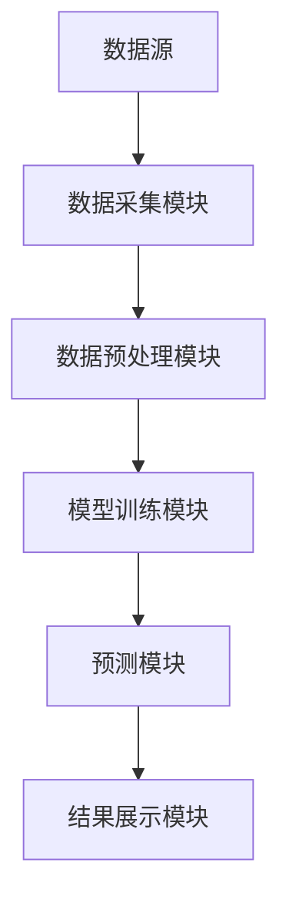

                 


# AI辅助的企业现金流预测

> 关键词：企业现金流预测，人工智能，机器学习，深度学习，LSTM，时间序列分析

> 摘要：本文探讨了如何利用人工智能技术辅助企业进行现金流预测。通过分析现金流预测的基本概念、AI技术的核心原理，以及具体算法在现金流预测中的应用，本文详细阐述了如何构建一个高效的现金流预测系统。结合实际案例和系统架构设计，本文为读者提供了从理论到实践的完整指南。

---

## 第一部分: AI辅助的企业现金流预测概述

### 第1章: 企业现金流预测的背景与意义

#### 1.1 企业现金流预测的基本概念

现金流预测是企业在财务管理中的一项重要任务，主要用于预测未来一段时间内的现金流流入和流出情况。准确的现金流预测能够帮助企业做出更明智的财务决策，优化资金分配，降低经营风险。

- **现金流预测的定义**：现金流预测是通过对历史数据、市场趋势和企业内部运营情况的分析，预测未来一定时期内的现金流状况。

- **现金流预测的重要性**：
  - 优化资金管理：通过预测未来现金流，企业可以更好地规划资金的使用和分配。
  - 支持投资决策：现金流预测能够帮助企业评估投资项目的风险和收益。
  - 风险管理：通过预测现金流的变化，企业可以提前应对潜在的财务危机。

- **现金流预测的常见应用场景**：
  - 月度或季度财务报告
  - 投资项目可行性分析
  - 资金筹集与分配规划
  - 风险评估与控制

#### 1.2 AI辅助现金流预测的必要性

传统现金流预测方法通常依赖于简单的线性回归或专家经验，存在以下问题：

- 数据复杂性：现金流受多种因素影响，包括市场波动、经济环境、企业内部运营等，传统方法难以捕捉这些复杂关系。
- 数据量大：现代企业产生的财务数据量巨大，人工分析效率低下。
- 预测准确性：传统方法往往忽视时间序列的非线性特征，导致预测精度不高。

AI技术的应用可以显著提升现金流预测的准确性和效率：

- **AI技术在现金流预测中的优势**：
  - 能够处理海量数据，提取复杂特征。
  - 通过机器学习算法捕捉数据中的非线性关系。
  - 实时更新预测结果，适应快速变化的市场环境。

---

### 第2章: AI与现金流预测的核心概念

#### 2.1 机器学习的基本概念

机器学习是一种人工智能技术，通过训练模型从数据中学习规律，并利用这些规律进行预测或分类。以下是机器学习的几个关键概念：

- **监督学习**：给定带标签的数据，通过训练模型预测新的数据标签。
  - 例如：根据历史销售数据预测未来的销售额。
- **无监督学习**：在无标签数据中发现隐藏的结构或模式。
  - 例如：通过聚类分析将客户分为不同的群体。
- **强化学习**：通过与环境交互，学习最优决策策略。
  - 例如：智能投顾系统通过不断试错优化投资组合。

#### 2.2 时间序列分析的基本原理

时间序列分析是一种统计方法，用于分析随时间变化的数据。现金流预测本质上是一个时间序列问题，因为现金流数据是按时间顺序排列的。

- **时间序列的特征**：
  - 趋势（Trend）：数据整体的上升或下降趋势。
  - 季节性（Seasonality）：数据在固定周期内的重复模式。
  - 噪声（Noise）：随机波动，无法用趋势或季节性解释的部分。

- **时间序列分析的常见方法**：
  - 移动平均法（Moving Average）
  - 指数平滑法（Exponential Smoothing）
  - ARIMA模型（Autoregressive Integrated Moving Average）

#### 2.3 深度学习与现金流预测的关系

深度学习是一种基于人工神经网络的机器学习技术，近年来在时间序列预测中取得了显著成果。

- **深度学习的基本概念**：
  - 神经网络：由多个层次的人工神经元组成的网络结构。
  - 长短期记忆网络（LSTM）：一种特殊的循环神经网络，擅长处理时间序列数据。

- **深度学习在时间序列预测中的优势**：
  - 能够捕捉数据中的长距离依赖关系。
  - 自动提取特征，减少人工特征工程的负担。

---

## 第二部分: AI辅助现金流预测的核心算法

### 第3章: 核心算法原理与实现

#### 3.1 线性回归与现金流预测

线性回归是一种简单的统计建模方法，适用于线性关系的预测。

- **线性回归的数学模型**：
  $$ y = \beta_0 + \beta_1 x + \epsilon $$
  - $y$：目标变量（现金流）
  - $x$：自变量（时间或其他相关因素）
  - $\beta_0$、$\beta_1$：回归系数
  - $\epsilon$：误差项

- **线性回归的应用步骤**：
  1. 数据收集与预处理。
  2. 建立线性回归模型。
  3. 训练模型，计算回归系数。
  4. 评估模型性能（如R²值）。
  5. 使用模型进行预测。

- **线性回归的优缺点**：
  - 优点：简单易懂，计算效率高。
  - 缺点：仅适用于线性关系，无法捕捉复杂特征。

#### 3.2 支持向量机（SVM）与现金流预测

支持向量机是一种强大的监督学习算法，适用于分类和回归任务。

- **SVM的基本原理**：
  - 数据映射到高维空间，找到最优超平面分割数据。
  - 使用核函数处理非线性问题。

- **SVM在时间序列预测中的应用**：
  - 将时间序列数据转换为向量空间。
  - 使用SVM进行回归预测。

- **SVM的优缺点**：
  - 优点：适合小样本数据，泛化能力强。
  - 缺点：计算复杂度高，难以处理大规模数据。

#### 3.3 长短期记忆网络（LSTM）与现金流预测

LSTM是一种特殊的循环神经网络，适用于时间序列数据。

- **LSTM的基本原理**：
  - 细胞状态（Cell State）：记忆单元。
  - 输入门（Input Gate）：控制新信息的输入。
  - 遗忘门（Forget Gate）：决定遗忘哪些旧信息。
  - 输出门（Output Gate）：决定输出什么信息。

- **LSTM的数学模型**：
  - 细胞状态更新：
    $$ c_t = \sigma(f\_f) \cdot c_{t-1} + \sigma(f\_i) \cdot x_t $$
  - 输出：
    $$ h_t = \sigma(f\_o) \cdot c_t $$

- **LSTM的应用优势**：
  - 能够捕捉时间序列的长期依赖关系。
  - 适用于波动较大、非线性特征明显的现金流数据。

---

## 第三部分: 系统架构与设计

### 第4章: 系统架构设计

#### 4.1 系统架构设计概述

现金流预测系统通常包括以下几个模块：

- **数据采集模块**：从数据库或外部API获取现金流数据。
- **数据预处理模块**：清洗、转换和归一化数据。
- **模型训练模块**：选择并训练预测模型。
- **预测模块**：利用训练好的模型进行现金流预测。
- **结果展示模块**：将预测结果可视化或输出报告。

#### 4.2 系统架构设计图

以下是现金流预测系统的架构图：



#### 4.3 系统功能设计

- **数据采集模块**：支持多种数据来源，如企业财务系统、市场数据API等。
- **数据预处理模块**：包括数据清洗、特征工程和数据归一化。
- **模型训练模块**：支持多种算法，如线性回归、SVM、LSTM等。
- **预测模块**：根据输入的时间点生成预测的现金流值。
- **结果展示模块**：以图表形式展示预测结果和实际数据的对比。

---

## 第四部分: 项目实战

### 第5章: 项目实战与案例分析

#### 5.1 环境配置

- **安装Python环境**：推荐使用Anaconda。
- **安装依赖库**：如numpy、pandas、sklearn、keras、tensorflow等。

#### 5.2 核心代码实现

以下是使用LSTM进行现金流预测的Python代码：

```python
import numpy as np
from tensorflow.keras.models import Sequential
from tensorflow.keras.layers import LSTM, Dense, Dropout

# 数据预处理
data = [...]  # 输入的数据
train_data = data[:700]
test_data = data[700:]

# 归一化
from sklearn.preprocessing import MinMaxScaler
scaler = MinMaxScaler()
train_scaled = scaler.fit_transform(train_data)
test_scaled = scaler.transform(test_data)

# 构建数据集
def create_dataset(data, look_back=1):
    X, Y = [], []
    for i in range(len(data) - look_back):
        X.append(data[i:i + look_back])
        Y.append(data[i + look_back])
    return np.array(X), np.array(Y)

X_train, y_train = create_dataset(train_scaled, look_back=10)
X_test, y_test = create_dataset(test_scaled, look_back=10)

# LSTM模型
model = Sequential()
model.add(LSTM(50, input_shape=(10, 1)))
model.add(Dropout(0.2))
model.add(Dense(1))
model.compile(loss='mean_squared_error', optimizer='adam')

# 训练模型
model.fit(X_train, y_train, epochs=50, batch_size=32, verbose=1)

# 预测
train_predict = model.predict(X_train)
test_predict = model.predict(X_test)

# 反归一化
train_predict = scaler.inverse_transform(train_predict)
test_predict = scaler.inverse_transform(test_predict)
```

#### 5.3 结果分析

- **训练集与测试集的预测结果对比**：
  - 训练集预测值与实际值的误差较小，说明模型在训练数据上表现良好。
  - 测试集预测值与实际值可能存在一定的误差，需要进一步优化模型。

- **模型优化建议**：
  - 调整LSTM的神经元数量。
  - 增加_dropout层的比率，防止过拟合。
  - 尝试不同的优化器（如Adam、RMSprop）。

---

## 第五部分: 总结与展望

### 第6章: 总结与展望

#### 6.1 总结

本文详细探讨了AI辅助企业现金流预测的核心算法和系统设计，通过实际案例展示了如何利用深度学习技术（如LSTM）提高现金流预测的准确性。AI技术的应用不仅提高了预测效率，还为企业提供了更精准的财务决策支持。

#### 6.2 展望

未来，随着AI技术的不断发展，现金流预测将更加智能化和自动化。以下是几个可能的发展方向：

- **多模型融合**：结合多种算法（如ARIMA、LSTM、随机森林）的优势，构建更 robust 的预测模型。
- **实时预测**：利用流数据处理技术，实现现金流的实时预测和监控。
- **多因素分析**：将更多影响现金流的因素（如市场情绪、政策变化）纳入预测模型。

---

通过本文的介绍，读者可以全面了解AI在现金流预测中的应用，从理论到实践，掌握如何利用AI技术优化企业的财务预测能力。

