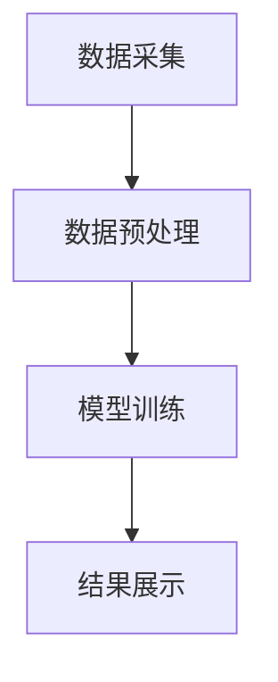
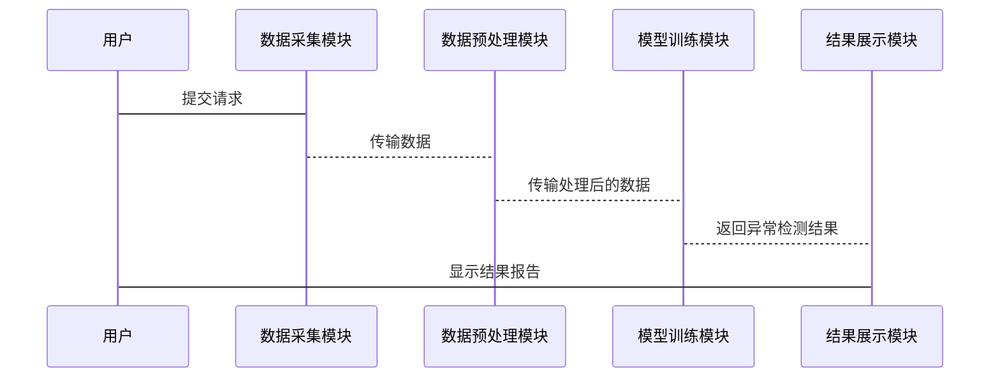

                 


# AI辅助的公司财务比率异常检测

> 关键词：AI技术、财务比率、异常检测、机器学习、数据分析

> 摘要：本文探讨了利用AI技术辅助检测公司财务比率异常的方法。首先，介绍了财务比率的基本概念和异常检测的重要性。接着，详细讲解了传统统计方法与现代机器学习算法在异常检测中的应用。然后，分析了基于AI的异常检测算法原理，并通过实际案例展示了如何构建AI辅助的财务比率异常检测系统。最后，总结了最佳实践和未来发展方向。

---

## 第一章：AI辅助的公司财务比率异常检测概述

### 1.1 财务比率异常检测的重要性

#### 1.1.1 财务比率的基本概念
财务比率是衡量公司财务健康状况的重要指标，主要包括以下几类：
- **流动性比率**：衡量公司短期偿债能力，如流动比率（Current Ratio）和速动比率（Quick Ratio）。
- **偿债能力比率**：衡量公司长期偿债能力，如债务股本比率（Debt-to-Equity Ratio）和利息覆盖倍数（Interest Coverage Ratio）。
- **运营效率比率**：衡量公司管理资产效率，如存货周转率（Inventory Turnover Ratio）和应收账款周转率（Accounts Receivable Turnover Ratio）。
- **盈利能力比率**：衡量公司盈利能力，如净利率（Net Profit Margin）和ROE（Return on Equity）。

#### 1.1.2 异常检测在财务管理中的作用
财务比率异常可能预示着公司财务健康状况出现问题，例如：
- 流动比率过低可能表明公司面临短期偿债压力。
- 净利率持续下降可能暗示公司盈利能力减弱。

及时发现这些异常可以帮助财务人员采取措施，避免潜在的财务危机。

#### 1.1.3 AI技术在财务分析中的优势
AI技术能够处理大量数据，发现隐藏的模式，提高异常检测的准确性和效率。与传统方法相比，AI技术具有以下优势：
- **自动化**：AI系统可以自动处理和分析大量财务数据，减少人工干预。
- **实时性**：通过实时数据分析，公司可以快速发现潜在问题。
- **高精度**：机器学习算法能够识别复杂的模式，比传统统计方法更准确。

### 1.2 传统财务比率分析的局限性

#### 1.2.1 传统方法的不足
传统财务比率分析依赖于经验丰富的财务人员，存在以下问题：
- **主观性**：不同分析师可能对同一比率有不同的解读。
- **效率低下**：手动分析大量数据耗时且容易出错。
- **复杂性**：面对复杂的财务结构，传统方法难以捕捉所有异常情况。

#### 1.2.2 数据量与复杂性带来的挑战
随着公司规模的扩大，财务数据量急剧增加，传统的分析方法难以处理以下问题：
- 数据维度高，难以找到关键指标。
- 数据分布复杂，难以用简单的统计方法捕捉异常。

#### 1.2.3 人工分析的效率问题
人工分析不仅效率低下，还容易受到主观因素的影响，难以保证结果的客观性和准确性。

### 1.3 AI辅助的解决方案

#### 1.3.1 机器学习在异常检测中的应用
机器学习算法可以自动从大量数据中学习特征，识别异常模式。常用的算法包括：
- **无监督学习**：如聚类算法（K-means）和异常检测算法（Isolation Forest）。
- **有监督学习**：如分类算法（SVM、随机森林）。

#### 1.3.2 大数据分析的优势
大数据分析能够处理海量数据，发现传统方法难以察觉的异常情况。通过整合多种数据源，可以提供更全面的分析结果。

#### 1.3.3 结合AI的财务分析新范式
AI技术与财务分析的结合开创了一种新的分析范式，通过自动化、智能化的方式提高分析效率和准确性。

---

## 第二章：财务比率的基础知识

### 2.1 财务比率的分类与计算

#### 2.1.1 流动性比率
- **流动比率（Current Ratio）**：计算公式为 $流动资产 / 流动负债$。
- **速动比率（Quick Ratio）**：计算公式为 $(流动资产 - 存货) / 流动负债$。

#### 2.1.2 偿债能力比率
- **债务股本比率（Debt-to-Equity Ratio）**：计算公式为 $总负债 / 股东权益$。
- **利息覆盖倍数（Interest Coverage Ratio）**：计算公式为 $EBIT / 利息支出$。

#### 2.1.3 运营效率比率
- **存货周转率（Inventory Turnover Ratio）**：计算公式为 $COGS / 平均存货$。
- **应收账款周转率（Accounts Receivable Turnover Ratio）**：计算公式为 $营业收入 / 平均应收账款$。

#### 2.1.4 盈利能力比率
- **净利率（Net Profit Margin）**：计算公式为 $净利润 / 营业收入$。
- **ROE（Return on Equity）**：计算公式为 $净利润 / 股东权益$。

### 2.2 各类比率的财务意义

#### 2.2.1 流动比率的意义
流动比率衡量公司短期偿债能力，正常情况下应大于1。如果流动比率过低，可能表明公司面临短期债务偿还压力。

#### 2.2.2 速动比率的应用
速动比率是流动比率的补充指标，进一步排除存货的影响。速动比率正常情况下应大于0.5。

#### 2.2.3 资产周转率的计算
资产周转率衡量公司管理资产效率，周转率越高，说明资产使用效率越高。

#### 2.2.4 净利润率的分析
净利润率衡量公司盈利能力，利润率越高，说明公司每单位收入的利润越高。

### 2.3 异常比率的潜在问题

#### 2.3.1 比率异常的可能原因
比率异常可能是由于市场环境变化、公司管理问题或财务造假等多重因素导致。

#### 2.3.2 异常比率对企业的影响
异常比率可能导致公司信用评级下降、融资困难，甚至引发财务危机。

#### 2.3.3 异常检测的必要性
及时发现和分析异常比率，可以帮助公司采取措施，避免潜在的财务风险。

---

## 第三章：异常检测的基本概念

### 3.1 统计方法在异常检测中的应用

#### 3.1.1 基于均值和标准差的异常检测
- **方法**：计算数据的均值和标准差，将距离均值超过一定倍数标准差的数据点标记为异常。
- **公式**：异常值判定标准为 $x_i$ 超出范围 $(\mu \pm k\sigma)$，其中 $\mu$ 是均值，$\sigma$ 是标准差，$k$ 是倍数。

#### 3.1.2 箱线图法
- **方法**：绘制箱线图，根据 whisker（须）的位置判断异常值。
- **步骤**：
  1. 计算数据的四分位数 $Q_1$ 和 $Q_3$。
  2. 计算 whisker 上界 $Q_3 + 1.5 \times IQR$ 和下界 $Q_1 - 1.5 \times IQR$，其中 $IQR = Q_3 - Q_1$。
  3. 数据点超出上下界即为异常值。

#### 3.1.3 3σ原则
- **方法**：数据点落在 $\mu \pm 3\sigma$ 之外即为异常值。
- **应用**：适用于正态分布的数据集。

### 3.2 机器学习方法概述

#### 3.2.1 监督学习
- **分类算法**：如支持向量机（SVM）、随机森林（Random Forest）。
- **回归算法**：如线性回归、岭回归（Ridge Regression）。

#### 3.2.2 无监督学习
- **聚类算法**：如K-means、DBSCAN。
- **异常检测算法**：如One-Class SVM、Isolation Forest。

#### 3.2.3 半监督学习
- **算法**：结合少量标记数据和大量未标记数据进行训练，适用于异常检测场景。

### 3.3 统计方法与机器学习方法的对比

| **方法**       | **优点**                                | **缺点**                              |
|----------------|---------------------------------------|---------------------------------------|
| 统计方法       | 易解释，计算简单                       | 依赖数据分布假设，鲁棒性差           |
| 机器学习方法   | 高准确性，适应复杂数据                | 黑箱模型，解释性差                   |

---

## 第四章：基于AI的异常检测方法

### 4.1 常见的AI算法及其原理

#### 4.1.1 Isolation Forest
- **原理**：通过构建随机树将数据进行隔离，异常点更容易被孤立。
- **公式**：无监督算法，无需标记数据。
- **优势**：适合高维数据，对异常点的检测准确率高。

#### 4.1.2 One-Class SVM
- **原理**：在高维空间中构建一个包含正常数据的超球，异常点位于超球外。
- **公式**：最大化包含正常数据的区域。
- **优势**：适用于小样本数据。

### 4.2 算法实现与代码示例

#### 4.2.1 使用Isolation Forest进行异常检测
```python
from sklearn.ensemble import IsolationForest

# 初始化模型
iforest = IsolationForest(n_estimators=100, contamination=0.05)

# 训练模型
iforest.fit(X_train)

# 预测异常值
y_pred = iforest.predict(X_test)
```

#### 4.2.2 使用One-Class SVM进行异常检测
```python
from sklearn.svm import OneClassSVM

# 初始化模型
ocsvm = OneClassSVM(nu=0.05)

# 训练模型
ocsvm.fit(X_train)

# 预测异常值
y_pred = ocsvm.predict(X_test)
```

### 4.3 算法的数学模型

#### 4.3.1 Isolation Forest
- **目标**：通过构建随机树，将数据点隔离到叶子节点。
- **数学模型**：无显式公式，基于树结构的分割。

#### 4.3.2 One-Class SVM
- **目标**：在高维空间中构建一个包含正常数据的区域。
- **数学模型**：最大化 $V = \{x | x^T x \leq 1\}$。

---

## 第五章：系统架构设计

### 5.1 系统功能设计

#### 5.1.1 数据采集模块
- **功能**：从数据库中获取公司财务数据，包括收入、支出、资产、负债等。
- **工具**：使用Python的pandas库进行数据读取和处理。

#### 5.1.2 数据预处理模块
- **功能**：清洗数据，处理缺失值、异常值和标准化。
- **工具**：使用scikit-learn的preprocessing模块。

#### 5.1.3 模型训练模块
- **功能**：训练异常检测模型，保存模型参数。
- **工具**：使用scikit-learn进行模型训练。

#### 5.1.4 结果展示模块
- **功能**：将异常检测结果可视化，生成报告。
- **工具**：使用matplotlib或seaborn进行数据可视化。

### 5.2 系统架构图


### 5.3 系统交互流程



---

## 第六章：项目实战

### 6.1 环境安装

```bash
pip install pandas scikit-learn matplotlib
```

### 6.2 核心实现代码

#### 6.2.1 数据预处理
```python
import pandas as pd
import numpy as np

# 读取数据
df = pd.read_csv('financial_data.csv')

# 处理缺失值
df = df.dropna()

# 标准化处理
from sklearn.preprocessing import StandardScaler
scaler = StandardScaler()
df_scaled = scaler.fit_transform(df)
```

#### 6.2.2 模型训练
```python
from sklearn.ensemble import IsolationForest

# 初始化模型
model = IsolationForest(n_estimators=100, contamination=0.05)

# 训练模型
model.fit(df_scaled)

# 预测异常值
y_pred = model.predict(df_scaled)
```

#### 6.2.3 结果展示
```python
import matplotlib.pyplot as plt

# 绘制异常值分布图
plt.scatter(range(len(y_pred)), y_pred)
plt.xlabel('数据点索引')
plt.ylabel('异常值预测结果')
plt.title('异常值分布图')
plt.show()
```

### 6.3 案例分析

#### 6.3.1 数据来源
假设我们从一家公司的财务报表中提取了以下数据：
- 营业收入（Revenue）
- 净利润（Net Income）
- 资产总额（Total Assets）
- 负债总额（Total Liabilities）

#### 6.3.2 模型训练与结果
通过Isolation Forest算法，我们发现某些季度的净利润率显著低于行业平均水平，可能表明公司盈利能力下降。

### 6.4 代码解读与分析
- **数据预处理**：确保数据干净，适合模型训练。
- **模型训练**：使用Isolation Forest算法，参数设置为100棵树，异常比例为5%。
- **结果展示**：通过可视化工具展示异常值分布，帮助财务人员快速识别问题。

---

## 第七章：总结与展望

### 7.1 最佳实践

#### 7.1.1 数据质量管理
- 确保数据的完整性和准确性，清洗缺失值和异常值。
- 使用适当的数据预处理方法，如标准化或归一化。

#### 7.1.2 模型选择与优化
- 根据数据特点选择合适的异常检测算法，如Isolation Forest适合高维数据。
- 调整模型参数，优化检测准确率。

#### 7.1.3 结果解读与反馈
- 定期检查模型结果，分析异常原因。
- 根据反馈调整模型参数或更换算法。

### 7.2 小结
本文详细介绍了AI辅助的公司财务比率异常检测的方法，从理论到实践，为财务分析提供了新的思路和工具。

### 7.3 注意事项
- 数据隐私和安全问题需引起重视。
- 模型需要定期更新，以适应市场变化。
- 异常检测结果需结合业务背景进行解读，避免误判。

### 7.4 拓展阅读
- 推荐阅读《机器学习实战》和《Python数据分析 cookbook》，深入理解数据处理和机器学习算法。

---

## 附录：参考文献

1. 刘军. (2022). 基于机器学习的财务异常检测研究. 计算机应用研究.
2. scikit-learn官方文档. (n.d.). Isolation Forest Algorithm.

---

以上是《AI辅助的公司财务比率异常检测》的完整文章内容，涵盖从基础概念到实际应用的各个方面，帮助读者系统地理解和应用AI技术在财务异常检测中的应用。

