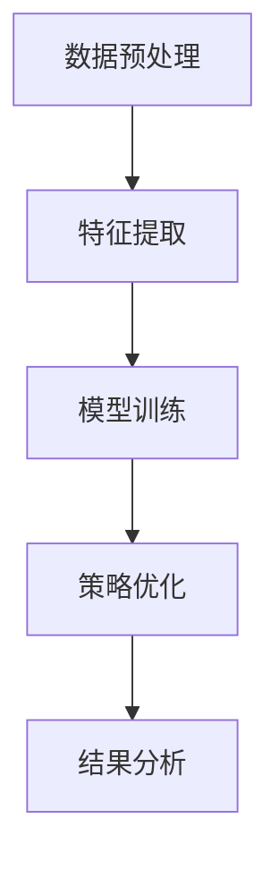
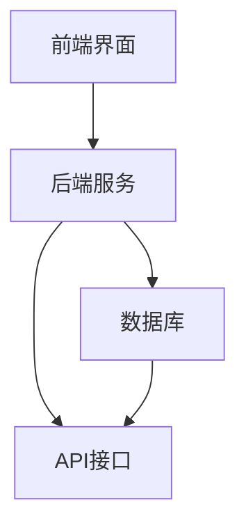
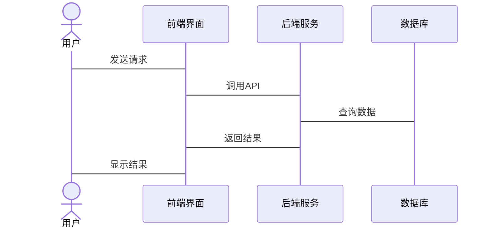

                 


# AI辅助的对冲基金策略分析

---

## 关键词：
AI技术，对冲基金，策略分析，机器学习，深度学习，风险管理，资产配置

---

## 摘要：
本文深入探讨了人工智能技术在对冲基金策略分析中的应用，从背景、核心概念、算法原理到系统设计和项目实战，全面解析AI如何优化对冲基金的策略分析过程。文章结合实际案例，详细介绍了机器学习和深度学习算法在对冲基金中的具体应用，并通过数学公式和mermaid图展示系统的结构与流程，为读者提供了一套完整的AI辅助对冲基金策略分析的方法论。

---

## 目录大纲

### 第一部分：背景介绍

#### 第1章：对冲基金与AI技术的背景

##### 1.1 对冲基金的基本概念
- 1.1.1 对冲基金的定义
- 1.1.2 对冲基金的主要策略
- 1.1.3 对冲基金的市场角色

##### 1.2 AI技术的背景与发展
- 1.2.1 AI技术的定义与特点
- 1.2.2 AI在金融领域的应用现状
- 1.2.3 AI技术的未来趋势

##### 1.3 对冲基金与AI的结合
- 1.3.1 对冲基金策略分析的痛点
- 1.3.2 AI技术如何解决对冲基金的挑战
- 1.3.3 对冲基金AI化的发展前景

### 第二部分：核心概念与联系

#### 第2章：AI辅助对冲基金的核心概念

##### 2.1 数据处理与特征提取
- 2.1.1 数据的来源与类型
- 2.1.2 特征提取的方法与工具

##### 2.2 模型构建与策略优化
- 2.2.1 模型的选择与训练
- 2.2.2 策略优化的原理与方法

##### 2.3 风险管理与组合优化
- 2.3.1 风险管理的核心概念
- 2.3.2 组合优化的AI方法

### 第三部分：算法原理讲解

#### 第3章：常用AI算法及其在对冲基金中的应用

##### 3.1 机器学习算法
- 3.1.1 线性回归与逻辑回归
- 3.1.2 支持向量机（SVM）
- 3.1.3 随机森林与梯度提升树

##### 3.2 深度学习算法
- 3.2.1 神经网络基础
- 3.2.2 长短期记忆网络（LSTM）
- 3.2.3 图神经网络（GNN）

##### 3.3 算法流程图（Mermaid）


### 第四部分：数学模型与公式

#### 第4章：数学模型与公式解析

##### 4.1 机器学习模型的数学基础
- 4.1.1 线性回归的数学公式：$$y = \beta_0 + \beta_1x + \epsilon$$
- 4.1.2 逻辑回归的损失函数：$$L = -\frac{1}{m}\sum_{i=1}^{m} [y_i\ln h(x_i) + (1-y_i)\ln(1-h(x_i))]$$

##### 4.2 深度学习模型的数学基础
- 4.2.1 神经网络的激活函数：$$ReLU(x) = \max(0, x)$$
- 4.2.2 LSTM的门控机制：$$i_t = \sigma(W_i x_t + U_i h_{t-1} + b_i)$$
- 4.2.3 图神经网络的聚合函数：$$h_v = \text{Agg}(h_u, h_v)$$

### 第五部分：系统分析与架构设计

#### 第5章：系统功能与架构设计

##### 5.1 问题场景介绍
- 5.1.1 对冲基金的实时数据分析需求
- 5.1.2 复杂市场环境下的策略调整需求

##### 5.2 系统功能设计
- 5.2.1 数据采集模块
- 5.2.2 模型训练模块
- 5.2.3 策略执行模块
- 5.2.4 风险管理模块

##### 5.3 系统架构设计


##### 5.4 系统交互设计


### 第六部分：项目实战

#### 第6章：AI辅助对冲基金策略分析的实战案例

##### 6.1 环境安装与数据获取
- 6.1.1 安装Python和相关库（如pandas、numpy、scikit-learn等）
- 6.1.2 数据源介绍与获取（如股票价格数据）

##### 6.2 系统核心实现源代码
```python
# 示例代码：使用机器学习模型进行股票预测
import pandas as pd
from sklearn.linear_model import LinearRegression

# 数据加载
data = pd.read_csv('stock_prices.csv')

# 特征与目标分离
X = data[['open', 'high', 'low', 'volume']]
y = data['close']

# 模型训练
model = LinearRegression()
model.fit(X, y)

# 预测
y_pred = model.predict(X)

# 结果分析
print('预测准确率:', model.score(X, y))
```

##### 6.3 代码应用解读与分析
- 6.3.1 数据预处理与特征工程
- 6.3.2 模型选择与调优
- 6.3.3 策略实现与回测

##### 6.4 实际案例分析和详细讲解剖析
- 6.4.1 案例背景
- 6.4.2 数据分析与策略设计
- 6.4.3 系统实现与结果展示

##### 6.5 项目小结
- 6.5.1 项目成果总结
- 6.5.2 经验与教训
- 6.5.3 改进方向与未来计划

### 第七部分：总结与展望

#### 第7章：总结与展望

##### 7.1 最佳实践 tips
- 数据质量的重要性
- 模型解释性的关注
- 风险管理的必要性

##### 7.2 小结
- AI技术对对冲基金策略分析的深远影响
- 本文章的核心观点回顾

##### 7.3 注意事项
- 数据隐私与合规性
- 模型的过拟合问题
- 系统的实时性和稳定性

##### 7.4 拓展阅读
- 推荐的书籍和资源
- 相关学术论文和研究报告

---

通过以上步骤，我能够系统地构建一个全面且详细的目录大纲，确保内容覆盖背景、概念、算法、系统设计、项目实战和总结等各个方面，帮助读者深入理解AI在对冲基金策略分析中的应用。

