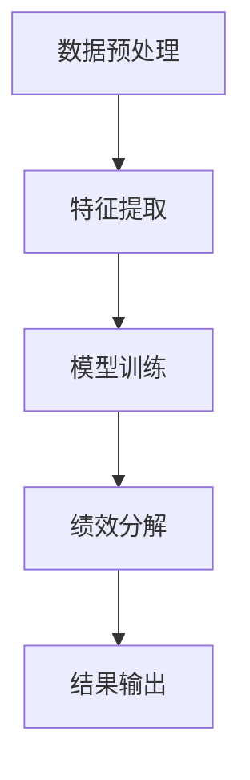
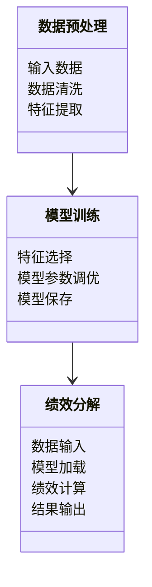
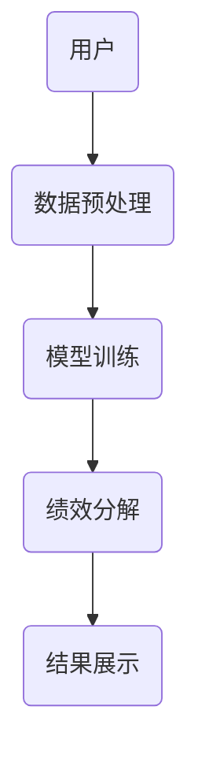
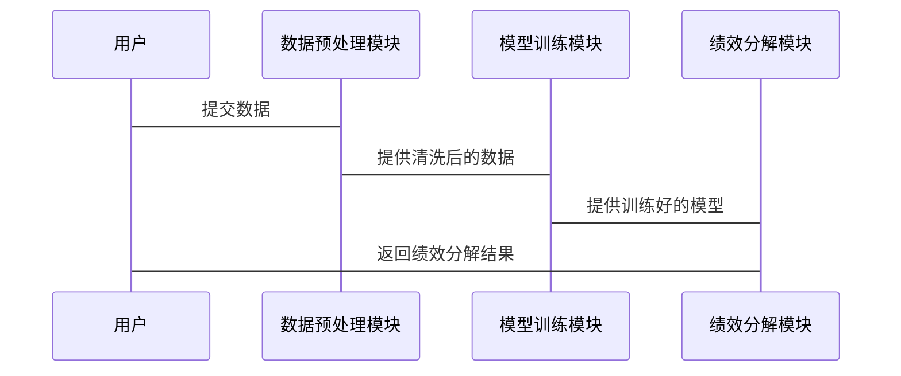

                 


# AI辅助的对冲基金绩效归因

> 关键词：对冲基金，绩效归因，人工智能，机器学习，算法原理，系统架构

> 摘要：本文深入探讨了AI技术在对冲基金绩效归因中的应用，从传统方法的局限性出发，结合现代机器学习算法，分析了如何通过AI技术实现高效、精准的绩效归因。文章详细介绍了AI辅助绩效归因的核心概念、算法原理、系统架构设计以及实际项目案例，为对冲基金行业在数字化转型中的技术创新提供了有价值的参考。

---

# 第一部分: 对冲基金绩效归因基础

# 第1章: 对冲基金与绩效归因概述

## 1.1 对冲基金的定义与运作模式

### 1.1.1 对冲基金的基本定义
对冲基金是一种通过做空和做多相结合的投资工具，旨在通过市场波动获取收益。其核心目标是通过多样化的投资策略降低风险，同时实现超额收益。

### 1.1.2 对冲基金的运作机制
对冲基金通过杠杆操作、多空策略和复杂的资产组合配置来实现收益。其运作机制包括资产选择、市场 timing、风险对冲和杠杆运用。

### 1.1.3 对冲基金的主要策略类型
- **股票多空策略**：通过买入低估股票和卖出高估股票获利。
- **套利策略**：利用市场价差进行无风险或低风险套利。
- **事件驱动策略**：基于公司并购、重组等事件进行投资。
- **宏观对冲策略**：基于宏观经济趋势进行多空操作。

## 1.2 绩效归因的定义与重要性

### 1.2.1 绩效归因的基本概念
绩效归因是将投资组合的收益分解为不同因素（如市场风险、选股能力、行业选择等）的贡献，以量化每部分对总收益的影响。

### 1.2.2 绩效归因在投资管理中的作用
绩效归因能够帮助投资经理识别超额收益的来源，优化投资策略，评估投资组合的风险暴露，并为未来投资决策提供数据支持。

### 1.2.3 绩效归因的边界与外延
绩效归因不仅关注收益来源，还需要考虑交易成本、税收影响和市场流动性等因素。其外延包括风险分析、绩效预测和动态监控。

## 1.3 传统绩效归因方法

### 1.3.1 时间加权法
时间加权法将投资组合的收益与市场指数的收益进行比较，计算其超额收益。

### 1.3.2 因子分解法
因子分解法将收益分解为市场因子（如市值、价值、动量等）的贡献，用于量化每种因子对收益的贡献。

### 1.3.3 实际归因法
实际归因法通过分析投资组合的实际交易记录，计算每笔交易对总收益的贡献。

## 1.4 本章小结
本章介绍了对冲基金的基本定义、运作模式及其主要策略类型，重点阐述了绩效归因的定义、重要性及其在投资管理中的应用。传统绩效归因方法的局限性为后续AI辅助的绩效归因方法提供了改进空间。

---

# 第2章: AI辅助的对冲基金绩效归因背景

## 2.1 对冲基金绩效归因的挑战

### 2.1.1 数据复杂性
对冲基金的投资策略复杂，涉及多资产类别、多市场和多策略，导致数据维度高且复杂。

### 2.1.2 高维数据处理难度
传统方法在处理高维数据时效率低下，难以捕捉非线性关系。

### 2.1.3 传统方法的局限性
传统绩效归因方法难以应对动态市场环境下的复杂问题，且缺乏对非线性关系的建模能力。

## 2.2 AI技术在金融领域的应用潜力

### 2.2.1 机器学习在金融中的应用
机器学习能够处理海量数据，发现传统方法难以捕捉的模式和关系。

### 2.2.2 自然语言处理在金融新闻分析中的应用
自然语言处理技术可以分析新闻、报告等非结构化数据，提取影响市场情绪的关键词。

### 2.2.3 图神经网络在金融关系网络中的应用
图神经网络可以分析公司之间的关联关系，识别系统性风险。

## 2.3 对冲基金绩效归因中的AI机会

### 2.3.1 数据驱动的绩效分解
通过机器学习模型，可以基于海量数据进行绩效分解，发现传统方法无法捕捉的因子。

### 2.3.2 高效特征提取与建模
AI技术能够从多维数据中提取特征，构建非线性模型，提高绩效归因的准确性。

### 2.3.3 实时监控与预测
AI技术可以实现对投资组合的实时监控，预测未来收益来源，帮助投资经理及时调整策略。

## 2.4 本章小结
本章分析了对冲基金绩效归因面临的挑战，探讨了AI技术在金融领域的应用潜力，并总结了AI在对冲基金绩效归因中的具体机会。

---

# 第3章: AI辅助的对冲基金绩效归因核心概念与联系

## 3.1 核心概念原理

### 3.1.1 绩效归因的数学模型
绩效归因的数学模型包括因子模型和机器学习模型，用于量化各因素对收益的贡献。

### 3.1.2 AI算法在绩效归因中的应用
AI算法通过分析历史数据，识别影响收益的关键因素，并预测未来收益来源。

### 3.1.3 绩效归因与风险分析的关系
绩效归因与风险分析密切相关，AI技术可以帮助识别风险来源，并优化投资组合的风险暴露。

## 3.2 核心概念特征对比

| **特征**         | **传统绩效归因**       | **AI辅助绩效归因**       |
|-------------------|-----------------------|-------------------------|
| 数据处理能力     | 低效，难以处理高维数据 | 高效，支持多维数据处理   |
| 模型复杂性       | 线性，假设简单         | 非线性，能够捕捉复杂模式 |
| 预测能力         | 有限，基于历史数据     | 强大，能够预测未来收益   |
| 计算效率         | 低，依赖人工分析       | 高，自动化处理能力       |

## 3.3 绩效归因的ER实体关系图

```mermaid
erDiagram
    actor 投资经理 {
        <属性> 投资组合ID
        <属性> 资产分配
        <属性> 风险偏好
    }
    actor 数据源 {
        <属性> 市场数据
        <属性> 交易记录
        <属性> 新闻数据
    }
    actor 绩效分析系统 {
        <属性> 绩效报告
        <属性> 因子分解结果
    }
    investment_portfolio : 对冲基金投资组合 {
        <属性> 组合ID
        <属性> 资产配置
        <属性> 交易历史
    }
    performance_factors : 绩效因子 {
        <属性> 因子名称
        <属性> 因子权重
        <属性> 贡献度
    }
    investment_strategy : 投资策略 {
        <属性> 策略类型
        <属性> 策略参数
        <属性> 策略表现
    }
    投资经理 --> investment_portfolio : 管理
    投资经理 --> investment_strategy : 设定
    数据源 --> investment_portfolio : 提供
    数据源 --> investment_strategy : 支持
    investment_portfolio --> performance_factors : 分解
    investment_strategy --> performance_factors : 影响
    performance_factors --> 绩效分析系统 : 报告
```

## 3.4 本章小结
本章从数学模型和算法应用的角度，详细阐述了AI辅助绩效归因的核心概念及其与传统方法的区别。通过对比分析和ER实体关系图，进一步明确了AI在对冲基金绩效归因中的优势和应用场景。

---

# 第4章: AI辅助的对冲基金绩效归因算法原理

## 4.1 绩效归因的数学模型

### 4.1.1 因子模型
因子模型将收益分解为市场因子（如市值、价值、动量等）的线性组合，用于量化各因子对收益的贡献。

$$ R_i = \beta_1 F_1 + \beta_2 F_2 + ... + \beta_n F_n + \alpha $$

其中，$R_i$ 是资产i的收益，$F_j$ 是因子j，$\beta_j$ 是因子的权重，$\alpha$ 是超额收益。

### 4.1.2 机器学习模型
机器学习模型（如随机森林、支持向量机、神经网络等）能够捕捉非线性关系，用于更复杂的绩效归因分析。

$$ R_i = f(X_i) + \epsilon $$

其中，$X_i$ 是特征向量，$f$ 是非线性函数，$\epsilon$ 是误差项。

## 4.2 基于机器学习的绩效归因算法

### 4.2.1 算法步骤



### 4.2.2 算法实现代码

```python
import pandas as pd
from sklearn.ensemble import RandomForestRegressor
from sklearn.metrics import r2_score

# 数据预处理
data = pd.read_csv('performance_data.csv')
X = data.drop('return', axis=1)
y = data['return']

# 特征提取
selected_features = ['market_factor1', 'market_factor2', 'alpha_factor1', 'alpha_factor2']
X_selected = X[selected_features]

# 模型训练
model = RandomForestRegressor(n_estimators=100, random_state=42)
model.fit(X_selected, y)

# 绩效分解
importances = model.feature_importances_
performance_contributions = {}
for i, feature in enumerate(selected_features):
    contribution = importances[i] * y.std()
    performance_contributions[feature] = contribution

print(performance_contributions)
```

## 4.3 算法优势

### 4.3.1 非线性关系捕捉
机器学习模型能够捕捉传统因子模型无法识别的非线性关系，提高绩效归因的准确性。

### 4.3.2 高维数据处理
AI算法能够高效处理高维数据，降低维度灾难的风险。

### 4.3.3 实时更新
基于机器学习的绩效归因方法可以实时更新模型，适应市场的动态变化。

## 4.4 本章小结
本章详细介绍了AI辅助绩效归因的算法原理，包括因子模型和机器学习模型的数学公式、算法步骤和代码实现。通过对比分析，突出了AI技术在绩效归因中的优势。

---

# 第5章: 对冲基金绩效归因系统架构设计

## 5.1 系统功能设计

### 5.1.1 领域模型



### 5.1.2 功能模块
- 数据预处理模块：负责数据清洗和特征提取。
- 模型训练模块：负责特征选择和模型调优。
- 绩效分解模块：负责绩效计算和结果输出。

## 5.2 系统架构设计

### 5.2.1 系统架构图



### 5.2.2 接口设计
- 数据预处理接口：接收原始数据，返回清洗后的数据。
- 模型训练接口：接收特征向量，返回训练好的模型。
- 绩效分解接口：接收模型和数据，返回绩效分解结果。

## 5.3 系统交互流程

### 5.3.1 交互流程图



## 5.4 本章小结
本章从系统架构的角度，详细阐述了AI辅助绩效归因系统的功能设计、架构图和交互流程。通过模块化设计，确保系统的高效性和可扩展性。

---

# 第6章: 项目实战——基于AI的对冲基金绩效归因系统实现

## 6.1 项目背景与目标

### 6.1.1 项目背景
随着金融市场的复杂化，传统绩效归因方法难以满足对冲基金的需求，亟需引入AI技术提升绩效分析能力。

### 6.1.2 项目目标
构建一个基于AI的对冲基金绩效归因系统，实现高效、精准的绩效分解和风险分析。

## 6.2 环境安装与配置

### 6.2.1 环境要求
- Python 3.8+
- Jupyter Notebook
- 数据处理库（Pandas、NumPy）
- 机器学习库（Scikit-learn、XGBoost）

## 6.3 核心代码实现

### 6.3.1 数据预处理

```python
import pandas as pd
import numpy as np

# 数据加载
data = pd.read_csv('performance_data.csv')

# 数据清洗
data.dropna(inplace=True)
data = data[~data['return'].isin([np.nan, ''])]

# 特征提取
selected_features = ['market_factor1', 'market_factor2', 'alpha_factor1', 'alpha_factor2']
X = data[selected_features]
y = data['return']
```

### 6.3.2 模型训练

```python
from sklearn.ensemble import RandomForestRegressor
from sklearn.model_selection import GridSearchCV

# 模型参数调优
param_grid = {
    'n_estimators': [100, 200],
    'max_depth': [None, 10, 20],
    'min_samples_split': [2, 5]
}

grid_search = GridSearchCV(RandomForestRegressor(), param_grid, cv=5)
grid_search.fit(X, y)

best_model = grid_search.best_estimator_
```

### 6.3.3 绩效分解与可视化

```python
importances = best_model.feature_importances_
performance_contributions = {}
for i, feature in enumerate(selected_features):
    contribution = importances[i] * y.std()
    performance_contributions[feature] = contribution

# 可视化
import matplotlib.pyplot as plt

plt.bar(performance_contributions.keys(), performance_contributions.values())
plt.title('Performance Contributions')
plt.show()
```

## 6.4 实际案例分析

### 6.4.1 数据来源与处理
使用某对冲基金的真实交易数据，包括市场因子、选股因子和交易记录。

### 6.4.2 模型训练与评估
通过网格搜索找到最佳模型参数，评估模型的准确性和稳定性。

### 6.4.3 绩效分解与解读
分析各因子对收益的贡献度，识别超额收益的主要来源。

## 6.5 项目总结与优化

### 6.5.1 项目小结
通过项目实战，验证了AI技术在对冲基金绩效归因中的有效性，提高了绩效分解的准确性和效率。

### 6.5.2 优化建议
- 引入实时数据流处理，提升系统的实时性。
- 增加多模态数据（如文本数据）的分析能力。
- 定期更新模型，适应市场变化。

## 6.6 本章小结
本章通过一个实际项目案例，详细展示了基于AI的对冲基金绩效归因系统的实现过程，包括环境配置、代码实现和案例分析。项目总结与优化建议为读者提供了进一步改进的方向。

---

# 第7章: 总结与展望

## 7.1 本章总结

### 7.1.1 核心内容回顾
本文系统性地介绍了对冲基金绩效归因的传统方法与AI辅助方法，分析了AI技术在绩效归因中的优势和应用场景。

### 7.1.2 项目成果
通过实际项目案例，验证了AI技术在对冲基金绩效归因中的有效性，提高了绩效分解的准确性和效率。

## 7.2 未来展望

### 7.2.1 技术发展
随着AI技术的不断进步，未来的绩效归因系统将更加智能化、自动化，能够处理更复杂的数据和场景。

### 7.2.2 应用扩展
AI辅助的绩效归因技术将扩展到更多领域，如风险管理、投资组合优化和市场预测。

### 7.2.3 挑战与机遇
尽管AI技术在对冲基金绩效归因中展现了巨大潜力，但其应用仍面临数据隐私、模型解释性和计算成本等挑战。

## 7.3 最佳实践 tips

### 7.3.1 数据处理
- 确保数据的完整性和准确性。
- 多模态数据的融合能够提高模型的准确性。

### 7.3.2 模型选择
- 根据具体问题选择合适的模型。
- 定期更新模型，适应市场变化。

### 7.3.3 系统设计
- 模块化设计能够提高系统的可维护性和扩展性。
- 系统架构的优化能够提升处理效率。

## 7.4 本章小结
本章总结了本文的核心内容和研究成果，展望了AI技术在对冲基金绩效归因中的未来发展方向，并提出了具体的实践建议。

---

# 结语

通过对冲基金绩效归因的传统方法与AI辅助方法的对比，本文展现了AI技术在金融领域的巨大潜力。未来，随着AI技术的不断进步，对冲基金的绩效归因将更加智能化、精准化，为投资经理和机构投资者提供更有力的支持。

