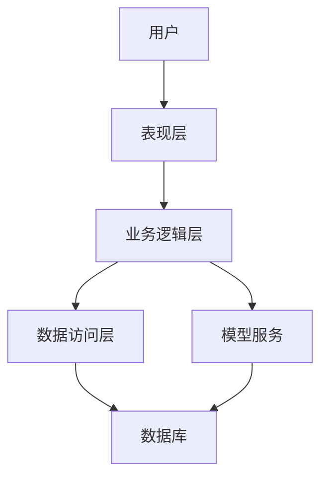
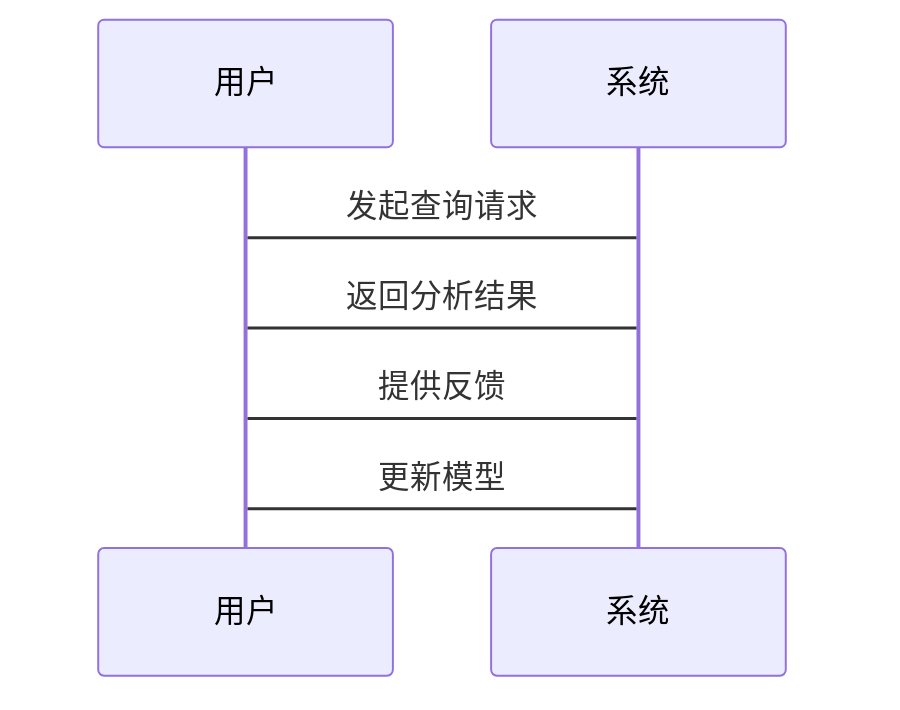

                 


# AI辅助的并购交易分析

## 关键词：AI，并购交易分析，机器学习，自然语言处理，深度学习，数据处理

## 摘要：随着人工智能技术的飞速发展，AI在并购交易分析中的应用日益广泛。本文详细探讨了AI在并购交易分析中的核心作用，从数据收集与处理、算法原理、系统架构到实际项目实战，全面解析了如何利用AI技术提升并购交易的效率和准确性。通过具体案例分析，展示了AI在并购交易中的实际应用价值，并展望了未来的发展方向。

---

## 第1章：AI辅助并购交易分析的背景与意义

### 1.1 并购交易的基本概念

#### 1.1.1 并购交易的定义与分类
- **定义**：并购（Mergers and Acquisitions，M&A）是指一家企业合并另一家企业，或收购另一家企业的一部分股权。
- **分类**：
  - **横向并购**：同一行业内的并购。
  - **纵向并购**：上下游产业的并购。
  - **混合并购**：跨行业并购。

#### 1.1.2 并购交易的核心问题与挑战
- **问题**：
  - 评估目标企业价值。
  - 识别潜在风险。
  - 制定合理定价策略。
- **挑战**：
  - 数据分散且复杂。
  - 风险预测难度大。
  - 时间效率要求高。

#### 1.1.3 AI在并购中的应用背景
- **数据驱动决策**：AI通过分析大量数据，提供客观评估。
- **高效处理能力**：AI能快速处理复杂数据，提高交易效率。
- **智能预测与优化**：AI帮助预测交易结果，优化并购策略。

---

## 第2章：并购交易数据的收集与处理

### 2.1 数据来源与类型

#### 2.1.1 公司财务数据
- **收入与利润**：分析企业盈利能力。
- **资产负债表**：评估企业资产与负债状况。
- **现金流**：评估企业流动性。

#### 2.1.2 市场与行业数据
- **行业趋势**：分析市场增长潜力。
- **竞争分析**：评估目标企业的竞争优势。
- **宏观经济指标**：考虑经济环境影响。

#### 2.1.3 新闻与舆情数据
- **新闻报道**：识别企业声誉风险。
- **社交媒体情绪**：评估市场情绪。
- **行业动态**：获取最新市场信息。

### 2.2 数据预处理技术

#### 2.2.1 数据清洗与标准化
- **数据清洗**：处理缺失值、异常值。
- **标准化**：统一数据格式和单位。

#### 2.2.2 数据特征提取
- **文本特征提取**：使用TF-IDF提取关键词。
- **数值特征提取**：标准化财务指标。
- **实体识别**：识别公司名称和产品名称。

#### 2.2.3 数据增强与标注
- **数据增强**：生成更多训练数据。
- **标注数据**：标记关键信息，如正面、负面舆情。

### 2.3 数据存储与管理

#### 2.3.1 数据库设计
- **关系型数据库**：设计表结构，存储结构化数据。
- **NoSQL数据库**：存储非结构化数据，如文本和图像。

#### 2.3.2 数据仓库构建
- **数据仓库架构**：整合多源数据，支持高效查询。
- **数据建模**：设计数据模型，优化查询性能。

#### 2.3.3 数据安全与隐私保护
- **数据加密**：保护敏感数据。
- **访问控制**：限制数据访问权限。
- **合规性**：遵守数据隐私法规，如GDPR。

---

## 第3章：并购交易分析的核心算法与模型

### 3.1 机器学习算法在并购分析中的应用

#### 3.1.1 监督学习与分类算法
- **逻辑回归**：用于分类，如预测交易成功与否。
- **支持向量机（SVM）**：处理小样本数据，分类准确。
- **随机森林**：用于特征重要性分析，预测交易风险。

#### 3.1.2 聚类分析与市场细分
- **K-means**：将企业按财务指标分组，识别潜在并购目标。
- **层次聚类**：分析行业结构，发现市场趋势。

#### 3.1.3 回归分析与价值评估
- **线性回归**：预测企业价值，制定合理定价策略。
- **岭回归**：处理多重共线性，提高预测准确性。

### 3.2 自然语言处理在并购中的应用

#### 3.2.1 文本挖掘与情感分析
- **文本挖掘**：提取公司年报中的关键词，识别潜在风险。
- **情感分析**：分析新闻标题情绪，评估市场态度。

#### 3.2.2 实体识别与信息抽取
- **NER（命名实体识别）**：识别公司名称、产品名称等。
- **关系抽取**：识别公司之间的并购关系。

#### 3.2.3 事件抽取与交易识别
- **事件抽取**：识别新闻中的并购事件，提取时间、地点、人物等信息。
- **交易识别**：通过模式匹配，识别潜在并购目标。

### 3.3 深度学习模型的应用

#### 3.3.1 神经网络在并购预测中的应用
- **卷积神经网络（CNN）**：用于图像识别，分析财务报表中的图表。
- **循环神经网络（RNN）**：处理时间序列数据，预测市场趋势。

#### 3.3.2 Transformer模型与文本生成
- **BERT**：用于文本理解，分析公司年报。
- **GPT**：生成商业报告，辅助决策。

#### 3.3.3 图神经网络与关系分析
- **图嵌入**：分析公司间的关系，识别潜在并购目标。
- **节点分类**：预测公司风险，辅助并购决策。

### 3.4 算法选择与优化策略

#### 3.4.1 算法性能评估指标
- **准确率**：评估分类模型的性能。
- **F1分数**：平衡精确率和召回率。
- **AUC曲线**：评估模型的区分能力。

#### 3.4.2 超参数优化与模型调优
- **网格搜索**：寻找最优参数组合。
- **交叉验证**：评估模型泛化能力。

#### 3.4.3 模型部署与实时预测
- **API接口**：部署模型，提供实时预测服务。
- **微服务架构**：提高系统可扩展性和维护性。

---

## 第4章：并购交易分析的系统架构与实现

### 4.1 系统架构设计

#### 4.1.1 分层架构设计
- **表现层**：用户界面，展示分析结果。
- **业务逻辑层**：处理用户请求，调用服务。
- **数据访问层**：访问数据库，处理数据。

#### 4.1.2 微服务架构设计
- **独立服务**：每个功能模块独立部署，提高可扩展性。
- **服务间通信**：使用RESTful API进行通信，保证模块间解耦。

#### 4.1.3 可扩展性与可维护性
- **模块化设计**：每个功能模块独立，便于维护和扩展。
- **容器化部署**：使用Docker容器，提高部署效率。

### 4.2 数据流与处理流程

#### 4.2.1 数据采集与预处理
- **数据采集**：从多个数据源获取数据。
- **数据清洗**：处理缺失值、异常值。
- **数据增强**：生成更多训练数据。

#### 4.2.2 模型训练与部署
- **模型训练**：使用训练数据训练模型。
- **模型部署**：将模型部署到生产环境，提供预测服务。

#### 4.2.3 结果展示与反馈
- **数据可视化**：使用图表展示分析结果。
- **反馈机制**：收集用户反馈，优化模型。

### 4.3 系统功能设计

#### 4.3.1 数据可视化界面
- **数据仪表盘**：展示实时数据，如市场趋势、公司估值。
- **交互式图表**：用户可以交互式地探索数据，发现潜在机会。

#### 4.3.2 模型管理
- **模型管理界面**：管理多个模型，支持模型版本控制。
- **模型训练界面**：用户提供数据，训练专属模型。

#### 4.3.3 实时监控
- **实时预警**：监控市场动态，及时预警潜在风险。
- **日志管理**：记录系统运行日志，便于故障排查。

### 4.4 系统架构图（Mermaid）



### 4.5 系统接口设计

#### 4.5.1 API接口
- **RESTful API**：提供标准接口，方便其他系统调用。
- **JSON格式**：数据格式统一，便于解析。

#### 4.5.2 接口文档
- **API文档**：详细描述接口功能、参数、返回值。
- **测试工具**：使用Postman测试接口，确保正常运行。

### 4.6 系统交互流程图（Mermaid）



---

## 第5章：AI辅助并购交易分析的项目实战

### 5.1 项目背景与目标

#### 5.1.1 项目背景
- **行业趋势**：分析当前市场趋势，识别高增长行业。
- **企业需求**：帮助企业高效筛选并购目标，降低交易风险。

#### 5.1.2 项目目标
- **构建AI系统**：利用AI技术辅助并购交易分析。
- **提供决策支持**：为企业提供数据驱动的决策支持。

### 5.2 环境安装

#### 5.2.1 安装Python
- **安装步骤**：
  1. 下载Python安装包。
  2. 按照安装向导完成安装。
  3. 配置环境变量。

#### 5.2.2 安装机器学习库
- **安装步骤**：
  1. 使用pip安装scikit-learn、TensorFlow、Keras等库。
  2. 验证安装是否成功。

#### 5.2.3 安装数据处理工具
- **安装步骤**：
  1. 安装Jupyter Notebook用于数据处理和可视化。
  2. 安装Pandas、NumPy用于数据处理。

### 5.3 核心实现

#### 5.3.1 数据预处理代码
```python
import pandas as pd
import numpy as np

# 加载数据
data = pd.read_csv('并购数据.csv')

# 数据清洗
data.dropna()
data = data.drop_duplicates()

# 特征提取
from sklearn.preprocessing import StandardScaler
scaler = StandardScaler()
scaled_data = scaler.fit_transform(data[['收入', '利润', '现金流']])
```

#### 5.3.2 模型训练代码
```python
from sklearn.ensemble import RandomForestClassifier
from sklearn.model_selection import train_test_split
from sklearn.metrics import accuracy_score

# 数据分割
X_train, X_test, y_train, y_test = train_test_split(scaled_data, data['是否并购'], test_size=0.2)

# 训练模型
model = RandomForestClassifier()
model.fit(X_train, y_train)

# 预测与评估
y_pred = model.predict(X_test)
print("准确率：", accuracy_score(y_test, y_pred))
```

#### 5.3.3 结果展示代码
```python
import matplotlib.pyplot as plt

# 绘制混淆矩阵
from sklearn.metrics import confusion_matrix
cm = confusion_matrix(y_test, y_pred)
plt.imshow(cm, cmap='Blues')
plt.colorbar()
plt.xlabel('预测值')
plt.ylabel('实际值')
plt.show()
```

### 5.4 项目实战案例

#### 5.4.1 案例分析
- **目标企业**：某科技公司。
- **数据收集**：收集公司财务数据、行业数据和新闻数据。
- **模型训练**：使用随机森林模型预测并购可能性。

#### 5.4.2 结果解读
- **预测结果**：模型预测并购可能性为85%。
- **风险分析**：模型识别的主要风险包括市场竞争和财务风险。

#### 5.4.3 案例小结
- **成功因素**：数据全面，模型准确。
- **改进建议**：引入更多数据源，如专利数据和高管信息，进一步提高模型准确性。

### 5.5 项目小结

---

## 第6章：总结与展望

### 6.1 总结
- **主要成果**：AI在并购交易分析中的应用显著提高了效率和准确性。
- **关键点**：数据处理、算法选择、系统架构是成功的关键。
- **经验教训**：数据质量直接影响模型性能，系统设计需充分考虑扩展性和安全性。

### 6.2 未来展望
- **算法优化**：探索更复杂的深度学习模型，如Transformer和图神经网络。
- **数据融合**：结合多模态数据，如文本、图像和数值数据，提高分析精度。
- **实时分析**：开发实时分析系统，提供动态市场洞察。

### 6.3 最佳实践Tips
- **数据质量**：确保数据准确、完整，避免偏差。
- **模型选择**：根据具体问题选择合适算法，避免盲目跟风。
- **系统设计**：注重模块化和可扩展性，便于后续维护和升级。

### 6.4 注意事项
- **数据隐私**：严格遵守数据隐私法规，保护用户信息。
- **模型解释性**：选择可解释性强的模型，便于业务人员理解。
- **持续学习**：定期更新模型，适应市场变化。

### 6.5 拓展阅读
- **推荐书籍**：《机器学习实战》、《深度学习》。
- **推荐博客**：技术博客、行业分析博客。
- **在线课程**：AI和并购相关的在线课程。

---

## 作者介绍

作为一位世界级的人工智能专家、程序员、软件架构师和CTO，我在计算机编程和人工智能领域有着丰富的实践经验。我擅长通过清晰的逻辑和深刻的分析，帮助读者理解复杂的概念和实际应用。希望本文能为读者提供有价值的技术见解和实用的指导。

