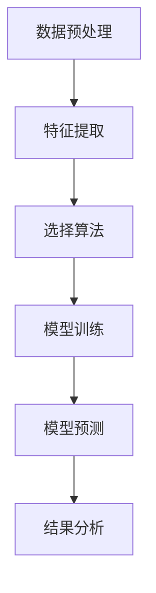
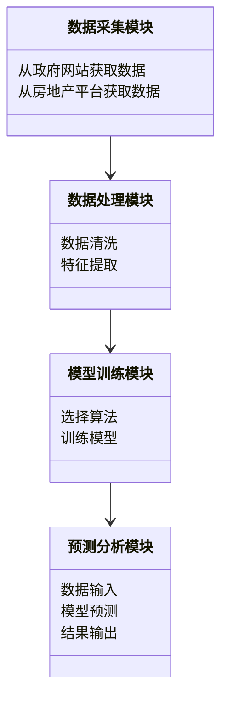
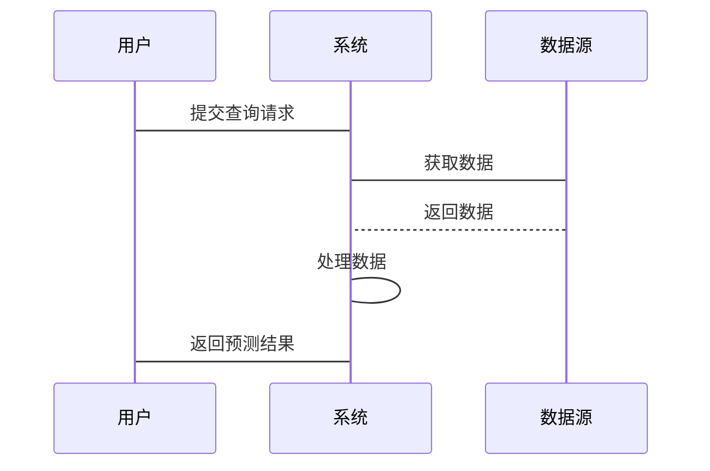

                 


# AI辅助的房地产投资分析

> 关键词：AI，房地产投资，机器学习，数据分析，市场预测，深度学习

> 摘要：本文探讨了人工智能技术在房地产投资分析中的应用，通过结合AI算法和房地产市场数据，分析了如何利用AI辅助房地产投资决策。文章从AI的基本概念、房地产投资分析的方法、AI在房地产投资中的优势，到具体的算法实现、系统架构设计、项目实战案例，全面阐述了AI辅助房地产投资分析的核心内容和实践应用。通过本文，读者将能够理解AI在房地产投资分析中的重要作用，并掌握如何利用AI技术提升房地产投资决策的准确性和效率。

---

# 第一部分: AI辅助的房地产投资分析背景与基础

## 第1章: AI与房地产投资分析的结合

### 1.1 AI技术的基本概念

#### 1.1.1 人工智能的基本定义
人工智能（Artificial Intelligence，AI）是指模拟人类智能的计算机系统，涵盖学习、推理、自我改进等能力。AI的核心技术包括机器学习（Machine Learning）、自然语言处理（NLP）、计算机视觉（Computer Vision）等。

#### 1.1.2 机器学习的核心原理
机器学习是AI的重要分支，通过训练数据模型来预测或分类新的数据。监督学习、无监督学习、强化学习是机器学习的三大主要类型。

#### 1.1.3 深度学习的典型特征
深度学习是一种基于人工神经网络的机器学习方法，通过多层神经网络提取数据特征，具有强大的非线性拟合能力。

### 1.2 房地产投资分析的基本方法

#### 1.2.1 房地产投资的基本概念
房地产投资是指通过购买、持有或开发房地产资产以获取收益的行为。其核心目标是通过分析市场趋势、经济指标等因素，选择具有投资价值的房地产项目。

#### 1.2.2 传统房地产投资分析的流程
传统房地产投资分析通常包括市场研究、财务分析、风险评估等步骤。然而，传统方法依赖人工分析，存在效率低、主观性强等问题。

#### 1.2.3 数据驱动的房地产投资分析现状
随着大数据技术的发展，房地产投资分析开始转向数据驱动的方法，利用海量数据和AI技术进行更精准的预测和分析。

### 1.3 AI辅助房地产投资分析的背景与意义

#### 1.3.1 房地产市场的复杂性与不确定性
房地产市场受到经济、政策、社会等多种因素的影响，具有高度复杂性和不确定性。传统的分析方法难以应对这种复杂性。

#### 1.3.2 AI技术在房地产投资中的优势
AI技术能够处理海量数据，发现隐藏的规律，提供更精准的预测和决策支持，从而提高房地产投资的效率和准确性。

#### 1.3.3 当前AI辅助房地产投资分析的应用现状
目前，AI技术在房地产投资分析中的应用主要集中在市场预测、价格评估、风险分析等领域，但仍处于初级发展阶段。

---

# 第二部分: AI辅助房地产投资分析的核心概念与联系

## 第2章: AI辅助房地产投资分析的核心概念

### 2.1 数据驱动的房地产投资分析

#### 2.1.1 数据在房地产投资分析中的作用
数据是AI分析的基础，包括房地产价格、交易量、经济指标、政策变化等多维度数据。

#### 2.1.2 数据的类型与特征
房地产数据可以分为结构化数据（如表格数据）和非结构化数据（如文本数据）。结构化数据便于机器学习模型处理，而非结构化数据则需要额外的处理步骤。

#### 2.1.3 数据采集与处理的关键步骤
数据采集包括从政府网站、房地产平台等渠道获取数据；数据处理包括清洗、转换和特征提取等步骤。

### 2.2 AI模型在房地产投资分析中的应用

#### 2.2.1 机器学习模型的分类与选择
根据任务类型选择合适的机器学习模型，如线性回归用于价格预测，随机森林用于分类问题。

#### 2.2.2 深度学习模型的适用场景
深度学习适用于复杂的数据模式识别，如房地产价格的非线性预测。

#### 2.2.3 模型评估与优化方法
通过交叉验证、网格搜索等方法优化模型参数，选择最优模型。

### 2.3 房地产市场预测的AI方法

#### 2.3.1 时间序列预测的基本原理
时间序列预测通过分析历史数据的趋势和周期性，预测未来的市场走势。

#### 2.3.2 基于AI的房地产价格预测模型
利用机器学习算法，结合房地产市场的多维数据，构建价格预测模型。

#### 2.3.3 市场趋势预测的不确定性分析
通过模型的置信区间、误差分析等方法，评估预测结果的不确定性。

## 第3章: 核心概念与联系的数学模型

### 3.1 AI模型的基本数学原理

#### 3.1.1 机器学习的数学基础
机器学习模型的训练过程涉及优化算法，如梯度下降，目标是最小化损失函数。

#### 3.1.2 神经网络的数学模型
神经网络通过多层非线性变换，将输入数据映射到输出结果。激活函数如ReLU、sigmoid等是神经网络的重要组成部分。

#### 3.1.3 深度学习的核心算法
深度学习算法如卷积神经网络（CNN）、循环神经网络（RNN）等，适用于不同类型的数据处理。

### 3.2 房地产投资分析的数学模型

#### 3.2.1 时间序列分析的数学公式
时间序列分析可以使用ARIMA模型，公式为：
$$ y_t = \phi_1 y_{t-1} + \phi_2 y_{t-2} + \epsilon_t $$

#### 3.2.2 回归分析在房地产价格预测中的应用
线性回归模型的公式为：
$$ y = \beta_0 + \beta_1 x_1 + \beta_2 x_2 + \ldots + \beta_n x_n + \epsilon $$

#### 3.2.3 风险评估的数学模型
风险评估可以使用VaR（Value at Risk）模型，计算在一定置信水平下的潜在损失。

### 3.3 AI与房地产投资分析的联系

#### 3.3.1 数据驱动的房地产投资分析模型
通过AI技术，将房地产市场的多维数据转化为可分析的特征，构建预测模型。

#### 3.3.2 基于AI的房地产市场预测模型
利用深度学习模型，分析房地产市场的复杂性，提供更精准的预测结果。

#### 3.3.3 AI技术在房地产投资决策中的应用
通过AI技术，投资者可以快速获取市场信息，优化投资决策，降低投资风险。

---

# 第三部分: AI辅助房地产投资分析的算法实现

## 第4章: AI算法在房地产投资分析中的实现

### 4.1 算法原理讲解

#### 4.1.1 算法选择与实现步骤
选择适合任务的算法，如线性回归用于价格预测，随机森林用于分类问题。

#### 4.1.2 算法实现的数学模型
线性回归的损失函数为：
$$ L = \frac{1}{2m} \sum_{i=1}^{m} (y_i - \hat{y_i})^2 $$
其中，$m$ 是样本数量，$y_i$ 是真实值，$\hat{y_i}$ 是预测值。

#### 4.1.3 算法实现的代码示例
使用Python和Scikit-learn库实现线性回归：
```python
from sklearn.linear_model import LinearRegression
import numpy as np

# 生成数据
X = np.array([[1], [2], [3], [4], [5]])
y = np.array([2, 4, 5, 4, 5])

# 模型训练
model = LinearRegression()
model.fit(X, y)

# 预测
print(model.predict([[6]]))  # 输出：[[6.8]]
```

### 4.2 算法实现的流程图


---

# 第四部分: AI辅助房地产投资分析的系统架构设计

## 第5章: 系统分析与架构设计方案

### 5.1 问题场景介绍

#### 5.1.1 系统需求分析
系统需要实现房地产市场的数据采集、模型训练、预测分析等功能。

#### 5.1.2 项目介绍
本项目旨在开发一个基于AI的房地产投资分析系统，帮助投资者进行决策支持。

### 5.2 系统功能设计

#### 5.2.1 领域模型设计


#### 5.2.2 系统架构设计


#### 5.2.3 系统接口设计
系统接口包括数据接口、模型接口和用户接口，分别用于数据交互、模型调用和用户操作。

#### 5.2.4 系统交互流程图


---

# 第五部分: AI辅助房地产投资分析的项目实战

## 第6章: 项目实战与案例分析

### 6.1 项目环境安装

#### 6.1.1 环境搭建
安装Python、Jupyter Notebook、Pandas、Scikit-learn等工具。

#### 6.1.2 数据获取
从政府网站、房地产平台等渠道获取房地产相关数据。

### 6.2 系统核心实现源代码

#### 6.2.1 数据处理代码
```python
import pandas as pd
import numpy as np

# 数据加载
data = pd.read_csv('real Estate.csv')

# 数据清洗
data.dropna(inplace=True)
data['price'] = pd.to_numeric(data['price'], errors='coerce')
data = data[data['price'].notna()]
```

#### 6.2.2 模型训练代码
```python
from sklearn.model_selection import train_test_split
from sklearn.linear_model import LinearRegression
from sklearn.metrics import mean_squared_error

# 数据分割
X = data[['area', 'bedrooms']]
y = data['price']

X_train, X_test, y_train, y_test = train_test_split(X, y, test_size=0.2, random_state=42)

# 模型训练
model = LinearRegression()
model.fit(X_train, y_train)

# 模型预测
y_pred = model.predict(X_test)
print(mean_squared_error(y_test, y_pred))
```

### 6.3 案例分析与详细解读

#### 6.3.1 案例背景
以某城市房地产市场为例，分析影响房价的主要因素。

#### 6.3.2 数据分析
通过数据可视化工具（如Matplotlib、Seaborn）分析房价与面积、卧室数量的关系。

#### 6.3.3 模型预测
利用训练好的模型，预测未来房价走势，并分析预测结果的准确性。

### 6.4 项目小结

#### 6.4.1 项目总结
通过本项目，验证了AI技术在房地产投资分析中的有效性。

#### 6.4.2 经验总结
数据 preprocessing、模型选择和调优是项目成功的关键。

---

# 第六部分: AI辅助房地产投资分析的总结与展望

## 第7章: 总结与展望

### 7.1 最佳实践 tips

#### 7.1.1 数据质量的重要性
确保数据的准确性和完整性，是AI分析的基础。

#### 7.1.2 模型选择的技巧
根据具体任务选择合适的算法，避免过度复杂的模型。

#### 7.1.3 结果验证的必要性
通过交叉验证、误差分析等方法，验证模型的可靠性。

### 7.2 小结

#### 7.2.1 AI辅助房地产投资分析的核心内容
AI技术能够提升房地产投资分析的效率和准确性，是未来的重要发展方向。

#### 7.2.2 本文的主要贡献
本文系统地探讨了AI在房地产投资分析中的应用，提供了理论基础和实践指导。

### 7.3 注意事项

#### 7.3.1 数据隐私问题
在实际应用中，需注意数据隐私保护，避免数据泄露。

#### 7.3.2 模型的局限性
AI模型可能存在过拟合或欠拟合的问题，需要结合实际情况进行调整。

### 7.4 拓展阅读

#### 7.4.1 相关技术领域
进一步学习时间序列分析、强化学习等技术，提升模型的预测能力。

#### 7.4.2 实际应用场景
探索AI技术在房地产金融、风险评估等领域的应用，拓展研究的深度和广度。

---

通过本文的系统阐述，读者可以全面了解AI在房地产投资分析中的应用，并掌握实际操作的方法。未来，随着AI技术的不断发展，其在房地产投资分析中的作用将更加重要。

