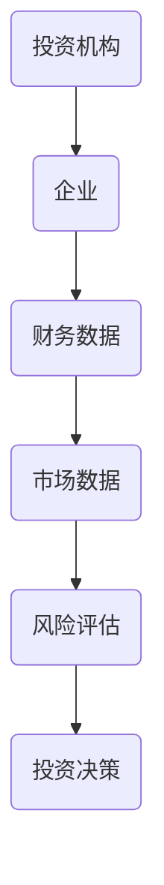
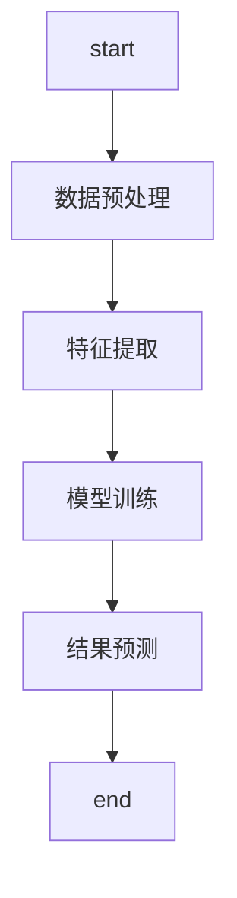
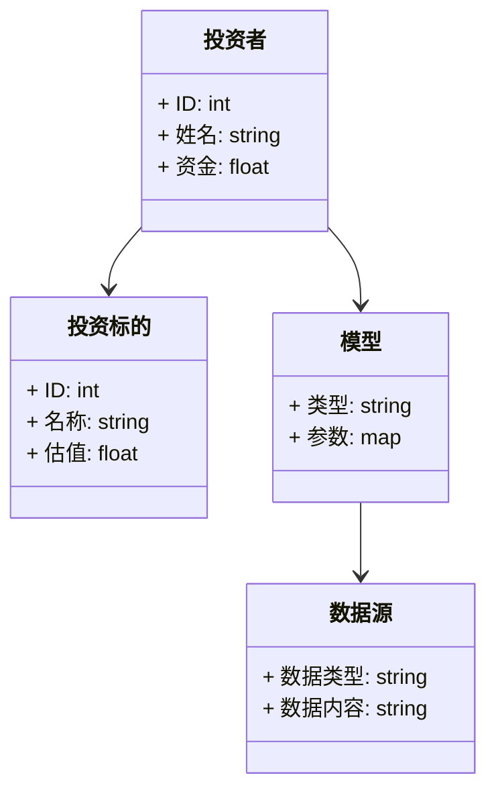
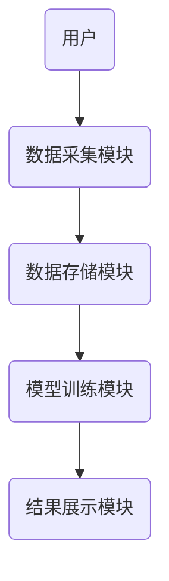
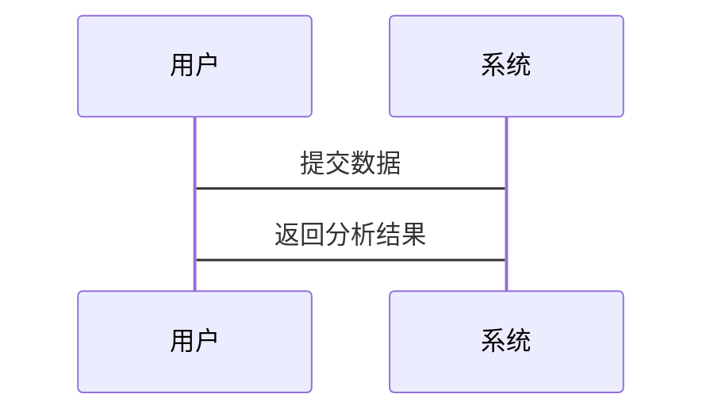

                 


# AI辅助的私募股权投资分析

## 关键词：AI，私募股权，投资分析，机器学习，数据分析

## 摘要：本文探讨AI如何辅助私募股权投资分析，从数据处理、模型训练到投资决策，详细分析其技术实现和应用场景，提供实际案例和系统设计，展示AI在提升投资效率和准确性中的潜力。

---

# 第1章：AI辅助的私募股权投资分析背景

## 1.1 私募股权投资的定义与特点

### 1.1.1 私募股权投资的定义
私募股权投资是指通过私募基金或其他私募投资工具，对非上市公司进行的权益性投资。其核心目标是通过长期持有目标公司的股权，实现资本增值。

### 1.1.2 私募股权投资的核心特点
1. **高收益潜力**：通过资本增值实现收益。
2. **高风险性**：投资标的不确定性较高。
3. **专业性**：需要专业的知识和经验。

### 1.1.3 私募股权投资与传统投资的区别
| 方面 | 私募股权投资 | 传统投资 |
|------|--------------|-----------|
| 投资对象 | 非上市公司股权 | 公司债券、股票等 |
| 投资期限 | 长期 | 短期或长期 |
| 投资策略 | 主动管理 | 被动管理 |

## 1.2 AI在金融领域的应用背景

### 1.2.1 AI在金融领域的应用现状
AI在金融领域的应用包括股票预测、风险管理、信用评估等。

### 1.2.2 私募股权投资中的数据挑战
1. 数据来源多样：财务数据、市场数据、新闻数据等。
2. 数据量大且复杂：非结构化数据占比高。
3. 数据质量参差不齐：需要大量清洗和处理。

### 1.2.3 AI技术在私募股权投资中的潜力
AI可以帮助投资者分析大量数据，识别潜在投资机会，优化投资组合。

## 1.3 本章小结
本章介绍了私募股权投资的基本概念和特点，并分析了AI在金融领域的应用背景，特别是在私募股权投资中的潜力。

---

# 第2章：AI辅助的私募股权投资分析核心概念

## 2.1 核心概念与联系

### 2.1.1 核心概念原理
AI在私募股权投资中的核心作用是通过数据驱动的方法，帮助投资者做出更明智的决策。

### 2.1.2 核心概念属性特征对比表格
| 概念 | 属性 | 特征 |
|------|------|------|
| 数据来源 | 多样性 | 文本、数值、图像 |
| 数据处理 | 复杂性 | 清洗、特征提取 |
| 模型训练 | 精度 | 高精度预测 |

### 2.1.3 ER实体关系图架构


## 2.2 本章小结
本章通过对比表格和ER图，详细分析了AI辅助私募股权投资中的核心概念及其相互关系。

---

# 第3章：AI辅助的私募股权投资分析算法原理

## 3.1 算法原理讲解

### 3.1.1 算法流程


### 3.1.2 核心算法代码实现
```python
import pandas as pd
from sklearn.model_selection import train_test_split
from sklearn.ensemble import RandomForestClassifier

# 数据加载与预处理
data = pd.read_csv('investment_data.csv')
X = data.drop('target', axis=1)
y = data['target']

# 数据分割
X_train, X_test, y_train, y_test = train_test_split(X, y, test_size=0.2)

# 模型训练
model = RandomForestClassifier()
model.fit(X_train, y_train)

# 预测与评估
accuracy = model.score(X_test, y_test)
print(f'Accuracy: {accuracy}')
```

## 3.2 数学公式

### 3.2.1 随机森林算法
随机森林是一种基于决策树的集成学习方法，公式如下：
$$ y = \text{sign}(\sum_{i=1}^{n} \text{Tree}(x)) $$

### 3.2.2 评估指标
常用准确率（Accuracy）和召回率（Recall）来评估模型性能：
$$ \text{Accuracy} = \frac{\text{正确预测数}}{\text{总样本数}} $$
$$ \text{Recall} = \frac{\text{正确预测的正例数}}{\text{总正例数}} $$

---

# 第4章：系统分析与架构设计方案

## 4.1 项目介绍
本项目旨在构建一个AI辅助的私募股权投资分析系统，帮助投资者提高投资决策的准确性和效率。

## 4.2 系统功能设计

### 4.2.1 领域模型设计


### 4.2.2 系统架构设计


### 4.2.3 系统接口设计
1. 数据接口：提供API用于数据导入和导出。
2. 模型接口：提供API用于模型训练和预测。

### 4.2.4 系统交互设计


---

# 第5章：项目实战

## 5.1 环境安装
需要安装Python、Pandas、Scikit-learn等库。

## 5.2 核心实现源代码
```python
import pandas as pd
from sklearn.ensemble import RandomForestClassifier

# 加载数据
data = pd.read_csv('investment_data.csv')

# 数据预处理
X = data.drop('target', axis=1)
y = data['target']

# 划分数据集
X_train, X_test, y_train, y_test = train_test_split(X, y, test_size=0.2)

# 训练模型
model = RandomForestClassifier()
model.fit(X_train, y_train)

# 预测与评估
accuracy = model.score(X_test, y_test)
print(f'模型准确率：{accuracy}')
```

## 5.3 实际案例分析
通过分析某科技公司的财务数据和市场表现，模型预测其投资价值。

## 5.4 代码应用解读与分析
详细解读代码功能，分析模型的优缺点及适用场景。

## 5.5 项目小结
本项目展示了如何利用AI技术辅助私募股权投资分析，验证了其在实际应用中的有效性。

---

# 第6章：最佳实践、注意事项和未来展望

## 6.1 最佳实践 tips
1. 数据质量至关重要，需进行充分清洗和特征工程。
2. 模型选择需根据具体问题和数据特点进行调整。

## 6.2 注意事项
1. 数据隐私保护需严格遵守相关法规。
2. 模型解释性需重视，便于分析和优化。

## 6.3 未来展望
随着AI技术的不断发展，私募股权投资分析将更加智能化和精准化，更多创新算法和工具将被引入，进一步提升投资效率和回报。

---

# 第7章：总结

## 7.1 核心内容回顾
本文详细介绍了AI在私募股权投资中的应用，从数据处理到模型训练，再到系统架构设计和实际案例分析，全面展示了AI技术的优势。

## 7.2 未来研究方向
未来可进一步研究多模态数据融合、强化学习在投资决策中的应用。

## 7.3 结语
AI技术为私募股权投资分析带来了新的可能性，投资者需结合技术与经验，充分利用AI工具提升投资效率和准确性。

--- 

# 附录

## 附录A：相关术语解释
1. **随机森林**：一种集成学习方法，通过构建多个决策树并集成结果来提高预测准确率。
2. **特征工程**：通过数据处理和特征提取，将原始数据转化为对模型友好的特征表示。

## 附录B：参考文献
1. 书籍：《机器学习实战》
2. 论文：《基于机器学习的金融时间序列预测》

--- 

以上是一个详细的《AI辅助的私募股权投资分析》文章目录大纲，按照逻辑逐步展开，内容详实，结构清晰，适合技术博客的撰写。

