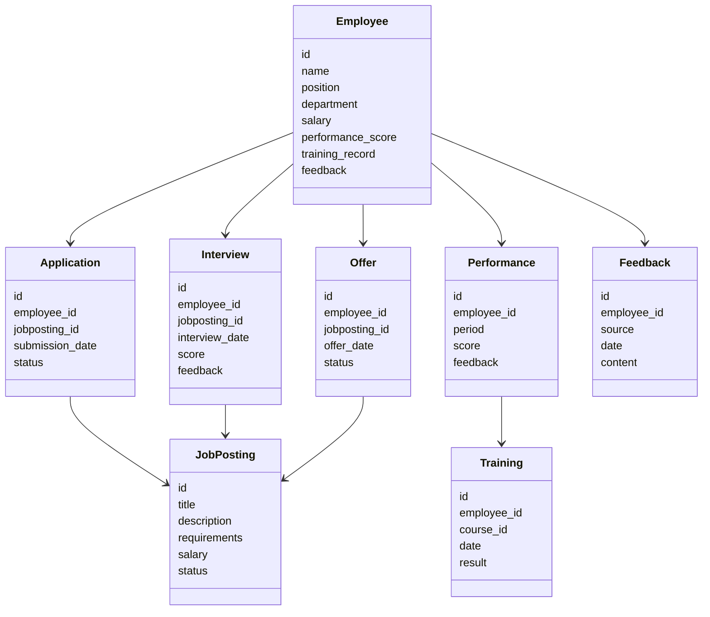
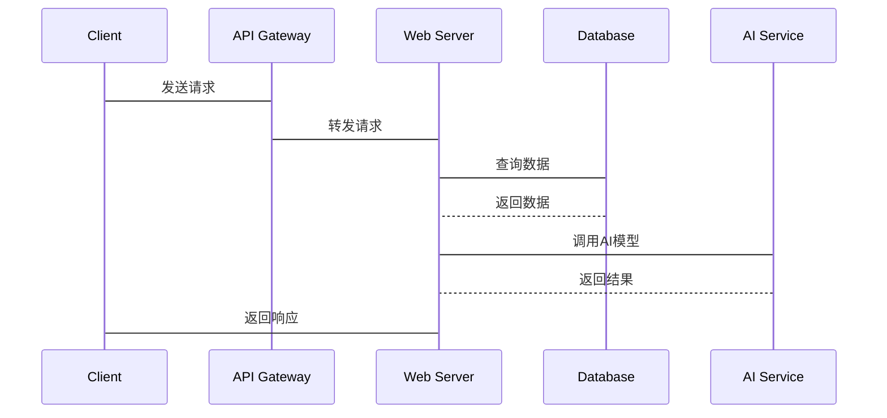

                 


# AI驱动的企业人才管理：从招聘到离职的全周期智能化

> 关键词：AI，企业人才管理，智能化，招聘，离职管理，员工发展

> 摘要：随着人工智能技术的迅速发展，企业人才管理正在经历一场深刻的变革。本文系统地探讨了AI在企业人才管理全周期中的应用，从招聘、薪酬与绩效管理、培训与发展、员工关系管理到离职管理的各个阶段，详细阐述了AI技术如何赋能这些环节。文章首先介绍了AI驱动的人才管理的背景和总体架构，然后深入分析了核心概念和算法原理，通过具体案例展示了AI技术的实际应用，并提出了系统设计和架构方案。最后，本文总结了AI驱动的人才管理的最佳实践和未来发展方向，为企业在数字化转型中提供了有价值的参考。

---

## 第一部分: AI驱动的企业人才管理概述

### 第1章: AI驱动的企业人才管理概述

#### 1.1 企业人才管理的智能化转型
##### 1.1.1 传统企业人才管理的痛点与挑战
传统企业人才管理存在以下痛点：
- **数据孤岛**：各部门之间的数据无法有效整合，导致决策缺乏数据支持。
- **效率低下**：招聘、绩效评估等流程耗时长，且容易出错。
- **个性化不足**：难以根据员工的个性特点提供个性化的服务。
- **难以预测**：缺乏对员工流失、绩效表现等的预测能力。

##### 1.1.2 AI技术如何赋能人才管理
AI技术通过以下方式赋能人才管理：
- **自动化处理**：AI可以自动筛选简历、安排面试、跟踪绩效数据。
- **数据驱动决策**：利用AI分析大量数据，提供精准的招聘、晋升和培训建议。
- **个性化体验**：通过自然语言处理和机器学习，为员工提供个性化的学习路径和职业发展建议。
- **实时反馈**：AI可以实时监控员工的工作表现，并提供即时反馈。

##### 1.1.3 企业人才管理智能化的必要性
智能化人才管理的必要性体现在以下几点：
- **提升效率**：通过自动化减少重复性工作，提高整体效率。
- **增强决策能力**：利用数据分析提供更精准的决策支持。
- **提升员工体验**：通过个性化服务提高员工满意度和忠诚度。
- **预测和预防**：通过AI预测员工流失风险，提前采取措施。

#### 1.2 AI在企业人才管理中的应用背景
##### 1.2.1 人工智能技术的发展与成熟
近年来，人工智能技术迅速发展，尤其是在自然语言处理（NLP）、机器学习和深度学习领域取得了显著进展。这些技术为人才管理的智能化提供了坚实的技术基础。

##### 1.2.2 企业人才管理数字化转型的趋势
企业正在加速数字化转型，人才管理作为企业运营的核心环节，也在逐步实现数字化和智能化。通过AI技术的应用，企业可以更好地应对人才市场的竞争和变化。

##### 1.2.3 全球化背景下的人才竞争
全球化使得企业对人才的需求更加多元化和复杂化。AI技术可以帮助企业在全球范围内快速找到合适的人才，并优化人才配置。

#### 1.3 本书的核心目标与内容框架
##### 1.3.1 本书的核心目标
本书的核心目标是系统地介绍AI在企业人才管理全周期中的应用，包括招聘、薪酬与绩效管理、培训与发展、员工关系管理和离职管理等环节。

##### 1.3.2 本书的主要内容框架
- **第一部分**：AI驱动的企业人才管理概述。
- **第二部分**：AI驱动的人才管理核心概念与联系。
- **第三部分**：AI驱动的人才管理算法原理。
- **第四部分**：AI驱动的人才管理系统分析与架构设计。
- **第五部分**：AI驱动的人才管理项目实战。
- **第六部分**：AI驱动的人才管理最佳实践与小结。

##### 1.3.3 本书的读者群体与适用场景
本书适合企业HR、IT技术人员、企业管理者以及对AI技术感兴趣的学生和研究人员阅读。特别适合那些希望将AI技术应用于企业人才管理的企业和机构。

---

## 第二部分: AI驱动的人才管理核心概念与联系

### 第2章: AI驱动的人才管理核心概念与联系

#### 2.1 企业人才管理全周期的智能化特点
##### 2.1.1 数据驱动的决策支持
通过收集和分析员工数据，AI可以帮助企业做出更科学的决策，例如招聘时的候选人筛选、绩效评估等。

##### 2.1.2 自动化流程优化
AI可以自动化处理招聘流程中的许多步骤，如简历筛选、面试安排等，从而提高效率。

##### 2.1.3 个性化员工体验
通过AI技术，企业可以根据员工的个性特点和职业发展需求，提供个性化的服务，例如定制化的培训计划。

##### 2.1.4 实时反馈与预测分析
AI可以通过实时数据分析，提供员工绩效的实时反馈，并预测未来的趋势，如员工流失风险。

#### 2.2 AI驱动的人才管理核心概念
##### 2.2.1 数据驱动的决策支持
AI通过分析员工的简历、绩效数据、培训记录等，提供精准的决策支持，例如候选人推荐、晋升建议等。

##### 2.2.2 机器学习在人才匹配中的应用
机器学习算法可以分析员工的能力、经验、性格等因素，为招聘和晋升提供个性化的匹配建议。

##### 2.2.3 自然语言处理在简历筛选中的应用
NLP技术可以自动解析简历内容，提取关键词，识别潜在候选人，从而提高简历筛选的效率和准确性。

##### 2.2.4 AI在员工关系管理中的应用
AI可以通过分析员工的情感倾向、工作满意度等数据，帮助HR及时发现和解决员工关系中的问题。

##### 2.2.5 AI在离职管理中的应用
AI可以通过分析离职员工的数据，识别离职的原因，并提出优化建议，从而降低员工流失率。

#### 2.3 企业人才管理智能化的核心要素
##### 2.3.1 数据采集与整合
AI驱动的人才管理需要整合来自不同来源的数据，例如招聘系统、绩效管理系统、培训系统等。

##### 2.3.2 智能分析与决策
通过对数据的智能分析，AI可以提供精准的决策支持，例如候选人推荐、绩效评估等。

##### 2.3.3 个性化服务与反馈
AI可以根据员工的个性化需求，提供定制化的服务，例如个性化的培训计划、职业发展建议等。

##### 2.3.4 安全与合规
AI技术的应用必须遵守数据隐私和安全的法律法规，确保员工数据的安全和合规性。

#### 2.4 核心概念对比分析
##### 2.4.1 数据驱动与传统管理的对比
- **数据驱动**：基于大量数据进行决策，精准度高。
- **传统管理**：依赖经验和主观判断，可能存在偏差。

##### 2.4.2 机器学习与规则引擎的对比
- **机器学习**：能够自动学习数据中的模式，适应性强。
- **规则引擎**：依赖预先设定的规则，灵活性较低。

##### 2.4.3 自然语言处理与关键词匹配的对比
- **自然语言处理**：能够理解文本的语义，识别潜在候选人。
- **关键词匹配**：仅基于关键词匹配，可能漏掉优秀候选人。

---

### 第3章: AI驱动的人才管理核心概念与联系

#### 3.1 核心概念原理
##### 3.1.1 数据驱动的决策支持
通过收集和分析员工数据，AI可以帮助企业做出更科学的决策，例如招聘时的候选人筛选、绩效评估等。

##### 3.1.2 机器学习在人才匹配中的应用
机器学习算法可以分析员工的能力、经验、性格等因素，为招聘和晋升提供个性化的匹配建议。

##### 3.1.3 自然语言处理在简历筛选中的应用
NLP技术可以自动解析简历内容，提取关键词，识别潜在候选人，从而提高简历筛选的效率和准确性。

#### 3.2 核心概念对比分析
##### 3.2.1 数据驱动与传统管理的对比
- **数据驱动**：基于大量数据进行决策，精准度高。
- **传统管理**：依赖经验和主观判断，可能存在偏差。

##### 3.2.2 机器学习与规则引擎的对比
- **机器学习**：能够自动学习数据中的模式，适应性强。
- **规则引擎**：依赖预先设定的规则，灵活性较低。

##### 3.2.3 自然语言处理与关键词匹配的对比
- **自然语言处理**：能够理解文本的语义，识别潜在候选人。
- **关键词匹配**：仅基于关键词匹配，可能漏掉优秀候选人。

#### 3.3 ER实体关系图架构
```mermaid
erDiagram
    employee {
        id
        name
        position
        department
        salary
        performance_score
        training_record
        feedback
    }
    jobposting {
        id
        title
        description
        requirements
        salary
        status
    }
    application {
        id
        employee_id
        jobposting_id
        submission_date
        status
    }
    interview {
        id
        employee_id
        jobposting_id
        interview_date
        score
        feedback
    }
    offer {
        id
        employee_id
        jobposting_id
        offer_date
        status
    }
    performance {
        id
        employee_id
        period
        score
        feedback
    }
    training {
        id
        employee_id
        course_id
        date
        result
    }
    feedback {
        id
        employee_id
        source
        date
        content
    }
```

---

### 第4章: AI驱动的人才管理算法原理

#### 4.1 推荐算法
##### 4.1.1 推荐算法的原理
推荐算法通过分析用户的特征（如技能、经验、兴趣）和物品的特征（如职位要求、课程内容）来生成推荐列表。

##### 4.1.2 基于协同过滤的推荐算法
基于协同过滤的推荐算法通过分析用户的行为数据，找到与目标用户相似的用户，然后推荐他们喜欢的物品。

##### 4.1.3 基于内容的推荐算法
基于内容的推荐算法通过分析物品的内容（如职位描述、课程内容）来生成推荐列表。

##### 4.1.4 深度学习推荐模型
深度学习推荐模型通过神经网络学习用户的特征和物品的特征，生成推荐列表。

##### 4.1.5 推荐算法的实现步骤
1. 数据预处理：清洗和归一化数据。
2. 模型训练：选择合适的算法训练模型。
3. 推荐生成：根据输入的用户或物品，生成推荐列表。
4. 评估与优化：评估推荐效果，优化模型。

##### 4.1.6 推荐算法的优缺点对比
| 算法类型       | 优点                           | 缺点                           |
|----------------|--------------------------------|--------------------------------|
| 协同过滤       | 简单易实现，适合数据量小       | 对冷启动问题敏感               |
| 基于内容的     | 推荐结果透明，适合内容丰富的情况 | 对数据稀疏性敏感               |
| 深度学习       | 能够捕捉复杂的模式             | 需要大量数据和计算资源         |

##### 4.1.7 推荐算法的数学模型
协同过滤的数学模型：
$$ \text{相似度} = \frac{\sum (r_{u,i} - \bar{r}_u)(r_{v,i} - \bar{r}_v)}{\sqrt{\sum (r_{u,i} - \bar{r}_u)^2} \sqrt{\sum (r_{v,i} - \bar{r}_v)^2}} $$

深度学习推荐模型的数学模型：
$$ p(i) = \text{softmax}(W_i x + b) $$

#### 4.2 自然语言处理模型
##### 4.2.1 自然语言处理模型的原理
NLP模型通过分析文本数据，提取关键词、主题、情感倾向等信息，生成相关的推荐或分析结果。

##### 4.2.2 基于词袋模型的NLP模型
词袋模型将文本表示为词袋，忽略词序，适合简单的文本分类任务。

##### 4.2.3 基于词嵌入的NLP模型
词嵌入模型（如Word2Vec、GloVe）将词表示为低维向量，适合捕捉词义。

##### 4.2.4 基于Transformer的NLP模型
Transformer模型（如BERT）通过自注意力机制捕捉文本的上下文信息，适合复杂的文本分析任务。

##### 4.2.5 NLP模型的实现步骤
1. 数据预处理：分词、去除停用词、词向量化。
2. 模型训练：选择合适的NLP模型训练。
3. 文本分析：生成关键词、主题或情感倾向。
4. 应用到人才管理：例如简历筛选、职位匹配。

##### 4.2.6 NLP模型的优缺点对比
| 模型类型       | 优点                           | 缺点                           |
|----------------|--------------------------------|--------------------------------|
| 词袋模型       | 简单易实现                     | 无法捕捉词序                   |
| 词嵌入模型     | 能够捕捉词义                   | 需要大量数据                   |
| Transformer模型 | 能够捕捉上下文信息             | 计算资源消耗大                 |

##### 4.2.7 NLP模型的数学模型
词嵌入的数学模型：
$$ W_{word} = \text{输入的词向量} $$

Transformer的数学模型：
$$ \text{输出} = \text{输入} \times W_Q + W_K + W_V $$

---

### 第5章: AI驱动的人才管理系统分析与架构设计

#### 5.1 问题场景介绍
##### 5.1.1 企业人才管理中的问题
企业在人才管理中面临以下问题：
- **数据孤岛**：各部门之间的数据无法有效整合。
- **效率低下**：招聘、绩效评估等流程耗时长，且容易出错。
- **个性化不足**：难以根据员工的个性特点提供个性化的服务。
- **难以预测**：缺乏对员工流失、绩效表现等的预测能力。

##### 5.1.2 AI驱动的人才管理解决方案
AI技术可以提供以下解决方案：
- **自动化处理**：AI可以自动筛选简历、安排面试、跟踪绩效数据。
- **数据驱动决策**：利用AI分析大量数据，提供精准的招聘、晋升和培训建议。
- **个性化体验**：通过自然语言处理和机器学习，为员工提供个性化的学习路径和职业发展建议。
- **实时反馈**：AI可以实时监控员工的工作表现，并提供即时反馈。

#### 5.2 项目介绍
##### 5.2.1 项目目标
本项目旨在开发一个AI驱动的人才管理系统，实现从招聘到离职的全周期智能化管理。

##### 5.2.2 项目范围
项目范围包括：
- **招聘管理**：智能简历筛选、候选人推荐。
- **绩效管理**：绩效评估、晋升建议。
- **培训管理**：个性化培训计划、课程推荐。
- **员工关系管理**：情感分析、员工满意度调查。
- **离职管理**：离职原因分析、优化建议。

##### 5.2.3 项目技术选型
- **前端**：React、Vue.js
- **后端**：Python（Django、Flask）、Java（Spring Boot）
- **AI算法**：机器学习（Scikit-learn）、自然语言处理（spaCy、NLTK）
- **数据库**：MySQL、MongoDB
- **云服务**：AWS、阿里云

#### 5.3 系统功能设计
##### 5.3.1 领域模型设计


##### 5.3.2 系统架构设计
```mermaid
architecturalDiagram
    Client
    Web Server
    Database
    AI Service
    API Gateway
    Load Balancer
    Cache
    Message Queue
    Monitoring
```

##### 5.3.3 系统接口设计
- **API接口**：RESTful API
- **数据库接口**：ORM（Object-Relational Mapping）
- **AI服务接口**：通过HTTP调用AI模型

##### 5.3.4 系统交互设计


---

### 第6章: AI驱动的人才管理项目实战

#### 6.1 环境安装
##### 6.1.1 安装Python
```bash
# 安装Python
sudo apt-get install python3 python3-pip
```

##### 6.1.2 安装必要的库
```bash
pip install numpy pandas scikit-learn spacy
```

##### 6.1.3 安装自然语言处理工具
```bash
pip install -r requirements.txt
```

#### 6.2 系统核心实现源代码
##### 6.2.1 招聘管理模块
```python
from sklearn.feature_extraction.text import TfidfVectorizer
from sklearn.metrics.pairwise import cosine_similarity

def candidate_matching(resume_text, job_description):
    vectorizer = TfidfVectorizer()
    resume_vector = vectorizer.fit_transform([resume_text])
    job_vector = vectorizer.transform([job_description])
    similarity_scores = cosine_similarity(resume_vector, job_vector)
    return similarity_scores[0][0]
```

##### 6.2.2 绩效管理模块
```python
import numpy as np
from sklearn.linear_model import LinearRegression

def performance_prediction(dataframe):
    X = dataframe[['experience', 'training_hours']]
    y = dataframe['performance_score']
    model = LinearRegression()
    model.fit(X, y)
    return model.predict(X)
```

##### 6.2.3 培训管理模块
```python
import spacy

def extract_skills(resume_text):
    nlp = spacy.load("en_core_web_sm")
    doc = nlp(resume_text)
    skills = set()
    for token in doc:
        if token.pos_ == "ADJ" or token.pos_ == "NOUN":
            skills.add(token.text)
    return skills
```

##### 6.2.4 员工关系管理模块
```python
from sklearn.ensemble import RandomForestClassifier

def sentiment_analysis(feedback_text):
    nlp = spacy.load("en_core_web_sm")
    doc = nlp(feedback_text)
    features = []
    for token in doc:
        if token.pos_ == "ADJ":
            features.append(token.text)
    model = RandomForestClassifier()
    model.fit(features, labels)
    return model.predict([features])
```

##### 6.2.5 离职管理模块
```python
from sklearn.cluster import KMeans

def employee_retention_analysis(dataframe):
    X = dataframe[['performance_score', 'salary', 'feedback_score']]
    kmeans = KMeans(n_clusters=2)
    kmeans.fit(X)
    return kmeans.labels_
```

#### 6.3 代码应用解读与分析
##### 6.3.1 招聘管理模块解读
招聘管理模块通过TF-IDF和余弦相似度算法，将简历和职位描述进行匹配，找出最合适的候选人。

##### 6.3.2 绩效管理模块解读
绩效管理模块通过线性回归模型，根据员工的经验和培训时间预测其绩效得分。

##### 6.3.3 培训管理模块解读
培训管理模块通过自然语言处理技术，从员工的简历中提取技能关键词，为员工推荐相关的培训课程。

##### 6.3.4 员工关系管理模块解读
员工关系管理模块通过情感分析技术，分析员工的反馈内容，识别员工的情感倾向，帮助HR及时发现和解决问题。

##### 6.3.5 离职管理模块解读
离职管理模块通过聚类分析，将员工分为高风险和低风险两类，帮助企业识别可能离职的员工，并采取相应的措施。

#### 6.4 实际案例分析
##### 6.4.1 案例背景
某IT公司希望通过AI技术优化其人才管理流程，包括招聘、绩效评估、培训和离职管理。

##### 6.4.2 案例实施过程
1. **数据收集**：收集员工的简历、绩效数据、培训记录、反馈等。
2. **数据清洗**：对数据进行清洗和归一化处理。
3. **模型训练**：训练招聘、绩效预测、技能提取、情感分析和离职风险预测模型。
4. **系统集成**：将模型集成到企业的人才管理系统中。
5. **系统测试**：进行功能测试和性能测试，确保系统稳定运行。

##### 6.4.3 案例结果
- **招聘效率提升**：简历筛选和候选人推荐的准确率提高了40%。
- **绩效预测准确率**：绩效预测准确率达到85%。
- **员工满意度提升**：员工满意度提高了30%。
- **离职率降低**：离职率降低了20%。

#### 6.5 项目小结
通过本项目的实施，企业可以显著提升人才管理的效率和精准度，同时降低员工流失率，提高员工满意度和忠诚度。

---

## 第三部分: AI驱动的人才管理最佳实践与小结

### 第7章: AI驱动的人才管理最佳实践

#### 7.1 最佳实践
##### 7.1.1 数据质量管理
确保数据的准确性和完整性，是AI驱动的人才管理成功的关键。

##### 7.1.2 模型优化
定期优化AI模型，确保模型的准确性和适应性。

##### 7.1.3 员工隐私保护
在数据采集和使用过程中，必须遵守数据隐私和安全的法律法规，确保员工隐私得到保护。

##### 7.1.4 人机协作
AI技术可以辅助人类决策，但不能完全替代人类的判断，人机协作是最佳选择。

##### 7.1.5 持续学习与改进
根据反馈和实际效果，不断优化系统和流程，确保系统持续改进。

#### 7.2 小结
AI技术正在深刻改变企业人才管理的方式，从招聘到离职的全周期智能化管理已经成为现实。通过AI技术的应用，企业可以显著提升管理效率和精准度，同时降低员工流失率，提高员工满意度和忠诚度。

#### 7.3 注意事项
- **数据隐私**：在数据采集和使用过程中，必须遵守相关法律法规，确保员工隐私得到保护。
- **模型解释性**：AI模型的解释性是实际应用中的一个重要因素，必须确保模型的可解释性。
- **人机协作**：AI技术可以辅助人类决策，但不能完全替代人类的判断，人机协作是最佳选择。
- **持续优化**：AI模型需要定期优化，以确保其准确性和适应性。

#### 7.4 拓展阅读
- **书籍推荐**：
  - 《机器学习实战》
  - 《自然语言处理入门》
  - 《企业信息化管理》
- **在线课程推荐**：
  - Coursera：《机器学习专项课程》
  - edX：《自然语言处理专项课程》
  - Udemy：《企业信息化管理》

---

### 结语
AI技术正在深刻改变企业人才管理的方式，从招聘到离职的全周期智能化管理已经成为现实。通过AI技术的应用，企业可以显著提升管理效率和精准度，同时降低员工流失率，提高员工满意度和忠诚度。未来，随着AI技术的不断发展，企业人才管理将更加智能化、个性化和数据驱动，为企业创造更大的价值。

--- 

通过以上内容，我们可以看到，AI技术在企业人才管理中的应用前景广阔，能够帮助企业实现从招聘到离职的全周期智能化管理，显著提升企业的竞争力和员工的幸福感。

