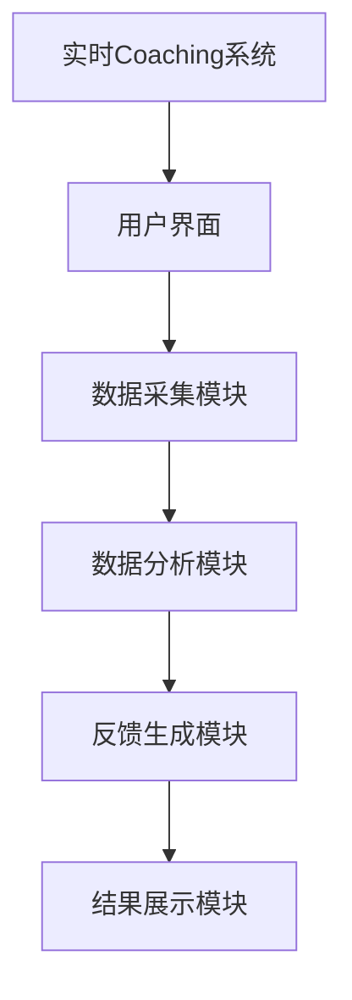
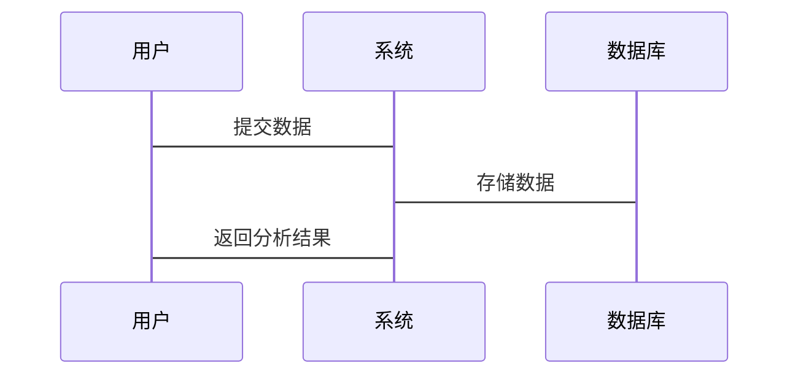
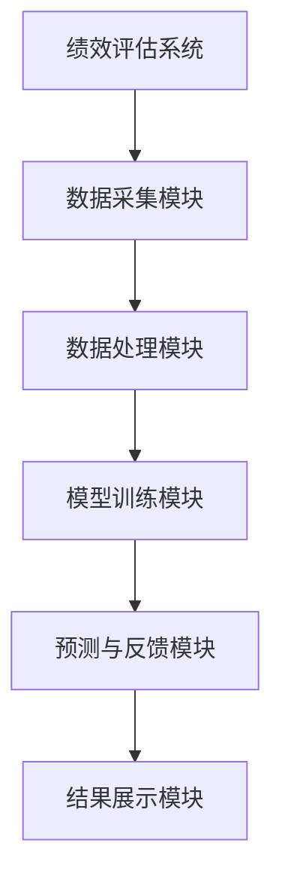

                 


# AI驱动的企业绩效管理：360度反馈与实时 Coaching

## 关键词：AI、绩效管理、360度反馈、实时Coaching、企业绩效、员工发展

## 摘要：  
随着人工智能技术的快速发展，企业绩效管理正在经历一场深刻的变革。传统的绩效管理方式逐渐被AI驱动的智能化方法所取代，360度反馈和实时Coaching成为提升员工绩效和企业整体效率的重要手段。本文将从AI在企业绩效管理中的应用出发，详细探讨360度反馈的核心概念、实现方法，以及实时Coaching的系统架构和算法原理。通过结合实际案例和系统设计，本文为读者提供一套完整的AI驱动企业绩效管理解决方案。

---

# 第1章: 企业绩效管理的背景与挑战

## 1.1 传统企业绩效管理的局限性

### 1.1.1 绩效管理的定义与目标  
绩效管理是企业通过设定目标、监控过程、评估结果和提供反馈，以提升员工和组织绩效的系统。其核心目标是优化员工表现、提高企业整体效率，并为员工发展提供支持。

### 1.1.2 传统绩效管理的常见问题  
1. **评估主观性**：传统绩效评估往往依赖于主观判断，容易受到评估者偏见的影响。  
2. **反馈延迟**：传统反馈机制通常周期较长，无法实时指导员工改进。  
3. **数据孤岛**：各部门数据分散，难以形成统一的评估标准和反馈机制。  
4. **员工参与度低**：员工对绩效评估过程缺乏参与感，导致对结果的不满和不信任。  

### 1.1.3 数字化转型对企业绩效管理的新要求  
随着企业数字化转型的推进，绩效管理需要更加智能化、数据化和实时化。企业期望通过技术手段实现精准评估、实时反馈和个性化发展支持。

---

## 1.2 AI技术对企业绩效管理的推动作用  

### 1.2.1 AI在企业管理中的应用现状  
AI技术在企业管理中的应用越来越广泛，特别是在数据分析、决策支持和流程优化方面。AI可以通过机器学习算法处理海量数据，提供精准的决策支持。

### 1.2.2 AI如何提升绩效管理的效率与精准度  
1. **数据驱动的评估**：AI可以通过分析员工的历史数据和实时表现，提供更加客观的评估结果。  
2. **实时反馈机制**：AI可以实时监控员工行为，提供即时反馈和指导。  
3. **个性化发展计划**：基于员工的绩效数据和能力特点，AI可以制定个性化的培训和发展计划。  

### 1.2.3 企业绩效管理的未来发展趋势  
未来的绩效管理将更加依赖AI技术，实现智能化、自动化和个性化。AI不仅能够优化评估过程，还能通过实时反馈和数据分析，帮助企业更好地实现战略目标。

---

## 1.3 本章小结  

### 1.3.1 传统绩效管理的不足  
传统绩效管理存在评估主观性、反馈延迟、数据孤岛和员工参与度低等问题，难以满足现代企业的需求。  

### 1.3.2 AI技术的赋能作用  
AI技术通过数据驱动的评估、实时反馈机制和个性化发展计划，显著提升了绩效管理的效率和精准度。  

### 1.3.3 未来绩效管理的发展方向  
未来的绩效管理将更加智能化、数据化和个性化，AI技术将在其中发挥核心作用。

---

# 第2章: 360度反馈的原理与实施

## 2.1 360度反馈的定义与特点  

### 2.1.1 360度反馈的定义  
360度反馈是一种多维度的绩效评估方法，通过收集来自员工本人、上级、同事、下属和客户等多个方面的反馈，全面评估员工的绩效表现。  

### 2.1.2 360度反馈的核心特点  
1. **全面性**：覆盖多个维度，包括技能、态度、行为表现等。  
2. **客观性**：结合多方反馈，减少评估的主观性。  
3. **互动性**：鼓励员工与管理者之间的互动，促进绩效改进。  

### 2.1.3 360度反馈与传统反馈的主要区别  
- **数据来源**：传统反馈主要依赖上级评估，而360度反馈结合多方数据。  
- **评估维度**：传统反馈注重结果，而360度反馈关注过程和行为。  
- **反馈频率**：传统反馈周期较长，而360度反馈可以实时进行。  

---

## 2.2 360度反馈的实施步骤  

### 2.2.1 确定反馈目标与范围  
企业在实施360度反馈前，需要明确评估的目标、范围和参与人员。  

### 2.2.2 设计反馈问卷与收集数据  
1. **问卷设计**：问卷应涵盖多个维度，包括技能、态度、行为表现等。  
2. **数据收集**：通过在线平台收集反馈数据，确保数据的完整性和准确性。  

### 2.2.3 数据分析与结果解读  
1. **数据分析**：利用AI技术对反馈数据进行分析，识别关键问题和优势。  
2. **结果解读**：将分析结果可视化，帮助员工和管理者更好地理解反馈内容。  

### 2.2.4 反馈结果的应用与改进  
1. **制定改进计划**：根据反馈结果，制定个性化的改进计划。  
2. **跟踪与评估**：定期跟踪改进效果，确保反馈结果的有效性。  

---

## 2.3 360度反馈的系统架构  

### 2.3.1 系统功能模块划分  
1. **用户界面**：供员工和管理者访问反馈系统。  
2. **数据采集模块**：收集多方反馈数据。  
3. **数据分析模块**：对数据进行清洗、分析和建模。  
4. **结果展示模块**：将分析结果以可视化形式呈现。  

### 2.3.2 数据流与信息交互  
- **数据流**：用户提交反馈 → 数据采集模块 → 数据分析模块 → 结果展示模块。  
- **信息交互**：系统根据反馈结果生成改进建议，并通过用户界面反馈给用户。  

### 2.3.3 系统安全性与隐私保护  
- **数据加密**：确保反馈数据的安全性和隐私性。  
- **权限管理**：不同角色用户拥有不同的访问权限。  

---

# 第3章: 实时Coaching的理论与实践

## 3.1 实时Coaching的定义与优势  

### 3.1.1 实时Coaching的定义  
实时Coaching是一种基于实时数据和AI技术的绩效改进方法，通过即时反馈和个性化指导帮助员工提升绩效。  

### 3.1.2 实时Coaching的核心优势  
1. **实时性**：能够在问题发生时立即提供反馈和指导。  
2. **个性化**：根据员工的实时表现和需求，提供个性化的改进建议。  
3. **数据驱动**：基于实时数据和AI分析，确保反馈的准确性和科学性。  

---

## 3.2 实时Coaching的实现方法  

### 3.2.1 基于AI的实时反馈机制  
- **数据采集**：通过传感器、日志记录等方式采集员工的实时行为数据。  
- **数据分析**：利用机器学习算法对数据进行分析，识别问题并生成反馈。  
- **反馈输出**：通过用户界面或消息通知的形式，将反馈实时传递给员工。  

### 3.2.2 实时数据分析与决策支持  
- **数据流处理**：对实时数据进行处理和分析，确保反馈的及时性。  
- **决策支持**：基于数据分析结果，提供实时的决策支持和改进建议。  

### 3.2.3 个性化Coaching策略的制定与执行  
- **个性化分析**：根据员工的绩效数据和能力特点，制定个性化的Coaching策略。  
- **策略执行**：通过系统化的流程，确保策略的有效执行和持续改进。  

---

## 3.3 实时Coaching的系统设计  

### 3.3.1 系统功能模块设计  
1. **实时数据采集模块**：采集员工的实时行为数据。  
2. **数据分析模块**：对数据进行清洗、分析和建模。  
3. **反馈生成模块**：根据分析结果生成实时反馈。  
4. **用户界面模块**：展示反馈结果并提供交互功能。  

### 3.3.2 系统架构图（Mermaid）  


### 3.3.3 系统交互流程图（Mermaid）  


---

## 3.4 本章小结  

### 3.4.1 实时Coaching的定义  
实时Coaching是一种基于实时数据和AI技术的绩效改进方法，能够快速响应员工的需求。  

### 3.4.2 实时Coaching的核心优势  
实时Coaching具有实时性、个性化和数据驱动三大优势，能够显著提升员工绩效。  

### 3.4.3 系统设计的关键点  
实时Coaching系统的功能模块设计、数据流与信息交互是实现实时反馈和个性化指导的核心。

---

# 第4章: 基于AI的绩效评估算法与系统架构

## 4.1 绩效评估的数学模型  

### 4.1.1 绩效评估的数学公式  
$$ \text{绩效得分} = \sum_{i=1}^{n} w_i \cdot x_i $$
其中，$w_i$ 是第i个评估维度的权重，$x_i$ 是第i个维度的得分。  

### 4.1.2 权重分配与数据预处理  
- **权重分配**：根据评估维度的重要性分配权重。  
- **数据预处理**：对数据进行归一化处理，确保数据的可比性。  

---

## 4.2 基于机器学习的绩效预测  

### 4.2.1 机器学习算法的选择  
- **监督学习**：适用于已知标签的数据，如回归算法。  
- **无监督学习**：适用于未知标签的数据，如聚类算法。  

### 4.2.2 算法实现步骤  
1. **数据收集**：收集员工的历史绩效数据。  
2. **数据清洗**：去除异常值和缺失值。  
3. **特征工程**：提取关键特征，如员工的工作效率、团队合作能力等。  
4. **模型训练**：使用机器学习算法训练模型。  
5. **模型评估**：通过交叉验证评估模型的性能。  
6. **预测与反馈**：利用模型预测员工未来绩效，并提供反馈。  

---

## 4.3 系统架构设计  

### 4.3.1 系统功能模块划分  
1. **数据采集模块**：采集员工的实时数据。  
2. **数据处理模块**：对数据进行清洗和特征提取。  
3. **模型训练模块**：训练机器学习模型。  
4. **预测与反馈模块**：生成预测结果并提供反馈。  

### 4.3.2 系统架构图（Mermaid）  


---

## 4.4 本章小结  

### 4.4.1 绩效评估的数学模型  
通过数学公式和权重分配，可以实现绩效评估的量化。  

### 4.4.2 基于机器学习的绩效预测  
机器学习算法可以有效预测员工绩效，并提供实时反馈。  

### 4.4.3 系统架构的关键点  
系统的功能模块划分和架构设计是实现AI驱动绩效管理的基础。

---

# 第5章: 项目实战与系统实现

## 5.1 项目背景与目标  

### 5.1.1 项目背景  
某企业希望通过AI技术优化绩效管理流程，实现360度反馈与实时Coaching。  

### 5.1.2 项目目标  
1. 实现360度反馈系统。  
2. 实现实时Coaching功能。  
3. 提供绩效评估与反馈的可视化界面。  

---

## 5.2 系统核心实现  

### 5.2.1 环境安装与配置  
1. **开发环境**：Python 3.8及以上版本。  
2. **依赖库安装**：numpy、pandas、scikit-learn、flask。  

### 5.2.2 代码实现  

#### 5.2.2.1 数据采集模块  
```python
import pandas as pd

def collect_data():
    data = pd.read_csv('performance.csv')
    return data
```

#### 5.2.2.2 数据分析模块  
```python
from sklearn.model import LinearRegression

def train_model(data):
    X = data.drop('score', axis=1)
    y = data['score']
    model = LinearRegression()
    model.fit(X, y)
    return model
```

#### 5.2.2.3 反馈生成模块  
```python
def generate_feedback(score):
    if score > 90:
        return " Excellent performance! Keep it up!"
    elif score > 70:
        return " Good performance. Need to improve in some areas."
    else:
        return " Needs improvement. Please seek guidance."
```

---

## 5.3 系统交互与功能实现  

### 5.3.1 系统交互流程图（Mermaid）  


### 5.3.2 功能实现  
1. **数据采集**：通过API接口采集员工的实时数据。  
2. **数据分析**：利用机器学习模型分析数据，生成反馈结果。  
3. **反馈输出**：将反馈结果通过用户界面展示给员工。  

---

## 5.4 项目小结  

### 5.4.1 项目背景与目标  
通过AI技术优化绩效管理流程，实现360度反馈与实时Coaching。  

### 5.4.2 系统实现的关键点  
数据采集、数据分析和反馈生成是系统实现的核心模块。  

### 5.4.3 项目成果  
实现了基于AI的360度反馈与实时Coaching系统，显著提升了企业的绩效管理水平。

---

# 第6章: 最佳实践与总结

## 6.1 最佳实践  

### 6.1.1 数据质量管理  
确保数据的准确性和完整性，是实现精准评估的基础。  

### 6.1.2 系统安全性与隐私保护  
在数据采集和处理过程中，必须严格遵守数据隐私保护法规。  

### 6.1.3 人员培训与参与度  
通过培训和沟通，提升员工对AI驱动绩效管理的认知和参与度。  

---

## 6.2 项目总结  

### 6.2.1 项目成果  
通过本项目，我们成功实现了基于AI的360度反馈与实时Coaching系统，显著提升了企业的绩效管理水平。  

### 6.2.2 经验与教训  
1. **数据质量的重要性**：数据的准确性和完整性直接影响评估结果。  
2. **系统安全性与隐私保护**：在数据处理过程中，必须严格遵守相关法规。  
3. **人员参与度**：员工的积极参与是实现绩效管理目标的关键。  

---

## 6.3 展望与建议  

### 6.3.1 未来发展方向  
1. **更智能化的评估系统**：利用更先进的AI技术，实现更加智能化的绩效评估。  
2. **更个性化的Coaching策略**：根据员工的实时表现和需求，制定更加个性化的Coaching策略。  
3. **更广泛的应用场景**：将AI驱动的绩效管理应用到更多领域，如教育、医疗等。  

### 6.3.2 实施建议  
企业在实施AI驱动的绩效管理时，应注重数据质量管理、系统安全性与人员培训，确保系统的顺利运行和员工的积极参与。

---

# 结语  

AI驱动的企业绩效管理正在改变传统的管理方式，通过360度反馈和实时Coaching，企业能够更高效地提升员工绩效和整体效率。本文通过详细探讨AI在绩效管理中的应用，为读者提供了一套完整的解决方案。未来，随着AI技术的不断发展，企业绩效管理将更加智能化、个性化和高效化。

