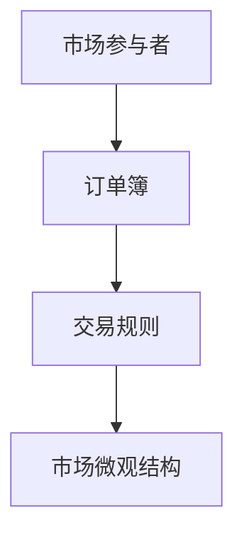
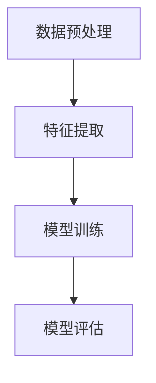
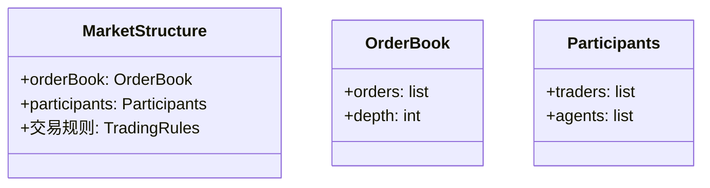
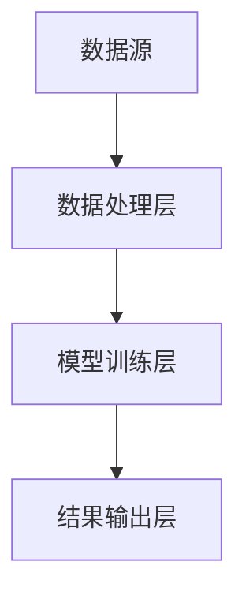
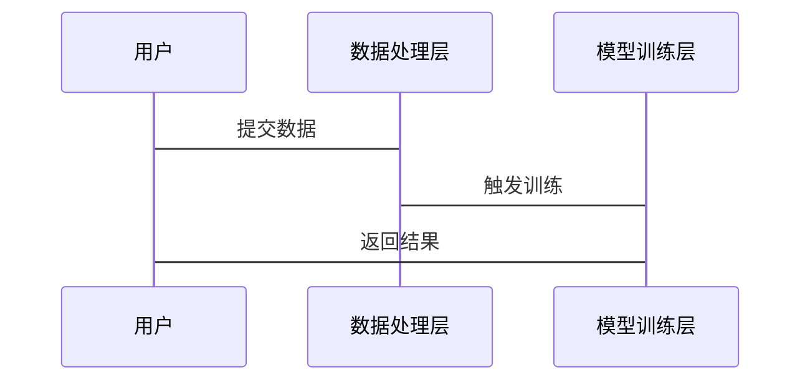

                 


# AI驱动的市场微观结构影响分析

> **关键词**: AI, 市场微观结构, 金融分析, 强化学习, 时间序列分析, 博弈论

> **摘要**: 本文详细探讨了人工智能技术在市场微观结构分析中的应用，从基础概念到高级算法，再到实际项目实现，系统性地分析了AI如何影响和优化市场微观结构。通过深入的理论分析和实际案例，本文展示了如何利用AI技术提升市场微观结构的预测和评估能力。

---

# 第1章: AI驱动的市场微观结构分析背景

## 1.1 市场微观结构的核心概念

### 1.1.1 市场微观结构的定义

市场微观结构是指金融市场的参与者、交易规则、订单簿等微观层面的构成和相互作用。它反映了市场的流动性和效率，是理解市场行为的关键。



### 1.1.2 市场微观结构的重要性

市场微观结构决定了市场的流动性和价格形成机制，直接影响交易成本和市场效率。传统的市场微观结构分析依赖于统计方法，但随着数据量的增加和复杂性提升，AI技术成为不可或缺的工具。

### 1.1.3 AI技术在市场微观结构中的作用

AI技术能够处理高频交易数据，预测市场行为，优化交易策略。通过深度学习和强化学习，AI能够捕捉市场中的非线性关系，提供更精准的市场微观结构分析。

---

## 1.2 AI驱动的市场分析背景

### 1.2.1 人工智能在金融领域的应用现状

AI技术广泛应用于金融市场的预测、交易和风险管理。深度学习在股票预测中的应用，强化学习在算法交易中的应用，都是当前的研究热点。

### 1.2.2 市场微观结构分析的难点

市场微观结构分析涉及高频数据、复杂交易规则和非线性关系，传统方法难以捕捉这些复杂性。AI技术的引入解决了这些问题。

### 1.2.3 AI技术如何解决市场微观结构分析的挑战

通过深度学习模型，AI能够从海量数据中提取有用的特征，构建高精度的市场预测模型。强化学习则用于动态调整交易策略，优化市场微观结构分析。

---

# 第2章: AI驱动的市场微观结构分析方法

## 2.1 数据收集与特征提取

### 2.1.1 数据来源

市场微观结构分析的数据来源包括订单簿数据、交易数据、市场深度数据等。高频交易数据需要处理大量的实时数据，这对数据收集和存储提出了高要求。

### 2.1.2 常见的特征提取方法

特征提取是市场微观结构分析的关键步骤。常用的特征包括订单簿的深度、订单撤销率、订单簿的不平衡性等。

### 2.1.3 特征选择的优化策略

通过机器学习方法（如Lasso回归、随机森林）进行特征选择，优化特征组合，提高模型的预测能力。

---

## 2.2 模型构建与训练

### 2.2.1 基于深度学习的市场预测

使用LSTM（长短期记忆网络）模型进行时间序列预测，捕捉市场中的时间依赖性。

### 2.2.2 基于强化学习的交易策略优化

通过强化学习算法（如Q-learning）优化交易策略，动态调整订单提交和撤销策略。

### 2.2.3 模型训练的流程



---

## 2.3 市场影响的评估与预测

### 2.3.1 市场影响的评估指标

常用的市场影响评估指标包括交易成本、市场深度变化、订单簿稳定性等。

### 2.3.2 基于AI的市场预测方法

结合市场微观结构特征和AI模型，预测市场的短期波动和长期趋势。

### 2.3.3 预测结果的验证与优化

通过回测和交叉验证评估模型的性能，优化模型参数，提高预测精度。

---

# 第3章: AI驱动的市场微观结构分析算法原理

## 3.1 强化学习算法

### 3.1.1 强化学习的基本原理

强化学习通过智能体与环境的交互，学习最优策略。在市场微观结构分析中，智能体可以是交易员或算法。

### 3.1.2 Q-learning算法的实现

Q-learning算法通过更新Q值表，学习最优动作策略。

$$ Q(s, a) = r + \gamma \max_{a'} Q(s', a') $$

### 3.1.3 强化学习在市场微观结构分析中的应用

通过强化学习优化交易策略，动态调整订单簿分析。

---

## 3.2 时间序列分析

### 3.2.1 时间序列分析的基本原理

时间序列分析用于预测市场未来的走势，常用ARIMA、GARCH等模型。

### 3.2.2 基于深度学习的时间序列预测

使用LSTM网络捕捉时间序列中的长距离依赖关系。

### 3.2.3 时间序列分析在市场微观结构中的应用

预测订单簿的变化趋势，优化交易时机。

---

## 3.3 博弈论模型

### 3.3.1 博弈论的基本原理

博弈论用于分析市场参与者的策略选择和相互作用。

### 3.3.2 博弈论在市场微观结构分析中的应用

分析市场参与者的竞争与合作，预测市场行为。

### 3.3.3 博弈论模型的数学表达

$$ \text{收益} = \sum_{i=1}^{n} \pi_i x_i $$

---

# 第4章: 系统架构设计

## 4.1 系统功能设计

### 4.1.1 领域模型设计



### 4.1.2 系统架构设计



---

## 4.2 接口设计与交互流程

### 4.2.1 系统接口设计

设计API接口，实现数据输入、模型调用和结果输出。

### 4.2.2 系统交互流程



---

# 第5章: 项目实战

## 5.1 环境安装与数据准备

### 5.1.1 环境安装

安装Python、TensorFlow、Keras等工具。

### 5.1.2 数据准备

收集高频交易数据，清洗和预处理数据。

## 5.2 核心代码实现

### 5.2.1 基于LSTM的时间序列预测

```python
import numpy as np
from tensorflow.keras.models import Sequential
from tensorflow.keras.layers import LSTM, Dense

model = Sequential()
model.add(LSTM(64, input_shape=(timesteps, features)))
model.add(Dense(1))
model.compile(loss='mean_squared_error', optimizer='adam')
model.fit(X_train, y_train, epochs=100, batch_size=32)
```

### 5.2.2 基于Q-learning的交易策略优化

```python
class Agent:
    def __init__(self, state_size, action_size):
        self.Q = np.zeros((state_size, action_size))
    
    def act(self, state):
        return np.argmax(self.Q[state, :])
    
    def update(self, state, action, reward, next_state):
        self.Q[state, action] = reward + gamma * np.max(self.Q[next_state, :])
```

## 5.3 案例分析与结果解读

### 5.3.1 实际案例分析

分析真实市场数据，评估模型的预测能力。

### 5.3.2 结果解读

通过回测和交叉验证，评估模型的准确性和稳定性。

## 5.4 项目小结

总结项目实现的关键点，提出改进建议。

---

# 第6章: 最佳实践与注意事项

## 6.1 最佳实践

### 6.1.1 数据处理

确保数据的高质量，避免噪声干扰。

### 6.1.2 模型选择

根据具体问题选择合适的模型和算法。

## 6.2 小结

回顾全文，总结AI技术在市场微观结构分析中的应用价值。

## 6.3 注意事项

注意数据隐私和合规性，避免模型过拟合。

## 6.4 拓展阅读

推荐阅读相关领域的最新论文和技术报告。

---

# 结语

AI技术正在深刻改变市场微观结构分析的方式。通过本文的系统性分析，我们能够更好地理解AI在金融市场中的应用潜力。未来，随着技术的进步，AI将在市场微观结构分析中发挥更大的作用。

