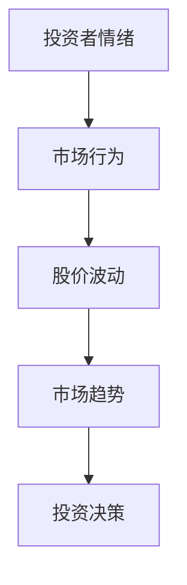
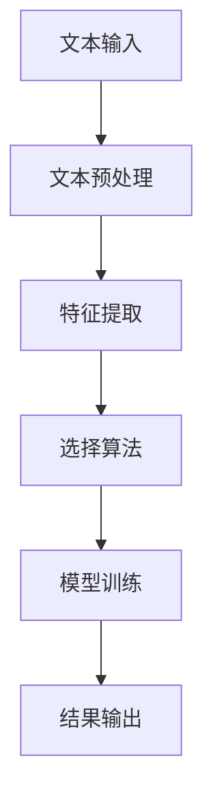
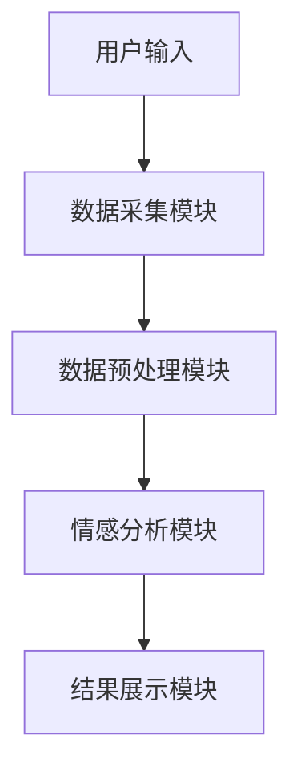
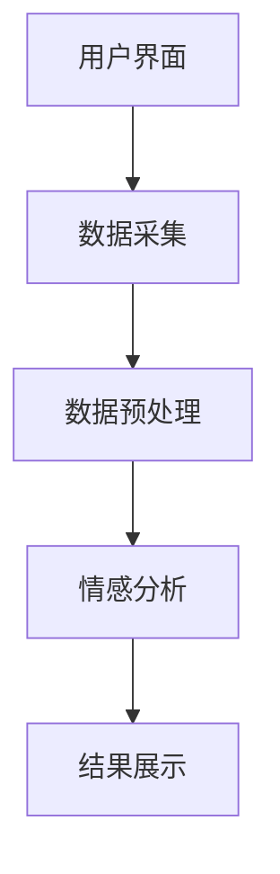
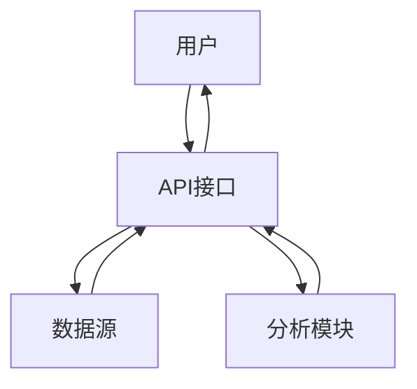

                 

# AI驱动的股票市场情绪分析

> 关键词：AI, 情绪分析, 股票市场, 机器学习, 深度学习

> 摘要：本文系统地介绍了AI驱动的股票市场情绪分析的背景、核心概念、算法原理和系统架构设计。通过分析市场情绪对股票价格的影响，探讨了如何利用机器学习和深度学习技术进行情感分类和预测，为投资者提供决策支持。

---

## 第1章：股票市场情绪分析的背景与概念

### 1.1 情绪分析的基本概念

#### 1.1.1 情感分析的定义
情绪分析是指对文本数据中的情感倾向进行识别和分类的过程。例如，判断一条社交媒体上的股票评论是正面、负面还是中性。

#### 1.1.2 情感分析的分类
- **二分类**：将文本分为正面和负面。
- **多分类**：分为正面、中性、负面。
- **情感强度**：量化情感的强烈程度（如0.1到0.9）。

#### 1.1.3 情感分析在股票市场中的应用
- 分析投资者情绪，预测市场走势。
- 辅助投资决策，优化交易策略。

### 1.2 股票市场的基本运作机制

#### 1.2.1 股票市场的定义与功能
股票市场是投资者买卖公司股份的场所，反映了市场对公司的价值评估。

#### 1.2.2 影响股票价格的主要因素
- **市场情绪**：投资者的心理和行为。
- **经济指标**：GDP、利率等。
- **公司业绩**：收入、利润等。

#### 1.2.3 市场情绪对股票价格的影响
市场情绪是影响股票价格的重要因素，特别是在短期内。

### 1.3 AI驱动的股票市场情绪分析的必要性

#### 1.3.1 传统情绪分析的局限性
- 依赖人工分析，效率低。
- 无法处理海量数据。

#### 1.3.2 AI技术在情绪分析中的优势
- 高效处理大数据。
- 准确识别隐含情绪。

#### 1.3.3 情感分析对投资决策的价值
- 提供数据支持，优化投资策略。

### 1.4 本章小结
本章介绍了情绪分析的基本概念和股票市场的运作机制，强调了AI在情绪分析中的重要性。

---

## 第2章：情绪分析的核心概念与联系

### 2.1 情绪分析的核心原理

#### 2.1.1 文本预处理与特征提取
- **文本清洗**：去除无关字符。
- **分词**：将文本分割成词语。
- **特征提取**：使用TF-IDF提取关键词。

#### 2.1.2 情感分类算法
- **规则-based**：基于关键词的分类。
- **模型-based**：基于机器学习或深度学习模型。

#### 2.1.3 情感强度预测
- 预测情感的强度，如“非常正面”或“轻微负面”。

### 2.2 情绪分析与股票市场的关联

#### 2.2.1 市场情绪的周期性
市场情绪会随着市场波动呈现周期性变化。

#### 2.2.2 情感数据的来源与类型
- **社交媒体数据**：如Twitter、Reddit。
- **新闻数据**：如金融新闻、财经评论。
- **交易数据**：如交易量、订单簿。

#### 2.2.3 情感数据对股价波动的预测能力
情绪分析可以预测股价的短期波动。

### 2.3 核心概念对比分析

#### 2.3.1 情感分类与情感强度的对比
- 情感分类：二分类或三分类。
- 情感强度：量化情绪程度。

#### 2.3.2 不同情感分类算法的优劣势对比

| 算法类型       | 优点                           | 缺点                           |
|----------------|--------------------------------|--------------------------------|
| 传统机器学习   | 计算效率高                     | 表达能力有限                   |
| 深度学习       | 表达能力强                     | 计算资源需求高                 |

#### 2.3.3 情感数据与传统技术分析的结合
结合技术分析指标和情绪分析，提升预测准确性。

### 2.4 情感分析的实体关系图

### 2.5 本章小结
本章分析了情绪分析的核心概念和其与股票市场的关联，强调了不同算法的优劣势。

---

## 第3章：情绪分析算法原理

### 3.1 基于传统机器学习的情感分类算法

#### 3.1.1 支持向量机（SVM）
- **原理**：寻找最优超平面，最大化分类间隔。
- **公式**：$$ \text{最大化} \frac{1}{||\mathbf{w}||} $$

#### 3.1.2 朴素贝叶斯（Naive Bayes）
- **原理**：基于概率论，假设特征独立。
- **公式**：$$ P(y=1|x) = \frac{P(x|y=1)P(y=1)}{P(x)} $$

#### 3.1.3 K近邻算法（KNN）
- **原理**：基于距离最近的K个样本进行投票分类。

### 3.2 基于深度学习的情感分类算法

#### 3.2.1 循环神经网络（RNN）
- **原理**：处理序列数据，捕捉上下文信息。

#### 3.2.2 Transformer架构
- **原理**：使用自注意力机制，捕捉全局依赖。

#### 3.2.3 BERT模型
- **原理**：预训练语言模型，理解上下文语义。

### 3.3 情感分类算法的流程图

### 3.4 情感分类的数学模型

#### 3.4.1 支持向量机的数学模型
$$ \text{最大化} \frac{1}{||\mathbf{w}||} $$

#### 3.4.2 逻辑回归的数学模型
$$ P(y=1|x) = \frac{1}{1 + e^{-\mathbf{w}^T x - b}} $$

### 3.5 本章小结
本章详细讲解了传统机器学习和深度学习算法的原理及流程。

---

## 第4章：系统架构与设计

### 4.1 系统功能设计

#### 4.1.1 数据采集模块
- 从社交媒体、新闻网站等来源采集数据。

#### 4.1.2 数据预处理模块
- 清洗、分词、提取特征。

#### 4.1.3 情感分析模块
- 使用模型进行情感分类。

#### 4.1.4 结果展示模块
- 可视化分析结果，辅助投资决策。

### 4.2 系统架构设计

#### 4.2.1 系统功能模块图

#### 4.2.2 系统架构图

### 4.3 系统接口设计
- API接口：提供数据采集、分析结果查询功能。

### 4.4 系统交互序列图

### 4.5 本章小结
本章设计了系统的功能模块和架构，展示了各部分的交互流程。

---

## 附录：AI情绪分析在股票市场的实际应用案例

### 案例1：Twitter情绪分析与股价预测
- 使用Twitter数据训练模型，预测特定股票的短期走势。

### 案例2：新闻标题分析与市场趋势
- 分析财经新闻标题的情绪，预测整体市场趋势。

### 案例3：结合交易数据的多因素分析
- 综合情绪分析和交易数据，构建多因素模型，提升预测准确性。

---

## 总结与展望

### 总结
本文详细探讨了AI驱动的股票市场情绪分析，从概念、算法到系统设计，为投资者提供了理论和实践指导。

### 展望
未来，随着技术进步，情绪分析将更加精准，应用范围也将更广。

---

通过以上结构和内容，您可以系统地撰写一篇详尽的技术博客，详细介绍AI在股票市场情绪分析中的应用。

