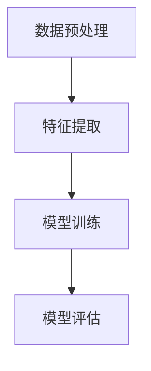
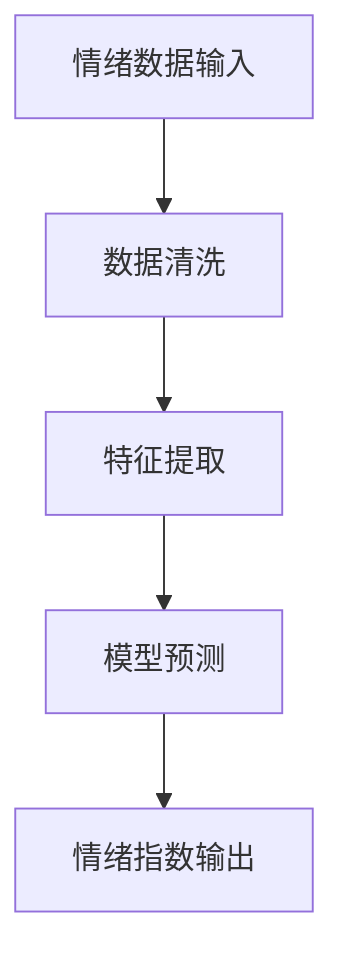
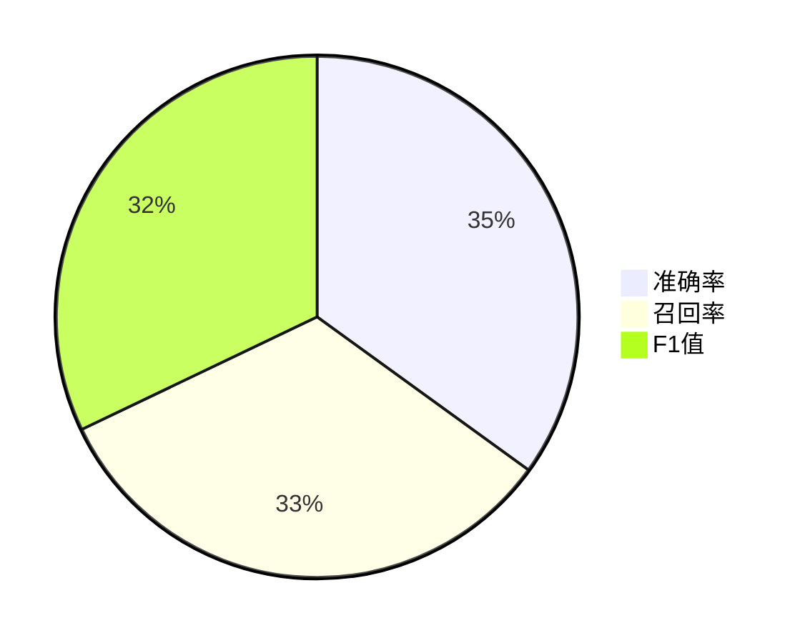
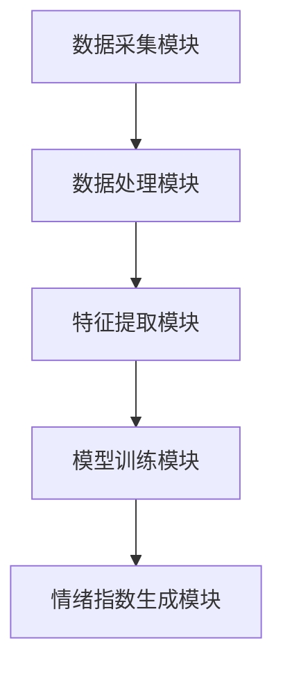
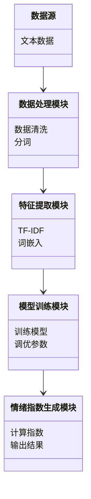

                 


# AI驱动的股票市场情绪指数开发

## 关键词：AI, 股票市场, 情绪指数, 情感分析, 机器学习

## 摘要：  
本文详细探讨了利用人工智能技术开发股票市场情绪指数的方法，从概念、算法、系统架构到项目实现，全面分析了情绪指数的构建过程及其在金融投资中的应用价值。文章结合理论与实践，通过具体案例展示了如何利用自然语言处理、时间序列分析和机器学习技术，提取和分析市场情绪数据，构建具有实际应用价值的情绪指数。

---

# 第一部分: 股票市场情绪指数开发背景与概述

## 第1章: 股票市场情绪指数的基本概念

### 1.1 情绪指数的定义与作用

#### 1.1.1 什么是股票市场情绪指数
股票市场情绪指数是一种量化市场参与者情绪的指标，反映了投资者对市场的乐观或悲观程度。它通过分析新闻、社交媒体、市场评论等非结构化数据，将情绪信息转化为可量化的指标，帮助投资者和分析师更好地理解市场走势。

#### 1.1.2 情绪指数在投资决策中的作用
- **预测市场趋势**：情绪指数可以作为市场趋势的先行指标，帮助投资者提前预判市场的波动。
- **风险管理和投资决策**：通过情绪指数，投资者可以更好地管理投资组合的风险，制定投资策略。
- **市场监控与预警**：情绪指数能够实时监控市场情绪变化，提供市场异常情况的预警信号。

#### 1.1.3 情绪指数与其他市场指标的区别
传统市场指标（如股价指数、成交量等）主要反映市场的价格走势和交易活跃度，而情绪指数则关注市场的心理状态，是价格走势的潜在驱动因素。

---

### 1.2 AI技术在金融领域的应用

#### 1.2.1 AI在金融分析中的优势
- **数据处理能力**：AI能够快速处理海量非结构化数据（如新闻、社交媒体）。
- **模式识别**：通过机器学习算法，AI能够识别数据中的隐含模式和趋势。
- **实时性**：AI系统可以实现实时数据处理和情绪分析，满足金融市场的实时性需求。

#### 1.2.2 情感分析在股票市场中的应用
- **情绪分类**：将市场情绪分为乐观、中性、悲观等类别，量化市场情绪。
- **情绪强度分析**：评估情绪的强度，帮助判断市场的波动程度。
- **情绪传播分析**：分析情绪在市场中的传播路径和影响范围。

#### 1.2.3 AI驱动情绪指数的可行性与前景
- **技术可行性**：AI技术已经成熟，能够处理复杂的情感分析任务。
- **市场需求**：投资者和机构对情绪指数的需求日益增长。
- **未来前景**：随着技术的进步，情绪指数将更加精准，应用场景也将更加广泛。

---

## 第2章: 情绪指数的核心概念与分析

### 2.1 情绪数据的特征与分类

#### 2.1.1 情绪数据的来源与特征
- **数据来源**：新闻、社交媒体、市场评论、论坛等。
- **时间特性**：情绪数据具有很强的时间性，反映了市场的实时动态。
- **空间分布**：情绪数据可能分布在不同的市场和区域。

#### 2.1.2 情绪分类的维度与方法
- **情感极性分析**：将文本分为积极、消极或中性。
- **情感强度分析**：评估情绪的强度，如非常积极、稍微积极等。
- **情感类别划分**：将情绪分为多个类别，如乐观、谨慎、悲观等。

#### 2.1.3 情绪指标体系的构建
- **指标权重**：根据数据来源和重要性，赋予不同权重。
- **指标计算逻辑**：通过加权平均或其他数学方法，将情绪数据转化为指标。
- **指标验证与优化**：通过回测和验证，优化指标的计算方法和权重。

---

## 第3章: 情绪指数的算法原理

### 3.1 自然语言处理与情感分析

#### 3.1.1 情感分类流程


#### 3.1.2 情感分类的数学模型
- **朴素贝叶斯模型**：基于概率的分类方法。
- **支持向量机（SVM）**：通过构建超平面进行分类。
- **深度学习模型**：如LSTM和Transformer，用于处理长文本和复杂语义。

#### 3.1.3 情感分类的代码实现
```python
from nltk.sentiment import SentimentIntensityAnalyzer

sia = SentimentIntensityAnalyzer()
text = "The market is bullish today."
scores = sia.polarity_scores(text)
print(scores)  # 输出：{'neg': 0.0, 'neu': 0.84, 'pos': 0.16, 'compound': 0.89}
```

### 3.2 时间序列分析与情绪指数计算

#### 3.2.1 时间序列分析方法
- **ARIMA模型**：用于预测时间序列数据。
- **LSTM网络**：适合处理时间依赖性较强的数据。

#### 3.2.2 情绪指数的计算流程


### 3.3 机器学习模型的应用

#### 3.3.1 情绪分类的混淆矩阵


#### 3.3.2 情绪预测的数学公式
$$
\text{预测情绪} = \sum_{i=1}^{n} w_i \cdot x_i
$$
其中，$w_i$ 是特征权重，$x_i$ 是特征值。

---

## 第4章: 情绪指数的系统架构设计

### 4.1 系统功能设计

#### 4.1.1 数据采集模块
- **数据来源**：从新闻网站、社交媒体等获取数据。
- **数据格式**：文本数据，可能包含日期、标题和正文。

#### 4.1.2 特征提取模块
- **文本处理**：分词、去除停用词。
- **特征提取**：TF-IDF、词嵌入（如Word2Vec）。

#### 4.1.3 模型训练模块
- **模型选择**：根据数据特点选择合适的模型。
- **参数调优**：使用交叉验证优化模型参数。

#### 4.1.4 情绪指数生成模块
- **指数计算**：将情绪数据转化为量化指数。
- **结果输出**：生成情绪指数并存储或可视化。

### 4.2 系统架构设计

#### 4.2.1 系统架构图


#### 4.2.2 实体关系图


---

## 第5章: 项目实战

### 5.1 环境配置与数据采集

#### 5.1.1 环境配置
- 安装Python和相关库（如NLTK、scikit-learn、TensorFlow）。

#### 5.1.2 数据采集
```python
import requests
from bs4 import BeautifulSoup

url = "https://www.reuters.com/finance/stocks"
response = requests.get(url)
soup = BeautifulSoup(response.text, "html.parser")
text = soup.find("div", {"class": "article-content"}).text
print(text)
```

### 5.2 数据预处理与特征提取

#### 5.2.1 数据清洗
```python
import nltk
from sklearn.feature_extraction.text import TfidfVectorizer

text = "The market is bullish today. Investors are confident in the future."
tokens = nltk.word_tokenize(text)
filtered_tokens = [word for word in tokens if word.lower() not in nltk.corpus.stopwords.words("english")]
```

#### 5.2.2 特征提取
```python
vectorizer = TfidfVectorizer(max_features=100)
tfidf_matrix = vectorizer.fit_transform([" ".join(filtered_tokens)])
```

### 5.3 模型训练与评估

#### 5.3.1 模型训练
```python
from sklearn.svm import SVC
from sklearn.metrics import classification_report

model = SVC()
model.fit(tfidf_matrix, [1])  # 假设目标是二分类问题
```

#### 5.3.2 模型评估
```python
print(classification_report([1], model.predict(tfidf_matrix)))
```

### 5.4 情绪指数计算与可视化

#### 5.4.1 情绪指数计算
```python
import pandas as pd
import matplotlib.pyplot as plt

df = pd.DataFrame({"日期": ["2023-01-01", "2023-01-02", "2023-01-03"], "情绪指数": [0.7, 0.8, 0.6]})
df.plot(x="日期", y="情绪指数", kind="line")
plt.show()
```

#### 5.4.2 可视化结果


---

## 第6章: 优化与展望

### 6.1 模型优化

#### 6.1.1 超参数调优
- 使用网格搜索（Grid Search）优化模型参数。

#### 6.1.2 模型集成
- 使用集成学习（如投票分类器、堆叠模型）提高模型性能。

### 6.2 未来研究方向

#### 6.2.1 更多数据源的引入
- 结合市场交易数据和情绪数据，构建多维度情绪指数。

#### 6.2.2 情绪模型的优化
- 使用更先进的深度学习模型（如BERT、GPT）进行情感分析。

#### 6.2.3 实时更新机制
- 构建实时情绪监控系统，动态更新情绪指数。

---

## 第7章: 结论与展望

### 7.1 结论
本文详细探讨了AI驱动的股票市场情绪指数开发的全过程，从理论到实践，为投资者和机构提供了一种新的市场分析工具。

### 7.2 展望
随着AI技术的不断进步，情绪指数将在金融领域发挥更大的作用，为投资决策提供更精准的依据。

---

## 参考文献
（此处列出相关文献和资源）

---

## 致谢
感谢读者的支持与关注！

