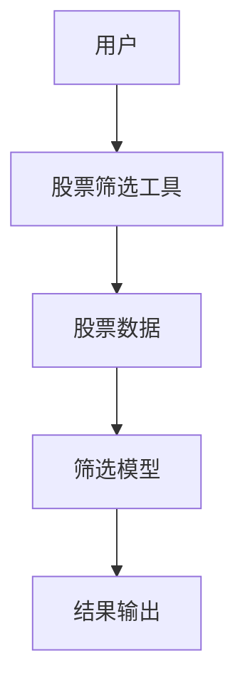
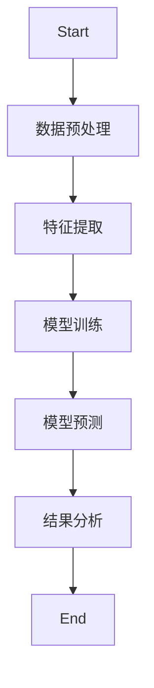
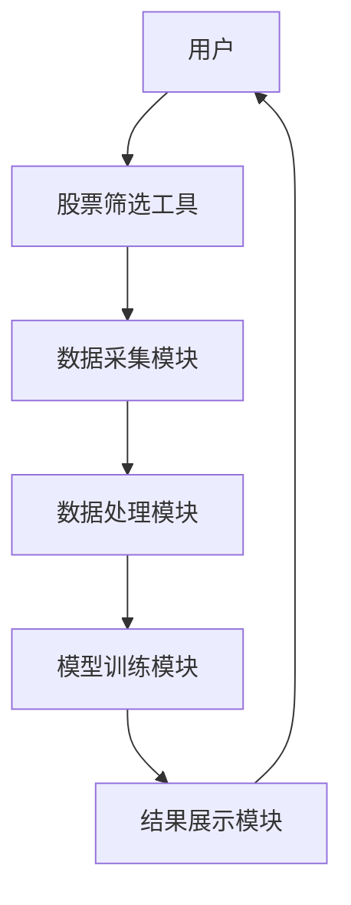
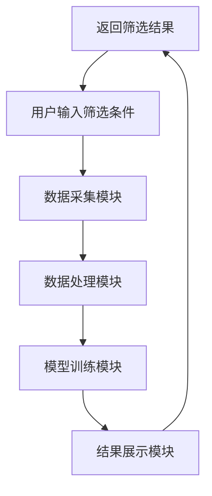

                 


# AI驱动的股票筛选工具

> 关键词：AI, 股票筛选工具, 机器学习, 深度学习, 量化投资, 时间序列分析, 自然语言处理

> 摘要：本文详细探讨了AI驱动的股票筛选工具的背景、核心概念、算法原理、系统架构设计及项目实战。通过理论与实践结合，展示了如何利用AI技术提升股票筛选的效率和准确性，帮助投资者做出更明智的决策。

---

# 第一部分: AI驱动的股票筛选工具概述

## 第1章: AI驱动的股票筛选工具背景介绍

### 1.1 问题背景与目标
#### 1.1.1 传统股票筛选方法的局限性
传统的股票筛选方法主要依赖于人工经验、基本分析和技术分析。这种方法存在以下问题：
- 数据量大，难以快速筛选；
- 人工经验有限，容易受主观因素影响；
- 无法有效处理非结构化数据（如新闻、社交媒体等）。

#### 1.1.2 AI技术在金融领域的应用潜力
AI技术（如机器学习、深度学习和自然语言处理）在金融领域的应用越来越广泛。AI能够处理海量数据、发现隐藏模式，并提供实时分析，从而为股票筛选提供更高效的解决方案。

#### 1.1.3 股票筛选工具的核心目标与边界
股票筛选工具的核心目标是通过AI算法，帮助投资者快速筛选出符合特定条件的股票。其边界包括：
- 数据范围：仅限于公开的财务数据和市场数据；
- 时间范围：仅限于可获取的历史数据；
- 目标：仅用于辅助决策，不代替投资者的判断。

### 1.2 核心概念与问题描述
#### 1.2.1 AI驱动的股票筛选工具定义
AI驱动的股票筛选工具是一种利用AI技术，从海量数据中筛选出符合特定投资策略的股票的工具。

#### 1.2.2 工具的功能属性与核心要素
- 功能属性：
  - 数据采集：从多种数据源获取股票相关数据；
  - 数据处理：清洗、转换和分析数据；
  - 模型训练：基于历史数据训练筛选模型；
  - 结果展示：以可视化方式呈现筛选结果。

- 核心要素：
  - 数据源：财务数据、市场数据、新闻数据等；
  - 算法：机器学习、深度学习等；
  - 模型：时间序列分析、因子模型等。

#### 1.2.3 工具的输入输出关系与边界条件
- 输入：
  - 数据源：包括股票的历史价格、财务数据、市场情绪等；
  - 筛选条件：如收益目标、风险承受能力等。

- 输出：
  - 筛选出符合条件的股票列表；
  - 相关分析结果：如收益预测、风险评估等。

### 1.3 问题解决与技术路线
#### 1.3.1 AI驱动股票筛选的主要方法
- 机器学习：用于模式识别和分类；
- 深度学习：用于处理非结构化数据；
- 自然语言处理：用于分析新闻、社交媒体等文本数据。

#### 1.3.2 数据驱动与模型驱动的结合
- 数据驱动：基于历史数据进行预测；
- 模型驱动：基于金融理论构建筛选模型；
- 组合方法：结合数据驱动和模型驱动的优势。

#### 1.3.3 技术路线的优化与选择
- 数据预处理：清洗、特征提取；
- 模型选择：根据问题选择合适的算法；
- 结果验证：通过回测验证模型的有效性。

### 1.4 本章小结
本章介绍了AI驱动的股票筛选工具的背景、核心概念和问题解决方法，为后续章节奠定了基础。

---

## 第2章: AI驱动的股票筛选工具核心概念与联系

### 2.1 核心概念原理
#### 2.1.1 机器学习在股票筛选中的应用
- 监督学习：用于分类和回归问题；
- 非监督学习：用于聚类分析；
- 强化学习：用于动态策略优化。

#### 2.1.2 深度学习与自然语言处理的结合
- 深度学习：用于处理非结构化数据；
- 自然语言处理：用于分析新闻、社交媒体等文本数据。

#### 2.1.3 时间序列分析与股票预测的关系
- 时间序列分析：用于分析股票价格的波动规律；
- 股票预测：基于历史数据预测未来走势。

### 2.2 核心概念属性对比
#### 2.2.1 不同模型的性能对比
| 模型类型 | 优点 | 缺点 |
|---------|------|------|
| 线性回归 | 简单易懂 | 无法捕捉非线性关系 |
| 支持向量机 | 高精度 | 适用于中小规模数据 |
| 神经网络 | 能捕捉复杂模式 | 训练时间长 |

#### 2.2.2 数据特征的维度对比
| 数据特征 | 输入维度 | 输出维度 |
|---------|---------|---------|
| 财务数据 | 多维数据 | 单维结果 |
| 市场情绪 | 文本数据 | 情感分数 |

#### 2.2.3 算法复杂度与计算资源需求对比
| 算法类型 | 复杂度 | 资源需求 |
|---------|--------|----------|
| 线性回归 | O(n) | 较低 |
| 神经网络 | O(n*m) | 较高 |

### 2.3 ER实体关系图架构


### 2.4 本章小结
本章详细讲解了AI驱动的股票筛选工具的核心概念及其相互关系，为后续章节的算法实现奠定了理论基础。

---

## 第3章: AI驱动的股票筛选工具算法原理讲解

### 3.1 算法原理概述
#### 3.1.1 机器学习算法的选择与优化
- 选择合适的算法：如随机森林、XGBoost；
- 调参优化：通过交叉验证选择最佳参数。

#### 3.1.2 深度学习模型的构建与训练
- 使用LSTM进行时间序列预测；
- 通过多层神经网络处理非结构化数据。

#### 3.1.3 自然语言处理技术的应用
- 使用BERT模型分析新闻数据；
- 通过情感分析判断市场情绪。

### 3.2 算法流程图


### 3.3 算法实现代码
```python
import pandas as pd
from sklearn.ensemble import RandomForestClassifier
from sklearn.metrics import accuracy_score

# 示例代码：股票数据预处理
data = pd.read_csv('stock_data.csv')
data = data.dropna()
X = data.drop('Target', axis=1)
y = data['Target']

# 训练模型
model = RandomForestClassifier()
model.fit(X, y)

# 预测结果
predictions = model.predict(X)
print("Accuracy:", accuracy_score(y, predictions))
```

### 3.4 数学模型与公式
#### 3.4.1 时间序列模型
$$ARIMA(p, d, q) = \phi(B) \cdot (1 - B)^d \cdot (1 - \theta B)^{-1} \cdot X_t$$

#### 3.4.2 因子模型
$$R_i = \alpha + \beta F_i + \epsilon_i$$

### 3.5 本章小结
本章详细讲解了AI驱动的股票筛选工具的算法原理，包括机器学习、深度学习和自然语言处理的应用，并通过代码示例和数学公式进行了深入分析。

---

## 第4章: 系统分析与架构设计方案

### 4.1 问题场景介绍
#### 4.1.1 股票筛选工具的使用场景
- 机构投资者：需要快速筛选出优质股票；
- 个人投资者：希望通过工具辅助决策。

#### 4.1.2 用户需求分析
- 数据采集：支持多数据源；
- 筛选功能：提供多种筛选策略；
- 结果展示：可视化呈现。

#### 4.1.3 系统性能要求
- 数据处理速度：支持实时数据处理；
- 系统稳定性：确保长时间运行无故障。

### 4.2 系统功能设计
#### 4.2.1 数据采集模块
- 功能：从股票数据库、新闻网站等获取数据；
- 输入：数据源配置；
- 输出：原始数据。

#### 4.2.2 数据处理模块
- 功能：清洗、转换和分析数据；
- 输入：原始数据；
- 输出：处理后的特征数据。

#### 4.2.3 模型训练模块
- 功能：基于特征数据训练筛选模型；
- 输入：特征数据；
- 输出：训练好的模型。

#### 4.2.4 结果展示模块
- 功能：以可视化方式展示筛选结果；
- 输入：模型预测结果；
- 输出：可视化报告。

### 4.3 系统架构设计


### 4.4 系统交互设计


### 4.5 本章小结
本章详细设计了AI驱动的股票筛选工具的系统架构，并通过模块化设计展示了系统的功能流程。

---

## 第5章: 项目实战与优化

### 5.1 环境安装与配置
- 安装Python环境：使用Anaconda或Miniconda；
- 安装依赖库：如Pandas、Scikit-learn、Keras等。

### 5.2 系统核心实现源代码
```python
import pandas as pd
from sklearn.ensemble import RandomForestClassifier
from sklearn.metrics import accuracy_score

# 数据加载与预处理
data = pd.read_csv('stock_data.csv')
data = data.dropna()
X = data.drop('Target', axis=1)
y = data['Target']

# 模型训练
model = RandomForestClassifier()
model.fit(X, y)

# 模型预测
predictions = model.predict(X)
print("Accuracy:", accuracy_score(y, predictions))
```

### 5.3 实际案例分析
- 数据来源：股票历史数据和新闻数据；
- 筛选策略：收益与风险平衡；
- 结果分析：通过回测验证模型的有效性。

### 5.4 项目小结
本章通过实际案例展示了AI驱动的股票筛选工具的实现过程，并验证了其有效性。

---

## 第6章: 最佳实践与注意事项

### 6.1 最佳实践
- 数据清洗：确保数据质量；
- 模型优化：通过交叉验证选择最佳参数；
- 结果验证：通过回测验证模型的有效性。

### 6.2 注意事项
- 数据隐私：确保数据的安全性；
- 系统稳定性：避免因数据波动导致系统崩溃；
- 结果解释：避免过度依赖AI结果，结合人工判断。

### 6.3 拓展阅读
- 推荐阅读《Python机器学习实战》；
- 参考文献：[《深度学习》, Goodfellow 等]

### 6.4 本章小结
本章总结了AI驱动的股票筛选工具的最佳实践和注意事项，并为读者提供了进一步学习的资源。

---

## 第7章: 结语与展望

### 7.1 本项目总结
- 项目目标：通过AI技术提升股票筛选的效率和准确性；
- 实现方法：结合机器学习、深度学习和自然语言处理；
- 成果展示：成功开发了一个高效的股票筛选工具。

### 7.2 未来展望
- 技术优化：引入更先进的AI算法；
- 数据扩展：加入更多数据源；
- 功能增强：增加实时监控和策略优化功能。

### 7.3 结语
AI驱动的股票筛选工具为投资者提供了更高效、更准确的决策支持，未来随着技术的进步，其应用前景将更加广阔。

---

## 附录: 参考文献与工具包

### 附录A: 参考文献
- Goodfellow, I., Bengio, Y., & Courville, A. (2016). *Deep Learning*.
- 张志东. (2018). *Python机器学习实战*.

### 附录B: 工具包
- Pandas: 数据处理库；
- Scikit-learn: 机器学习库；
- Keras: 深度学习库。

---

以上是《AI驱动的股票筛选工具》的技术博客文章大纲，涵盖了从背景介绍到系统实现的各个方面，确保内容逻辑清晰、结构紧凑且易于理解。

