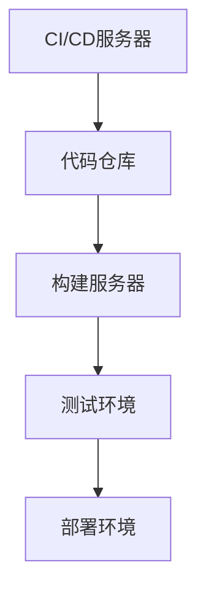

                 


# CI/CD流程：实现AI Agent的持续集成与部署

> 关键词：CI/CD，AI Agent，持续集成，持续部署，系统架构，项目实战

> 摘要：本文详细探讨了如何在AI Agent的开发过程中实施CI/CD流程，包括持续集成和持续部署的核心原理、系统架构设计、项目实战以及安全与监控等方面，旨在为AI Agent的高效开发和部署提供指导。

---

## 第1章 CI/CD流程与AI Agent的背景

### 1.1 CI/CD的基本概念

#### 1.1.1 持续集成的定义与作用
持续集成（CI）是一种软件开发实践，通过频繁地将代码合并到主代码库，并自动化执行构建、测试和验证，以确保代码的健康性。其主要作用包括快速发现集成问题、减少集成风险、加速反馈循环和提高代码质量。

#### 1.1.2 持续部署的定义与作用
持续部署（CD）是CI的扩展，强调在CI的基础上，自动化将代码部署到生产环境或其它指定环境。其作用包括加快交付速度、降低部署风险、实现蓝绿部署和版本回滚。

#### 1.1.3 CI/CD在现代软件开发中的地位
CI/CD已成为现代软件开发的基石，特别是在AI Agent这种需要频繁迭代和快速交付的场景下，CI/CD能够显著提高开发效率和产品质量。

### 1.2 AI Agent的定义与特点

#### 1.2.1 AI Agent的定义
AI Agent是一种能够感知环境、执行任务并做出决策的智能实体。它可以是一个软件程序，通过机器学习模型和规则引擎来实现自主操作。

#### 1.2.2 AI Agent的核心特点
- **自主性**：能够在没有人工干预的情况下执行任务。
- **反应性**：能够根据环境变化调整行为。
- **学习能力**：能够通过数据和经验不断优化自身性能。

#### 1.2.3 AI Agent与传统软件开发的区别
AI Agent的开发涉及更多的数据处理、模型训练和部署，对开发流程的自动化要求更高。

### 1.3 CI/CD在AI Agent开发中的重要性

#### 1.3.1 AI Agent开发的挑战
- **频繁的模型更新**：AI模型需要不断训练和优化，导致代码和依赖频繁变化。
- **复杂的依赖管理**：AI Agent通常依赖于多个第三方库和数据集，依赖管理复杂。
- **测试覆盖率不足**：由于模型的复杂性，传统单元测试难以覆盖所有场景。

#### 1.3.2 CI/CD如何解决AI Agent开发中的问题
通过自动化构建、测试和部署，CI/CD能够快速发现集成问题，减少部署风险，并确保每次代码提交都能在不同环境下稳定运行。

#### 1.3.3 AI Agent CI/CD的目标与边界
目标是实现AI Agent的自动化交付，确保每次代码提交都能经过完整的测试和部署流程。边界包括代码仓库、构建工具、测试框架和部署环境。

---

## 第2章 持续集成的实现原理

### 2.1 持续集成的核心流程

#### 2.1.1 代码提交与版本控制
开发人员将代码提交到版本控制系统（如Git），触发CI流程。

#### 2.1.2 自动化构建
CI服务器（如Jenkins）从代码仓库拉取最新代码，进行编译和构建。

#### 2.1.3 自动化测试
构建完成后，执行单元测试、集成测试和端到端测试，确保代码质量。

#### 2.1.4 反馈与修复
测试结果通过CI工具反馈给开发人员，发现问题后及时修复。

#### 2.1.5 持续集成的反馈循环
通过频繁的构建和测试，确保每次提交都保持代码库的稳定性。

### 2.2 持续集成的关键要素

#### 2.2.1 自动化构建工具
- **Jenkins**：广泛使用的开源CI工具，支持多种插件和扩展。
- **GitHub Actions**：集成在GitHub上的CI/CD工具，支持工作流定义。

#### 2.2.2 测试框架
- **单元测试**：针对单个模块或函数的测试。
- **集成测试**：测试模块之间的交互。
- **端到端测试**：模拟用户操作，测试整个系统的流程。

#### 2.2.3 反馈机制
- **构建状态报告**：通过颜色、徽章或邮件通知开发人员构建结果。
- **问题定位**：提供详细的错误日志和堆栈跟踪。

### 2.3 持续集成的挑战与解决方案

#### 2.3.1 持续集成的挑战
- **构建时间过长**：复杂的项目可能导致构建时间过长，影响开发效率。
- **测试覆盖率不足**：难以覆盖所有场景，导致潜在问题未被发现。
- **资源消耗过大**：频繁的构建和测试消耗大量计算资源。

#### 2.3.2 解决方案
- **并行构建与测试**：利用分布式计算资源，加快构建和测试速度。
- **测试优化**：采用测试分层和测试用例优先级排序，提高测试效率。
- **资源管理**：使用云基础设施，按需分配计算资源。

---

## 第3章 AI Agent的持续集成与部署

### 3.1 AI Agent开发中的CI/CD挑战

#### 3.1.1 模型依赖管理
AI Agent通常依赖于机器学习模型和训练数据，如何管理这些依赖是CI/CD中的难点。

#### 3.1.2 模型训练与部署
AI模型的训练和部署需要特定的环境和资源，如何在CI/CD流程中自动化这些步骤是关键。

### 3.2 持续集成在AI Agent开发中的应用

#### 3.2.1 自动化构建与训练
CI工具在每次提交代码时，自动触发模型的训练和构建过程。

#### 3.2.2 模型验证与测试
通过自动化测试框架，验证AI模型的行为和输出是否符合预期。

### 3.3 持续部署在AI Agent中的应用

#### 3.3.1 模型部署与发布
将训练好的模型部署到目标环境中，确保其能够正常运行。

#### 3.3.2 环境一致性
通过容器化技术（如Docker），确保部署环境与开发环境一致，减少环境引起的错误。

### 3.4 AI Agent CI/CD的案例分析

#### 3.4.1 环境配置
使用Docker Compose定义开发环境，确保所有开发人员在相同的环境中工作。

#### 3.4.2 CI/CD Pipeline配置
在Jenkins中定义Pipeline，实现从代码提交到模型部署的自动化流程。

---

## 第4章 系统架构设计

### 4.1 系统架构概述

#### 4.1.1 系统模块划分
- **CI/CD服务器**：负责触发和管理构建、测试和部署任务。
- **代码仓库**：存储项目代码和模型文件。
- **构建服务器**：执行代码构建和模型训练。
- **测试环境**：提供多个环境用于自动化测试。
- **部署环境**：目标环境，部署AI Agent。

#### 4.1.2 系统交互流程
从代码提交开始，经过构建、测试、部署，最终将AI Agent部署到生产环境。

#### 4.1.3 系统架构图


### 4.2 系统设计细节

#### 4.2.1 CI/CD服务器
- **Jenkins**：用于定义和管理CI/CD Pipeline。
- **GitHub Actions**：集成在GitHub中的CI/CD工具，支持GitHub代码仓库和部署。

#### 4.2.2 构建服务器
- **Jenkins Slave**：分布式构建节点，用于并行执行构建任务。
- **Docker**：构建镜像，确保构建环境一致性。

#### 4.2.3 测试环境
- **单元测试环境**：用于执行单元测试。
- **集成测试环境**：用于执行集成测试。
- **端到端测试环境**：用于执行端到端测试。

#### 4.2.4 部署环境
- **生产环境**：部署AI Agent的最终环境。
- **测试环境**：用于蓝绿部署和验证。

---

## 第5章 项目实战：AI Agent的CI/CD配置

### 5.1 环境配置

#### 5.1.1 安装Jenkins
```bash
sudo apt-get update
sudo apt-get install jenkins.io
```

#### 5.1.2 安装Git
```bash
sudo apt-get install git
```

#### 5.1.3 安装Docker
```bash
sudo apt-get install docker.io
```

### 5.2 Jenkins Pipeline配置

#### 5.2.1 Pipeline脚本
```jenkinsfile
pipeline {
    stages {
        stage('Build') {
            steps {
                sh 'git clone https://github.com/your-repo.git'
                sh 'mvn clean install'
            }
        }
        stage('Test') {
            steps {
                sh 'mvn test'
            }
        }
        stage('Deploy') {
            steps {
                sh 'docker build -t ai-agent .'
                sh 'docker run -it ai-agent'
            }
        }
    }
}
```

#### 5.2.2 环境变量配置
```yaml
env {
    DOCKER_IMAGE = 'ai-agent:latest'
    GIT_REPO = 'https://github.com/your-repo.git'
}
```

### 5.3 测试与部署

#### 5.3.1 测试脚本
```python
def test_model():
    # 加载模型
    model = load_model()
    # 执行测试
    assert model.predict(input) == expected_output
```

#### 5.3.2 部署流程
1. **构建镜像**：`docker build -t ai-agent .`
2. **运行容器**：`docker run -it ai-agent`

---

## 第6章 安全与监控

### 6.1 安全问题

#### 6.1.1 代码安全
- **代码审查**：定期进行代码审查，发现潜在的安全漏洞。
- **依赖管理**：使用安全的依赖管理工具，避免引入恶意依赖。

#### 6.1.2 模型安全
- **模型保护**：防止模型被恶意篡改或泄露。
- **访问控制**：限制对模型和数据的访问权限。

### 6.2 系统监控

#### 6.2.1 监控指标
- **CPU和内存使用情况**
- **请求响应时间**
- **错误率**

#### 6.2.2 监控工具
- **Prometheus**：监控系统指标。
- **Grafana**：可视化监控数据。

#### 6.2.3 日志分析
- **集中化日志管理**：使用ELK（Elasticsearch, Logstash, Kibana）进行日志管理。
- **异常检测**：通过日志分析发现潜在问题。

### 6.3 安全与监控的实现

#### 6.3.1 安全策略
- **身份验证**：确保只有授权人员可以访问CI/CD系统。
- **权限管理**：根据角色分配适当的权限。

#### 6.3.2 监控流程
1. **收集指标**：使用Prometheus收集系统指标。
2. **告警配置**：设置阈值告警，及时通知相关人员。
3. **日志分析**：定期分析日志，发现异常行为。

---

## 第7章 总结与展望

### 7.1 总结

#### 7.1.1 本文内容回顾
本文详细探讨了如何在AI Agent的开发过程中实施CI/CD流程，包括持续集成和持续部署的核心原理、系统架构设计、项目实战以及安全与监控等方面。

#### 7.1.2 核心要点总结
- CI/CD能够显著提高AI Agent的开发效率和产品质量。
- 系统架构设计是实现高效CI/CD流程的关键。
- 安全与监控是确保系统稳定运行的重要保障。

### 7.2 展望

#### 7.2.1 未来趋势
- **AIOps**：AI与运维的结合，进一步优化CI/CD流程。
- **自适应部署**：根据环境动态调整部署策略。
- **边缘计算**：在边缘设备上部署AI Agent，减少延迟。

#### 7.2.2 挑战与机遇
- **挑战**：随着AI技术的不断发展，CI/CD流程需要不断优化和创新。
- **机遇**：AI技术的进步为CI/CD流程提供了新的可能性，如自动化测试用例生成和自适应部署。

---

## 参考文献

1. Continuous Integration: Improving Software Quality, Dirk Riehle, 2000
2. Continuous Delivery: Reliable Software Releases through Build, Test, and Deployment Automation, Jez Humble, 2010
3. Implementing DevOps with Jenkins, John Fenwick, 2020

---

通过以上结构和内容，我们详细探讨了如何在AI Agent的开发过程中实施CI/CD流程，确保高效、可靠的交付。希望本文对读者在实际项目中应用CI/CD提供有价值的指导和启示。

