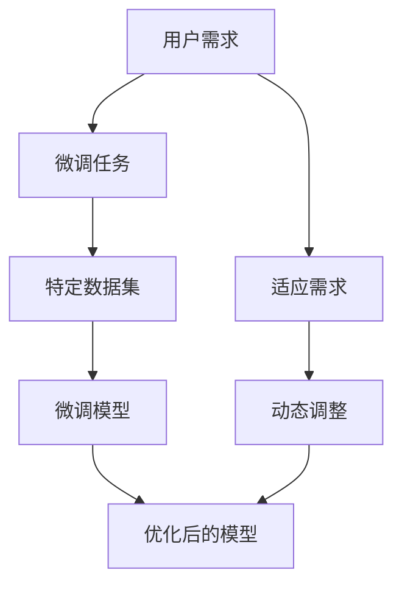
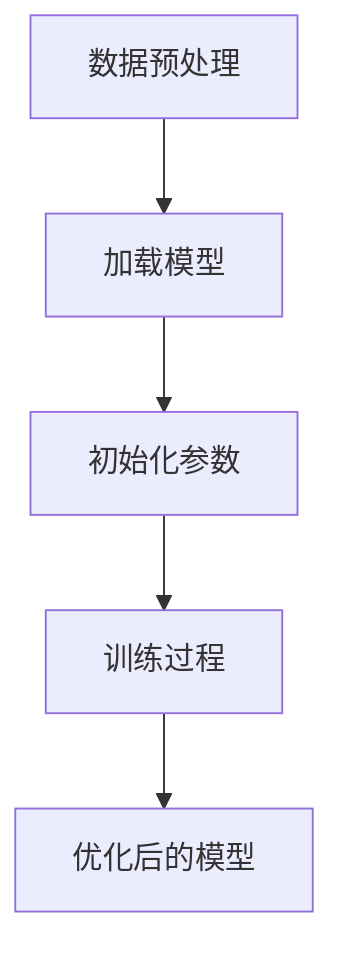
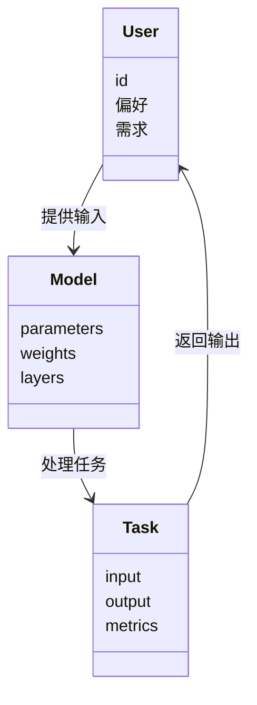
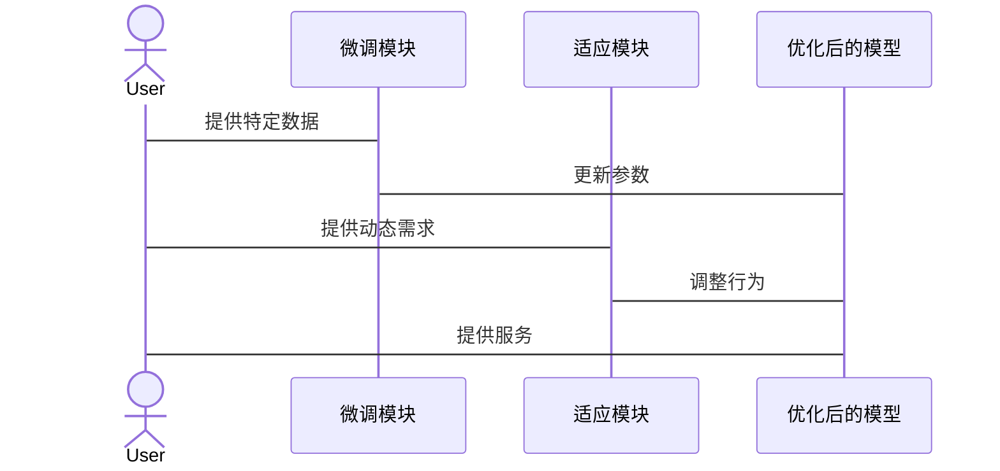

                 


# LLM的微调与适应：针对特定用户群优化

## 关键词
大语言模型（LLM）、微调、适应、迁移学习、用户群优化

## 摘要
本文详细探讨了如何对大语言模型（LLM）进行微调与适应，以满足特定用户群体的需求。文章从问题背景、核心概念、算法原理、系统架构到项目实战，全面分析了LLM微调与适应的实现过程。通过对比分析、数学建模和系统设计，为读者提供了理论与实践相结合的深度解析，帮助读者掌握针对特定用户群优化LLM的核心方法。

---

# 目录大纲：LLM的微调与适应：针对特定用户群优化

## 第一部分：LLM微调与适应的背景与基础

### 第1章：LLM微调与适应概述
#### 1.1 问题背景与描述
- **1.1.1 大语言模型（LLM）的现状与挑战**
  - 当前LLM技术的快速发展及其广泛应用，但通用模型难以满足特定用户需求。
  - 针对特定用户群的优化需求日益增长，微调与适应成为关键解决方案。

- **1.1.2 微调与适应的必要性**
  - 微调：通过特定数据优化模型，使其更贴合用户需求。
  - 适应：通过动态调整模型参数或结构，满足不同场景需求。

- **1.1.3 针对特定用户群优化的目标与意义**
  - 提高模型在特定场景下的性能和用户体验。
  - 降低模型的泛化依赖，增强实用性。

#### 1.2 问题解决与边界
- **1.2.1 微调与适应的核心问题解决**
  - 微调解决模型在特定任务上的表现不足。
  - 适应解决模型在动态环境中的表现问题。

- **1.2.2 解决方案的边界与外延**
  - 微调仅适用于数据量较大的特定领域。
  - 适应适用于需要动态调整的任务。

- **1.2.3 核心要素与组成分析**
  - 数据预处理、模型选择、训练策略、评估指标。

---

## 第二部分：核心概念与联系

### 第2章：LLM微调与适应的核心概念
#### 2.1 微调与适应的原理
- **2.1.1 微调的定义与实现方式**
  - 微调：基于特定领域数据，对模型进行 fine-tuning。
  - 实现方式：使用特定任务数据，调整模型参数。

- **2.1.2 适应的定义与应用场景**
  - 适应：动态调整模型行为，以应对不同输入。
  - 应用场景：对话系统、推荐系统等需要动态反馈的任务。

- **2.1.3 微调与适应的区别与联系**
  - 区别：微调是静态优化，适应是动态调整。
  - 联系：两者都是为了提高模型在特定场景下的性能。

#### 2.2 核心概念对比分析
- **2.2.1 微调与零样本学习的对比**
  - 零样本学习：无需特定领域数据，直接使用通用模型。
  - 微调：基于特定数据优化模型。

- **2.2.2 适应与迁移学习的对比**
  - 迁移学习：将知识从一个任务迁移到另一个任务。
  - 适应：动态调整模型以应对变化。

- **2.2.3 核心概念的特征对比表格**
  | 概念 | 定义 | 适用场景 | 是否改变模型参数 | 是否动态调整 |
  |------|------|----------|-----------------|-------------|
  | 微调 | 基于特定数据优化模型 | 特定领域任务 | 是 | 否 |
  | 适应 | 动态调整模型行为 | 动态环境 | 是 | 是 |

#### 2.3 实体关系图
- **2.3.1 LLM微调与适应的实体关系图（Mermaid流程图）**



---

## 第三部分：算法原理与数学模型

### 第3章：微调与适应的算法原理
#### 3.1 微调算法的流程
- **3.1.1 数据预处理**
  - 数据清洗、标注、格式转换。

- **3.1.2 模型加载与初始化**
  - 加载预训练模型，初始化参数。

- **3.1.3 微调训练过程（Mermaid流程图）**



#### 3.2 数学模型与公式
- **3.2.1 损失函数的定义**
  $$ L = -\sum_{i=1}^{n} y_i \log p(y_i) $$

- **3.2.2 参数更新公式**
  $$ \theta_{new} = \theta_{old} - \eta \frac{\partial L}{\partial \theta} $$

- **3.2.3 微调过程中的数学推导**
  通过反向传播计算梯度，并更新模型参数。

#### 3.3 适应算法的实现
- **3.3.1 适应的定义与实现方式**
  - 动态调整模型输出，基于实时反馈。

- **3.3.2 适应过程中的数学模型**
  $$ f(x) = \sum_{i=1}^{m} w_i x_i $$

---

## 第四部分：系统分析与架构设计

### 第4章：系统分析与架构设计
#### 4.1 问题场景介绍
- **4.1.1 针对特定用户群优化的场景**
  - 例如，医疗领域中的患者咨询系统。

- **4.1.2 系统的目标与功能需求**
  - 提供个性化的医疗咨询。

#### 4.2 系统功能设计
- **4.2.1 领域模型设计（Mermaid类图）**



#### 4.3 系统架构设计
- **4.3.1 系统架构图（Mermaid架构图）**

```mermaid
archi
title LLM 微调与适应系统架构
actor User
participant 微调模块
participant 适应模块
participant 优化后的模型
User --> 微调模块: 提供特定数据
微调模块 --> 优化后的模型: 更新参数
User --> 适应模块: 提供动态需求
适应模块 --> 优化后的模型: 调整行为
优化后的模型 --> User: 提供服务
```

#### 4.4 系统接口设计
- **4.4.1 接口定义与交互流程**

#### 4.5 系统交互设计
- **4.5.1 交互流程图（Mermaid序列图）**



---

## 第五部分：项目实战

### 第5章：项目实战与实现
#### 5.1 环境安装与配置
- **5.1.1 开发环境搭建**
  - 安装 Python、TensorFlow、PyTorch 等依赖库。

- **5.1.2 依赖库安装**
  ```bash
  pip install torch transformers numpy
  ```

#### 5.2 核心代码实现
- **5.2.1 微调代码示例**
  ```python
  from transformers import AutoModelForSequenceClassification, AutoTokenizer
  import torch

  model = AutoModelForSequenceClassification.from_pretrained('bert-base-uncased')
  tokenizer = AutoTokenizer.from_pretrained('bert-base-uncased')

  # 微调训练
  optimizer = torch.optim.AdamW(model.parameters(), lr=1e-5)
  model.train()
  for epoch in range(num_epochs):
      for batch in train_loader:
          inputs, labels = batch
          outputs = model(**inputs)
          loss = outputs.loss
          loss.backward()
          optimizer.step()
  ```

- **5.2.2 适应代码示例**
  ```python
  def adapt_model(model, input_data):
      # 动态调整模型参数
      with torch.no_grad():
          for param in model.parameters():
              param.data = param.data * (1 + 0.1 * input_data.mean())
  ```

#### 5.3 案例分析与解读
- **5.3.1 案例分析**
  - 以医疗咨询系统为例，展示微调与适应的实际应用。

- **5.3.2 代码应用解读与分析**
  - 解释代码的功能和实现细节。

#### 5.4 项目小结
- **5.4.1 实战总结**
  - 微调与适应的实现步骤和注意事项。

- **5.4.2 项目意义**
  - 提高模型在特定场景下的性能和用户体验。

---

## 第六部分：最佳实践、小结、注意事项与拓展阅读

### 第6章：最佳实践与注意事项
#### 6.1 最佳实践
- **6.1.1 数据预处理的关键点**
  - 数据清洗、标注的准确性。

- **6.1.2 模型选择的策略**
  - 根据任务需求选择合适的模型架构。

- **6.1.3 超参数调优的技巧**
  - 使用交叉验证和网格搜索。

#### 6.2 小结
- 通过本文的学习，读者掌握了LLM微调与适应的核心方法，能够针对特定用户群优化模型。

#### 6.3 注意事项
- 数据质量和数量对微调效果至关重要。
- 动态调整模型时需考虑实时反馈的延迟和准确性。

#### 6.4 拓展阅读
- 推荐阅读相关领域的论文和书籍，深入理解微调与适应的技术细节。

---

## 结语
通过本文的系统介绍，读者能够全面理解LLM微调与适应的核心原理和实现方法，并能够将其应用于实际项目中。希望本文能为相关领域的从业者提供有价值的参考和指导。

--- 

以上为文章的完整目录大纲，各章节内容将按照上述结构展开，确保逻辑清晰、内容详实，为读者提供深度的技术解析与实践指导。

