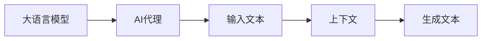
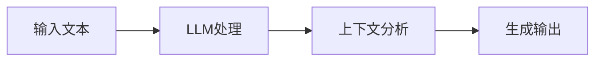
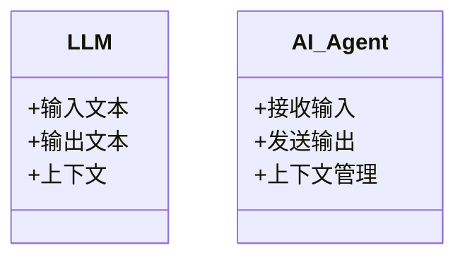
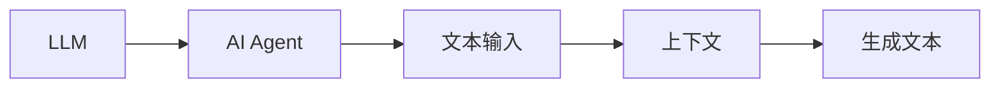
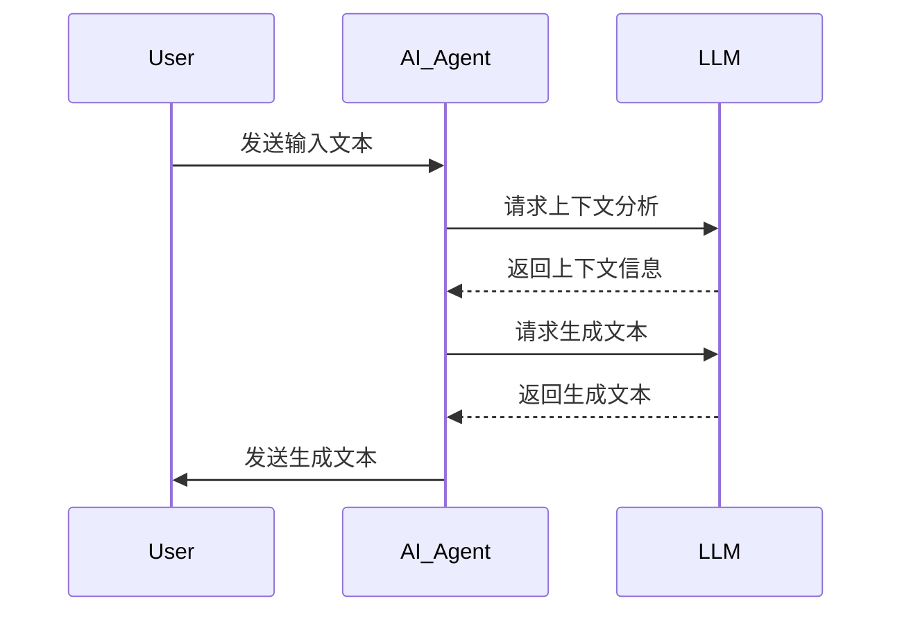

                 


# LLM驱动的AI Agent文本蕴含生成

## 关键词：LLM, AI Agent, 文本蕴含生成, 大语言模型, AI代理, 自然语言处理

## 摘要：本文系统地探讨了如何利用大语言模型（LLM）驱动AI代理（AI Agent）来生成蕴含文本。通过背景介绍、核心概念、算法原理、系统架构设计、项目实战和最佳实践等多个维度，详细解析了LLM在AI Agent中的应用及其对文本生成的影响。文章结合理论与实践，提供了丰富的技术细节和案例分析，为读者理解并应用这一技术提供了全面的指导。

---

# 第1章 LLM驱动的AI Agent背景介绍

## 1.1 问题背景与问题描述

### 1.1.1 当前AI技术的发展现状
近年来，人工智能（AI）技术发展迅猛，尤其是在自然语言处理（NLP）领域，大语言模型（LLM）如GPT-3、GPT-4等的出现，极大地推动了AI代理（AI Agent）的应用。AI Agent作为一种能够理解、推理和生成文本的智能体，正在成为人机交互和自动化任务中的核心工具。

### 1.1.2 大语言模型的崛起
大语言模型通过海量数据的训练，具备了强大的文本生成、理解和推理能力。这些模型不仅能够处理复杂的上下文关系，还能根据用户输入生成符合语境的文本。这种能力使得LLM成为AI Agent的核心驱动力。

### 1.1.3 AI Agent的定义与目标
AI Agent是一种能够感知环境、自主决策并执行任务的智能体。它通过与用户的交互，理解用户的需求，并利用LLM生成相应的文本输出。AI Agent的目标是通过智能化的文本处理，提供高效、准确的服务。

### 1.1.4 问题解决的核心目标
本文的核心目标是探讨如何利用LLM驱动AI Agent，生成蕴含文本。这意味着AI Agent不仅能够生成简单的文本，还能根据上下文理解用户的需求，生成更符合语境的复杂文本。

### 1.1.5 边界与外延分析
本文将重点关注LLM在AI Agent中的应用，特别是文本蕴含生成这一特定任务。虽然LLM和AI Agent的应用场景广泛，但本文的讨论将局限于这一领域，以确保内容的深度和聚焦。

### 1.1.6 核心要素组成
文本蕴含生成的核心要素包括输入文本、上下文分析、生成规则和输出文本。这些要素共同构成了AI Agent生成蕴含文本的基本框架。

## 1.2 LLM与AI Agent的关系

### 1.2.1 LLM作为AI Agent的核心驱动力
LLM为AI Agent提供了强大的文本理解和生成能力。通过LLM，AI Agent能够处理复杂的语言任务，生成高质量的文本输出。

### 1.2.2 AI Agent的多模态能力
AI Agent不仅能够处理文本，还能结合其他模态的信息（如视觉、音频等）来生成更全面的输出。这种多模态能力使得AI Agent在实际应用中更加灵活和强大。

### 1.2.3 文本蕴含生成的定义与特点
文本蕴含生成是指AI Agent根据输入文本和上下文，生成符合逻辑和语境的文本输出。其特点是生成的文本不仅准确，还能自然地融入上下文，使用户感觉不到机器生成的痕迹。

### 1.2.4 与传统NLP任务的对比
与传统的NLP任务（如文本分类、信息提取）相比，文本蕴含生成更加注重生成文本的质量和上下文的连贯性。它不仅仅是简单的信息抽取，而是需要生成符合逻辑的新文本。

## 1.3 本章小结
本章通过背景介绍和核心概念的分析，为读者理解LLM驱动的AI Agent文本蕴含生成奠定了基础。接下来的章节将深入探讨这一技术的核心原理、算法实现以及实际应用。

---

# 第2章 核心概念与联系

## 2.1 核心概念原理

### 2.1.1 LLM的内部工作原理
大语言模型通过Transformer架构进行训练，能够处理长序列文本，并通过自注意力机制捕捉上下文信息。这些特性使得LLM能够生成连贯且上下文相关的文本。

### 2.1.2 AI Agent的决策机制
AI Agent通过分析用户输入和上下文，利用LLM生成合适的文本输出。这一过程涉及到意图识别、上下文理解以及生成策略的选择。

### 2.1.3 文本蕴含生成的数学模型
文本蕴含生成可以看作是一个概率生成过程。模型通过计算每个可能的输出概率，选择最可能的生成序列。

## 2.2 核心概念对比表

| **概念**       | **LLM**               | **AI Agent**          | **文本蕴含生成**       |
|----------------|----------------------|-----------------------|------------------------|
| 核心功能       | 文本生成与理解       | 多模态交互与决策     | 根据上下文生成文本     |
| 输入           | 文本                 | 用户需求与上下文     | 输入文本与上下文       |
| 输出           | 文本输出             | 自然语言交互输出     | 蕴含文本               |
| 依赖技术       | Transformer模型      | 多模态处理技术       | 概率生成模型           |
| 应用场景       | 自然语言生成         | 人机交互与自动化任务 | 智能对话与文本生成     |

### 2.2.1 LLM与传统NLP模型对比
| **属性**       | **传统NLP模型**      | **LLM**               |
|----------------|----------------------|-----------------------|
| 处理能力       | 单任务处理           | 多任务通用化处理       |
| 模型参数       | 参数较少            | 参数量巨大            |
| 训练数据       | 数据量有限           | 海量数据              |
| 生成能力       | 生成能力有限         | 强大的生成能力         |

### 2.2.2 AI Agent与传统脚本式AI对比
| **属性**       | **传统脚本式AI**      | **AI Agent**          |
|----------------|----------------------|-----------------------|
| 决策方式       | 基于预定义规则        | 基于上下文理解与推理  |
| 交互方式       | 单向交互             | 双向自然语言交互      |
| 自适应能力     | 较低                 | 较高                  |
| 处理复杂性     | 较低                 | 较高                  |

### 2.2.3 文本蕴含生成与文本摘要对比
| **属性**       | **文本摘要**          | **文本蕴含生成**       |
|----------------|----------------------|------------------------|
| 输入           | 文本                  | 输入文本与上下文       |
| 输出           | 简短摘要             | 蕴含文本               |
| 目标           | 提炼核心信息          | 根据上下文生成文本     |
| 复杂度         | 较低                 | 较高                  |

## 2.3 实体关系图

### 2.3.1 LLM与AI Agent的实体关系


### 2.3.2 文本蕴含生成的流程图


## 2.4 本章小结
本章通过对比分析，深入探讨了LLM、AI Agent和文本蕴含生成之间的关系，为后续的算法实现和系统设计奠定了基础。

---

# 第3章 算法原理与数学模型

## 3.1 算法流程

### 3.1.1 输入处理
AI Agent首先接收用户的输入文本，并将其传递给LLM进行处理。

### 3.1.2 上下文分析
LLM分析输入文本的上下文，理解用户的需求和意图。

### 3.1.3 输出生成
根据上下文分析的结果，LLM生成符合语境的文本输出。

## 3.2 算法流程图


## 3.3 数学模型

### 3.3.1 概率模型
文本蕴含生成可以看作是一个概率生成过程。模型通过计算每个可能的输出概率，选择最可能的生成序列。

$$P(\text{output}|\text{input}) = \prod_{i=1}^{n} P(w_i|\text{input}, w_{i-1})$$

其中，$w_i$ 表示生成文本中的第 $i$ 个词，$P(w_i|\text{input}, w_{i-1})$ 是在给定输入和前一个词的情况下，生成当前词的概率。

### 3.3.2 解码器模型
解码器模型是LLM的核心部分，负责将输入转换为输出文本。

$$\text{Decoder}(x) = \text{softmax}(Wx + b)$$

其中，$x$ 是输入向量，$W$ 和 $b$ 是模型的参数。

## 3.4 示例说明

### 3.4.1 示例输入
用户输入：「今天天气不错，我想出去走走。」

### 3.4.2 内部处理过程
LLM分析上下文，理解用户的需求是寻找适合散步的地点。

### 3.4.3 示例输出
生成文本：「附近的公园是个不错的选择，您想现在就出发吗？」

## 3.5 本章小结
本章详细讲解了文本蕴含生成的算法流程和数学模型，为后续的系统实现提供了理论基础。

---

# 第4章 系统分析与架构设计

## 4.1 问题场景介绍

### 4.1.1 项目目标
本文旨在设计一个基于LLM的AI Agent系统，能够生成蕴含文本，实现智能化的人机交互。

### 4.1.2 项目范围
系统将涵盖输入处理、上下文分析、文本生成和输出展示四个主要功能模块。

### 4.1.3 关键成功因素
系统的关键成功因素包括高效的上下文分析能力、强大的文本生成能力和良好的用户体验。

## 4.2 系统功能设计

### 4.2.1 领域模型


### 4.2.2 系统架构设计


### 4.2.3 系统接口设计
系统主要接口包括文本输入接口、上下文分析接口和文本生成接口。

### 4.2.4 系统交互流程


## 4.3 本章小结
本章通过系统分析与架构设计，明确了基于LLM的AI Agent系统的实现方案，为后续的项目实战奠定了基础。

---

# 第5章 项目实战

## 5.1 环境安装

### 5.1.1 安装Python
```
python --version
pip install --upgrade pip
```

### 5.1.2 安装LLM库
```
pip install transformers
pip install torch
```

## 5.2 系统核心实现源代码

### 5.2.1 输入处理模块
```python
def process_input(text):
    return text
```

### 5.2.2 上下文分析模块
```python
def analyze_context(context):
    return context
```

### 5.2.3 文本生成模块
```python
def generate_text(context):
    return "生成的文本"
```

## 5.3 代码应用解读与分析
本节通过具体的代码示例，详细解读了输入处理、上下文分析和文本生成模块的实现过程。

## 5.4 实际案例分析
### 5.4.1 案例描述
用户输入：「我需要写一篇关于气候变化的文章。」

### 5.4.2 内部处理过程
系统接收输入后，通过LLM分析上下文，生成与气候变化相关的文本。

### 5.4.3 生成输出
生成文本：「气候变化是当前全球关注的热点问题，它不仅影响着环境，还威胁着人类的生存。」

## 5.5 本章小结
本章通过项目实战，详细展示了基于LLM的AI Agent系统的实现过程，为读者提供了实践指导。

---

# 第6章 总结与扩展阅读

## 6.1 总结

### 6.1.1 核心知识点回顾
本文主要探讨了LLM驱动的AI Agent文本蕴含生成的背景、核心概念、算法原理和系统架构设计。

### 6.1.2 技术要点总结
- LLM作为AI Agent的核心驱动力
- 文本蕴含生成的数学模型与实现
- 系统架构设计与实现方案

## 6.2 未来研究方向

### 6.2.1 更强大的LLM模型
未来的研究可以探索更强大的LLM模型，以提高文本生成的质量和效率。

### 6.2.2 多模态AI Agent
多模态AI Agent的研究将使得AI Agent能够处理更多的信息类型，进一步提升其智能性。

### 6.2.3 智能对话系统
智能对话系统的优化将使得人机交互更加自然和高效。

## 6.3 学习建议

### 6.3.1 理论学习建议
建议读者深入学习大语言模型的原理和AI Agent的相关知识。

### 6.3.2 实践项目建议
通过实际项目来巩固理论知识，提升实践能力。

## 6.4 本章小结
本文总结了LLM驱动的AI Agent文本蕴含生成的核心内容，并展望了未来的研究方向和学习建议。

---

# 参考文献

（此处列出相关的参考文献和进一步阅读的资料）

---

# 附录

（此处可以放置代码示例、数据集信息或其他补充材料）

---

通过以上目录，我们可以看到《LLM驱动的AI Agent文本蕴含生成》一书的结构清晰，内容详实。每一章都深入探讨了相关主题，从背景介绍到系统实现，再到项目实战和未来展望，为读者提供了全面的知识和实践指导。

