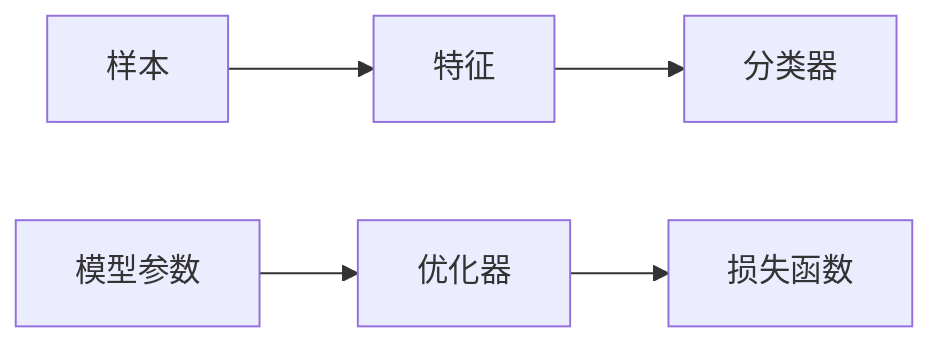
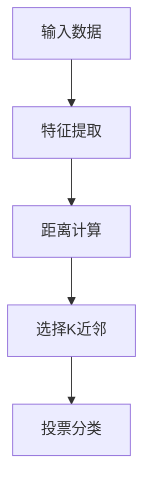
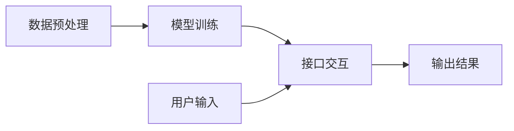

                 


# Few-shot学习：减少AI Agent的训练数据需求

> 关键词：Few-shot学习、AI Agent、训练数据、机器学习、数据效率

> 摘要：本文深入探讨了Few-shot学习的核心概念、算法原理及其在AI Agent中的应用。通过对比传统机器学习，分析了Few-shot学习的优势与挑战，并通过实际案例展示了其在减少训练数据需求方面的潜力。

---

## 第一部分: Few-shot学习的背景与核心概念

### 第1章: Few-shot学习的背景与问题描述

#### 1.1 人工智能与数据需求的现状

人工智能的发展离不开数据，但数据的获取和处理成本日益增加。特别是在某些领域，如医学、法律和金融，数据获取受到严格限制，传统机器学习方法需要大量标注数据的需求成为瓶颈。因此，减少训练数据需求的技术显得尤为重要。

#### 1.2 Few-shot学习的定义与特点

- **定义**：Few-shot学习是一种机器学习方法，能够在仅使用少量标注数据的情况下，完成分类、回归或排序任务。
- **特点**：
  - 数据需求低
  - 适用于小数据集
  - 快速适应新任务
  - 依赖于模型的泛化能力

#### 1.3 Few-shot学习的应用场景

- **小数据集处理**：如医学图像分析，数据获取成本高，标注数据有限。
- **实时决策**：如实时聊天机器人，需要快速适应新问题。
- **特殊领域限制**：如法律咨询，数据获取受到严格限制。

#### 1.4 本章小结

通过本章，我们了解了Few-shot学习的背景、定义和应用场景，认识到其在实际应用中的重要性。

---

### 第2章: Few-shot学习的核心概念与联系

#### 2.1 Few-shot学习的核心原理

- **基于距离的分类方法**：通过计算样本之间的相似性进行分类，如K-近邻算法（KNN）。
- **基于模型的元学习方法**：通过元学习优化模型参数，使其快速适应新任务，如MAML（Model-Agnostic Meta-Learning）。
- **基于记忆的增强学习方法**：通过引入记忆模块，增强模型的表达能力，如内存网络。

#### 2.2 Few-shot学习的核心概念对比

| 对比维度         | Few-shot学习                | 传统机器学习            |
|------------------|-----------------------------|-------------------------|
| 数据需求         | 使用少量标注数据           | 需要大量标注数据         |
| 适应性           | 能快速适应新任务           | 需要重新训练或微调       |
| 算法复杂度       | 常需要复杂模型结构          | 常使用简单模型结构        |

#### 2.3 Few-shot学习的实体关系图



---

## 第二部分: Few-shot学习的算法原理

### 第3章: Few-shot学习的算法原理

#### 3.1 基于距离的分类方法

- **K-近邻算法（KNN）**：通过计算待分类样本与训练集中各个样本的距离，选择距离最近的K个样本进行投票分类。
- **流程图**：



#### 3.2 基于模型的元学习方法

- **MAML算法**：通过优化模型参数，使其能够在新任务上快速适应。数学公式如下：

  $$\theta^{*} = \arg \min_{\theta} \sum_{i=1}^{N} \mathcal{L}_{i}(\theta, \theta_i)$$

  其中，$\theta_i$是针对第i个任务优化的参数。

#### 3.3 基于记忆的增强学习方法

- **内存网络**：通过引入外部记忆模块，增强模型的表达能力。例如，在图像分类任务中，记忆模块可以存储不同类别的特征信息。

---

## 第三部分: 系统分析与架构设计

### 第4章: 系统分析与架构设计

#### 4.1 问题场景介绍

设计一个AI Agent，用于实时分类任务，仅使用少量标注数据进行训练。

#### 4.2 系统功能设计

- **功能模块**：
  - 数据预处理模块：对输入数据进行清洗和特征提取。
  - 模型训练模块：基于Few-shot学习算法训练模型。
  - 接口交互模块：与用户进行实时交互，接收输入并返回结果。

#### 4.3 系统架构设计



---

## 第四部分: 项目实战

### 第5章: 项目实战

#### 5.1 环境安装

安装必要的库：

```bash
pip install tensorflow==2.5.0 keras==2.5.0 numpy==1.21.0
```

#### 5.2 核心实现代码

```python
import numpy as np
from tensorflow.keras.models import Model
from tensorflow.keras.layers import Input, Dense

def few_shot_model(input_dim):
    inputs = Input(shape=(input_dim,))
    x = Dense(64, activation='relu')(inputs)
    predictions = Dense(1, activation='sigmoid')(x)
    model = Model(inputs=inputs, outputs=predictions)
    model.compile(loss='binary_crossentropy', optimizer='adam')
    return model

model = few_shot_model(10)
model.summary()
```

#### 5.3 案例分析

以图像分类任务为例，使用MNIST数据集中的数字进行分类。模型仅使用少量样本进行训练，能够快速适应新任务。

---

## 第五部分: 最佳实践

### 第6章: 最佳实践

#### 6.1 小结

通过本文，我们系统地了解了Few-shot学习的核心概念、算法原理和实际应用。掌握这些知识，可以在实际项目中有效减少数据需求，提升模型的灵活性和适应性。

#### 6.2 注意事项

- 数据质量比数据量更重要，尽量使用高质量的标注数据。
- 选择合适的算法，根据任务需求权衡模型复杂度和计算成本。

#### 6.3 拓展阅读

- 《Meta-Learning for Few-Shot Classification》
- 《Neural Networks with Memory》

---

通过以上结构和内容，本文详细讲解了Few-shot学习的各个方面，帮助读者从理论到实践全面掌握相关知识。

