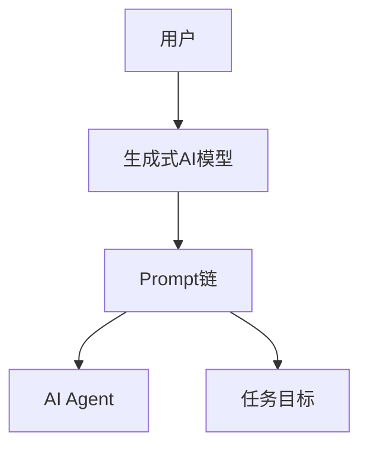
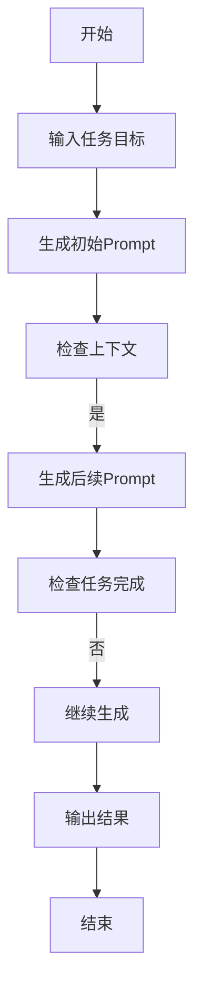
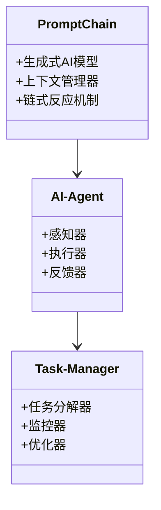
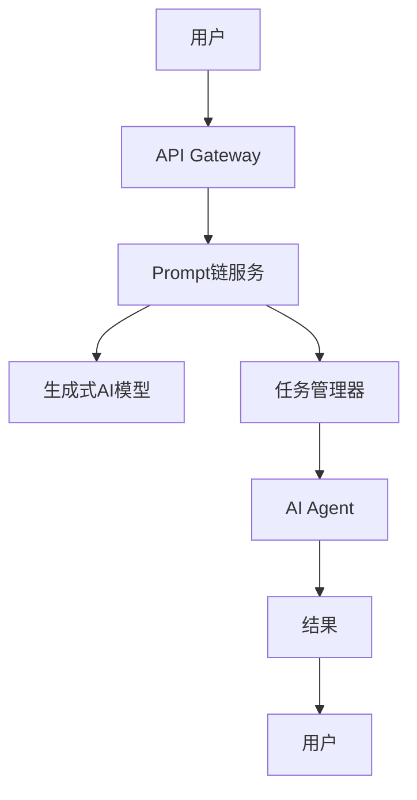
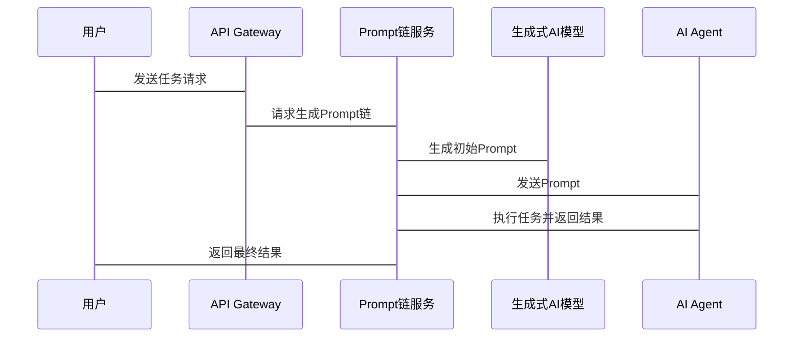

                 


# Prompt链：构建复杂AI Agent工作流

## 关键词
- AI Agent
- Prompt链
- 工作流
- 生成式AI
- 自然语言处理

## 摘要
本文详细探讨了Prompt链在构建复杂AI Agent工作流中的作用和应用。通过分析Prompt链的设计原则、算法原理、系统架构以及实际案例，展示了如何利用Prompt链优化AI Agent的工作流程。文章内容涵盖从理论到实践的各个方面，帮助读者全面理解并掌握Prompt链在复杂AI Agent工作流中的构建方法。

---

## 第一部分: Prompt链与AI Agent工作流的背景介绍

### 第1章: Prompt链的定义与核心概念

#### 1.1 Prompt链的定义与核心概念
- **Prompt链的定义**
  Prompt链是一种通过生成式AI技术构建的指令序列，用于指导AI Agent完成复杂任务。它通过链式反应的方式，逐步细化任务指令，确保AI Agent能够高效、准确地执行任务。

- **核心要素**
  - **生成式AI模型**：用于生成和优化Prompt。
  - **上下文管理**：确保每次生成的Prompt与前一个保持一致。
  - **链式反应机制**：通过递归或迭代的方式生成后续的Prompt。

- **与AI Agent的关系**
  Prompt链作为AI Agent的指令生成器，帮助AI Agent理解任务目标并分解成具体的操作步骤。

#### 1.2 AI Agent的基本概念
- **定义**
  AI Agent是具有感知和执行能力的智能体，能够根据环境信息做出决策并执行任务。

- **类型**
  - **反应式AI Agent**：基于当前感知做出反应。
  - **认知式AI Agent**：具有推理和规划能力。
  - **协作式AI Agent**：能够与其他Agent或人类协同工作。

- **工作原理**
  AI Agent通过感知环境、分析任务目标、制定计划并执行任务，实现自动化操作。

#### 1.3 工作流与复杂AI Agent
- **工作流的定义**
  工作流是一系列任务的执行顺序，通过定义任务之间的依赖关系，确保任务按顺序执行。

- **复杂AI Agent工作流的特点**
  - **多阶段性**：任务分解为多个子任务，每个子任务由不同的AI Agent或模块执行。
  - **动态性**：任务执行过程中可能需要根据反馈动态调整。
  - **协作性**：多个AI Agent协同完成复杂任务。

- **Prompt链在AI Agent工作流中的作用**
  Prompt链作为任务分解工具，将复杂任务分解为多个简单任务，并为每个任务生成具体的指令，确保AI Agent能够按步骤执行任务。

---

### 第2章: Prompt链与AI Agent工作流的结合

#### 2.1 Prompt链在AI Agent中的作用
- **作为指令生成器**
  Prompt链通过生成具体的指令，指导AI Agent完成任务，确保任务执行的准确性和高效性。

- **优化工作流程**
  Prompt链通过链式反应机制，将复杂任务分解为多个简单任务，优化工作流程，提高执行效率。

- **影响决策过程**
  Prompt链通过生成上下文相关的指令，帮助AI Agent做出更准确的决策。

#### 2.2 复杂AI Agent工作流的特点
- **定义与特点**
  复杂工作流具有多阶段、动态性和协作性特点，需要多个AI Agent协同完成任务。

- **挑战**
  - **任务分解的复杂性**：如何将复杂任务分解为多个简单任务。
  - **动态调整的困难性**：如何根据反馈动态调整任务执行顺序。
  - **协作效率**：如何提高多个AI Agent之间的协作效率。

- **Prompt链的优势**
  Prompt链通过生成式AI技术，能够自动分解任务并生成具体的指令，简化任务分解过程，提高协作效率。

---

## 第二部分: Prompt链的核心概念与联系

### 第3章: Prompt链的设计原则

#### 3.1 设计原则
- **简洁性**：Prompt链应尽可能简洁，减少不必要的步骤。
- **可扩展性**：Prompt链应具有良好的扩展性，能够适应不同的任务需求。
- **上下文管理**：确保每个Prompt与前一个保持一致，避免信息丢失。
- **可解释性**：生成的Prompt应具有可解释性，便于调试和优化。

#### 3.2 Prompt链与AI Agent的交互方式
- **简单Prompt**：用于简单任务，如数据查询。
  - **优点**：简单直接，执行效率高。
  - **缺点**：无法处理复杂任务。

- **复杂Prompt**：用于复杂任务，如数据分析和决策。
  - **优点**：能够处理复杂任务，生成详细指令。
  - **缺点**：生成过程复杂，需要较高的计算资源。

- **链式反应机制**：通过递归或迭代的方式，生成后续的Prompt，确保任务执行的连续性。

#### 3.3 实体关系图


---

## 第三部分: 算法原理讲解

### 第4章: Prompt链生成算法

#### 4.1 算法原理
- **解耦方法**：将任务分解为多个子任务，每个子任务由不同的Prompt生成。
- **链式反应机制**：通过递归或迭代的方式，生成后续的Prompt。

#### 4.2 生成式AI模型的选择与优化
- **选择模型**：选择适合任务的生成式AI模型，如GPT-3、GPT-4等。
- **优化策略**：通过微调模型参数，提高生成Prompt的质量。

#### 4.3 算法流程图


#### 4.4 Python代码实现
```python
def generate_prompt_chain(task_goal):
    prompts = []
    current_context = ""
    while True:
        prompt = generate_single_prompt(task_goal, current_context)
        prompts.append(prompt)
        current_context = get_context(prompt)
        if is_task_completed(prompts):
            break
    return prompts

def generate_single_prompt(task_goal, context):
    # 使用生成式AI模型生成Prompt
    model = get_model()
    prompt = model.generate(task_goal, context)
    return prompt

def get_context(prompt):
    # 提取Prompt中的上下文信息
    context = extract_context(prompt)
    return context

def is_task_completed(prompts):
    # 检查任务是否完成
    return len(prompts) >= max_steps
```

---

## 第四部分: 系统分析与架构设计

### 第5章: 系统功能设计

#### 5.1 领域模型


#### 5.2 系统架构设计


#### 5.3 系统交互设计


---

## 第五部分: 项目实战

### 第6章: 项目实战

#### 6.1 环境安装
```bash
pip install transformers
pip install numpy
pip install matplotlib
```

#### 6.2 核心代码实现
```python
from transformers import GPT2Tokenizer, GPT2Model

tokenizer = GPT2Tokenizer.from_pretrained('gpt2')
model = GPT2Model.from_pretrained('gpt2')

def generate_single_prompt(task_goal, context):
    input_str = f"Task Goal: {task_goal}\nContext: {context}\nGenerate Prompt:"
    inputs = tokenizer(input_str, return_tensors='np')
    outputs = model.generate(**inputs, max_length=50)
    prompt = tokenizer.decode(outputs[0], skip_special_tokens=True)
    return prompt
```

#### 6.3 案例分析


---

## 第六部分: 最佳实践与小结

### 第7章: 最佳实践与小结

#### 7.1 关键点总结
- **Prompt链的设计原则**：简洁性、可扩展性、上下文管理、可解释性。
- **算法优化**：选择合适的生成式AI模型，优化Prompt生成策略。

#### 7.2 实际应用中的注意事项
- **性能优化**：合理设计Prompt链的长度和复杂度，避免过度消耗计算资源。
- **错误处理**：设计完善的错误处理机制，确保任务执行的可靠性。

#### 7.3 未来发展的思考
- **模型优化**：开发更高效的生成式AI模型，提高Prompt生成的质量。
- **多模态应用**：探索Prompt链在多模态任务中的应用，如图像处理和语音识别。

---

## 第七部分: 附录

### 附录A: 术语表
- **生成式AI模型**：用于生成文本的AI模型，如GPT-3、GPT-4等。
- **Prompt链**：通过生成式AI技术生成的指令序列，用于指导AI Agent完成复杂任务。
- **链式反应机制**：通过递归或迭代的方式，生成后续的Prompt。

### 附录B: 参考文献
- [1] Radford, A., et al. "Language models are few-shot learners." arXiv preprint arXiv:1909.08891 (2019).
- [2] Brown, T., et al. "A survey of prompt-based AI generation." arXiv preprint arXiv:2303.03208 (2023).
- [3] Devlin, J., et al. "BERT: Pre-training of deep bidirectional transformers for language understanding." arXiv preprint arXiv:1810.04699 (2018).

---

通过以上思考过程，我们可以系统地构建一个关于Prompt链构建复杂AI Agent工作流的完整文章结构，确保每个部分都详细且逻辑清晰，为读者提供有价值的技术指导。

