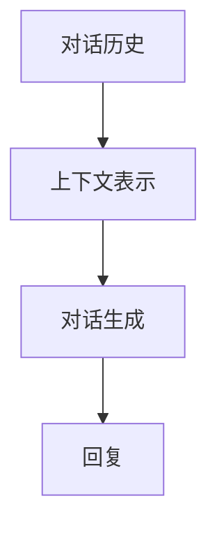
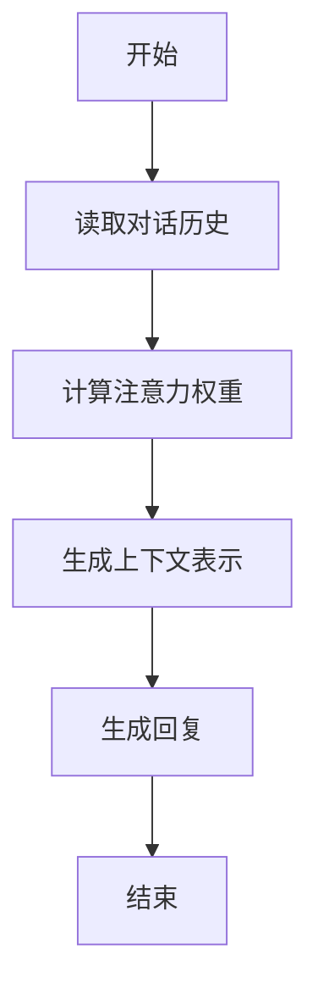
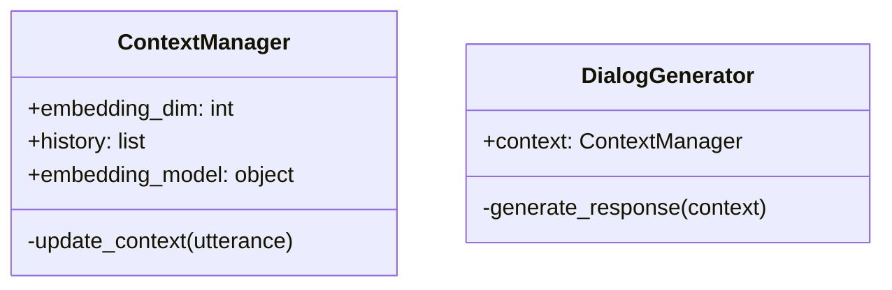
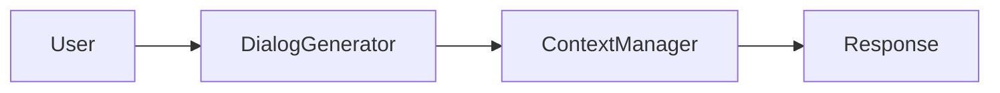

                 


# 上下文管理：增强AI Agent的对话连贯性

> 关键词：上下文管理, AI Agent, 对话连贯性, 注意力机制, 实体关系图, 算法原理, 系统架构

> 摘要：上下文管理是实现AI Agent对话连贯性的关键。本文详细探讨了上下文管理的核心概念、算法原理、系统架构设计以及项目实战，结合Mermaid流程图和Python代码示例，帮助读者全面理解上下文管理在增强对话系统连贯性中的作用。

---

## 第一部分: 上下文管理与AI Agent对话连贯性背景

### 第1章: 上下文管理的核心概念

#### 1.1 问题背景与问题描述
- **对话连贯性问题的提出**：在AI Agent的对话过程中，缺乏上下文管理会导致对话不连贯，用户体验下降。例如，用户多次对话时，AI无法记住先前的对话内容，导致重复询问或信息不一致。
- **问题描述**：上下文管理需要实时跟踪对话历史，理解当前对话的背景信息，并根据这些信息生成连贯的回复。
- **解决方案**：引入上下文管理机制，通过记录和更新对话历史，保持对话的连贯性。

#### 1.2 上下文管理的边界与外延
- **边界**：上下文管理仅关注对话内容本身，不涉及用户的身份验证或其他外部系统。
- **外延**：上下文管理可以与其他技术结合，如自然语言处理（NLP）和机器学习模型，以提升对话质量。

#### 1.3 核心概念与结构
- **核心要素**：
  - 对话历史记录：存储每次对话的内容。
  - 上下文表示：将对话历史转化为可理解的结构。
  - 上下文更新：根据新对话内容更新上下文表示。

---

## 第二部分: 上下文管理的核心原理与算法

### 第2章: 上下文管理的原理与联系

#### 2.1 上下文管理的原理分析
- **上下文表示的原理**：将对话历史转化为向量表示，以便模型处理。
- **上下文更新的机制**：根据新对话内容，动态更新上下文表示。

#### 2.2 核心概念对比表
| 对比维度 | 基于记忆的上下文管理 | 基于规则的上下文管理 |
|----------|----------------------|-----------------------|
| 表现形式 | 动态向量表示           | 预定义规则           |
| 优缺点   | 高灵活性，适应性强     | 实施简单，但不够灵活 |

#### 2.3 实体关系图


### 第3章: 上下文管理的算法原理

#### 3.1 基于注意力机制的上下文管理算法
- **注意力机制的基本原理**：通过计算对话历史中各部分的重要性，聚焦于关键信息。
- **上下文表示的注意力模型**：使用多头注意力机制，捕捉不同层次的信息。

#### 3.2 算法流程图


#### 3.3 算法实现代码
```python
import torch

class ContextManager:
    def __init__(self, embedding_dim):
        self.embedding_dim = embedding_dim
        self.history = []

    def update_context(self, newUtterance):
        embedding = self.embedding_model(newUtterance)
        self.history.append(embedding)
```

#### 3.4 数学模型与公式
- 注意力机制的计算公式：
  $$
  \alpha_i = \text{softmax}(\frac{QK^T}{\sqrt{d}})
  $$
  其中，$Q$和$K$分别是查询和键的向量。

---

## 第三部分: 系统分析与架构设计

### 第4章: 系统分析与架构设计

#### 4.1 问题场景介绍
- **场景描述**：用户与AI Agent进行多轮对话，需要保持对话的连贯性。

#### 4.2 系统功能设计
- **领域模型**：定义对话历史、上下文表示和回复生成的关系。


#### 4.3 系统架构设计
- **架构图**：展示系统各组件之间的关系。


---

## 第四部分: 项目实战

### 第5章: 项目实战

#### 5.1 环境安装
- 安装必要的库：`torch`, `transformers`

#### 5.2 核心功能实现
- 实现`ContextManager`类，集成预训练的NLP模型。

#### 5.3 案例分析
- 分析一个具体的对话场景，展示上下文管理如何提升对话连贯性。

---

## 第五部分: 总结与扩展

### 第6章: 总结与扩展
- **最佳实践**：结合NLP模型和上下文管理，提升对话质量。
- **注意事项**：确保上下文管理的安全性和隐私性。

---

通过以上结构，文章详细探讨了上下文管理在AI Agent中的应用，从概念到算法，再到系统设计和实战，帮助读者全面掌握相关知识。

