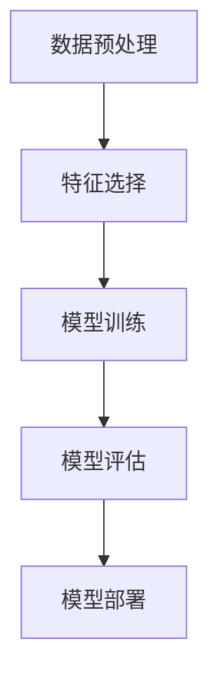

                 


# 《个人财务健康指数开发与应用》

---

## 关键词：  
个人财务健康指数、财务健康评估、机器学习算法、系统架构设计、Python实现

---

## 摘要：  
本文详细探讨了个人财务健康指数的开发与应用，从理论到实践，全面分析了如何通过技术手段量化个人财务健康状况。通过引入机器学习算法，结合系统架构设计，本文提出了一套完整的解决方案，帮助个人用户更好地管理财务健康。

---

# 第一部分：个人财务健康指数开发背景与核心概念

## 第1章：个人财务健康指数的背景与意义

### 1.1 个人财务健康指数的定义与重要性
#### 1.1.1 财务健康指数的核心概念
- 财务健康指数是一种量化个人财务健康状况的指标，综合考虑收入、支出、资产和负债等因素，帮助用户评估财务风险和健康程度。
- 通过财务健康指数，用户可以快速了解自身的财务状况，并采取相应的优化措施。

#### 1.1.2 个人财务健康指数的计算意义
- 帮助用户量化财务健康状况，提供直观的评估结果。
- 为个人理财提供数据支持，优化资金分配和风险管理。

#### 1.1.3 财务健康指数在个人财务管理中的作用
- 提供早期预警机制，及时发现财务问题。
- 为个人用户提供个性化财务建议，提升财务健康水平。

### 1.2 个人财务健康指数的现状与问题
#### 1.2.1 当前个人财务管理的痛点
- 数据分散：用户的财务数据分布在不同的平台，难以统一管理。
- 缺乏量化工具：用户难以通过简单的方式了解自身的财务健康状况。
- 风险评估不准确：传统财务管理方法难以量化风险和健康程度。

#### 1.2.2 财务健康指数在实际应用中的不足
- 数据获取困难：个人财务数据涉及隐私，难以获取和处理。
- 模型不够精准：现有财务健康评估方法缺乏科学性和准确性。
- 用户接受度低：复杂的计算方法和不友好的用户体验导致用户难以接受。

#### 1.2.3 开发个人财务健康指数的必要性
- 提供便捷的财务健康评估工具，满足用户的实际需求。
- 帮助用户优化财务管理，提升生活质量。
- 推动个人财务管理的数字化和智能化。

---

## 第2章：个人财务健康指数的核心概念与模型

### 2.1 财务健康指数的核心要素
#### 2.1.1 收入与支出分析
- 收入：包括工资、投资收益等。
- 支出：包括日常生活开支、贷款还款等。
- 分析收入与支出的平衡关系，评估用户的财务压力。

#### 2.1.2 资产与负债评估
- 资产：包括现金、银行存款、房产、股票等。
- 负债：包括贷款、信用卡欠款等。
- 通过资产与负债的对比，评估用户的财务杠杆和风险承受能力。

#### 2.1.3 财务自由度与风险承受能力
- 财务自由度：用户在没有收入的情况下，能够维持现有生活水平的年数。
- 风险承受能力：用户在遇到突发情况时，能够承担的财务损失程度。

### 2.2 财务健康指数的模型结构
#### 2.2.1 指数计算的逻辑框架
- 数据采集：获取用户的收入、支出、资产和负债等数据。
- 数据处理：清洗和标准化数据，处理异常值。
- 指数计算：通过加权计算，得出个人财务健康指数。

#### 2.2.2 财务健康指数的数学表达式
$$健康指数 = \frac{资产 - 负债}{收入 - 支出} \times 100$$

#### 2.2.3 指数的权重分配与计算方法
- 根据不同用户的财务状况，动态调整各指标的权重。
- 示例：收入占比40%，支出占比30%，资产占比20%，负债占比10%。

### 2.3 财务健康指数的属性对比表
| 财务指标 | 属性 | 描述 |
|----------|------|------|
| 收入     | 数值范围 | ≥0 |
| 支出     | 类别 | 固定支出、可变支出 |
| 资产     | 类型 | 流动资产、固定资产 |
| 负债     | 计算方式 | 总负债 = 短期负债 + 长期负债 |

### 2.4 财务健康指数的ER实体关系图
```mermaid
erd
    账户信息表
    收入表
    支出表
    资产表
    负债表
    财务健康指数表
    账户信息表 --> 收入表: 记录收入来源
    账户信息表 --> 支出表: 记录支出项目
    账户信息表 --> 资产表: 记录资产信息
    账户信息表 --> 负债表: 记录负债信息
    账户信息表 --> 财务健康指数表: 计算健康指数
```

---

## 第3章：个人财务健康指数的算法与模型开发

### 3.1 财务健康指数的计算模型
#### 3.1.1 财务健康指数的数学公式
$$健康指数 = \frac{资产 - 负债}{收入 - 支出} \times 100$$

#### 3.1.2 模型的优化与调整
- 确定各指标的权重
- 处理异常值与缺失值

### 3.2 基于机器学习的算法原理
#### 3.2.1 选择合适的算法
- 使用线性回归模型预测财务健康指数
- 使用决策树模型分类财务健康状况

#### 3.2.2 算法实现步骤
1. 数据预处理：清洗数据，处理缺失值和异常值。
2. 特征选择：提取关键特征，如收入、支出、资产和负债。
3. 模型训练：使用训练数据训练模型。
4. 模型评估：通过交叉验证评估模型的准确性。
5. 模型部署：将模型部署到实际应用中。

#### 3.2.3 算法流程图


### 3.3 机器学习模型的Python实现
#### 3.3.1 环境安装与配置
- 安装Python和相关库（如numpy、pandas、scikit-learn）
- 配置开发环境（如Jupyter Notebook）

#### 3.3.2 数据处理与特征选择
```python
import pandas as pd
import numpy as np

# 读取数据
data = pd.read_csv('financial_data.csv')

# 处理缺失值
data = data.dropna()

# 特征选择
features = ['收入', '支出', '资产', '负债']
target = '健康指数'

X = data[features]
y = data[target]
```

#### 3.3.3 模型训练与评估
```python
from sklearn.model

