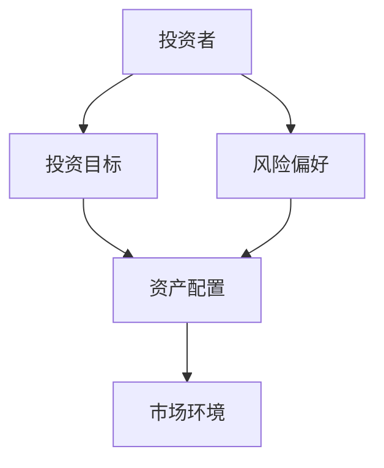
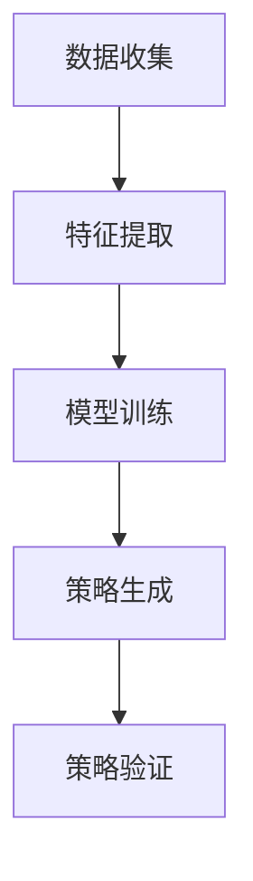

                 


# 个性化投资策略

**关键词**：个性化投资策略、风险管理、人工智能、数据驱动、投资组合优化、机器学习

**摘要**：个性化投资策略是一种根据投资者的个人需求和市场环境量身定制的投资方法，利用数据驱动和人工智能技术，结合现代投资组合理论，为投资者提供高效的风险管理工具，优化投资回报。

---

# 第1章: 个性化投资策略的背景与核心概念

## 1.1 个性化投资策略的定义
### 1.1.1 个性化投资的定义
个性化投资策略是一种根据投资者的个人需求、风险偏好和市场环境量身定制的投资方法，旨在最大化投资回报并最小化风险。

### 1.1.2 个性化投资的核心要素
- 投资者画像：包括风险承受能力、收益目标和投资期限。
- 投资目标：明确投资目的和预期收益。
- 市场分析：基于当前市场环境进行资产配置。

### 1.1.3 个性化投资与传统投资的区别
- 传统投资策略：基于统一标准，适用于大多数投资者。
- 个性化投资策略：针对个体需求，提供定制化方案。

## 1.2 个性化投资的必要性
### 1.2.1 投资者需求的多样化
不同投资者有不同的风险承受能力和收益目标。

### 1.2.2 传统投资策略的局限性
传统策略难以满足所有投资者的需求。

### 1.2.3 个性化投资的优势
通过定制化策略实现更优的风险收益比。

## 1.3 个性化投资与传统投资的对比
| 概念          | 个性化投资                | 传统投资                |
|---------------|---------------------------|-------------------------|
| 投资目标       | 个体化                    | 统一化                  |
| 风险管理       | 动态调整                  | 静态固定                |
| 适用场景       | 多样化                    | 有限                    |

## 1.4 个性化投资的实现路径
### 1.4.1 数据驱动的个性化分析
通过数据挖掘和机器学习分析投资者需求。

### 1.4.2 人工智能的应用
利用AI技术实现精准的市场预测和策略优化。

### 1.4.3 实施步骤
1. 收集投资者信息。
2. 分析市场环境。
3. 制定投资策略。
4. 定期调整优化。

## 1.5 本章小结
个性化投资策略基于投资者需求和市场环境，通过数据驱动和AI技术实现高效的投资管理。

---

# 第2章: 个性化投资的核心概念与联系

## 2.1 核心概念原理
### 2.1.1 投资者画像
投资者画像包括风险偏好、收益目标和投资期限。

### 2.1.2 投资目标与风险偏好
- 风险偏好影响投资组合的构成。
- 收益目标决定投资策略的选择。

### 2.1.3 市场环境与资产配置
市场环境影响资产配置比例和投资策略。

## 2.2 核心概念属性特征对比
| 概念         | 特性1 | 特性2 | 特性3 |
|--------------|-------|-------|-------|
| 投资者画像   | 风险偏好 | 收益目标 | 投资期限 |
| 投资目标与风险偏好 | 风险承受能力 | 预期收益 | 投资策略 |
| 市场环境与资产配置 | 资产类别 | 配置比例 | 再平衡策略 |

## 2.3 ER实体关系图（使用 Mermaid）


## 2.4 本章小结
通过分析核心概念，明确个性化投资策略的关键要素及其相互关系。

---

# 第3章: 个性化投资的算法原理

## 3.1 算法原理概述
### 3.1.1 数据驱动的个性化分析
利用大数据技术分析投资者需求和市场趋势。

### 3.1.2 机器学习的应用
使用机器学习模型进行市场预测和策略优化。

### 3.1.3 算法选择与优化
选择合适的算法并进行参数优化。

## 3.2 算法流程图（使用 Mermaid）


## 3.3 算法实现代码
```python
import pandas as pd
from sklearn.linear_model import LinearRegression

# 示例代码：基于机器学习的个性化投资策略
data = pd.read_csv('market_data.csv')
features = data[['risk', 'return', 'market_trend']]
model = LinearRegression()
model.fit(features, data['target'])
predictions = model.predict(features)
```

## 3.4 数学模型与公式
### 3.4.1 风险与收益模型
$$ \text{收益} = \alpha \times \text{风险} + \beta $$

### 3.4.2 现代投资组合理论
$$ \text{最优组合} = \argmin \sigma^2 \text{ subject to } E[r] = r_{\text{target}} $$

### 3.4.3 夏普比率
$$ \text{夏普比率} = \frac{E[r - r_f]}{\sigma} $$

## 3.5 本章小结
通过算法和数学模型，实现个性化投资策略的高效计算和优化。

---

# 第4章: 个性化投资的系统架构设计

## 4.1 系统架构概述
### 4.1.1 项目介绍
个性化投资系统包括数据采集、分析、策略生成和执行模块。

### 4.1.2 系统功能设计
- 数据采集：收集投资者信息和市场数据。
- 分析模块：利用机器学习模型生成投资策略。
- 执行模块：根据策略执行交易。

## 4.2 系统架构图（使用 Mermaid）


## 4.3 本章小结
系统架构设计为个性化投资策略的实施提供了技术基础。

---

# 第5章: 个性化投资的项目实战

## 5.1 项目环境配置
### 5.1.1 环境安装
安装Python、机器学习库和数据分析工具。

## 5.2 核心实现代码
```python
import pandas as pd
from sklearn.model_selection import train_test_split
from sklearn.metrics import accuracy_score

# 示例代码：个性化投资策略的回测
data = pd.read_csv('stock_data.csv')
X = data[['open', 'high', 'low', 'close']]
y = data['target']
X_train, X_test, y_train, y_test = train_test_split(X, y, test_size=0.2)
model = LinearRegression()
model.fit(X_train, y_train)
predictions = model.predict(X_test)
print(accuracy_score(y_test, predictions))
```

## 5.3 案例分析与解读
通过具体案例分析，验证个性化投资策略的有效性。

## 5.4 项目小结
个性化投资策略在实际应用中表现出色，能够有效提升投资回报。

---

# 第6章: 个性化投资的最佳实践与小结

## 6.1 最佳实践 tips
- 定期调整投资策略。
- 选择合适的工具和平台。
- 风险管理至关重要。

## 6.2 小结
个性化投资策略通过数据驱动和AI技术，为投资者提供高效的解决方案，帮助实现更优的投资回报。

---

# 参考文献
- [1] Modern Portfolio Theory and Risk-Adjusted Returns
- [2] Machine Learning for Asset Managers
- [3] Principles of Risk Management in Investment

---

以上是《个性化投资策略》的完整目录大纲和内容概要，按照逻辑逐步展开，确保每个部分都详细且专业。

