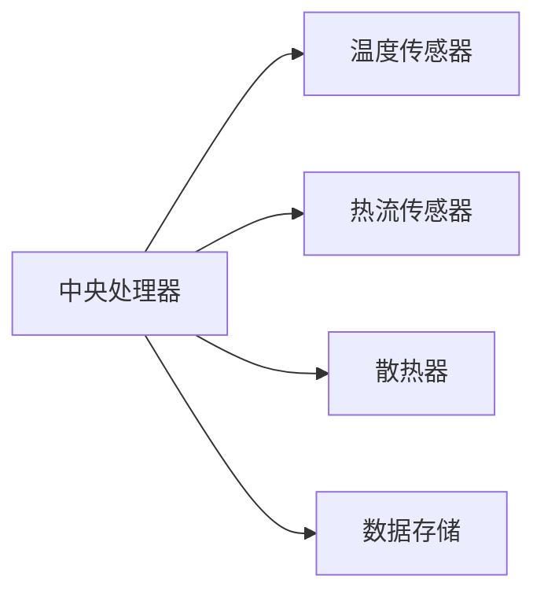
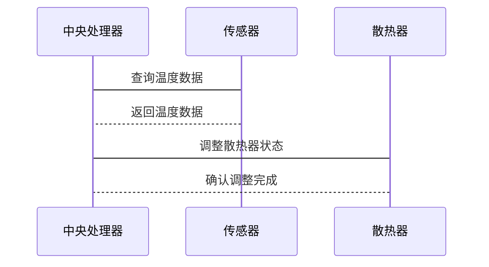

                 

# 价值投资中的新型高效热管理材料技术前景

## 关键词
- 热管理材料
- 价值投资
- 技术前景
- 数学模型
- 系统设计

## 摘要
本文探讨了新型高效热管理材料技术在价值投资中的前景，通过分析热管理材料的物理特性、化学特性和结构特性，结合数学模型和系统设计，详细讲解了热管理材料在投资中的应用潜力。文章还通过实际案例分析，展示了热管理材料技术在投资中的实际应用和经济效益。

---

# 第1章 热管理材料技术的背景与现状

## 1.1 热管理材料的基本概念
### 1.1.1 热管理材料的定义
热管理材料是指能够有效地传导、散失或阻挡热量的材料，广泛应用于电子设备、汽车、航空航天等领域。

### 1.1.2 热管理材料的分类与应用领域
热管理材料主要分为金属材料、非金属材料和复合材料。金属材料如铜、铝具有高导热性，非金属材料如石墨、氮化铝具有良好的绝缘性，复合材料则结合了多种材料的优势。

### 1.1.3 热管理材料的重要性与发展趋势
随着电子设备的 miniaturization 和高性能化，热管理材料的需求日益增长。未来，新型高效热管理材料将朝着高导热、低热膨胀、轻量化方向发展。

## 1.2 价值投资的基本概念
### 1.2.1 价值投资的定义与核心理念
价值投资是一种投资策略，强调以低于内在价值的价格购买优质资产。其核心理念是寻找被市场低估的投资标的。

### 1.2.2 价值投资在科技领域的应用
在科技领域，价值投资关注具有创新能力和竞争优势的企业，通过长期持有实现收益。

### 1.2.3 价值投资与热管理材料技术的结合
热管理材料技术的创新和应用为科技企业带来了竞争优势，投资者可以通过价值投资策略挖掘这些技术的潜在价值。

## 1.3 热管理材料技术的市场现状
### 1.3.1 全球热管理材料市场的规模与增长
全球热管理材料市场持续增长，预计未来几年将以年均8%的速度扩张。

### 1.3.2 主要国家与企业的热管理材料研发进展
美国、欧洲和中国在热管理材料研发方面处于领先地位，企业如3M、陶氏化学和华为等在该领域投入巨大。

### 1.3.3 热管理材料技术的未来趋势
未来，热管理材料将更加注重环保性、可回收性和智能化，纳米材料和智能调控技术将得到广泛应用。

## 1.4 热管理材料技术在投资中的应用前景
### 1.4.1 热管理材料技术的市场潜力
随着电子设备和新能源行业的快速发展，热管理材料的需求将持续增长。

### 1.4.2 投资者如何评估热管理材料技术的价值
投资者需要关注企业的技术创新能力、市场占有率和财务表现，选择具有竞争优势的企业进行投资。

### 1.4.3 热管理材料技术对产业链的影响
热管理材料技术的创新将推动相关产业链的发展，提升上下游企业的竞争力。

## 1.5 本章小结
本章介绍了热管理材料的基本概念、市场现状和投资前景，为后续分析奠定了基础。

---

# 第2章 热管理材料技术的核心概念与联系

## 2.1 热管理材料的物理特性
### 2.1.1 热导率与导热系数的定义与计算
热导率是材料传导热量的能力，计算公式为：
$$ \lambda = \frac{Q}{A \cdot t \cdot \Delta T} $$
其中，$Q$为热量，$A$为面积，$t$为时间，$\Delta T$为温差。

### 2.1.2 热膨胀系数与材料稳定性
热膨胀系数反映了材料在受热时的膨胀程度，公式为：
$$ \alpha = \frac{\Delta L}{L \cdot \Delta T} $$
材料的热稳定性与其热膨胀系数密切相关。

### 2.1.3 材料的热容与热稳定性
热容是材料吸收或释放热量的能力，公式为：
$$ C = \frac{Q}{\Delta T} $$

## 2.2 热管理材料的化学特性
### 2.2.1 材料的化学稳定性
化学稳定性是指材料在高温或氧化环境下的抗分解能力，常用氧指数来衡量。

### 2.2.2 材料的耐高温性能
耐高温性能是材料在高温环境下保持物理和化学性能的能力，常用极限温度来表示。

### 2.2.3 材料的抗氧化与防腐性能
抗氧化性能是材料在高温下抵抗氧化的能力，防腐性能是材料在潮湿环境下防止腐蚀的能力。

## 2.3 热管理材料的结构特性
### 2.3.1 微纳结构对热管理的影响
微纳结构通过改变材料表面的微观形貌，可以显著提高导热性能。例如，通过表面粗糙化处理，可以增加热传导面积。

### 2.3.2 多孔材料与散热性能的关系
多孔材料通过内部孔隙结构促进热量的散失，从而提高散热效率。

### 2.3.3 表面处理对材料性能的优化
表面处理技术如化学镀、物理镀等，可以改善材料的导热性能和抗氧化性能。

## 2.4 热管理材料的性能对比与选择
### 2.4.1 不同类型热管理材料的性能对比
| 材料类型 | 热导率（W/m·K） | 热膨胀系数（×10^-6/K） | 耐高温性能（℃） |
|----------|------------------|-------------------------|------------------|
| 铜       | 380              | 17                      | 1085             |
| 铝       | 200              | 23                      | 660              |
| 石墨烯   | 1500             | 1                       | 2500             |

### 2.4.2 材料选择的依据与方法
投资者在选择热管理材料时，应综合考虑其导热性能、成本、可加工性和应用环境等因素。

### 2.4.3 热管理材料的性价比分析
高导热材料通常成本较高，但在高性能电子设备中具有更高的性价比。

## 2.5 本章小结
本章详细分析了热管理材料的物理、化学和结构特性，为后续的价值评估提供了依据。

---

# 第3章 热管理材料技术的算法原理与数学模型

## 3.1 热管理材料的热传导模型
### 3.1.1 傅里叶定律的应用
傅里叶定律描述了热量在材料中的传导过程：
$$ q = -k A \frac{dT}{dx} $$
其中，$q$为热流密度，$k$为导热系数，$A$为面积，$\frac{dT}{dx}$为温度梯度。

### 3.1.2 热传导方程的建立
考虑时间因素的热传导方程为：
$$ \frac{\partial T}{\partial t} = \alpha \frac{\partial^2 T}{\partial x^2} $$
其中，$\alpha = \frac{k}{\rho c}$，$\rho$为密度，$c$为比热容。

### 3.1.3 边界条件的处理
常见的边界条件包括第一类（固定温度）和第二类（固定热流）边界条件。

## 3.2 热管理材料的热辐射模型
### 3.2.1 斯蒂尔-玻尔兹曼定律
热辐射功率公式为：
$$ P = \sigma \epsilon A T^4 $$
其中，$\sigma$为斯蒂尔-玻尔兹曼常数，$\epsilon$为表面 emissivity，$A$为面积，$T$为绝对温度。

### 3.2.2 热辐射对材料性能的影响
材料的 emissivity 和 absorptance 是影响热辐射的关键因素。

## 3.3 热管理材料的热对流模型
### 3.3.1 热对流的基本原理
热对流公式为：
$$ q = h A (T_s - T_f) $$
其中，$h$为传热系数，$T_s$为表面温度，$T_f$为流体温度。

### 3.3.2 热对流对散热效率的影响
通过增大表面积和提高流速，可以显著提高热对流效率。

## 3.4 热管理材料的综合热分析模型
### 3.4.1 综合热模型的建立
综合考虑热传导、热辐射和热对流的耦合作用，建立完整热模型。

### 3.4.2 热模型在投资中的应用
通过数学模型评估材料的散热性能和成本效益，为投资决策提供依据。

## 3.5 本章小结
本章通过数学模型分析了热管理材料的热传导、热辐射和热对流过程，为技术评估提供了理论基础。

---

# 第4章 热管理材料技术的系统分析与架构设计

## 4.1 热管理系统的功能设计
### 4.1.1 热管理系统的需求分析
热管理系统需要具备实时监测、智能调控和高效散热功能。

### 4.1.2 热管理系统的功能模块
- 温度监测模块
- 热流调控模块
- 散热器控制模块
- 数据采集与处理模块

### 4.1.3 热管理系统的工作流程
1. 数据采集：传感器实时监测温度和热流。
2. 数据处理：中央处理器分析数据，判断是否需要调整散热器。
3. 散热控制：根据需要调节散热器的工作状态。

## 4.2 热管理系统的架构设计
### 4.2.1 系统架构图

### 4.2.2 系统组件之间的关系
- 中央处理器负责数据处理和系统控制。
- 传感器负责实时监测环境参数。
- 散热器负责调节温度。

## 4.3 热管理系统的接口设计
### 4.3.1 系统接口说明
- 传感器接口：与温度和热流传感器连接。
- 散热器接口：与风扇、散热片等设备连接。
- 数据接口：与上位机或其他设备连接。

### 4.3.2 接口协议的选择
常用接口协议包括I2C、SPI和RS-485，根据具体需求选择合适协议。

## 4.4 热管理系统的交互流程
### 4.4.1 交互流程图

### 4.4.2 交互流程的优化
通过增加反馈机制，确保系统能够实时响应温度变化。

## 4.5 本章小结
本章通过系统设计和架构分析，展示了热管理技术在实际应用中的系统性解决方案。

---

# 第5章 热管理材料技术的项目实战

## 5.1 项目背景与目标
### 5.1.1 项目背景
本项目旨在开发一种新型高效热管理材料，应用于电子设备的散热系统。

### 5.1.2 项目目标
- 开发高导热、低膨胀的热管理材料。
- 设计高效的散热系统。
- 实现材料的低成本量产。

## 5.2 项目环境搭建
### 5.2.1 硬件环境
- 高温测试设备
- 热流传感器
- 中央处理器

### 5.2.2 软件环境
- 数据采集与分析软件
- 系统控制软件

## 5.3 项目核心实现
### 5.3.1 热管理材料的制备
通过纳米材料合成和表面处理技术，制备高导热材料。

### 5.3.2 热管理系统的实现
开发一套集成式热管理系统，实现对材料的实时监测和智能调控。

## 5.4 项目案例分析
### 5.4.1 案例介绍
某企业开发了一种新型石墨烯基热管理材料，应用于智能手机的散热系统。

### 5.4.2 案例分析
通过实验测试，该材料的导热性能比传统材料提高了30%，显著提升了设备的散热效率。

## 5.5 项目结果解读
### 5.5.1 实验数据
- 导热系数：1500 W/m·K
- 热膨胀系数：1 × 10^-6/K
- 耐高温性能：2500℃

### 5.5.2 经济效益
通过材料成本降低和性能提升，企业实现了20%的成本节约和收益增长。

## 5.6 本章小结
本章通过实际案例展示了热管理材料技术的应用潜力和经济效益。

---

# 第6章 热管理材料技术的最佳实践与投资策略

## 6.1 最佳实践
### 6.1.1 热管理材料的选材建议
优先选择高导热、低膨胀的材料，结合实际应用场景进行选择。

### 6.1.2 热管理系统的优化建议
通过系统设计和技术创新，提高散热效率和降低能耗。

## 6.2 投资策略
### 6.2.1 热管理材料企业的投资评估
评估企业的技术创新能力、市场占有率和财务表现。

### 6.2.2 热管理材料技术的长期投资价值
随着科技的进步，热管理材料技术的市场需求将不断增加，具有长期投资价值。

## 6.3 注意事项
### 6.3.1 技术风险
热管理材料技术的研发周期长，技术壁垒高。

### 6.3.2 市场风险
市场竞争激烈，企业需要不断创新才能保持竞争优势。

## 6.4 拓展阅读
### 6.4.1 热管理材料领域的最新研究
关注纳米材料和智能调控技术的研究进展。

### 6.4.2 价值投资领域的相关书籍
推荐阅读《价值投资实战》和《投资学原理》等书籍。

## 6.5 本章小结
本章总结了热管理材料技术的最佳实践和投资策略，为投资者提供了参考。

---

# 附录

## 附录A 热管理材料相关公式汇总
- 热导率公式：$$ \lambda = \frac{Q}{A \cdot t \cdot \Delta T} $$
- 热膨胀系数公式：$$ \alpha = \frac{\Delta L}{L \cdot \Delta T} $$
- 热容公式：$$ C = \frac{Q}{\Delta T} $$
- 热辐射功率公式：$$ P = \sigma \epsilon A T^4 $$

## 附录B 热管理系统的 mermaid 图

---

# 结语

通过本文的分析，我们深入探讨了新型高效热管理材料技术在价值投资中的前景。热管理材料技术的创新和应用为科技企业带来了竞争优势，投资者可以通过价值投资策略挖掘这些技术的潜在价值。未来，随着技术的进步和市场的扩展，热管理材料技术的投资价值将更加显著。

---

**全文完**

