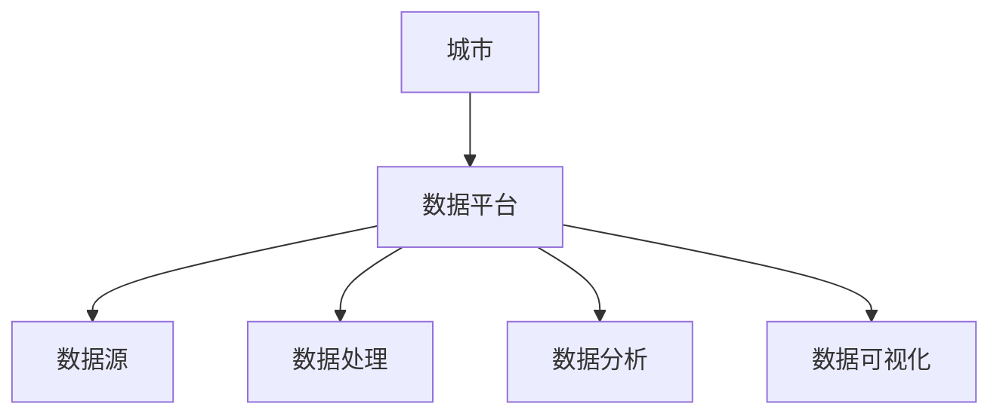
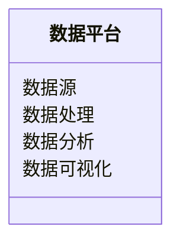
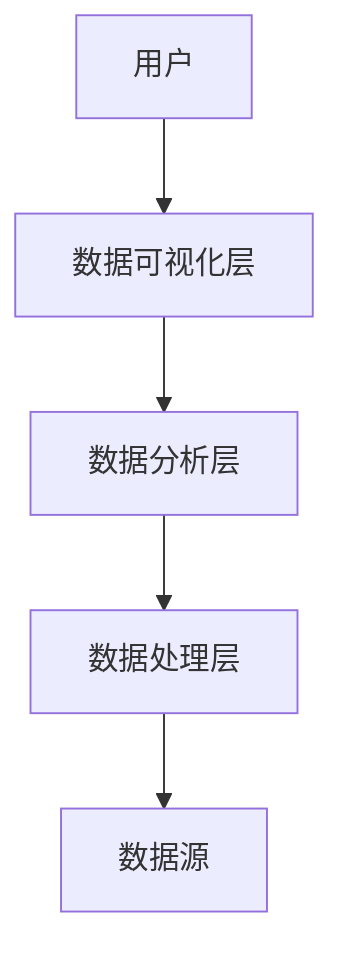
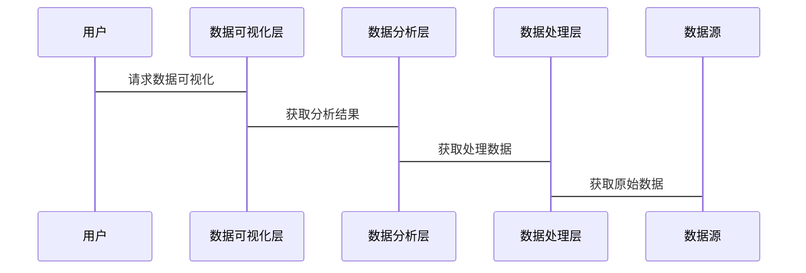

                 


# 价值投资中的智能城市数据平台分析

## 关键词：价值投资、智能城市、数据平台、数据分析、算法原理、系统架构

## 摘要：  
本文从价值投资的角度出发，深入分析智能城市数据平台的核心概念、算法原理、数学模型和系统架构，结合实际案例，详细阐述如何利用数据平台进行价值评估和投资决策。文章内容涵盖背景介绍、核心概念与联系、算法原理、数学模型、系统架构设计、项目实战等部分，旨在为读者提供全面的技术指导和实践参考。

---

# 第一部分：智能城市数据平台与价值投资背景

## 第1章：智能城市数据平台与价值投资背景

### 1.1 智能城市数据平台的定义与核心要素

#### 1.1.1 智能城市数据平台的定义
智能城市数据平台是通过整合城市中各类数据（如交通、环境、能源、社会经济等），利用大数据、人工智能等技术，为城市规划、管理和决策提供支持的数字化平台。

#### 1.1.2 数据平台的核心要素
智能城市数据平台的核心要素包括：
1. **数据源**：城市中的传感器、摄像头、数据库等数据采集设备。
2. **数据处理**：数据清洗、转换、整合等预处理过程。
3. **数据分析**：统计分析、机器学习模型的应用。
4. **数据可视化**：通过图表、仪表盘等形式展示数据。
5. **数据存储**：数据的存储和管理。

#### 1.1.3 数据平台的边界与外延
智能城市数据平台的边界在于数据的采集、处理和分析，外延则包括数据的共享和应用。

### 1.2 价值投资的基本概念

#### 1.2.1 价值投资的定义
价值投资是一种投资策略，强调以低于资产内在价值的价格购买优质资产，长期持有，等待市场对其价值的重新评估。

#### 1.2.2 价值投资的核心要素
1. **内在价值**：资产的真实价值，不依赖于市场情绪。
2. **安全边际**：买入价格与内在价值的差距，提供安全空间。
3. **长期视角**：关注长期收益，而非短期波动。

#### 1.2.3 价值投资与智能城市数据平台的结合
智能城市数据平台提供了大量城市运行数据，通过分析这些数据，可以评估城市的运营效率、资产价值和未来发展潜力，从而为价值投资提供支持。

### 1.3 本章小结
本章介绍了智能城市数据平台的定义、核心要素及其与价值投资的结合，为后续分析奠定了基础。

---

## 第2章：智能城市数据平台的核心概念

### 2.1 数据平台的实体关系分析

#### 2.1.1 实体关系图（ER图）
通过ER图展示智能城市数据平台的主要实体及其关系。



### 2.2 价值投资的分析框架

#### 2.2.1 价值投资的核心要素对比表

| 核心要素       | 描述                                                         |
|----------------|--------------------------------------------------------------|
| 数据源         | 数据来源的种类和可靠性                                       |
| 数据处理       | 数据清洗和预处理方法                                         |
| 数据分析       | 数据分析方法和模型                                           |
| 数据可视化     | 数据可视化的方式和工具                                       |

### 2.3 本章小结
本章通过实体关系图和对比表，详细分析了智能城市数据平台的核心概念及其与价值投资的联系。

---

## 第3章：智能城市数据平台的算法原理

### 3.1 数据处理算法

#### 3.1.1 数据清洗算法
数据清洗是去除噪声数据、填补缺失值、处理异常值的过程。

#### 3.1.2 数据预处理算法
数据预处理包括数据标准化、特征选择等步骤。

### 3.2 数据分析算法

#### 3.2.1 统计分析算法
统计分析包括均值、方差、相关性分析等方法。

#### 3.2.2 机器学习算法
机器学习算法包括回归分析、聚类分析、分类分析等。

### 3.3 数据可视化算法

#### 3.3.1 可视化工具的选择
常用的可视化工具包括Matplotlib、Seaborn、Tableau等。

#### 3.3.2 数据可视化方法
常见的数据可视化方法包括柱状图、折线图、散点图等。

### 3.4 本章小结
本章介绍了智能城市数据平台中常用的算法和工具，为后续分析提供了技术基础。

---

## 第4章：智能城市数据平台的数学模型与公式

### 4.1 数据分析的数学模型

#### 4.1.1 数据分析的数学公式

$$ y = \beta_0 + \beta_1x_1 + \beta_2x_2 + \dots + \beta_nx_n + \epsilon $$

### 4.2 价值评估的数学公式

#### 4.2.1 内在价值公式

$$ \text{内在价值} = \frac{\text{现金流}}{\text{折现率}} $$

### 4.3 本章小结
本章通过数学公式，详细阐述了数据分析和价值评估的核心方法。

---

## 第5章：智能城市数据平台的系统分析与架构设计

### 5.1 系统功能设计

#### 5.1.1 领域模型（Mermaid类图）



### 5.2 系统架构设计

#### 5.2.1 系统架构图（Mermaid架构图）



### 5.3 系统接口设计

#### 5.3.1 系统接口设计
系统接口设计包括数据输入接口、数据输出接口和用户界面接口。

### 5.4 系统交互设计

#### 5.4.1 系统交互流程图（Mermaid序列图）



### 5.5 本章小结
本章详细分析了智能城市数据平台的系统架构和交互流程，为后续实现提供了指导。

---

## 第6章：智能城市数据平台的项目实战

### 6.1 项目介绍

#### 6.1.1 项目背景
以某城市交通数据为例，分析城市交通运行效率，评估城市交通资产的内在价值。

### 6.2 系统核心实现源代码

#### 6.2.1 数据处理代码

```python
import pandas as pd
import numpy as np

# 数据清洗
def data_cleaning(data):
    # 去除缺失值
    data = data.dropna()
    # 处理异常值
    data = data[~(data['speed'] > 100)]
    return data

# 数据预处理
def data_preprocessing(data):
    # 数据标准化
    data['speed_normalized'] = (data['speed'] - data['speed'].mean()) / data['speed'].std()
    return data

# 数据处理主函数
def main():
    # 读取数据
    data = pd.read_csv('traffic_data.csv')
    # 数据清洗
    cleaned_data = data_cleaning(data)
    # 数据预处理
    processed_data = data_preprocessing(cleaned_data)
    return processed_data

if __name__ == "__main__":
    processed_data = main()
    print(processed_data.head())
```

#### 6.2.2 数据分析代码

```python
import pandas as pd
import numpy as np
from sklearn.linear_model import LinearRegression

# 数据分析
def data_analysis(data):
    # 统计分析
    print(data.describe())
    # 机器学习模型
    model = LinearRegression()
    model.fit(data[['speed', 'density']], data['flow'])
    return model

# 数据分析主函数
def main():
    processed_data = data_preprocessing(data_cleaning(pd.read_csv('traffic_data.csv')))
    model = data_analysis(processed_data)
    print('回归系数:', model.coef_)

if __name__ == "__name__":
    data_analysis(main())
```

### 6.3 实际案例分析与详细解读

#### 6.3.1 案例分析
以某城市交通数据为例，分析交通流量与密度、速度的关系。

#### 6.3.2 数据可视化
通过Matplotlib绘制交通流量与密度的散点图。

```python
import matplotlib.pyplot as plt

# 数据可视化
def data_visualization(data):
    plt.scatter(data['density'], data['flow'])
    plt.xlabel('Density')
    plt.ylabel('Flow')
    plt.title('Traffic Flow vs Density')
    plt.show()

data_visualization(processed_data)
```

### 6.4 项目小结
本章通过实际案例，详细展示了智能城市数据平台的实现过程和应用价值。

---

## 第7章：总结与最佳实践

### 7.1 总结
本文从价值投资的角度，详细分析了智能城市数据平台的核心概念、算法原理、数学模型和系统架构，并通过实际案例展示了其应用价值。

### 7.2 最佳实践 tips

#### 7.2.1 数据处理
- 数据清洗时，注意保留数据的完整性。
- 数据预处理时，选择合适的标准化方法。

#### 7.2.2 数据分析
- 统计分析与机器学习模型结合使用。
- 选择适合数据类型的分析方法。

#### 7.2.3 数据可视化
- 通过图表直观展示数据关系。
- 使用交互式可视化工具提高用户体验。

#### 7.2.4 系统设计
- 系统架构设计时，注重模块化和可扩展性。
- 系统交互设计时，简化用户操作流程。

### 7.3 未来展望
智能城市数据平台的应用前景广阔，未来可以通过区块链、物联网等技术进一步提升数据平台的智能化和安全性。

---

## 参考文献
1. 略

---

## 附录
1. 略

---

通过以上思考过程，我们系统地分析了智能城市数据平台与价值投资的关系，从理论到实践，为读者提供了全面的技术指导和实践参考。

