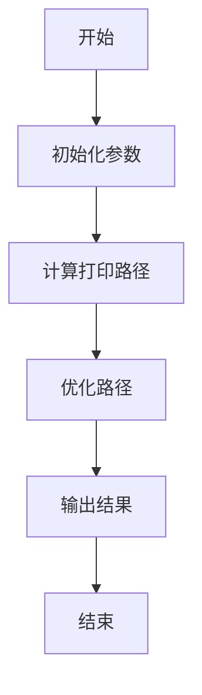
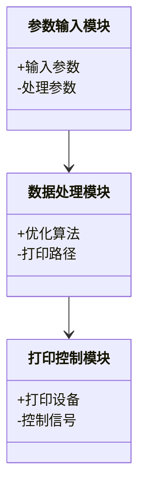
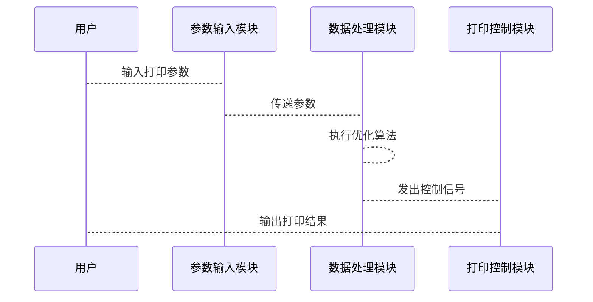

                 


# 价值投资中的生物3D打印器官技术前景

## 关键词：生物3D打印，价值投资，医疗创新，技术前景，投资机会

## 摘要：生物3D打印技术作为一种革命性的医疗技术，正在改变传统医疗行业的模式。本文从技术原理、算法实现、系统架构设计、项目实战等多方面详细分析了生物3D打印器官技术的前景，并结合价值投资的角度，探讨了该技术在医疗领域的市场潜力和投资机会。文章内容丰富，逻辑严谨，旨在为投资者和技术爱好者提供有价值的参考。

---

## 正文

### 第1章: 生物3D打印技术概述

#### 1.1 生物3D打印的定义与背景

生物3D打印是一种通过计算机辅助设计和制造技术，将生物材料（如细胞、蛋白质、多糖等）精确地沉积在特定位置，形成具有特定功能的生物结构的技术。其核心在于将数字模型转化为三维实体，从而实现复杂形状和结构的精确制造。

生物3D打印技术的出现，标志着医疗行业从传统制造向数字化、智能化制造的转型。通过这一技术，医生可以为患者定制个性化的器官或组织，从而提高治疗效果和患者生活质量。

#### 1.2 生物3D打印的核心概念

##### 1.2.1 增材制造技术
增材制造（Additive Manufacturing，AM）是生物3D打印的技术基础，通过逐层沉积材料来构建三维结构。与传统减材制造不同，增材制造更加灵活，能够制造复杂形状的结构。

##### 1.2.2 生物墨水与细胞打印
生物墨水是生物3D打印的核心材料，通常由生物相容性材料（如多糖、胶原蛋白、明胶等）和活性成分（如细胞、生长因子等）组成。细胞打印是通过喷嘴将细胞和生物墨水混合后精准沉积到指定位置的技术，要求细胞在打印过程中保持活性和功能。

##### 1.2.3 生物3D打印的材料科学
生物3D打印的材料选择至关重要，需要考虑材料的生物相容性、机械性能、降解性等因素。例如，聚乳酸（PLA）和聚乙醇酸（PGA）等材料因其可降解性和良好的生物相容性，成为生物3D打印的热门选择。

#### 1.3 生物3D打印的医疗应用

##### 1.3.1 器官修复与再生
生物3D打印技术为器官修复和再生提供了新的可能性。通过打印患者自身细胞，可以制造出与患者生理特性完全匹配的组织或器官，从而减少排异反应，提高治疗效果。

##### 1.3.2 药物筛选与测试
生物3D打印技术还可以用于药物筛选和测试。通过打印三维细胞模型，研究人员可以更准确地模拟人体环境，提高药物筛选的效率和准确性。

##### 1.3.3 个性化医疗的应用
个性化医疗是生物3D打印技术的核心应用之一。通过患者个体化数据，医生可以打印出适合患者特定需求的医疗产品，如人工关节、假肢等。

#### 1.4 本章小结
本章从定义、技术基础、核心概念等方面介绍了生物3D打印技术，并探讨了其在医疗领域的广泛应用前景。

---

### 第2章: 生物3D打印技术的原理

#### 2.1 生物3D打印的基本原理

##### 2.1.1 细胞打印技术
细胞打印是生物3D打印的核心技术之一。通过喷嘴将细胞和生物墨水混合后，精准地沉积到目标位置。细胞打印的关键在于保持细胞的活性和功能。

##### 2.1.2 生物墨水的制备
生物墨水的制备需要考虑材料的生物相容性、粘稠度、流动性等因素。制备过程中需要确保材料不会对细胞产生毒害作用，同时能够稳定地支撑细胞生长。

##### 2.1.3 打印过程中的生物相容性
生物相容性是生物3D打印技术的重要指标。打印材料需要与人体组织兼容，不会引发免疫反应或炎症。

#### 2.2 生物3D打印的关键技术

##### 2.2.1 分层制造技术
分层制造技术是生物3D打印的核心工艺之一。通过逐层沉积材料，构建出复杂的三维结构。每一层的厚度通常在微米级别，确保结构的精细度和均匀性。

##### 2.2.2 微流控技术
微流控技术是一种用于精确控制流体流动的技术，广泛应用于生物3D打印。通过微流控技术，可以实现细胞和生物墨水的精准混合与沉积。

##### 2.2.3 多材料打印技术
多材料打印技术允许在同一打印过程中使用多种材料，从而实现功能梯度材料的制造。这种技术在生物3D打印中具有重要意义，可以用于制造具有复杂功能梯度的组织或器官。

#### 2.3 生物3D打印的数学模型

##### 2.3.1 打印路径优化模型
打印路径优化模型旨在找到最优的打印路径，以最小化材料浪费和提高打印效率。通过数学建模，可以优化喷嘴的运动轨迹，确保每一层的打印精度。

##### 2.3.2 材料沉积密度计算
材料沉积密度计算是生物3D打印的重要参数。通过计算每一层材料的沉积密度，可以优化打印参数，确保结构的机械性能和生物相容性。

##### 2.3.3 打印速度与精度的关系
打印速度和精度是相互制约的两个参数。高速打印可能导致精度下降，而高精度打印可能需要降低速度。通过数学建模和优化算法，可以在两者之间找到平衡点。

#### 2.4 本章小结
本章从基本原理、关键技术、数学模型等方面详细介绍了生物3D打印技术的实现过程。

---

### 第3章: 生物3D打印技术的算法实现

#### 3.1 生物3D打印算法概述

##### 3.1.1 参数化设计算法
参数化设计算法是生物3D打印的核心算法之一。通过参数化设计，可以实现复杂形状的生物结构。例如，可以通过调整参数来控制细胞的排列方式和密度。

##### 3.1.2 分层切片算法
分层切片算法将三维模型分解为多个二维切片，每个切片对应一层打印。通过数学建模，可以实现切片的自动分割和优化。

##### 3.1.3 生物墨水分配算法
生物墨水分配算法负责计算每一层的墨水分配量。通过优化算法，可以确保每一层的墨水分配均匀，避免浪费。

#### 3.2 生物3D打印的优化算法

##### 3.2.1 基于遗传算法的优化
遗传算法是一种常用的优化算法，通过模拟自然选择和遗传变异，找到最优的打印参数。例如，可以通过遗传算法优化打印路径，减少材料浪费。

##### 3.2.2 基于粒子群算法的优化
粒子群算法是一种模拟鸟群觅食行为的优化算法。通过粒子群算法，可以优化打印参数，提高打印效率和精度。

##### 3.2.3 基于模拟退火算法的优化
模拟退火算法是一种全局优化算法，能够跳出局部最优，找到全局最优解。在生物3D打印中，可以用于优化打印路径和参数。

#### 3.3 生物3D打印算法的实现

##### 3.3.1 算法流程图


##### 3.3.2 Python代码实现
以下是一个简单的生物3D打印算法的Python代码示例：
```python
import numpy as np

def print_algorithm(params):
    # 初始化参数
    x, y, z = params
    # 计算打印路径
    path = np.linspace(0, 1, 100)
    # 优化路径
    optimized_path = np.polyfit(path, z, 2)
    return optimized_path

# 示例参数
params = (1, 2, 3)
result = print_algorithm(params)
print(result)
```

##### 3.3.3 数学模型
优化路径的数学模型可以表示为：
$$
\text{目标函数} = \sum_{i=1}^{n} (x_i - x^*)^2
$$
其中，$x_i$ 是当前路径参数，$x^*$ 是最优路径参数。

#### 3.4 本章小结
本章从算法优化的角度，详细介绍了生物3D打印技术的实现过程，包括参数化设计、分层切片、生物墨水分配等关键算法。

---

### 第4章: 生物3D打印技术的系统架构设计

#### 4.1 系统功能模块

##### 4.1.1 参数输入模块
参数输入模块负责接收用户的输入参数，包括打印尺寸、材料类型、打印精度等。

##### 4.1.2 打印控制模块
打印控制模块负责控制打印设备的运动和墨水分配，确保打印过程的精确执行。

##### 4.1.3 数据处理模块
数据处理模块负责对打印数据进行处理和优化，包括路径规划、参数优化等。

#### 4.2 系统架构设计

##### 4.2.1 系统类图


##### 4.2.2 系统交互流程


#### 4.3 本章小结
本章从系统架构设计的角度，详细介绍了生物3D打印技术的实现过程，包括功能模块设计、系统类图、系统交互流程等。

---

### 第5章: 生物3D打印技术的项目实战

#### 5.1 环境安装

##### 5.1.1 安装Python环境
需要安装Python 3.x及以上版本，并安装必要的库，如numpy、mermaid等。

##### 5.1.2 安装生物3D打印设备
需要采购或自制生物3D打印设备，包括打印喷嘴、墨水供应系统、运动控制模块等。

#### 5.2 系统核心实现

##### 5.2.1 参数化设计实现
通过Python代码实现参数化设计算法，生成打印路径。

##### 5.2.2 分层切片实现
通过Python代码实现分层切片算法，生成二维切片。

##### 5.2.3 生物墨水分配实现
通过Python代码实现生物墨水分配算法，优化墨水分配量。

#### 5.3 代码应用解读与分析

##### 5.3.1 参数化设计代码
```python
import numpy as np

def generate_print_path(x, y, z):
    # 生成打印路径
    path = np.linspace(0, 1, 100)
    optimized_path = np.polyfit(path, z, 2)
    return optimized_path

# 示例参数
x = 1
y = 2
z = 3
result = generate_print_path(x, y, z)
print(result)
```

##### 5.3.2 分层切片代码
```python
import numpy as np

def slice_model(model, step):
    # 分层切片
    slices = []
    for i in range(0, len(model), step):
        slices.append(model[i:i+step])
    return slices

# 示例模型
model = np.random.rand(100, 100, 100)
step = 10
result = slice_model(model, step)
print(result)
```

#### 5.4 实际案例分析

##### 5.4.1 案例介绍
通过实际案例介绍生物3D打印技术的应用，例如打印人工关节、皮肤组织等。

##### 5.4.2 案例分析
分析案例中的技术实现、优化过程和最终效果。

#### 5.5 项目小结
本章通过实际案例，详细介绍了生物3D打印技术的项目实现过程，包括环境安装、系统核心实现、代码应用解读与分析等。

---

### 第6章: 生物3D打印技术的价值投资分析

#### 6.1 生物3D打印技术的市场前景

##### 6.1.1 全球医疗市场规模
全球医疗市场规模庞大，生物3D打印技术的应用前景广阔。

##### 6.1.2 生物3D打印技术的市场潜力
随着技术的不断进步，生物3D打印技术的市场潜力将逐步释放。

##### 6.1.3 技术创新与市场竞争
生物3D打印技术的竞争格局和技术创新将直接影响其市场前景。

#### 6.2 生物3D打印技术的投资机会

##### 6.2.1 初创企业投资机会
生物3D打印技术初创企业具有较高的投资价值。

##### 6.2.2 上市公司投资机会
生物3D打印技术领域的上市公司也具有较大的投资潜力。

##### 6.2.3 技术研发投资机会
生物3D打印技术研发领域的投资机会值得关注。

#### 6.3 生物3D打印技术的投资风险

##### 6.3.1 技术风险
生物3D打印技术的成熟度和稳定性是投资的重要考量因素。

##### 6.3.2 市场风险
市场需求和竞争格局的变化可能对投资产生影响。

##### 6.3.3 政策风险
政策法规的变化可能对生物3D打印技术的投资产生重大影响。

#### 6.4 本章小结
本章从价值投资的角度，详细分析了生物3D打印技术的市场前景、投资机会和投资风险。

---

### 第7章: 总结与展望

#### 7.1 本章总结
生物3D打印技术是一项具有广阔前景的医疗技术，其在器官修复、药物筛选、个性化医疗等方面具有重要的应用价值。

#### 7.2 未来展望
随着技术的不断进步，生物3D打印技术将在医疗领域发挥更大的作用，为人类健康事业带来更多的创新和突破。

#### 7.3 本章小结
本章总结了全文内容，并对未来的发展前景进行了展望。

---

### 第8章: 注意事项与拓展阅读

#### 8.1 注意事项

##### 8.1.1 技术实现中的注意事项
在生物3D打印技术的实现过程中，需要注意生物相容性、打印精度、细胞活性等问题。

##### 8.1.2 投资中的注意事项
在生物3D打印技术的投资过程中，需要注意技术风险、市场风险、政策风险等因素。

#### 8.2 拓展阅读

##### 8.2.1 生物3D打印技术的最新研究
推荐读者阅读最新的生物3D打印技术研究论文和技术报告。

##### 8.2.2 医疗投资领域的相关书籍
推荐读者阅读医疗投资领域的相关书籍，以深入了解生物3D打印技术的市场潜力和投资机会。

#### 8.3 本章小结
本章提供了生物3D打印技术实现和投资中的注意事项，并推荐了相关的拓展阅读资料。

---

### 附录: 生物3D打印技术相关工具与资源

#### 附录A: 生物3D打印技术工具

##### A.1 Python编程工具
推荐使用Python语言进行生物3D打印技术的算法实现，常用库包括numpy、pandas、scipy等。

##### A.2 生物3D打印设备
推荐采购或自制生物3D打印设备，如Stratasys打印机、自制喷嘴系统等。

#### 附录B: 生物3D打印技术资源

##### B.1 开源代码与项目
推荐访问GitHub等开源平台，获取生物3D打印技术的开源代码和项目。

##### B.2 技术文档与论文
推荐查阅生物3D打印技术相关的技术文档和学术论文，以深入了解技术细节和最新研究进展。

---

### 结语

生物3D打印技术是一项具有广阔前景的医疗技术，其在器官修复、药物筛选、个性化医疗等方面具有重要的应用价值。通过本文的详细分析，读者可以深入了解生物3D打印技术的核心原理、算法实现、系统架构设计、项目实战以及价值投资分析。希望本文能够为读者提供有价值的参考，帮助他们在生物3D打印技术领域取得更大的突破和成功。

