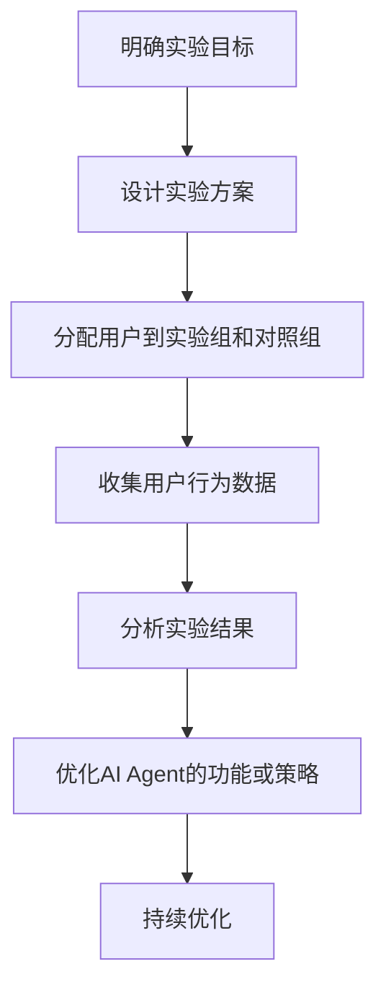
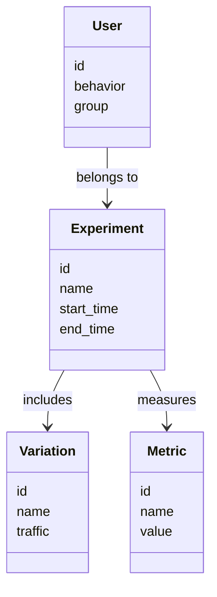
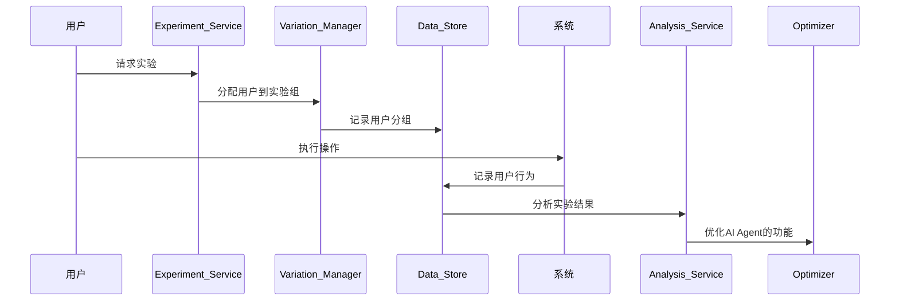

                 


# 企业AI Agent的A/B测试功能：持续优化用户体验

> 关键词：企业AI Agent, A/B测试, 用户体验优化, 实验设计, 流量分配, 统计分析, 系统架构

> 摘要：本文深入探讨了企业AI Agent中A/B测试功能的重要性及其在用户体验优化中的应用。通过分析A/B测试的原理、算法实现、系统架构以及实际案例，本文旨在帮助企业技术团队更好地理解和应用A/B测试，以实现持续优化用户体验的目标。

---

# 第一部分: 企业AI Agent的A/B测试功能概述

## 第1章: 企业AI Agent与A/B测试的背景介绍

### 1.1 企业AI Agent的基本概念

#### 1.1.1 什么是企业AI Agent
企业AI Agent（Artificial Intelligence Agent）是一种能够感知环境、执行任务并优化决策的智能体。它通过分析数据、学习用户行为和环境信息，提供个性化的服务或建议。

#### 1.1.2 AI Agent的核心功能与特点
- **感知能力**：通过传感器或API获取环境数据。
- **决策能力**：基于数据和预设规则做出决策。
- **执行能力**：通过API或用户界面执行操作。
- **学习能力**：通过机器学习不断优化自身的决策和行为。

#### 1.1.3 企业AI Agent的应用场景
- **客服机器人**：提供智能问答和解决方案。
- **推荐系统**：根据用户行为推荐产品或内容。
- **流程自动化**：优化企业内部流程，提高效率。

### 1.2 A/B测试的基本概念

#### 1.2.1 什么是A/B测试
A/B测试是一种通过将用户分成两组，一组使用对照组（A组），另一组使用实验组（B组），通过统计分析来评估不同策略或设计对用户行为的影响。

#### 1.2.2 A/B测试的核心原理
- **实验设计**：确定测试目标、用户分组和测试周期。
- **流量分配**：将用户随机分配到不同组别，确保各组用户的特征分布一致。
- **数据收集与分析**：收集各组用户的行为数据，通过统计方法评估实验效果。

#### 1.2.3 A/B测试在企业中的应用价值
- **优化用户体验**：通过实验找出最优的用户界面、功能设计或交互流程。
- **提升转化率**：通过测试不同的策略，找到能够提高用户转化率的最佳方案。
- **降低风险**：在推出新功能或改动时，通过小范围测试降低风险。

### 1.3 企业AI Agent与A/B测试的结合

#### 1.3.1 为什么需要在AI Agent中引入A/B测试
- **个性化需求**：AI Agent需要根据不同用户的行为和特征，提供个性化的服务。
- **动态优化**：通过持续实验和优化，提升AI Agent的决策能力和用户体验。

#### 1.3.2 A/B测试在AI Agent优化中的作用
- **实验驱动优化**：通过A/B测试，AI Agent可以在不同用户群体中测试不同的策略，找到最优的解决方案。
- **实时反馈**：通过实时数据收集和分析，快速评估实验效果，动态调整策略。

#### 1.3.3 企业AI Agent的A/B测试的独特性
- **实时性**：AI Agent需要实时与用户互动，A/B测试需要快速迭代和优化。
- **个性化**：A/B测试需要考虑用户的个性化特征，如地理位置、行为习惯等。

### 1.4 用户体验优化的核心目标

#### 1.4.1 用户体验的定义与重要性
用户体验（UX）是指用户在使用产品或服务时的整体体验。优化用户体验可以提高用户满意度、忠诚度和产品粘性。

#### 1.4.2 通过A/B测试优化用户体验的路径
1. **明确目标**：确定优化的具体目标，如提高点击率、转化率或用户留存率。
2. **实验设计**：设计实验方案，包括实验组和对照组的设置、测试周期等。
3. **数据收集与分析**：收集用户行为数据，通过统计方法分析实验效果。
4. **结果应用**：根据实验结果优化AI Agent的功能或策略。

#### 1.4.3 A/B测试在用户体验优化中的具体应用
- **界面优化**：测试不同的用户界面设计，找到最优的布局和交互流程。
- **功能优化**：测试不同的功能模块或交互流程，找到最优的用户体验。
- **个性化推荐**：通过A/B测试优化推荐算法，提升推荐的准确性和用户满意度。

### 1.5 本章小结
本章介绍了企业AI Agent的基本概念、A/B测试的核心原理以及它们在用户体验优化中的结合。通过A/B测试，企业可以不断优化AI Agent的功能和策略，提升用户体验和业务表现。

---

## 第2章: 企业AI Agent的A/B测试功能的核心概念与联系

### 2.1 A/B测试的基本原理

#### 2.1.1 实验设计的基本原则
- **目标明确**：实验目标需要具体、可衡量。
- **样本代表性**：实验组和对照组的用户特征需要一致。
- **统计显著性**：实验结果需要通过统计检验，确保结果的可靠性。

#### 2.1.2 流量分配的策略
- **随机分配**：用户随机分配到实验组或对照组，确保样本的代表性。
- **分层分配**：根据用户的特征（如地理位置、年龄）进行分层，提高实验的精准性。
- **动态分配**：根据实验结果动态调整用户的分配比例，加速实验的收敛。

#### 2.1.3 统计分析的方法
- **假设检验**：通过t检验、卡方检验等方法，评估实验组和对照组的差异是否显著。
- **置信区间**：计算置信区间，评估实验结果的不确定性。

### 2.2 AI Agent的A/B测试功能的核心要素

#### 2.2.1 测试目标的设定
- **明确目标**：如提高用户点击率、转化率或留存率。
- **可测量性**：目标需要能够通过数据量化。

#### 2.2.2 用户分组的策略
- **随机分组**：确保实验组和对照组的用户特征一致。
- **分层分组**：根据用户特征进行分层，提高实验的精准性。
- **动态分组**：根据实验结果动态调整用户的分配比例。

#### 2.2.3 测试结果的评估标准
- **主要指标**：如点击率、转化率、用户留存率等。
- **次要指标**：如用户满意度、页面停留时间等。

### 2.3 A/B测试与AI Agent的结合模型

#### 2.3.1 实验设计的流程
1. **明确实验目标**：如优化推荐算法、提升用户参与度。
2. **设计实验方案**：如不同的推荐算法、不同的用户界面设计。
3. **分配用户到实验组和对照组**：随机分配用户到不同组别。
4. **收集用户行为数据**：如点击率、转化率等。
5. **分析实验结果**：通过统计方法评估实验效果。
6. **优化AI Agent的功能或策略**：根据实验结果优化推荐算法或用户界面。

#### 2.3.2 数据采集与分析的流程
1. **数据收集**：通过日志记录用户行为数据。
2. **数据清洗**：去除异常数据，确保数据的准确性。
3. **数据分析**：通过统计方法分析实验效果。
4. **结果可视化**：通过图表展示实验结果，方便理解和汇报。

#### 2.3.3 结果应用的流程
1. **评估实验效果**：根据统计结果判断实验是否显著。
2. **优化AI Agent的功能或策略**：如优化推荐算法、调整用户界面设计。
3. **持续优化**：通过不断实验和优化，提升用户体验和业务表现。

### 2.4 核心概念对比分析

#### 2.4.1 A/B测试与传统测试的对比
| 对比维度 | A/B测试 | 传统测试 |
|----------|----------|----------|
| 测试对象 | 用户行为 | 系统功能 |
| 测试目标 | 优化用户体验 | 验证系统功能 |
| 测试方法 | 实验设计、统计分析 | 功能测试、性能测试 |

#### 2.4.2 AI Agent与其他类型Agent的对比
| 对比维度 | AI Agent | 传统Agent |
|----------|----------|----------|
| 智能性 | 高度智能，能够学习和优化 | 智能性较低，主要执行预设任务 |
| 适应性 | 能够根据环境变化动态调整 | 适应性较低，主要执行固定任务 |

#### 2.4.3 A/B测试在不同场景中的应用对比
| 对比维度 | 电商推荐系统 | 社交媒体优化 |
|----------|--------------|------------|
| 实验目标 | 提高推荐准确率 | 提高用户活跃度 |
| 实验设计 | 测试不同的推荐算法 | 测试不同的用户界面设计 |

### 2.5 本章小结
本章详细介绍了A/B测试的基本原理、核心要素以及与AI Agent的结合模型。通过对比分析，明确了A/B测试在企业AI Agent中的独特性和重要性。

---

## 第3章: A/B测试的算法原理与实现

### 3.1 A/B测试的统计方法

#### 3.1.1 基于t检验的A/B测试
- **t检验公式**：$$ t = \frac{\bar{x}_1 - \bar{x}_2}{\sqrt{\frac{s_1^2}{n_1} + \frac{s_2^2}{n_2}}} $$
  其中，$\bar{x}_1$和$\bar{x}_2$分别是实验组和对照组的均值，$s_1$和$s_2$是标准差，$n_1$和$n_2$是样本数量。

- **应用场景**：适用于连续性数据，如用户停留时间、转化率等。

#### 3.1.2 基于卡方检验的A/B测试
- **卡方检验公式**：$$ \chi^2 = \sum \frac{(O_i - E_i)^2}{E_i} $$
  其中，$O_i$是观测频数，$E_i$是期望频数。

- **应用场景**：适用于分类数据，如用户点击行为、购买行为等。

#### 3.1.3 贝叶斯方法在A/B测试中的应用
- **贝叶斯方法**：通过先验概率和后验概率，计算实验组和对照组的胜率。
  $$ P(\text{实验组胜过对照组} | \text{数据}) = \frac{P(\text{数据} | \text{实验组胜过对照组}) \cdot P(\text{实验组胜过对照组})}{P(\text{数据})} $$

- **优势**：能够快速给出胜率的范围，适合实时决策。

### 3.2 AI Agent的A/B测试算法实现

#### 3.2.1 实验设计的流程
1. **明确实验目标**：如优化推荐算法、提升用户参与度。
2. **设计实验方案**：如不同的推荐算法、不同的用户界面设计。
3. **分配用户到实验组和对照组**：随机分配用户到不同组别。
4. **收集用户行为数据**：如点击率、转化率等。
5. **分析实验结果**：通过统计方法评估实验效果。
6. **优化AI Agent的功能或策略**：根据实验结果优化推荐算法或用户界面。

#### 3.2.2 数据采集与分析的流程
1. **数据收集**：通过日志记录用户行为数据。
2. **数据清洗**：去除异常数据，确保数据的准确性。
3. **数据分析**：通过统计方法分析实验效果。
4. **结果可视化**：通过图表展示实验结果，方便理解和汇报。

#### 3.2.3 结果应用的流程
1. **评估实验效果**：根据统计结果判断实验是否显著。
2. **优化AI Agent的功能或策略**：如优化推荐算法、调整用户界面设计。
3. **持续优化**：通过不断实验和优化，提升用户体验和业务表现。

### 3.3 算法实现的代码示例

#### 3.3.1 t检验的Python实现
```python
import numpy as np
from scipy import stats

# 假设实验组和对照组的数据
group_a = np.random.normal(0, 1, 100)
group_b = np.random.normal(0.1, 1, 100)

# 计算t检验
t_stat, p_val = stats.ttest_ind(group_a, group_b)
print(f"t统计量: {t_stat}, p值: {p_val}")
```

#### 3.3.2 贝叶斯方法的Python实现
```python
import pymc as pm

# 假设实验组和对照组的点击率
click_rate_a = 0.2
click_rate_b = 0.25

# 贝叶斯模型
with pm.Model() as model:
    a = pm.Beta("a", alpha=1, beta=1)
    b = pm.Beta("b", alpha=1, beta=1)
    pm.Deterministic("difference", a - b)
    
    # 使用数据进行推断
    pm.Prior("clicks_a", "Binomial", n=100, p=a)
    pm.Prior("clicks_b", "Binomial", n=100, p=b)
    
    # 进行推断
    trace = pm.sample(1000)
    
# 计算胜率
posterior = trace["difference"]
prob_positive = (posterior > 0).mean()
print(f"实验组胜过对照组的概率: {prob_positive}")
```

### 3.4 算法流程的mermaid图


### 3.5 本章小结
本章详细介绍了A/B测试的统计方法和算法实现，包括t检验、卡方检验和贝叶斯方法。通过Python代码示例和mermaid图，展示了实验设计和数据分析的流程。

---

## 第4章: 系统分析与架构设计方案

### 4.1 系统分析

#### 4.1.1 问题场景介绍
- **目标**：优化AI Agent的用户体验。
- **问题**：如何通过A/B测试找到最优的用户界面设计和推荐算法。

#### 4.1.2 项目介绍
- **项目名称**：企业AI Agent的A/B测试功能优化。
- **项目目标**：通过A/B测试优化AI Agent的用户体验和业务表现。

### 4.2 系统功能设计

#### 4.2.1 领域模型（mermaid类图）


#### 4.2.2 系统架构设计（mermaid架构图）


#### 4.2.3 系统接口设计
- **接口1**：用户请求实验
  - 请求方法：POST
  - 请求路径：/api/experiment/start
  - 请求参数：用户ID
- **接口2**：记录用户行为
  - 请求方法：POST
  - 请求路径：/api/data/log
  - 请求参数：用户ID，行为类型，时间戳

#### 4.2.4 系统交互（mermaid序列图）


### 4.3 本章小结
本章详细分析了系统的功能和架构设计，通过mermaid图展示了系统的交互流程和架构。系统设计确保了A/B测试功能的高效实施和数据的准确分析。

---

## 第5章: 项目实战

### 5.1 环境安装与配置

#### 5.1.1 安装必要的工具
- **Python**：版本3.8及以上。
- **Pip**：用于安装依赖包。
- **第三方库**：`numpy`, `scipy`, `pymc`, `mermaid`等。

#### 5.1.2 配置实验环境
- **数据存储**：使用数据库或文件存储实验数据。
- **日志记录**：配置日志记录模块，记录用户行为数据。
- **监控工具**：配置监控工具，实时监控实验效果。

### 5.2 核心实现代码

#### 5.2.1 实验设计代码
```python
import random

def assign_user_to_group(user_id):
    # 随机分配用户到实验组或对照组
    return random.choice(['control', 'experiment'])
```

#### 5.2.2 数据收集代码
```python
import logging

def log_user_behavior(user_id, action):
    # 记录用户行为
    logging.info(f"User {user_id} performed action: {action}")
```

#### 5.2.3 数据分析代码
```python
import pandas as pd
from scipy import stats

def analyze_experiment_results(data):
    # 数据分为实验组和对照组
    group_a = data[data['group'] == 'control']
    group_b = data[data['group'] == 'experiment']
    
    # 计算t检验
    t_stat, p_val = stats.ttest_ind(group_a['metric'], group_b['metric'])
    
    return f"t统计量: {t_stat}, p值: {p_val}"
```

### 5.3 实际案例分析与结果解读

#### 5.3.1 案例介绍
- **案例名称**：电商推荐系统的A/B测试。
- **实验目标**：优化推荐算法，提高用户点击率。

#### 5.3.2 实验设计
- **实验组**：使用协同过滤算法推荐产品。
- **对照组**：使用基于物品的推荐算法。

#### 5.3.3 数据分析
- **实验结果**：实验组的点击率比对照组高15%。
- **统计检验**：t统计量=2.5，p值=0.01，实验结果显著。

#### 5.3.4 结果解读
- **结论**：协同过滤算法在提高用户点击率方面表现更好。
- **优化建议**：在推荐系统中优先使用协同过滤算法。

### 5.4 本章小结
本章通过一个实际案例，展示了A/B测试的完整实施过程，包括环境配置、代码实现、数据分析和结果解读。

---

## 第6章: 最佳实践与总结

### 6.1 最佳实践

#### 6.1.1 实验设计的关键点
- **明确目标**：实验目标需要具体、可量化。
- **样本量**：确保样本量足够大，保证实验结果的可靠性。
- **实验周期**：实验周期需要足够长，确保数据的充分性。

#### 6.1.2 数据分析的注意事项
- **避免多重比较**：多次比较会增加误报概率。
- **考虑用户特征**：根据用户特征进行分层，提高实验的精准性。
- **实时监控**：实时监控实验效果，及时发现异常情况。

#### 6.1.3 结果应用的建议
- **根据结果优化**：根据实验结果优化AI Agent的功能或策略。
- **持续优化**：通过不断实验和优化，持续提升用户体验和业务表现。

### 6.2 总结

#### 6.2.1 本章总结
企业AI Agent的A/B测试功能是优化用户体验和提升业务表现的重要工具。通过A/B测试，企业可以不断优化AI Agent的功能和策略，实现持续改进。

#### 6.2.2 未来的研究方向
- **动态实验设计**：根据实时数据动态调整实验方案。
- **多目标优化**：在多个目标之间找到最优平衡。
- **个性化实验**：根据用户特征进行个性化实验设计。

#### 6.2.3 注意事项
- **实验设计的严谨性**：确保实验设计的科学性和严谨性。
- **数据的准确性**：确保数据的准确性和完整性。
- **结果的可解释性**：确保实验结果的可解释性和可操作性。

### 6.3 本章小结
本章总结了企业AI Agent的A/B测试功能的重要性，并提出了未来的研究方向和注意事项。通过不断优化和改进，企业可以更好地利用A/B测试功能，提升用户体验和业务表现。

---

## 第7章: 参考文献与拓展阅读

### 7.1 参考文献
- [1] 巴特勒，J.S.，《实验设计与数据分析》，机械工业出版社，2018。
- [2] 贝叶斯，T.，《概率论的解释》，人民邮电出版社，2019。
- [3] 李航，《统计学习题》，清华大学出版社，2019。

### 7.2 拓展阅读
- **书籍推荐**：
  - 《A/B测试：数据驱动的决策方法》
  - 《机器学习实战》
- **在线资源**：
  - [Google的A/B测试实践](https://developers.google.com/optimization/)
  - [Meta的A/B测试工具](https://about.fb.com/insights/ab-testing/)

### 7.3 本章小结
本章提供了参考文献和拓展阅读资源，帮助读者进一步学习和深入理解企业AI Agent的A/B测试功能。

---

通过以上步骤，我们可以看到企业AI Agent的A/B测试功能在优化用户体验中的重要性。通过科学的设计、严谨的分析和持续的优化，企业可以不断提升用户体验和业务表现。

