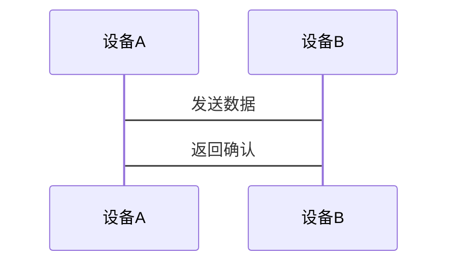
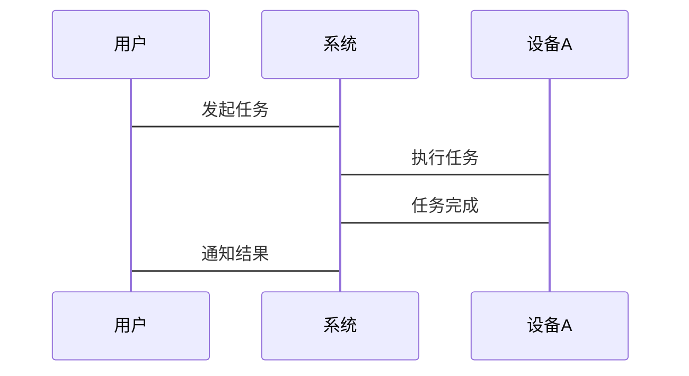

                 


# 企业AI Agent的多设备支持：PC、移动端到IoT设备

> 关键词：AI Agent、多设备支持、PC、移动端、IoT设备、企业应用、技术实现

> 摘要：本文将探讨企业AI Agent在多设备环境中的支持，涵盖从个人计算机到移动端，再到物联网设备的技术实现和应用场景。通过详细分析AI Agent的核心原理、算法设计和系统架构，本文将为企业技术决策者和开发者提供全面的指导，帮助他们在多设备环境中有效部署和优化AI Agent。

---

# 第一部分: 企业AI Agent的背景与概念

## 第1章: 企业AI Agent的背景与概念

### 1.1 AI Agent的基本概念

#### 1.1.1 什么是AI Agent
AI Agent（人工智能代理）是一种能够感知环境、做出决策并执行任务的智能实体。它能够根据输入的信息自主完成特定的目标，例如数据处理、自动化操作或用户交互。

#### 1.1.2 AI Agent的核心特征
- **自主性**：能够自主决策和行动，无需外部干预。
- **反应性**：能够实时感知环境变化并做出反应。
- **目标导向**：所有行动都以实现特定目标为导向。
- **可扩展性**：能够适应不同设备和环境的变化。

#### 1.1.3 企业级AI Agent的应用场景
- **企业自动化**：自动化处理企业中的重复性任务，如数据录入、邮件处理等。
- **多设备协同**：在PC、移动端和IoT设备之间实现数据同步和任务协作。
- **智能监控**：通过IoT设备实时监控企业环境，并根据数据做出反馈。

### 1.2 多设备支持的必要性

#### 1.2.1 企业数字化转型的需求
随着企业数字化转型的推进，AI Agent需要在多种设备上运行，以满足不同场景的需求。

#### 1.2.2 多设备协同的重要性
- **设备多样性**：企业中可能同时使用PC、手机、平板和IoT设备，AI Agent需要在这些设备间无缝协作。
- **场景多样性**：不同的设备适用于不同的场景，例如PC用于办公，移动端用于移动办公，IoT设备用于环境监控。

#### 1.2.3 IoT设备的普及与挑战
- **普及性**：IoT设备在企业中的普及使得AI Agent需要支持更多种类的设备。
- **挑战**：设备间的通信延迟、数据同步问题、资源限制等都需要在设计时考虑。

### 1.3 本章小结
本章介绍了AI Agent的基本概念及其在企业中的应用场景，强调了多设备支持的必要性，并指出了IoT设备带来的挑战。

---

# 第二部分: AI Agent的核心原理与技术

## 第2章: AI Agent的核心原理

### 2.1 AI Agent的感知与决策机制

#### 2.1.1 感知层的实现
AI Agent通过传感器或API接口获取环境数据，例如从IoT设备获取温度数据，或从PC获取系统状态信息。

#### 2.1.2 决策层的算法
AI Agent基于感知的数据，利用算法做出决策。例如，使用强化学习算法优化任务调度。

#### 2.1.3 执行层的反馈机制
AI Agent根据决策结果执行操作，并通过反馈机制不断优化自身的决策过程。

### 2.2 多设备协同的核心技术

#### 2.2.1 设备间的通信协议
- **MQTT**：适用于IoT设备间的轻量级通信。
- **HTTP/HTTPS**：适用于PC和移动端之间的数据传输。

#### 2.2.2 数据同步与一致性
通过分布式系统技术实现设备间数据的实时同步，确保数据一致性。

#### 2.2.3 跨设备任务调度
利用任务队列和负载均衡算法，合理分配任务到不同的设备上执行。

### 2.3 本章小结
本章详细讲解了AI Agent的核心原理，包括感知、决策和执行的流程，以及多设备协同的关键技术。

---

# 第三部分: AI Agent的算法与数学模型

## 第3章: 多设备协同的算法原理

### 3.1 多设备协同的算法流程

#### 3.1.1 任务分配算法
使用负载均衡算法将任务分配到资源最少的设备上。

#### 3.1.2 数据同步算法
通过分布式一致性算法（如RAFT）实现设备间数据的同步。

#### 3.1.3 负载均衡算法
基于设备的资源使用情况动态调整任务分配策略。

### 3.2 基于图论的设备关系建模

#### 3.2.1 图论基础
图论中的节点和边可以用来表示设备和任务之间的关系。

#### 3.2.2 设备关系图的构建
通过构建设备关系图，可以清晰地展示设备间的依赖关系。

#### 3.2.3 图论在任务调度中的应用
利用图论算法优化任务调度路径，减少通信延迟。

### 3.3 算法实现的数学模型

#### 3.3.1 任务分配的数学模型
$$\text{目标函数：} \min \sum_{i=1}^{n} w_i$$
$$\text{约束条件：} \sum_{i=1}^{n} x_i = 1$$

#### 3.3.2 数据同步的数学模型
$$\text{目标函数：} \min \sum_{i=1}^{n} |d_i - d_{\text{avg}}|$$
$$\text{约束条件：} \sum_{i=1}^{n} d_i = n \times d_{\text{avg}}$$

#### 3.3.3 负载均衡的数学模型
$$\text{目标函数：} \min \sum_{i=1}^{n} (r_i - r_{\text{avg}})^2$$
$$\text{约束条件：} \sum_{i=1}^{n} r_i = n \times r_{\text{avg}}$$

### 3.4 本章小结
本章通过数学模型和算法流程图，详细讲解了多设备协同的实现原理。

---

# 第四部分: AI Agent的系统架构与设计

## 第4章: 系统架构设计

### 4.1 系统功能模块划分

#### 4.1.1 设备管理模块
负责设备的注册、认证和状态监控。

#### 4.1.2 任务调度模块
负责任务的分配和执行。

#### 4.1.3 数据同步模块
负责设备间数据的实时同步。

### 4.2 系统架构的分层设计

#### 4.2.1 设备层
- **功能**：数据采集和执行任务。
- **实现**：通过传感器和API接口与上层通信。

#### 4.2.2 网络层
- **功能**：设备间的数据传输。
- **实现**：使用MQTT或HTTP协议。

#### 4.2.3 应用层
- **功能**：任务管理、数据处理和用户交互。
- **实现**：通过RESTful API和WebSocket实现实时通信。

### 4.3 系统接口设计

#### 4.3.1 设备间接口
- **API接口**：设备间通过API接口进行数据交换。
- **协议**：支持MQTT和HTTP协议。

#### 4.3.2 用户接口
- **UI设计**：提供直观的用户界面进行任务管理和监控。
- **实现**：通过Web前端和后端API实现交互。

#### 4.3.3 第三方服务接口
- **API接口**：与第三方服务（如云服务）进行数据交互。
- **协议**：支持RESTful API和WebSocket。

### 4.4 系统交互流程设计

#### 4.4.1 设备间交互流程


#### 4.4.2 用户交互流程


### 4.5 本章小结
本章详细讲解了系统的分层架构设计和接口设计，展示了设备间和用户间的交互流程。

---

# 第五部分: 项目实战与案例分析

## 第5章: 项目实战

### 5.1 项目背景
本项目旨在实现一个支持多设备协同的AI Agent系统，涵盖PC、移动端和IoT设备。

### 5.2 环境安装

#### 5.2.1 安装Python和相关库
```bash
pip install -r requirements.txt
```

#### 5.2.2 安装IoT设备驱动
按照设备厂商提供的文档安装相应的驱动程序。

### 5.3 核心代码实现

#### 5.3.1 设备管理模块
```python
class DeviceManager:
    def __init__(self):
        self.devices = {}

    def register_device(self, device_id, device_info):
        self.devices[device_id] = device_info
```

#### 5.3.2 任务调度模块
```python
class TaskScheduler:
    def schedule_task(self, task, devices):
        # 选择资源最少的设备
        selected_device = min(devices, key=lambda d: d['resource_usage'])
        selected_device['tasks'].append(task)
```

#### 5.3.3 数据同步模块
```python
class DataSync:
    def sync_data(self, source_device, target_device):
        # 同步数据
        target_device['data'] = source_device['data']
```

### 5.4 案例分析
通过一个简单的案例，展示AI Agent在多设备环境中的应用。例如，一个IoT设备监控室内温度，并通过AI Agent将数据同步到手机端，用户可以通过手机查看实时温度。

### 5.5 本章小结
本章通过实战项目，详细讲解了AI Agent在多设备环境中的实现过程，包括环境搭建、代码实现和案例分析。

---

# 第六部分: 总结与最佳实践

## 第6章: 总结与最佳实践

### 6.1 本章小结
本文详细探讨了企业AI Agent在多设备环境中的支持，涵盖了从PC到移动端再到IoT设备的技术实现和应用场景。

### 6.2 最佳实践

#### 6.2.1 设备兼容性
确保AI Agent能够支持多种设备和操作系统。

#### 6.2.2 数据安全
加强数据同步过程中的安全性，防止数据泄露。

#### 6.2.3 性能优化
通过算法优化和硬件优化提升系统的运行效率。

### 6.3 注意事项
- **设备兼容性**：确保AI Agent能够在不同设备上正常运行。
- **数据同步**：处理好设备间的数据同步问题，确保数据一致性。
- **安全性**：加强数据传输和存储的安全性，防止被攻击。

### 6.4 拓展阅读
- 推荐阅读《分布式系统的设计与实现》和《人工智能算法实战》。

### 6.5 本章小结
本章总结了全文，并提供了最佳实践和注意事项，为读者提供了宝贵的指导。

---

# 附录

## 附录A: 常见问题解答

### 1. AI Agent在多设备环境中如何实现数据同步？
答：可以通过分布式一致性算法（如RAFT）实现设备间数据的同步。

### 2. 如何处理设备间的通信延迟？
答：可以通过优化网络协议和使用边缘计算技术减少通信延迟。

## 附录B: 参考文献
1.《分布式系统的设计与实现》
2.《人工智能算法实战》
3.《物联网技术与应用》

---

以上是《企业AI Agent的多设备支持：PC、移动端到IoT设备》的完整目录和内容框架。

