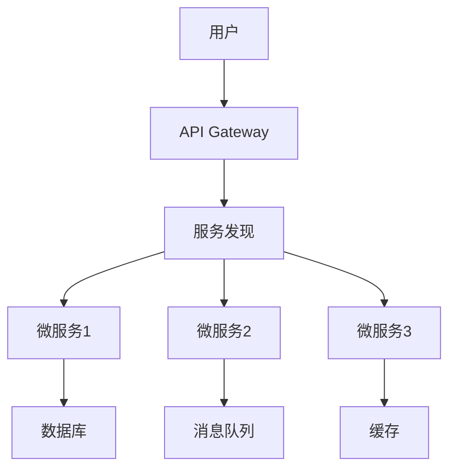
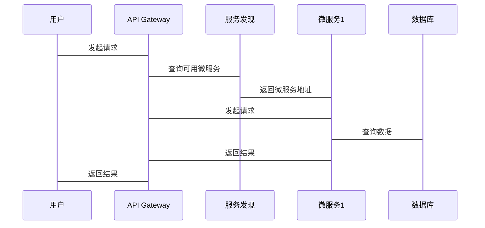

                 


# 企业AI Agent的微服务治理与监控策略

> 关键词：企业AI Agent、微服务治理、监控策略、服务架构、AI技术

> 摘要：随着企业智能化转型的加速，AI Agent在企业中的应用越来越广泛。本文将深入探讨企业AI Agent的微服务治理与监控策略，分析其核心概念、实现原理、治理方法和监控技术，为企业在AI Agent的微服务化过程中提供理论支持和实践指导。

---

## 第1章: 企业AI Agent与微服务概述

### 1.1 AI Agent的基本概念
#### 1.1.1 AI Agent的定义与特点
- AI Agent是一种能够感知环境、自主决策并执行任务的智能体。
- 具有主动性、反应性、社会性、学习性和适应性等特点。
- 通过NLP、知识图谱、强化学习等技术实现智能交互与决策。

#### 1.1.2 微服务架构的定义与特点
- 微服务架构是一种将应用程序分解为多个小型、独立服务的架构风格。
- 每个服务可以独立开发、部署和扩展。
- 服务间通过API进行通信，具有松耦合、高扩展性和灵活性。

#### 1.1.3 企业AI Agent与微服务的关系
- AI Agent可以通过微服务化的方式实现模块化设计。
- 微服务架构为AI Agent的扩展、部署和维护提供了便利。
- 通过微服务化，AI Agent可以更好地适应企业复杂多变的业务需求。

---

### 1.2 企业AI Agent的应用背景
#### 1.2.1 企业智能化转型的驱动力
- 数字化转型需求：企业希望通过智能化技术提升效率和竞争力。
- 业务场景复杂化：企业需要应对多样化的业务场景和用户需求。
- 技术进步：AI和微服务技术的成熟为企业AI Agent的应用提供了基础。

#### 1.2.2 微服务架构在企业中的应用现状
- 微服务架构已成为企业应用设计的主流模式。
- 微服务化可以帮助企业实现快速迭代和灵活部署。
- 微服务架构在企业中的应用还面临服务治理、监控和协作等挑战。

#### 1.2.3 AI Agent在企业中的应用场景
- 智能客服：通过AI Agent实现自动化问题解决和用户支持。
- 供应链优化：AI Agent可以协助企业优化库存管理和物流调度。
- 智能决策支持：AI Agent可以为企业提供数据驱动的决策支持。

---

### 1.3 本章小结
本章主要介绍了企业AI Agent和微服务架构的基本概念，探讨了两者之间的关系，并分析了AI Agent在企业中的应用背景和应用场景。通过这些内容，读者可以初步了解企业AI Agent的微服务化设计的重要性。

---

## 第2章: 微服务架构的核心原理

### 2.1 微服务架构的设计原则
#### 2.1.1 服务独立性与可扩展性
- 每个微服务独立运行，具有明确的边界和职责。
- 通过容器化技术实现服务的快速扩展和弹性伸缩。

#### 2.1.2 服务自治与边界划分
- 服务自治：每个微服务可以独立开发、部署和维护。
- 边界划分：通过领域建模和业务流程分析确定服务边界。

#### 2.1.3 服务通信与契约设计
- 服务间通信：通过API Gateway或服务发现实现服务间的通信。
- 契约设计：明确服务接口、协议和数据格式，确保服务间协作顺畅。

---

### 2.2 微服务架构的关键技术
#### 2.2.1 服务发现与负载均衡
- 服务发现：通过注册中心实现服务的自动注册和发现。
- 负载均衡：通过负载均衡算法实现流量的合理分配，提高系统可用性。

#### 2.2.2 服务容错与熔断机制
- 容错机制：通过断路器模式实现服务间的容错和熔断，防止故障扩散。
- 熔断机制：当服务出现故障时，熔断器会暂时阻止请求，避免雪崩效应。

#### 2.2.3 服务日志与监控
- 日志管理：通过集中化日志管理平台实现服务运行状态的监控和问题排查。
- 监控体系：通过指标监控、日志监控和事务监控实现系统的全面监控。

---

### 2.3 微服务架构的优缺点分析
#### 2.3.1 微服务的优点
- 高度灵活：微服务架构可以根据业务需求快速调整。
- 易扩展：每个微服务可以独立扩展，满足业务增长需求。
- 独立开发：不同团队可以独立开发和维护不同的微服务。

#### 2.3.2 微服务的挑战
- 复杂性：微服务架构的引入增加了系统的复杂性。
- 服务通信：服务间的通信需要设计合理的接口和协议。
- 监控与治理：需要建立完善的监控和治理机制，确保系统的稳定性和一致性。

#### 2.3.3 微服务的适用场景
- 适合复杂业务场景：微服务架构可以更好地应对复杂的业务需求。
- 适合快速迭代：微服务架构支持快速开发和部署。
- 适合分布式系统：微服务架构适合构建分布式系统。

---

### 2.4 本章小结
本章主要探讨了微服务架构的核心原理，包括设计原则、关键技术以及优缺点分析。通过这些内容，读者可以深入了解微服务架构的特点和实现方式，为后续章节的讨论奠定基础。

---

## 第3章: AI Agent的实现原理

### 3.1 AI Agent的核心技术
#### 3.1.1 自然语言处理（NLP）
- NLP技术用于实现AI Agent的自然语言交互能力。
- 通过词袋模型、TF-IDF和词嵌入技术（如Word2Vec、GloVe）实现文本表示和语义理解。

#### 3.1.2 知识表示与推理
- 知识图谱构建：通过知识抽取、实体识别和关系抽取构建知识图谱。
- 推理机制：通过逻辑推理、概率推理和符号推理实现知识推理。

#### 3.1.3 强化学习与决策
- 强化学习：通过Q-learning、Deep Q-Network等算法实现决策优化。
- 决策树：通过构建决策树实现多场景下的决策支持。

---

### 3.2 微服务架构下的AI Agent实现
#### 3.2.1 AI Agent的微服务化设计
- 模块化设计：将AI Agent的功能模块化，例如NLP模块、知识库模块、推理模块等。
- 微服务化部署：将每个功能模块部署为独立的微服务，通过API进行通信。

#### 3.2.2 微服务间的通信与协作
- 服务发现：通过注册中心实现AI Agent各微服务的自动发现和注册。
- 服务通信：通过RESTful API或RPC协议实现微服务间的通信。
- 事件驱动：通过消息队列（如Kafka、RabbitMQ）实现事件驱动的协作。

#### 3.2.3 AI Agent的事件驱动机制
- 事件生成：AI Agent根据用户输入生成事件。
- 事件路由：通过事件总线将事件路由到相应的处理服务。
- 事件处理：处理服务根据事件内容执行相应的操作并返回结果。

---

### 3.3 本章小结
本章主要探讨了AI Agent的核心技术及其在微服务架构下的实现方式。通过模块化设计和事件驱动机制，AI Agent可以在微服务架构中高效协作，实现智能化的业务处理。

---

## 第4章: 微服务架构下的AI Agent治理策略

### 4.1 微服务治理的核心原则
#### 4.1.1 服务治理的目标与范围
- 目标：确保微服务架构的稳定性和一致性。
- 范围：涵盖服务设计、部署、运行和监控的全生命周期。

#### 4.1.2 服务治理的组织与角色
- 治理组织：设立治理团队，负责制定治理策略和规范。
- 角色分工：明确开发团队、运维团队和治理团队的职责。

#### 4.1.3 服务治理的流程与方法
- 治理流程：包括需求分析、设计审查、部署验证和监控优化。
- 治理方法：采用自动化工具和人工审查相结合的方式。

---

### 4.2 微服务治理的具体策略
#### 4.2.1 服务注册与发现
- 服务注册：微服务启动时向注册中心注册自身信息。
- 服务发现：通过注册中心获取可用服务的地址和状态。

#### 4.2.2 服务版本控制
- 版本管理：通过语义化版本控制（如1.0.0）管理服务的版本。
- 版本兼容性：确保新旧版本之间的接口兼容性。

#### 4.2.3 服务依赖管理
- 依赖注入：通过依赖注入容器管理服务间的依赖关系。
- 依赖版本控制：确保服务依赖的版本一致性。

---

### 4.3 本章小结
本章主要探讨了微服务架构下AI Agent的治理策略，包括治理原则、具体策略和实施方法。通过有效的治理策略，可以确保AI Agent在微服务架构中的稳定运行和高效协作。

---

## 第5章: 微服务架构下的AI Agent监控策略

### 5.1 微服务监控的核心体系
#### 5.1.1 监控目标与范围
- 监控目标：确保微服务架构的可用性、性能和安全性。
- 监控范围：涵盖服务运行状态、用户行为和系统资源。

#### 5.1.2 监控指标与维度
- 服务指标：包括响应时间、错误率和吞吐量。
- 用户指标：包括用户活跃度、用户满意度和用户留存率。
- 系统指标：包括CPU、内存和磁盘使用情况。

---

### 5.2 微服务监控的具体策略
#### 5.2.1 日志管理与分析
- 日志收集：通过日志收集工具（如ELK、Fluentd）收集服务日志。
- 日志分析：通过日志分析工具（如Kibana、Graylog）进行日志查询和分析。

#### 5.2.2 性能调优与优化
- 性能监控：通过监控工具（如Prometheus、Grafana）监控服务性能。
- 性能调优：根据监控数据优化服务性能，例如减少响应时间、提高吞吐量。

#### 5.2.3 异常处理与恢复
- 异常检测：通过异常检测算法（如基于阈值的检测、基于统计的检测）发现服务异常。
- 异常恢复：通过自愈合机制（如自动重启、自动扩缩容）恢复服务正常运行。

---

### 5.3 本章小结
本章主要探讨了微服务架构下AI Agent的监控策略，包括监控体系和具体策略。通过有效的监控策略，可以实时掌握系统运行状态，快速定位和解决问题，确保系统的稳定运行。

---

## 第6章: 系统架构设计

### 6.1 系统功能设计
#### 6.1.1 系统功能模块
- 用户交互模块：负责与用户的交互和请求处理。
- 服务管理模块：负责服务的注册、发现和管理。
- 监控管理模块：负责系统监控和异常处理。

#### 6.1.2 系统功能流程
- 用户请求：用户通过界面或API发起请求。
- 服务调用：系统通过服务发现找到相应的服务并发起调用。
- 服务处理：服务处理请求并返回结果。
- 监控记录：监控系统记录请求和响应的详细信息。

---

### 6.2 系统架构设计
#### 6.2.1 系统架构图


#### 6.2.2 系统接口设计
- API Gateway：负责请求路由、认证和速率限制。
- 服务发现：负责服务注册和发现。
- 数据库：负责数据存储和查询。

---

### 6.3 系统交互设计
#### 6.3.1 交互流程
- 用户发起请求，API Gateway接收请求。
- API Gateway通过服务发现找到目标微服务。
- 微服务处理请求并返回结果。
- 监控系统记录整个流程的详细信息。

#### 6.3.2 交互序列图


---

### 6.4 本章小结
本章主要探讨了AI Agent微服务系统的架构设计，包括功能设计、架构图和交互流程。通过合理的设计，可以确保系统的高效运行和稳定扩展。

---

## 第7章: 项目实战

### 7.1 环境配置
#### 7.1.1 开发环境
- 操作系统：Linux/Windows/MacOS
- 开发工具：IntelliJ IDEA/VS Code
- 依赖管理：Maven/Gradle

#### 7.1.2 服务运行环境
- 服务器：Linux（如Ubuntu）
- 容器化平台：Docker
- 服务发现：Nacos
- API Gateway：Spring Cloud Gateway

---

### 7.2 核心代码实现
#### 7.2.1 服务发现与注册
```java
@SpringBootApplication
@EnableDiscoveryClient
public class DiscoveryClientApplication {
    public static void main(String[] args) {
        SpringApplication.run(DiscoveryClientApplication.class, args);
    }
}
```

#### 7.2.2 API Gateway配置
```yaml
spring:
  cloud:
    gateway:
      routes:
        - id: nlp-service
          uri: http://nlp-service
          predicates:
            - Path=/nlp/**
```

#### 7.2.3 微服务通信
```java
@RestController
@RequestMapping("/nlp")
class NlpController {
    @Autowired
    private RestTemplate restTemplate;

    @GetMapping("/analyze")
    public String analyze(@RequestParam String text) {
        return restTemplate.getForString("http://knowledge-base-service/api/analyze?text=" + text);
    }
}
```

---

### 7.3 案例分析与实现解读
#### 7.3.1 案例背景
- 某企业需要构建一个智能客服系统，通过AI Agent实现自动化问题解决。

#### 7.3.2 系统实现
- 前端：用户通过网页或移动端发起请求。
- API Gateway：接收请求并路由到相应的微服务。
- 微服务1：负责自然语言理解。
- 微服务2：负责知识库查询。
- 微服务3：负责结果返回和反馈。

---

### 7.4 项目总结
#### 7.4.1 实践总结
- 微服务化设计提高了系统的灵活性和扩展性。
- 服务发现和API Gateway的引入简化了服务间的通信。
- 监控系统的建设有助于实时掌握系统运行状态。

#### 7.4.2 注意事项
- 服务治理和监控是微服务架构成功的关键。
- 确保服务间的通信安全和高效。
- 定期优化系统架构，确保系统的稳定性和性能。

---

## 第8章: 最佳实践与小结

### 8.1 最佳实践
#### 8.1.1 服务设计
- 明确服务边界，确保服务的独立性和可扩展性。
- 采用模块化设计，避免功能耦合。

#### 8.1.2 服务治理
- 建立完善的服务治理体系，确保服务的稳定性和一致性。
- 定期审查和优化服务设计。

#### 8.1.3 系统监控
- 建立全面的监控体系，实时掌握系统运行状态。
- 定期优化监控策略，确保监控的准确性和及时性。

---

### 8.2 小结与展望
通过本文的探讨，我们深入了解了企业AI Agent的微服务治理与监控策略。从AI Agent的基本概念到微服务架构的核心原理，从治理策略到监控体系，再到系统架构设计和项目实战，我们全面分析了AI Agent微服务化的实现方式和应用价值。

未来，随着AI技术的不断发展和微服务架构的不断完善，企业AI Agent的微服务化将更加智能化和高效化。我们期待更多的企业能够成功应用这一技术，实现智能化转型和业务创新。

---

## 附录

### 附录A: 相关技术与工具
- 微服务框架：Spring Cloud、Docker、Kubernetes
- 服务发现：Nacos、Consul、Eureka
- 监控工具：Prometheus、Grafana、ELK
- API Gateway：Spring Cloud Gateway、Kong、Apigee

### 附录B: 术语解释
- 微服务架构：一种将应用程序分解为多个小型、独立服务的架构风格。
- AI Agent：一种能够感知环境、自主决策并执行任务的智能体。
- 服务治理：通过一系列策略和工具确保微服务架构的稳定性和一致性。

---

# 结束语

企业AI Agent的微服务治理与监控策略是一个复杂而重要的课题。通过本文的探讨，我们希望为读者提供理论支持和实践指导，帮助企业更好地实现AI Agent的微服务化，提升企业的智能化水平和竞争力。

