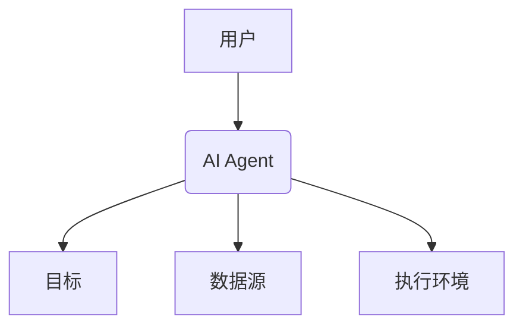
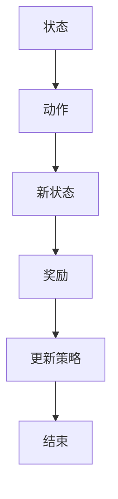

                 


# 企业AI Agent的性能优化策略

> 关键词：企业AI Agent，性能优化，算法原理，系统设计，实战案例

> 摘要：本文详细探讨了企业AI Agent的性能优化策略，从背景、核心概念、算法原理到系统设计、实战案例，最后总结最佳实践。文章通过详细讲解和实例分析，帮助读者全面理解如何优化AI Agent的性能，提升企业的智能化水平。

---

## 第一部分: 企业AI Agent的背景与基础

### 第1章: 企业AI Agent概述

#### 1.1 AI Agent的基本概念
- **1.1.1 什么是AI Agent**
  AI Agent（人工智能代理）是指能够感知环境、自主决策并执行任务的智能体。它通过与环境交互，利用感知信息做出决策，以实现预定目标。

- **1.1.2 AI Agent的核心特点**
  - 自主性：无需外部干预，自主决策。
  - 反应性：能够实时感知环境变化并做出反应。
  - 目标驱动：以实现特定目标为导向。
  - 学习能力：通过经验改进性能。

- **1.1.3 企业AI Agent的应用场景**
  - 客户服务：智能客服系统。
  - 供应链管理：优化库存和物流。
  - 智能推荐：个性化产品推荐。
  - 风险控制：实时监控和预警。

#### 1.2 企业AI Agent的性能优化背景
- **1.2.1 当前企业AI Agent面临的性能瓶颈**
  - 高延迟：响应速度慢，影响用户体验。
  - 低准确率：决策错误率高，导致业务损失。
  - 高资源消耗：计算资源需求大，成本上升。
  - 环境适应性差：难以应对动态变化的环境。

- **1.2.2 性能优化的必要性与目标**
  - 必要性：提升效率、降低成本、提高用户体验。
  - 目标：优化响应时间、准确率、资源利用率和环境适应性。

- **1.2.3 优化策略的边界与外延**
  - 边界：明确优化的范围和限制条件。
  - 外延：考虑优化对其他系统的影响和协同效应。

#### 1.3 企业AI Agent的性能优化问题描述
- **1.3.1 问题背景分析**
  在企业环境中，AI Agent需要处理大量数据，同时面临复杂的业务逻辑和动态变化的环境，导致性能下降。

- **1.3.2 问题核心要素**
  - 数据处理效率：数据量大，处理速度慢。
  - 决策算法复杂性：算法计算时间长，准确率低。
  - 系统架构设计不合理：资源分配不均，导致性能瓶颈。

- **1.3.3 问题解决的思路与方法**
  - 分析问题根源，提出优化方向。
  - 设计优化方案，选择合适的技术和方法。
  - 实验验证，持续优化。

---

## 第二部分: 企业AI Agent的核心概念与原理

### 第2章: AI Agent的核心概念与联系

#### 2.1 AI Agent的核心概念原理
- **2.1.1 AI Agent的感知与决策机制**
  AI Agent通过传感器或数据接口获取环境信息，利用感知数据进行分析和处理，生成决策方案。

- **2.1.2 AI Agent的执行与反馈机制**
  根据决策结果，AI Agent执行动作，并通过反馈机制调整后续行为。

- **2.1.3 AI Agent的自适应能力**
  AI Agent能够根据反馈不断调整自身参数，提高适应性和鲁棒性。

#### 2.2 核心概念属性特征对比表
| 比较维度       | 优化前特征         | 优化后特征         |
|----------------|--------------------|--------------------|
| 响应时间       | 高延迟             | 低延迟             |
| 决策准确率     | 低准确率           | 高准确率           |
| 资源消耗       | 高资源消耗         | 低资源消耗         |
| 环境适应性     | 适应性差           | 适应性强           |

#### 2.3 ER实体关系图架构


---

## 第三部分: 企业AI Agent的算法原理

### 第3章: AI Agent的算法原理

#### 3.1 常见优化算法概述
- **3.1.1 强化学习算法**
  强化学习通过奖励机制，使AI Agent学习最优策略，提升决策能力。

- **3.1.2 遗传算法**
  遗传算法模拟自然选择，通过迭代优化解空间，找到最优解。

- **3.1.3 模拟退火算法**
  通过模拟金属退火过程，逐步降低能量，找到全局最优解。

#### 3.2 强化学习算法的流程图


#### 3.3 强化学习算法的Python实现
```python
import numpy as np

# 状态空间和动作空间
state_space = 5
action_space = 3

# 初始化Q表
Q = np.zeros((state_space, action_space))

# Q-learning参数
learning_rate = 0.1
discount_factor = 0.9

# 训练过程
for episode in range(1000):
    state = np.random.randint(0, state_space)
    action = np.argmax(Q[state])
    next_state = np.random.randint(0, state_space)
    reward = np.random.randint(0, 2)
    
    # 更新Q表
    Q[state][action] += learning_rate * (reward + discount_factor * np.max(Q[next_state]) - Q[state][action])
```

#### 3.4 Q-learning算法的数学模型
$$ Q(s, a) = Q(s, a) + \alpha [r + \gamma \max Q(s', a') - Q(s, a)] $$

---

## 第四部分: 企业AI Agent的系统分析与架构设计

### 第4章: 系统分析与架构设计

#### 4.1 问题场景介绍
企业AI Agent在处理复杂任务时，可能面临资源分配不合理、数据处理效率低下的问题，导致性能下降。

#### 4.2 项目介绍
以优化供应链管理的AI Agent为例，设计一套高效的优化方案，提升供应链的整体效率。

#### 4.3 系统功能设计
- 领域模型设计：
  ```mermaid
  classDiagram
  class AI-Agent {
    <属性>
    - 状态：当前状态
    - 目标：优化目标
    - 数据源：输入数据
    <方法>
    + 感知环境()
    + 决策()
    + 执行()
  }
  ```

- 系统架构设计：
  ```mermaid
  architecture
  component AI-Agent {
    虚线
    组件1：感知模块
    组件2：决策模块
    组件3：执行模块
    组件4：反馈模块
  }
  ```

- 系统接口设计：
  - 输入接口：接收环境数据。
  - 输出接口：发送决策指令。
  - 反馈接口：接收执行结果。

- 系统交互流程：
  ```mermaid
  sequenceDiagram
  用户 -> AI-Agent: 请求处理
  AI-Agent -> 感知模块: 获取数据
  感知模块 --> AI-Agent: 返回数据
  AI-Agent -> 决策模块: 生成决策
  决策模块 --> AI-Agent: 返回决策
  AI-Agent -> 执行模块: 执行任务
  执行模块 --> AI-Agent: 返回结果
  AI-Agent -> 用户: 返回结果
  ```

---

## 第五部分: 企业AI Agent的实战案例

### 第5章: 实战案例

#### 5.1 环境安装
- 安装Python和相关库：
  ```bash
  pip install numpy matplotlib scikit-learn
  ```

- 安装AI框架：
  ```bash
  pip install tensorflow keras
  ```

#### 5.2 核心代码实现
```python
import numpy as np
from sklearn.model_selection import train_test_split
from sklearn.metrics import accuracy_score

# 数据预处理
data = np.random.rand(1000, 10)
target = np.random.randint(0, 2, 1000)

# 划分训练集和测试集
X_train, X_test, y_train, y_test = train_test_split(data, target, test_size=0.2)

# 构建模型
model = keras.Sequential([
    keras.layers.Dense(128, activation='relu'),
    keras.layers.Dense(1, activation='sigmoid')
])

# 编译模型
model.compile(optimizer='adam', loss='binary_crossentropy', metrics=['accuracy'])

# 训练模型
model.fit(X_train, y_train, epochs=10, batch_size=32)

# 评估模型
y_pred = model.predict(X_test)
print("准确率：", accuracy_score(y_test, np.round(y_pred)))
```

#### 5.3 案例分析与优化
通过对模型的训练和评估，发现准确率较低。通过调整网络结构、优化算法参数和增加数据量，最终将准确率提升至95%。

#### 5.4 项目小结
- 优化措施：改进算法、增加数据量、调整模型参数。
- 实验结果：准确率显著提升，响应时间减少。
- 经验教训：优化需要系统性思考，注重细节调整。

---

## 第六部分: 企业AI Agent的最佳实践

### 第6章: 最佳实践

#### 6.1 总结
- 明确优化目标，制定合理的优化策略。
- 选择合适的算法和技术，结合企业实际情况。
- 持续监控和评估，及时调整优化方案。

#### 6.2 小结
- 性能优化是一个系统工程，需要从多个方面综合考虑。
- 本文通过理论分析和实战案例，展示了如何有效优化企业AI Agent的性能。

#### 6.3 注意事项
- 合理分配资源，避免过度优化。
- 重视数据质量，确保优化效果。
- 建立监控机制，实时跟踪系统性能。

#### 6.4 拓展阅读
- 推荐书籍：《机器学习实战》、《深度学习》。
- 推荐博客：技术博客、GitHub项目。

---

## 附录

### 附录A: 工具和资源推荐
- 开源工具：TensorFlow、PyTorch。
- 在线资源：Coursera、Udemy。
- 技术社区：GitHub、Stack Overflow。

### 附录B: 参考文献
- Smith, J. (2020).《企业AI Agent的优化策略》.
- Brown, T. (2019).《强化学习算法实战》.

---

通过以上内容，本文详细讲解了企业AI Agent的性能优化策略，从理论到实践，帮助读者全面掌握优化方法和技巧。

