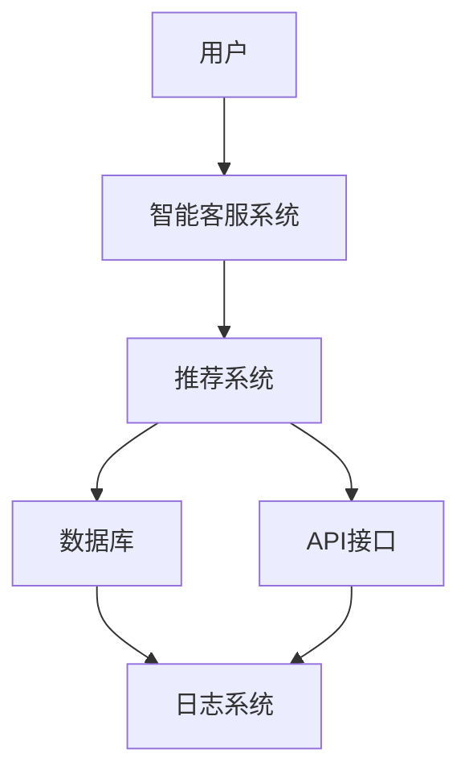
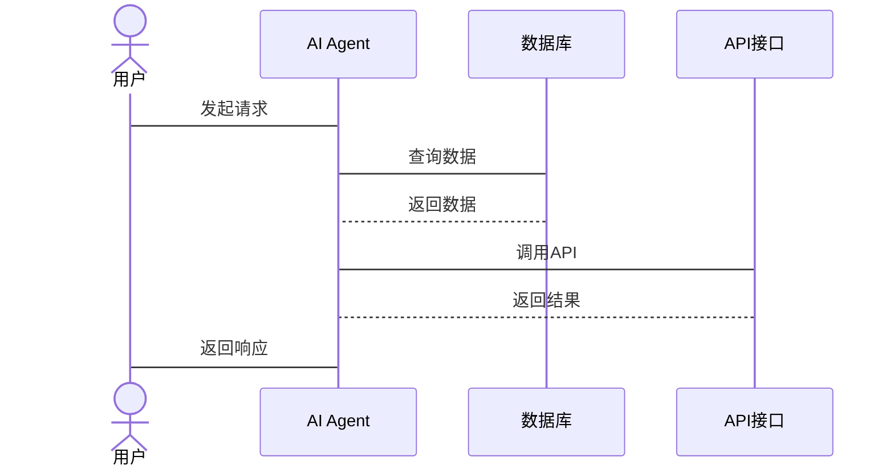

                 


# 《企业AI Agent的自动化测试与质量保证系统》

---

## 关键词：
- 企业AI Agent
- 自动化测试
- 质量保证
- 强化学习
- 系统架构

---

## 摘要：
本文系统性地探讨了企业AI Agent的自动化测试与质量保证系统的核心原理、实现方法和应用场景。从AI Agent的基本概念到其在企业中的具体应用，从自动化测试的原理到质量保证的体系构建，本文逐一展开分析。通过结合强化学习、监督学习等算法，详细阐述了企业AI Agent的测试与质量保证系统的设计思路和实现方案。最后，本文通过实际案例，展示了如何在企业中构建高效的AI Agent自动化测试与质量保证系统。

---

# 第一部分：企业AI Agent的背景与概念

## 第1章：企业AI Agent的背景与概念

### 1.1 AI Agent的基本概念

#### 1.1.1 AI Agent的定义
AI Agent（人工智能代理）是一种能够感知环境、自主决策并执行任务的智能实体。它通过与环境的交互，实现特定目标，例如信息检索、用户推荐、自动化操作等。

#### 1.1.2 AI Agent的核心特征
- **自主性**：能够在没有外部干预的情况下自主运行。
- **反应性**：能够根据环境的变化动态调整行为。
- **目标导向**：通过优化目标函数来实现最优决策。
- **学习能力**：能够通过数据和经验不断优化自身的性能。

#### 1.1.3 企业AI Agent的应用场景
- **客服系统**：通过自然语言处理技术为用户提供智能客服支持。
- **推荐系统**：基于用户行为数据推荐个性化产品或服务。
- **自动化操作**：在企业IT系统中自动执行任务，例如邮件分发、日志分析等。

### 1.2 企业AI Agent的背景与需求

#### 1.2.1 企业智能化转型的背景
随着人工智能技术的快速发展，企业正在加速智能化转型。AI Agent作为企业智能化的重要组成部分，能够帮助企业提高效率、降低成本、提升用户体验。

#### 1.2.2 AI Agent在企业中的价值
- **提高效率**：通过自动化处理任务，减少人工干预。
- **降低成本**：通过智能化决策，降低运营成本。
- **提升用户体验**：通过个性化服务，增强用户满意度。

#### 1.2.3 企业AI Agent的典型需求
- **高效性**：能够在较短时间内完成任务。
- **准确性**：能够准确理解用户需求并给出最优解决方案。
- **可扩展性**：能够适应企业规模的变化。

### 1.3 自动化测试与质量保证的重要性

#### 1.3.1 自动化测试的基本概念
自动化测试是通过工具和脚本自动执行测试用例，以验证系统功能是否符合预期。

#### 1.3.2 质量保证在企业系统中的作用
质量保证是确保系统在设计、开发、测试和部署过程中满足质量要求的重要环节。

#### 1.3.3 AI Agent在测试与质量保证中的应用
- **自动化测试用例生成**：基于AI技术生成测试用例，提高测试效率。
- **异常检测**：通过AI算法检测系统运行中的异常情况，提升系统稳定性。
- **性能优化**：通过分析测试结果，优化系统性能和用户体验。

### 1.4 本章小结
本章从AI Agent的基本概念出发，分析了其在企业中的应用场景和价值，并重点介绍了自动化测试与质量保证在企业AI Agent中的重要性。

---

## 第2章：企业AI Agent的核心概念与原理

### 2.1 AI Agent的核心概念

#### 2.1.1 状态（State）
状态是AI Agent对当前环境的认知。例如，在智能客服系统中，状态可能包括用户输入的关键词、历史对话记录等。

#### 2.1.2 动作（Action）
动作是AI Agent对当前状态的响应。例如，在推荐系统中，AI Agent可能根据用户的浏览记录推荐相关产品。

#### 2.1.3 环境（Environment）
环境是AI Agent运行的上下文。例如，在自动化操作中，环境可能包括企业的IT系统、数据库等。

#### 2.1.4 奖励（Reward）
奖励是AI Agent行为的反馈。例如，在智能客服系统中，用户的满意度评分可以作为奖励信号，指导AI Agent优化其回答策略。

### 2.2 AI Agent的核心原理

#### 2.2.1 知识表示与推理
知识表示是将知识以计算机能够理解的形式表示，例如通过知识图谱或规则库。推理则是基于知识表示进行逻辑推理，得出新的结论。

#### 2.2.2 行为决策机制
行为决策机制是AI Agent根据当前状态和目标，选择最优动作的过程。这通常涉及强化学习、监督学习等算法。

#### 2.2.3 与环境的交互过程
AI Agent通过感知环境、执行动作并与环境互动，逐步优化其行为策略，以实现目标。

### 2.3 企业AI Agent的核心要素

#### 2.3.1 数据驱动
数据是AI Agent决策的基础。企业AI Agent需要处理大量的结构化和非结构化数据，例如用户行为数据、系统日志等。

#### 2.3.2 智能决策
智能决策是AI Agent的核心能力。通过机器学习算法，AI Agent能够基于数据做出最优决策。

#### 2.3.3 自适应能力
自适应能力是AI Agent能够根据环境变化动态调整其行为的能力。这通常通过在线学习算法实现。

### 2.4 核心概念对比表

| 概念   | 描述                                                                 | 示例                   |
|--------|----------------------------------------------------------------------|------------------------|
| 状态   | 当前系统或环境的描述                                                 | 用户输入的查询         |
| 动作   | 系统对当前状态的响应                                               | 返回搜索结果           |
| 环境   | 系统运行的上下文                                                   | 用户的具体需求         |
| 奖励   | 系统行为的反馈                                                     | 用户满意度评分         |

### 2.5 本章小结
本章详细介绍了企业AI Agent的核心概念，包括状态、动作、环境和奖励，并通过对比表展示了这些概念之间的关系。

---

## 第3章：企业AI Agent的算法原理与实现

### 3.1 AI Agent的核心算法

#### 3.1.1 强化学习（Reinforcement Learning）
强化学习是一种通过试错学习来优化决策策略的算法。AI Agent通过与环境的交互，不断优化其行为策略，以最大化累计奖励。

#### 3.1.2 监督学习（Supervised Learning）
监督学习是一种基于标注数据进行模型训练的算法。AI Agent通过学习大量标注数据，能够准确识别模式并做出预测。

#### 3.1.3 混合学习（Hybrid Learning）
混合学习是结合强化学习和监督学习的一种算法。它在某些场景下能够充分利用两种学习方法的优势，提升模型性能。

### 3.2 算法实现流程

#### 3.2.1 状态空间的构建
状态空间是AI Agent可能遇到的所有状态的集合。例如，在推荐系统中，状态可能包括用户的点击行为、浏览记录等。

#### 3.2.2 动作空间的设计
动作空间是AI Agent可能执行的所有动作的集合。例如，在智能客服系统中，动作可能包括回复消息、提供解决方案等。

#### 3.2.3 奖励函数的定义
奖励函数是衡量AI Agent行为优劣的函数。例如，在自动化测试中，奖励函数可以定义为测试用例的覆盖率和执行时间的乘积。

### 3.3 强化学习算法的数学模型

$$ Q-learning 算法的核心公式为：Q(s, a) = Q(s, a) + \alpha \left[ r + \gamma \max_{a'} Q(s', a') - Q(s, a) \right] $$

其中：
- $Q(s, a)$ 表示状态$s$和动作$a$的Q值。
- $\alpha$ 表示学习率。
- $r$ 表示奖励。
- $\gamma$ 表示折扣因子。
- $\max_{a'} Q(s', a')$ 表示在新状态$s'$下动作$a'$的最优Q值。

### 3.4 本章小结
本章介绍了企业AI Agent的核心算法，包括强化学习、监督学习和混合学习，并通过数学公式详细讲解了Q-learning算法的实现原理。

---

## 第4章：企业AI Agent的系统分析与架构设计

### 4.1 系统分析

#### 4.1.1 问题场景介绍
企业AI Agent的测试与质量保证系统需要在复杂的环境下运行，例如高并发、多用户同时操作等。系统需要能够快速响应用户的请求，并保证系统的稳定性和可靠性。

#### 4.1.2 项目介绍
本项目旨在构建一个企业级的AI Agent自动化测试与质量保证系统，能够支持多种应用场景，例如智能客服、推荐系统等。

### 4.2 系统功能设计

#### 4.2.1 领域模型设计
领域模型是系统功能设计的核心，用于描述系统的功能模块及其之间的关系。例如，AI Agent需要与数据库、API接口等进行交互。

#### 4.2.2 系统架构设计
系统架构设计是实现企业AI Agent的核心部分。通过模块化设计，确保系统各部分的独立性和可扩展性。

### 4.3 系统架构设计



### 4.4 系统接口设计

#### 4.4.1 系统接口设计
系统接口是系统与其他模块或外部系统交互的接口。例如，AI Agent需要与数据库、API接口等进行交互。

#### 4.4.2 交互流程
通过Mermaid序列图展示系统各模块之间的交互流程。



### 4.5 本章小结
本章通过系统分析和架构设计，详细介绍了企业AI Agent自动化测试与质量保证系统的实现方案。

---

## 第5章：企业AI Agent的项目实战

### 5.1 环境配置

#### 5.1.1 系统环境
需要安装Python、Jupyter Notebook、TensorFlow等工具。

#### 5.1.2 数据集准备
需要准备相关的数据集，例如用户行为数据、系统日志等。

### 5.2 核心代码实现

#### 5.2.1 强化学习算法实现
通过Python代码实现Q-learning算法，用于优化AI Agent的行为策略。

```python
import numpy as np

class AI_Agent:
    def __init__(self, state_space, action_space):
        self.state_space = state_space
        self.action_space = action_space
        self.Q = np.zeros((state_space, action_space))
    
    def take_action(self, state):
        # 选择动作
        return np.argmax(self.Q[state, :])
    
    def update_Q(self, state, action, reward, next_state):
        # 更新Q值
        self.Q[state, action] += 0.1 * (reward + 0.9 * max(self.Q[next_state, :]) - self.Q[state, action])
```

#### 5.2.2 测试用例生成
通过自动化测试工具生成测试用例，并验证测试结果。

### 5.3 代码应用解读与分析

#### 5.3.1 代码实现细节
详细解读代码实现，包括类的定义、方法的实现等。

#### 5.3.2 系统性能分析
分析系统的性能表现，例如响应时间、处理能力等。

### 5.4 实际案例分析

#### 5.4.1 案例背景介绍
通过具体的案例，例如智能客服系统的测试，展示系统的设计与实现。

#### 5.4.2 测试结果与分析
分析测试结果，找出系统中存在的问题，并提出改进建议。

### 5.5 本章小结
本章通过实际案例展示了企业AI Agent自动化测试与质量保证系统的实现过程，详细解读了核心代码和测试结果。

---

## 第6章：总结与最佳实践

### 6.1 总结

#### 6.1.1 核心内容回顾
回顾本文的核心内容，包括企业AI Agent的背景、核心概念、算法原理、系统设计和项目实战。

#### 6.1.2 重要结论
总结本文的主要结论，例如企业AI Agent在自动化测试与质量保证中的重要作用。

### 6.2 最佳实践

#### 6.2.1 小结
总结本章内容，强调企业AI Agent的测试与质量保证系统的重要性。

#### 6.2.2 注意事项
提醒读者在实际应用中需要注意的问题，例如数据安全、系统稳定性等。

#### 6.2.3 拓展阅读
推荐相关的拓展阅读资料，例如强化学习、系统架构设计等方面的书籍和论文。

### 6.3 本章小结
本章通过总结与最佳实践，帮助读者更好地理解和应用企业AI Agent的自动化测试与质量保证系统。

---

## 参考文献

（此处列出相关的参考文献和资料）

---

## 致谢

（此处可以添加对团队成员、导师或其他人的感谢）

---

通过以上思考和规划，我可以系统地撰写一篇内容详实、结构清晰的《企业AI Agent的自动化测试与质量保证系统》的技术博客文章。

