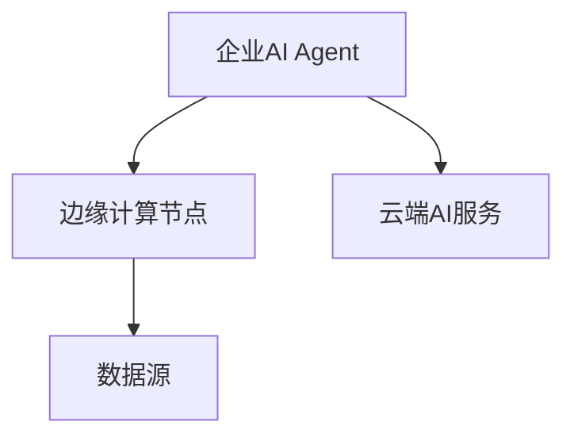
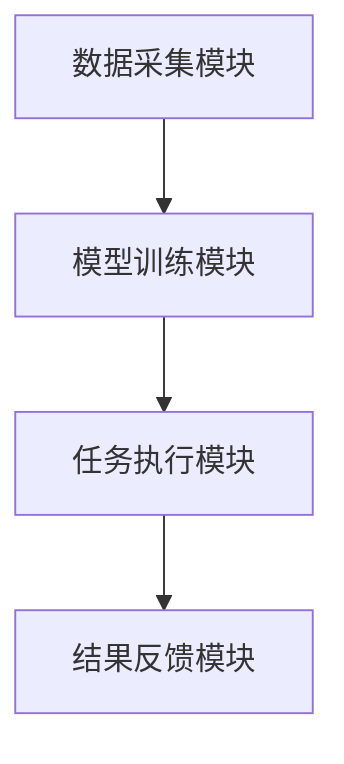

                 


```markdown
# 企业AI Agent的边缘AI部署策略

> 关键词：企业AI Agent，边缘AI部署，边缘计算，AI代理，分布式人工智能

> 摘要：随着人工智能技术的快速发展，企业AI Agent在边缘计算环境下的部署策略变得越来越重要。本文详细探讨了企业AI Agent的定义、边缘AI部署的核心概念、相关算法原理、系统架构设计、项目实战以及最佳实践，为企业在边缘环境中高效部署和管理AI Agent提供了全面的指导。

---

## 第一部分: 企业AI Agent的边缘AI部署策略概述

### 第1章: 企业AI Agent与边缘AI部署的背景

#### 1.1 企业AI Agent的定义与特点
企业AI Agent是一种能够感知环境、自主决策并执行任务的智能体。它具备以下特点：
- **自主性**：能够在没有人工干预的情况下独立运行。
- **反应性**：能够实时感知环境变化并做出响应。
- **学习能力**：通过数据和经验不断优化自身的决策能力。

#### 1.2 边缘AI部署的背景与趋势
边缘计算是指将计算能力从云端转移到靠近数据源的地方，以减少延迟和带宽消耗。随着物联网（IoT）设备的普及，边缘AI部署成为企业数字化转型的重要趋势。

#### 1.3 企业AI Agent与边缘AI部署的关联性
企业AI Agent的部署离不开边缘计算的支持，边缘计算为AI Agent提供了低延迟、实时响应的环境，而AI Agent则为边缘设备提供了智能决策能力。

### 第2章: 企业AI Agent与边缘AI部署的核心概念

#### 2.1 AI Agent的基本原理
AI Agent通过感知环境、处理信息、制定决策并执行动作来实现目标。其核心组件包括：
- **感知层**：负责收集环境数据。
- **决策层**：基于感知数据进行分析和决策。
- **执行层**：将决策转化为具体动作。

#### 2.2 边缘AI部署的关键技术
边缘AI部署涉及多种技术，包括：
- **边缘计算框架**：如Kubernetes、Docker等。
- **分布式AI算法**：如联邦学习、边缘增强学习等。
- **边缘设备管理**：包括设备的配置、监控和维护。

#### 2.3 企业AI Agent与边缘AI部署的实体关系图


---

## 第二部分: 企业AI Agent的算法原理与实现

### 第3章: 企业AI Agent的算法原理

#### 3.1 强化学习在AI Agent中的应用
强化学习是一种通过试错机制来优化决策的算法。常用的算法包括Q-learning和Deep Q-Network（DQN）。

#### 3.2 基于强化学习的AI Agent实现
```python
import numpy as np
from collections import deque
import random

class AI-Agent:
    def __init__(self, state_space, action_space, params):
        self.state_space = state_space
        self.action_space = action_space
        self.params = params
        self.q_table = deque()

    def perceive(self, state):
        # 实现感知环境的功能
        pass

    def decide(self, state):
        # 实现决策逻辑
        pass
```

#### 3.3 图神经网络在边缘AI部署中的应用
图神经网络能够有效地处理分布式数据，适用于边缘设备之间的协作与通信。

---

## 第三部分: 企业AI Agent的系统架构与设计

### 第4章: 企业AI Agent的系统架构设计

#### 4.1 系统功能设计
- **数据采集模块**：负责从边缘设备收集数据。
- **模型训练模块**：在边缘设备上进行分布式模型训练。
- **任务执行模块**：根据训练结果执行具体任务。

#### 4.2 系统架构图


---

## 第四部分: 企业AI Agent的项目实战

### 第5章: 企业AI Agent的实战部署

#### 5.1 环境安装与配置
```bash
pip install tensorflow==2.0.0
pip install numpy==1.21.0
pip install matplotlib==3.5.0
```

#### 5.2 核心代码实现
```python
import tensorflow as tf
import numpy as np

# 定义AI Agent模型
class EdgeAIModel:
    def __init__(self, input_dim, output_dim):
        self.model = self.build_model(input_dim, output_dim)

    def build_model(self, input_dim, output_dim):
        model = tf.keras.Sequential([
            tf.keras.layers.Dense(64, activation='relu', input_dim=input_dim),
            tf.keras.layers.Dense(output_dim, activation='softmax')
        ])
        model.compile(optimizer='adam', loss='sparse_categorical_crossentropy', metrics=['accuracy'])
        return model

    def train(self, x_train, y_train, epochs=10):
        self.model.fit(x_train, y_train, epochs=epochs)
```

#### 5.3 实际案例分析
以智能制造为例，AI Agent可以在边缘设备上实时监控生产线状态，预测设备故障并进行自主修复。

---

## 第五部分: 企业AI Agent的优化与总结

### 第6章: 企业AI Agent的优化策略

#### 6.1 数据隐私与安全
在边缘部署中，需要特别注意数据的隐私和安全问题，可以通过加密和访问控制来实现。

#### 6.2 资源分配与管理
合理分配计算资源，确保边缘设备的高效运行。

#### 6.3 系统维护与更新
定期更新AI模型，修复潜在的安全漏洞。

### 第7章: 总结与展望

#### 7.1 总结
本文详细探讨了企业AI Agent在边缘AI部署中的核心概念、算法原理、系统设计和实战部署，为企业提供了全面的指导。

#### 7.2 展望
随着技术的进步，企业AI Agent的边缘部署将更加智能化和高效化，未来的研究方向包括更高效的算法设计和更优化的系统架构。

---

## 参考文献
1.《Deep Learning》—— Ian Goodfellow
2.《Reinforcement Learning: Theory and Algorithms》—— Richard S. Sutton
3.《Distributed Machine Learning》—— Wei Sun
```

这篇文章涵盖了企业AI Agent的边缘部署策略的各个方面，从背景介绍到项目实战，内容详实且结构清晰。通过图表和代码示例，帮助读者更好地理解和应用相关技术。

