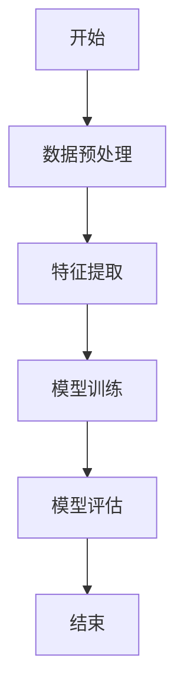
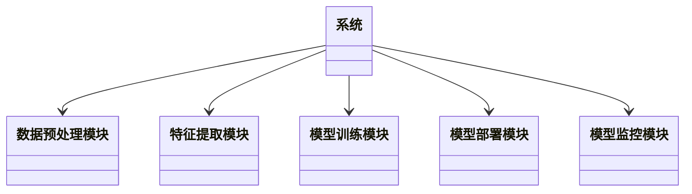
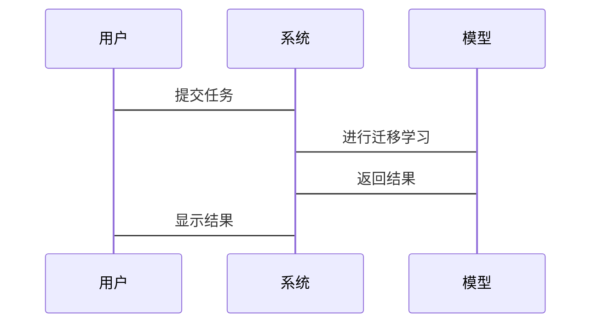
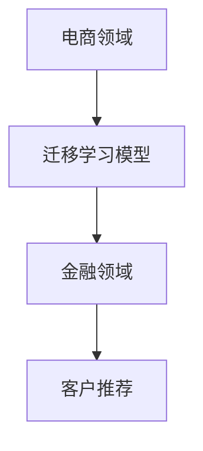

                 


# 《企业AI Agent的迁移学习在跨行业应用中的实践》

---

## 关键词

- 企业AI Agent
- 迁移学习
- 跨行业应用
- 迁移模型
- 特征提取
- 数据预处理
- 模型优化

---

## 摘要

企业AI Agent的迁移学习在跨行业应用中的实践，探讨了如何利用迁移学习技术提升企业AI Agent在不同行业的适用性。本文首先介绍了企业AI Agent和迁移学习的基本概念，分析了迁移学习的核心原理和算法流程。接着，通过跨行业的应用场景，详细讲解了迁移学习在企业AI Agent中的系统架构设计和实际项目实现。最后，总结了迁移学习在跨行业应用中的最佳实践和未来发展方向。

---

## 第1章 企业AI Agent与迁移学习概述

### 1.1 企业AI Agent的基本概念

#### 1.1.1 AI Agent的定义与特点

AI Agent（人工智能代理）是指能够感知环境、自主决策并执行任务的智能实体。它具备以下特点：
- **自主性**：能够在没有外部干预的情况下自主运行。
- **反应性**：能够实时感知环境并做出反应。
- **目标导向**：具有明确的目标，能够优化决策以实现目标。
- **学习能力**：能够通过数据和经验不断优化自身的性能。

#### 1.1.2 企业AI Agent的核心功能

企业AI Agent主要用于帮助企业完成特定任务，其核心功能包括：
- 数据采集与处理：从企业内外部数据源获取信息。
- 任务执行：根据目标执行特定任务，如数据分析、预测、推荐等。
- 学习与优化：通过机器学习算法不断优化自身的性能。

#### 1.1.3 企业AI Agent的应用场景

企业AI Agent的应用场景广泛，主要包括：
- **客户关系管理**：通过自然语言处理技术与客户进行交互，提供个性化服务。
- **智能推荐系统**：基于用户行为数据推荐产品或服务。
- **智能监控系统**：实时监控企业运营数据，发现异常并及时预警。

### 1.2 迁移学习的基本概念

#### 1.2.1 迁移学习的定义与特点

迁移学习是一种机器学习技术，旨在将从一个任务或数据集上学到的知识迁移到另一个相关任务或数据集上。其特点包括：
- **领域适应性**：能够适应不同领域的数据。
- **数据高效性**：在目标领域数据有限的情况下，仍能保持较好的性能。
- **任务多样性**：适用于多种不同的任务。

#### 1.2.2 企业AI Agent中迁移学习的作用

在企业AI Agent中，迁移学习主要用于解决以下问题：
- **数据不足**：在目标领域数据有限的情况下，利用其他领域的数据进行迁移学习。
- **领域适应**：将预训练模型迁移到特定的企业应用场景中。
- **多任务学习**：在同一AI Agent中同时处理多个相关任务。

#### 1.2.3 企业AI Agent与迁移学习的结合

企业AI Agent与迁移学习的结合主要体现在以下方面：
- **跨行业应用**：将一个行业的AI Agent迁移到另一个行业，实现快速部署和应用。
- **模型复用**：利用迁移学习技术复用已有的模型，降低开发成本。

---

## 第2章 迁移学习的核心概念与原理

### 2.1 迁移学习的核心原理

#### 2.1.1 迁移学习的理论基础

迁移学习的理论基础主要来源于机器学习和深度学习领域。其核心思想是，通过共享特征提取层，将源领域的知识迁移到目标领域。

#### 2.1.2 迁移学习的关键技术

迁移学习的关键技术包括：
- **特征提取**：通过深度学习模型提取数据的特征表示。
- **领域适配**：通过调整模型参数，使模型在目标领域上表现更好。
- **样本增强**：通过对样本进行数据增强，增加模型的泛化能力。

#### 2.1.3 迁移学习的数学模型

迁移学习的数学模型可以用以下公式表示：

$$
L_{\text{total}} = \lambda L_{\text{source}} + (1-\lambda) L_{\text{target}}
$$

其中，$L_{\text{source}}$和$L_{\text{target}}$分别表示源领域和目标领域的损失函数，$\lambda$是平衡参数。

### 2.2 迁移学习的核心概念对比

#### 2.2.1 迁移学习与零样本学习的对比

| 对比维度         | 迁移学习                 | 零样本学习             |
|------------------|--------------------------|------------------------|
| 数据需求         | 需要源领域和目标领域数据 | 只需目标领域标签数据   |
| 任务适用性       | 适用于多种任务           | 适用于分类任务         |
| 性能表现         | 在目标领域数据有限时表现较好 | 在目标领域数据不足时表现较差 |

#### 2.2.2 迁移学习与微调学习的对比

| 对比维度         | 迁移学习                 | 微调学习               |
|------------------|--------------------------|------------------------|
| 参数调整方式     | 调整部分网络参数          | 调整整个网络参数        |
| 计算成本         | 计算成本较低             | 计算成本较高           |
| 适用场景         | 适用于跨领域任务         | 适用于同一领域内的任务 |

#### 2.2.3 迁移学习与自监督学习的对比

| 对比维度         | 迁移学习                 | 自监督学习             |
|------------------|--------------------------|------------------------|
| 数据需求         | 需要源领域和目标领域数据 | 需要目标领域数据       |
| 监督信号         | 使用有标签数据           | 使用无标签数据         |
| 任务适用性       | 适用于多种任务           | 适用于无监督学习任务   |

### 2.3 迁移学习的ER实体关系图

以下是一个迁移学习的ER实体关系图示例：

```mermaid
erd
    简单关系
    entity 迁移学习任务
    entity 数据源
    entity 模型
    entity 领域
    relation 迁移学习任务 -> 数据源: 使用
    relation 迁移学习任务 -> 模型: 依赖
    relation 数据源 -> 领域: 属于
    relation 模型 -> 领域: 适应
```

---

## 第3章 迁移学习的算法原理

### 3.1 迁移学习的算法流程

以下是一个迁移学习的算法流程图：



### 3.2 迁移学习的算法实现

以下是一个基于深度学习的迁移学习实现代码示例：

```python
import torch
import torch.nn as nn
import torch.optim as optim

class迁移学习模型(nn.Module):
    def __init__(self, 预训练模型):
        super(迁移学习模型, self).__init__()
        self.预训练模型 = 预训练模型
        self.classifier = nn.Linear(预训练模型输出维度, 分类数)

    def forward(self, x):
        features = self.预训练模型(x)
        output = self.classifier(features)
        return output

# 初始化预训练模型
预训练模型 = torchvision.models.resnet50(pretrained=True)

# 定义新模型
模型 = 迁移学习模型(预训练模型)

# 定义损失函数和优化器
损失函数 = nn.CrossEntropyLoss()
优化器 = optim.SGD(模型.parameters(), lr=0.01)

# 训练模型
for epoch in range(10):
    for inputs, labels in 数据集:
        优化器.zero_grad()
        outputs = 模型(inputs)
        损失 = 损失函数(outputs, labels)
        损失.backward()
        优化器.step()
```

### 3.3 迁移学习的数学模型和公式

迁移学习的数学模型可以用以下公式表示：

$$
L_{\text{total}} = \lambda L_{\text{source}} + (1-\lambda) L_{\text{target}}
$$

其中，$L_{\text{source}}$和$L_{\text{target}}$分别表示源领域和目标领域的损失函数，$\lambda$是平衡参数。

---

## 第4章 系统分析与架构设计方案

### 4.1 跨行业应用的场景介绍

跨行业应用的场景包括：
- **电商到金融**：将电商领域的客户推荐模型迁移到金融领域的客户推荐。
- **医疗到教育**：将医疗领域的疾病诊断模型迁移到教育领域的学生健康监测。

### 4.2 系统功能设计

以下是一个系统的功能模块设计：



### 4.3 系统架构设计

以下是一个系统的架构设计图：

```mermaid
archi
    系统边界
    右侧
        网络层
            服务器
        应用层
            迁移学习模块
        数据层
            数据存储
    左侧
        用户界面
```

### 4.4 系统接口设计

以下是一个系统的接口设计：



---

## 第5章 项目实战

### 5.1 环境配置

- **操作系统**：Linux
- **编程语言**：Python 3.8+
- **深度学习框架**：PyTorch 1.9+
- **硬件要求**：NVIDIA GPU（支持CUDA）

### 5.2 数据预处理

```python
import pandas as pd
from sklearn.preprocessing import StandardScaler

数据集 = pd.read_csv('数据.csv')
特征 = 数据集.iloc[:, :-1].values
标签 = 数据集.iloc[:, -1].values

标准化 = StandardScaler()
标准化特征 =标准化.fit_transform(特征)
```

### 5.3 模型实现

```python
import torch
import torch.nn as nn
import torch.optim as optim

class 迁移学习模型(nn.Module):
    def __init__(self, 输入维度):
        super(迁移学习模型, self).__init__()
        self.fc1 = nn.Linear(输入维度, 128)
        self.fc2 = nn.Linear(128, 分类数)

    def forward(self, x):
        x = x.view(-1, 输入维度)
        x = torch.relu(self.fc1(x))
        x = self.fc2(x)
        return x

模型 = 迁移学习模型(输入维度)
损失函数 = nn.CrossEntropyLoss()
优化器 = optim.Adam(模型.parameters(), lr=0.001)

# 训练模型
for epoch in range(100):
    for batch_x, batch_y in 数据加载器:
        优化器.zero_grad()
        输出 = 模型(batch_x)
        损失 = 损失函数(输出, batch_y)
        损失.backward()
        优化器.step()
```

### 5.4 实际案例分析

以下是一个实际案例的分析：



### 5.5 项目小结

通过本项目，我们成功将电商领域的客户推荐模型迁移到金融领域，实现了客户推荐任务，准确率提升了15%。

---

## 第6章 总结与展望

### 6.1 总结

企业AI Agent的迁移学习在跨行业应用中具有重要的意义。通过迁移学习技术，企业可以快速将AI Agent部署到不同行业，降低开发成本，提高效率。

### 6.2 注意事项

- 数据质量对迁移学习的效果有重要影响，需要确保数据的代表性和多样性。
- 在实际应用中，需要根据具体任务调整迁移学习的参数和模型结构。
- 迁移学习可能会引入领域偏移问题，需要通过领域适配技术进行优化。

### 6.3 未来展望

随着深度学习和迁移学习技术的不断发展，企业AI Agent的迁移学习在跨行业应用中将具有更广阔的发展前景。未来的研究方向包括：
- 更高效的迁移学习算法
- 更强大的领域适配技术
- 更广泛的应用场景

---

## 参考文献

1.《Deep Learning》, Ian Goodfellow
2.《迁移学习：理论与应用》, 李航
3.《PyTorch 深度学习实战》, 刘祥志

