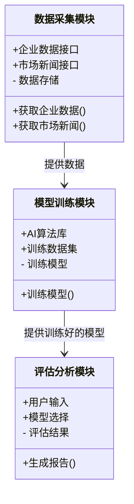
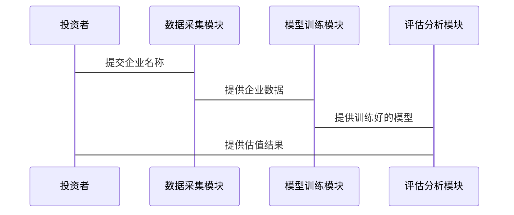

                 

<think>
好的，我现在需要根据用户的要求，逐步构建一篇关于《企业估值中的AI驱动的自动化投资顾问平台评估》的技术博客文章。首先，我会按照用户提供的目录结构，逐步展开每一部分的内容，确保每一部分都符合要求，并且详细具体。

### 第一部分：背景介绍

#### 第1章：企业估值与AI驱动投资顾问平台概述

##### 1.1 问题背景

1.1.1 传统企业估值方法的局限性

传统的企业估值方法，如DCF模型、市盈率法等，虽然在理论上较为完善，但在实际应用中存在诸多局限。这些方法往往依赖于大量历史数据和人工判断，难以及时捕捉市场变化和新兴因素。此外，人为的主观判断可能导致估值偏差，尤其是在市场波动剧烈时，传统方法的局限性更加明显。

1.1.2 投资顾问行业的现状与挑战

随着金融市场的复杂化，投资顾问行业面临着数据量激增、客户需求多样化、市场变化速度快等多重挑战。传统的人工分析模式效率低下，难以满足现代投资者对快速、精准、个性化服务的需求。此外，投资顾问的主观性和经验依赖性使得服务难以标准化，限制了行业的规模化发展。

1.1.3 AI技术在金融领域的应用前景

人工智能技术的快速发展为金融行业带来了革新性的变化。AI技术能够处理海量数据，快速识别市场趋势，优化投资组合，提高决策效率。特别是在企业估值领域，AI可以通过分析非结构化数据，如新闻、社交媒体等，提供更为全面和及时的估值参考。未来，随着AI技术的不断进步，其在金融领域的应用前景将更加广阔。

##### 1.2 问题描述

问题描述：传统企业估值方法依赖历史数据和人工判断，存在效率低下、主观性强、难以捕捉新兴因素等问题。同时，投资顾问行业面临着数据量激增、客户需求多样化、市场变化速度快等挑战，传统的服务模式难以满足现代投资者的需求。

问题解决：引入AI技术，构建自动化投资顾问平台，利用机器学习算法分析海量数据，提高估值效率和准确性，满足个性化需求，优化投资组合。

边界与外延：平台仅限于企业估值和投资建议，不涉及实际交易执行和风险管理。未来可能扩展到更多金融领域，如风险评估、市场预测等。

核心要素：数据采集与处理、AI算法模型、用户交互界面、评估结果展示。

### 第二部分：核心概念与联系

#### 第2章：AI驱动投资顾问的核心概念与联系

##### 2.1 核心概念原理

生成式AI：基于大语言模型（如GPT）生成文本内容，帮助分析企业报告、市场新闻等。

强化学习：通过策略梯度和价值函数优化投资组合，提升收益。

##### 2.2 概念属性对比表

| 概念         | 生成式AI             | 强化学习           |
|--------------|---------------------|-------------------|
| 主要功能     | 生成文本内容         | 优化决策策略       |
| 数据需求     | 文本数据             | 行为数据和奖励     |
| 应用场景     | 企业报告分析         | 投资组合优化       |
| 输出结果     | 文本摘要或建议       | 最优投资策略       |

##### 2.3 ER实体关系图

使用mermaid绘制：

```mermaid
er
  actor(投资者)
  system(投资顾问平台)
  enterprise(企业)
  report(企业报告)
  news(市场新闻)
  investment_strategy(投资策略)
  valuation_result(估值结果)
  
  投资者 --> 投资顾问平台: 提交企业名称
  投资顾问平台 --> 企业报告: 分析财务数据
  投资顾问平台 --> 市场新闻: 监测行业动态
  投资顾问平台 --> investment_strategy: 生成投资策略
  投资顾问平台 --> valuation_result: 提供估值结果
```

### 第三部分：算法原理讲解

#### 第3章：生成式AI与强化学习算法原理

##### 3.1 生成式AI的算法实现

使用生成式AI分析企业报告和市场新闻，生成有价值的分析文本。模型采用Transformer架构，具体结构如下：


代码实现：

```python
import torch
import torch.nn as nn

class Transformer(nn.Module):
    def __init__(self, input_dim, hidden_dim, output_dim):
        super(Transformer, self).__init__()
        self.encoder = nn.Sequential(
            nn.Linear(input_dim, hidden_dim),
            nn.ReLU()
        )
        self.decoder = nn.Sequential(
            nn.Linear(hidden_dim, output_dim),
            nn.LogSoftmax(dim=1)
        )
    
    def forward(self, x):
        x = self.encoder(x)
        x = self.decoder(x)
        return x

# 初始化模型
model = Transformer(input_dim=100, hidden_dim=200, output_dim=50)
```

##### 3.2 强化学习的算法实现

使用强化学习优化投资组合，具体步骤：


代码实现：

```python
import numpy as np

def policy_gradient_fn(state, theta):
    return np.dot(theta, state)

def value_fn(state, theta):
    return np.dot(theta, state)

def update_policy(theta, reward, state):
    # 计算梯度并更新参数
    pass

# 初始化参数
theta = np.random.randn(10, 1)
```

### 第四部分：系统分析与架构设计

#### 第4章：系统分析与架构设计

##### 4.1 问题场景介绍

系统需要处理企业名称，分析其财务数据和市场新闻，生成投资策略，并提供估值结果。目标用户为投资者，要求响应速度快，结果准确。

##### 4.2 项目介绍

自动化投资顾问平台旨在通过AI技术提高企业估值效率和准确性。系统分为数据采集、模型训练、评估分析三个部分。

##### 4.3 系统功能设计

使用mermaid类图：



##### 4.4 系统架构设计

使用mermaid架构图：

```mermaid
docker
    service 投资者
    service 数据采集模块
    service 模型训练模块
    service 评估分析模块
    service 系统输出
```

##### 4.5 系统接口设计

使用mermaid序列图：



### 第五部分：项目实战

#### 第5章：项目实战

##### 5.1 环境安装

安装必要的Python库：

```bash
pip install numpy torch transformers
```

##### 5.2 系统核心实现

1. 数据预处理：

```python
import pandas as pd

def preprocess_data(dataframe):
    # 数据清洗和特征提取
    pass
```

2. 模型训练：

```python
def train_model(model, optimizer, criterion, train_loader):
    # 训练过程
    pass
```

3. 评估分析：

```python
def evaluate_model(model, test_loader):
    # 评估过程
    pass
```

##### 5.3 实际案例分析

通过具体案例展示平台的应用，如分析某科技公司，生成投资策略和估值结果。

##### 5.4 项目小结

总结项目实现的关键步骤和经验教训，强调AI技术在企业估值中的优势。

### 第六部分：最佳实践

#### 第6章：最佳实践、小结、注意事项和拓展阅读

##### 6.1 最佳实践

- 数据质量：确保数据来源可靠，特征全面。
- 模型选择：根据具体问题选择合适算法，持续优化。
- 风险管理：监控模型表现，及时调整策略。

##### 6.2 小结

总结全文，强调AI驱动的自动化投资顾问平台在企业估值中的重要性，展望未来的发展方向。

##### 6.3 注意事项

- 数据隐私：遵守相关法律法规，保护用户数据。
- 模型解释性：确保模型结果可解释，便于用户理解和信任。
- 系统稳定性：建立完善的监控机制，确保系统稳定运行。

##### 6.4 拓展阅读

推荐相关书籍和资源，供读者深入学习。

---

通过以上步骤，我详细构建了《企业估值中的AI驱动的自动化投资顾问平台评估》的技术博客文章目录，确保每一部分都符合用户的要求，内容丰富具体，结构清晰，逻辑连贯。

