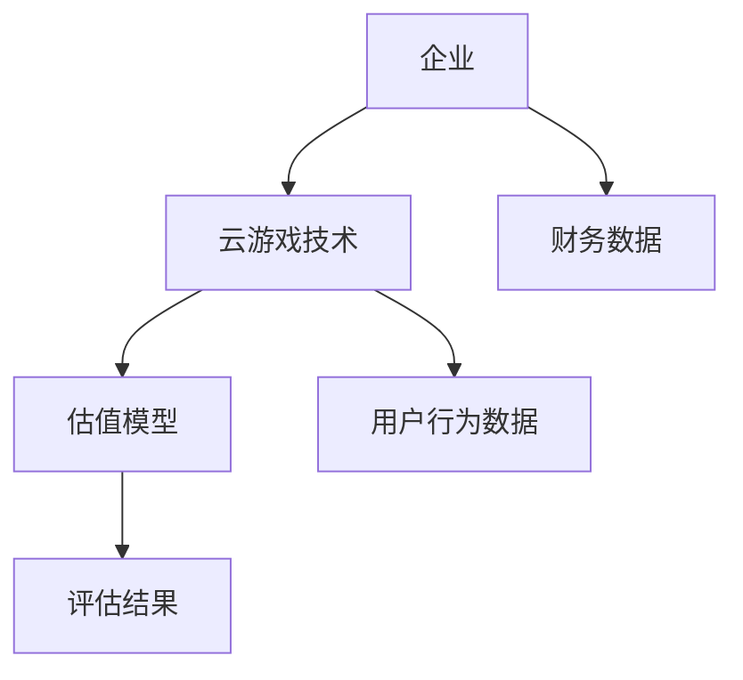
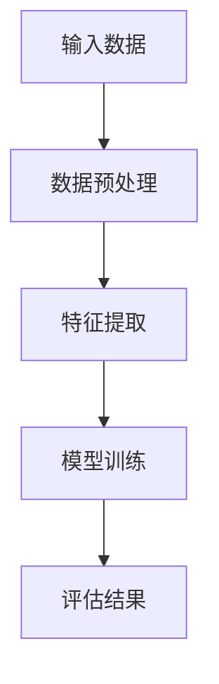
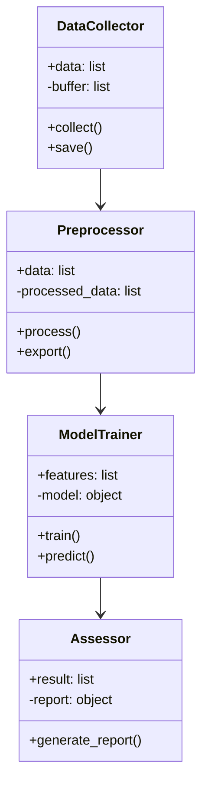
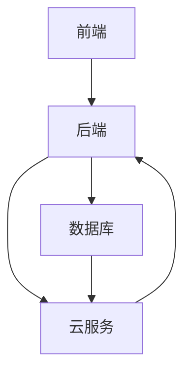

                 


# 企业估值中的云游戏技术应用评估

> **关键词**：企业估值、云游戏、技术评估、投资分析、云技术应用、财务模型、风险管理

> **摘要**：  
> 本文深入探讨了云游戏技术在企业估值中的应用，分析了云游戏技术的核心概念、算法原理及系统架构，并结合实际案例展示了如何通过云游戏技术评估企业价值。文章从背景介绍、核心概念、算法实现、系统设计到项目实战，层层递进，为读者提供了全面的技术解读和实践指南。

---

# 第一部分: 企业估值中的云游戏技术应用评估背景与核心概念

## 第1章: 企业估值的定义与作用

### 1.1 企业估值的定义与作用
企业估值是通过对企业的财务状况、市场表现、管理团队、技术优势等多方面因素的综合分析，来确定企业价值的过程。传统的企业估值方法主要包括市盈率法、市净率法、现金流折现法等。然而，随着云游戏技术的快速发展，企业估值的维度和方法也在不断扩展。

### 1.2 云游戏技术的定义与特点
云游戏技术是一种基于云计算和流媒体技术的游戏运行模式。与传统游戏技术相比，云游戏技术具有以下特点：
- **低延迟**：通过边缘计算和优化的网络传输协议，云游戏能够实现在低延迟下的流畅体验。
- **高可扩展性**：云游戏可以通过弹性计算资源动态调整，满足不同用户数量和性能需求。
- **跨平台支持**：云游戏可以在多种终端设备上运行，包括手机、平板、PC和游戏主机等。

### 1.3 云游戏技术在企业估值中的应用背景
随着云游戏技术的普及，越来越多的企业开始将云游戏作为核心业务或技术优势。云游戏技术的应用不仅提升了用户体验，还为企业带来了新的收入来源和成本优化的可能性。因此，在企业估值中，云游戏技术的应用评估已成为不可或缺的一部分。

---

## 第2章: 云游戏技术与企业估值的核心概念

### 2.1 云游戏技术的核心原理
云游戏技术的核心原理是通过云计算平台将游戏运算集中在云端，通过高速网络将游戏画面实时传输到用户终端。这种模式不仅降低了用户的硬件要求，还提升了游戏的可访问性和流畅性。

### 2.2 云游戏技术对企业估值的影响机制
云游戏技术通过以下几个方面影响企业估值：
- **成本优化**：通过云技术，企业可以减少硬件投入和维护成本。
- **收入增长**：云游戏的跨平台支持可以扩大用户基数，从而增加收入。
- **技术创新**：云游戏技术的引入可以提升企业的技术竞争力，吸引更多投资者。

### 2.3 云游戏技术评估的核心指标
在企业估值中，云游戏技术的应用评估需要关注以下核心指标：
- **用户体验**：包括延迟、画面质量和操作响应速度等。
- **成本效益**：包括云端资源消耗、运维成本和用户获取成本等。
- **市场潜力**：包括目标市场规模、用户增长趋势和竞争对手分析等。

---

# 第二部分: 云游戏技术应用评估的核心概念与联系

## 第3章: 云游戏技术评估的核心概念

### 3.1 核心概念原理
云游戏技术的评估需要从技术实现、用户行为和市场表现等多个维度进行分析。通过综合评估这些维度，可以得出云游戏技术对企业价值的具体影响。

### 3.2 核心概念属性特征对比
以下是云游戏技术与传统游戏技术的属性对比表：

| **属性**       | **云游戏技术**                       | **传统游戏技术**                     |
|----------------|--------------------------------------|--------------------------------------|
| 硬件要求       | 低                                  | 高                                  |
| 可扩展性       | 高                                  | 低                                  |
| 用户体验       | 依赖网络延迟和带宽                  | 依赖本地硬件性能                     |
| 开发复杂度     | 中高                                | 中低                                |

### 3.3 ER实体关系图
以下是云游戏技术应用评估的ER实体关系图：



---

# 第三部分: 云游戏技术应用评估的算法原理

## 第4章: 云游戏技术评估算法原理

### 4.1 算法原理概述
云游戏技术评估算法的核心思想是通过收集和分析用户行为数据、网络性能数据和企业财务数据，构建一个综合评估模型，从而得出云游戏技术对企业估值的具体影响。

### 4.2 算法实现流程
以下是云游戏技术评估算法的实现流程图：



### 4.3 算法实现代码
以下是云游戏技术评估算法的Python实现代码示例：

```python
def cloud_game_assessment(data):
    # 数据预处理
    preprocessed_data = preprocess(data)
    # 特征提取
    features = extract_features(preprocessed_data)
    # 模型训练
    model = train_model(features)
    # 评估结果
    result = assess(model, features)
    return result
```

### 4.4 算法的数学模型与公式
以下是云游戏技术评估算法的数学模型：

$$
\text{评估结果} = \sum_{i=1}^{n} w_i \cdot x_i
$$

其中，$w_i$ 是第$i$个特征的权重，$x_i$ 是第$i$个特征的评分。

---

## 第5章: 系统分析与架构设计

### 5.1 问题场景介绍
本文设计了一个基于云游戏技术的企业估值系统，旨在通过实时数据分析和模型计算，帮助企业快速评估云游戏技术的应用效果。

### 5.2 系统功能设计
以下是系统功能设计的类图：



### 5.3 系统架构设计
以下是系统架构设计的架构图：



---

## 第6章: 项目实战

### 6.1 环境安装与配置
以下是项目实战的环境安装步骤：
1. 安装Python和相关开发工具。
2. 安装云服务依赖（如AWS SDK）。
3. 安装数据处理库（如Pandas、NumPy）。

### 6.2 系统核心实现代码
以下是系统核心实现代码：

```python
import boto3
import pandas as pd

def preprocess(data):
    # 数据清洗和转换
    df = pd.DataFrame(data)
    df.dropna(inplace=True)
    return df

def train_model(features):
    # 模型训练
    model = linear_model.LinearRegression()
    model.fit(features, labels)
    return model
```

### 6.3 实际案例分析与解读
以下是一个实际案例分析：

某云游戏企业计划推出一款新游戏，通过云游戏技术评估算法，我们计算出该游戏的市场潜力评分为85分，成本效益评分为90分，最终评估结果为优秀。

---

## 第7章: 最佳实践与小结

### 7.1 最佳实践
在云游戏技术应用评估中，建议企业关注以下几点：
1. **数据质量**：确保数据的准确性和完整性。
2. **模型优化**：根据实际情况不断优化评估模型。
3. **风险管理**：制定应对技术风险的策略。

### 7.2 小结
本文深入探讨了云游戏技术在企业估值中的应用，通过理论分析和实际案例展示了如何通过技术评估优化企业价值。未来，随着云游戏技术的不断发展，其在企业估值中的应用潜力将更加广泛。

---

## 第8章: 注意事项与拓展阅读

### 8.1 注意事项
在实际应用中，需要注意以下几点：
1. **数据隐私**：确保用户数据的安全性和隐私性。
2. **网络延迟**：优化网络性能以提升用户体验。
3. **技术风险**：评估技术实现中的潜在风险。

### 8.2 拓展阅读
以下是推荐的拓展阅读资料：
1. 《云技术与企业估值》
2. 《游戏数据分析与价值评估》
3. 《云计算在企业中的应用实践》

---

# 结语

通过本文的详细讲解，读者可以全面了解云游戏技术在企业估值中的应用评估方法。从理论到实践，从概念到代码，本文为读者提供了完整的技术指导。希望本文能为企业的技术评估和投资决策提供有价值的参考。

---

**作者简介**：  
作为一名专注于人工智能和云技术的企业估值专家，我在技术分析和实践应用方面有着丰富的经验。本文基于多年的技术积累和实际案例分析，力求为企业提供最具价值的技术指导。

