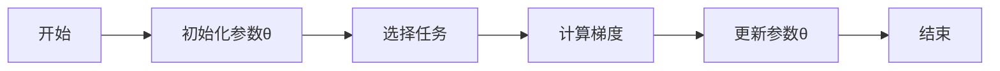
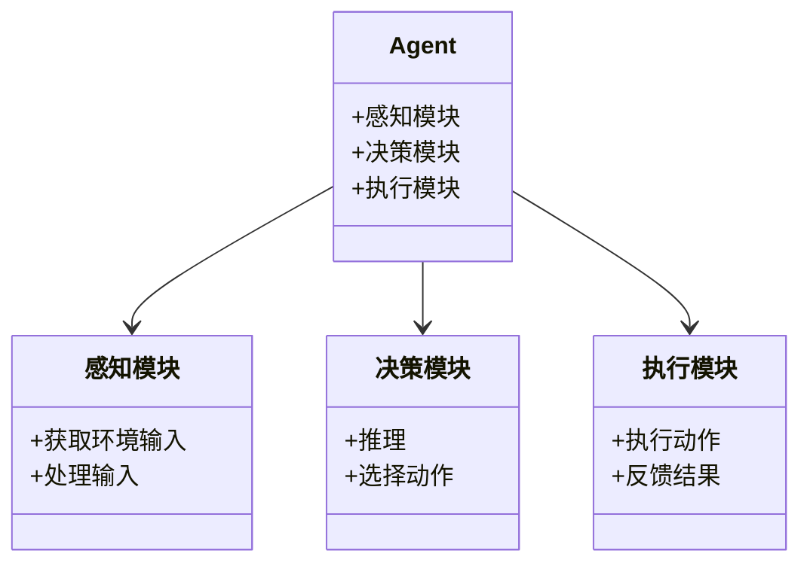

                 


# 元学习框架：构建快速适应的AI Agent

---

## 关键词：
元学习，AI Agent，快速适应，迁移学习，智能体设计，算法优化

---

## 摘要：
本文深入探讨了元学习框架在构建快速适应的AI Agent中的应用。通过分析元学习的核心原理、典型算法及其在AI Agent中的应用，结合实际项目案例，详细讲解了如何利用元学习框架提升AI Agent的适应能力和决策效率。文章从基础概念、算法原理、系统架构到项目实战，层层递进，为读者提供了全面的指导。

---

## 第一部分：背景与基础

### 第1章：元学习与AI Agent概述

#### 1.1 元学习的基本概念
元学习（Meta-Learning）是一种机器学习范式，旨在通过在多个任务上进行训练，使得模型能够快速适应新任务。与传统机器学习不同，元学习强调模型的通用性和快速适应能力。

**核心术语解释：**
- **元任务（Meta-Task）**：用于训练的虚拟任务集合，帮助模型学习通用的策略。
- **适应新任务（Adapt to New Task）**：模型在新任务上的快速调整能力。

**问题背景：**
传统机器学习模型通常需要大量标注数据才能表现良好。然而，在实际应用中，数据获取成本高，且环境动态变化，模型难以快速适应新任务。

**问题解决：**
元学习通过在多个任务上预训练，使得模型能够利用跨任务的共同结构，快速调整参数以适应新任务。

**边界与外延：**
- **边界**：元学习专注于任务间共享的知识，适用于任务相似但数据有限的场景。
- **外延**：结合迁移学习和自监督学习，元学习可以扩展到更广泛的应用场景。

**概念结构：**
通过对比表格和ER图展示元学习与其他学习范式的区别。

---

### 第2章：AI Agent的基本概念

#### 2.1 AI Agent的定义与类型
AI Agent是指能够感知环境、自主决策并执行任务的智能体。根据智能水平，AI Agent可以分为反应式Agent和认知式Agent。

**核心术语解释：**
- **反应式Agent**：基于当前感知做出决策，适用于简单任务。
- **认知式Agent**：具备推理、规划能力，适用于复杂任务。

**问题背景：**
传统AI Agent依赖于大量任务特定的训练数据，难以快速适应新环境。

**问题解决：**
通过元学习框架，AI Agent能够快速调整策略以适应新任务。

**边界与外延：**
- **边界**：AI Agent的适应能力受限于元学习的训练任务范围。
- **外延**：元学习可以与强化学习结合，提升Agent的自主决策能力。

---

## 第二部分：核心概念与原理

### 第3章：元学习的核心原理

#### 3.1 元学习的原理与机制
元学习通过在多个任务上训练，学习任务间共享的特征和策略，使得模型能够在新任务上快速调整。

**数学模型：**
元学习的目标函数可以表示为：
$$ \min_{\theta} \sum_{i=1}^{N} \mathbb{E}_{(x_i, y_i) \sim D_i} \left[ \mathcal{L}(f_\theta(x_i, y_i), y_i) \right] $$
其中，$\theta$是模型参数，$D_i$是第$i$个任务的数据分布。

**对比表格：**
通过对比表格展示元学习与其他学习范式的区别。

---

## 第三部分：算法与数学模型

### 第4章：元学习算法解析

#### 4.1 典型元学习算法
- **MAML算法**：通过在多个任务上进行两次梯度下降，学习任务间共享的参数。
- **ReMAML算法**：在MAML的基础上，引入重放机制，提升模型的稳定性。

**算法流程图（Mermaid）：**


**数学公式：**
MAML的优化步骤如下：
$$ \theta = \theta - \eta \nabla_\theta \mathcal{L}(f_\theta(x_i, y_i), y_i) $$
其中，$\eta$是学习率。

---

## 第四部分：系统架构与设计

### 第5章：AI Agent的系统架构

#### 5.1 系统架构设计
AI Agent的系统架构通常包括感知模块、决策模块和执行模块。

**领域模型（Mermaid类图）：**


---

## 第五部分：项目实战与应用

### 第6章：项目实战

#### 6.1 项目介绍
以图像分类任务为例，构建一个基于MAML的元学习框架，训练AI Agent快速适应新类别。

**环境安装：**
- 安装TensorFlow和Keras：
  ```bash
  pip install tensorflow keras
  ```

**核心代码实现：**
```python
import tensorflow as tf
from tensorflow import keras

def build_model():
    model = keras.Sequential([
        keras.layers.Conv2D(32, (3,3), activation='relu'),
        keras.layers.MaxPooling2D((2,2)),
        keras.layers.Flatten(),
        keras.layers.Dense(64, activation='relu'),
        keras.layers.Dense(10, activation='softmax')
    ])
    return model

def maml_training(model, X_support, y_support, X_query, y_query, inner_lr=0.01, outer_lr=0.01):
    for step in range(10):
        with tf.GradientTape() as outer_tape:
            with tf.GradientTape() as inner_tape:
                y_pred_support = model(X_support)
                loss_support = keras.losses.sparse_categorical_crossentropy(y_support, y_pred_support)
                grad_support = inner_tape.gradient(loss_support, model.trainable_variables)
                new_vars_support = [var - inner_lr * grad for var, grad in zip(model.trainable_variables, grad_support)]
            y_pred_query = model(X_query, weights=new_vars_support)
            loss_query = keras.losses.sparse_categorical_crossentropy(y_query, y_pred_query)
            grad_query = outer_tape.gradient(loss_query, model.trainable_variables)
            new_vars_query = [var - outer_lr * grad for var, grad in zip(model.trainable_variables, grad_query)]
        model.set_weights(new_vars_query)
    return model

# 示例数据
(X_support, y_support), (X_query, y_query) = get_data()  # 需要根据具体任务定义
model = build_model()
trained_model = maml_training(model, X_support, y_support, X_query, y_query)
```

---

## 第六部分：高级主题与未来展望

### 第7章：高级主题

#### 7.1 元学习的前沿技术
- **结合强化学习**：通过元学习提升强化学习Agent的适应能力。
- **自监督学习**：利用无标签数据增强元学习的效果。

#### 7.2 未来展望
元学习在AI Agent中的应用将更加广泛，尤其是在动态环境和多任务场景中。未来的研究方向包括优化元学习算法的效率和可解释性。

---

## 结语

通过本文的详细讲解，读者可以全面了解元学习框架在构建快速适应AI Agent中的应用。从基础概念到算法实现，再到项目实战，我们为读者提供了完整的指导。未来，随着技术的进步，元学习将在更多领域发挥重要作用。

