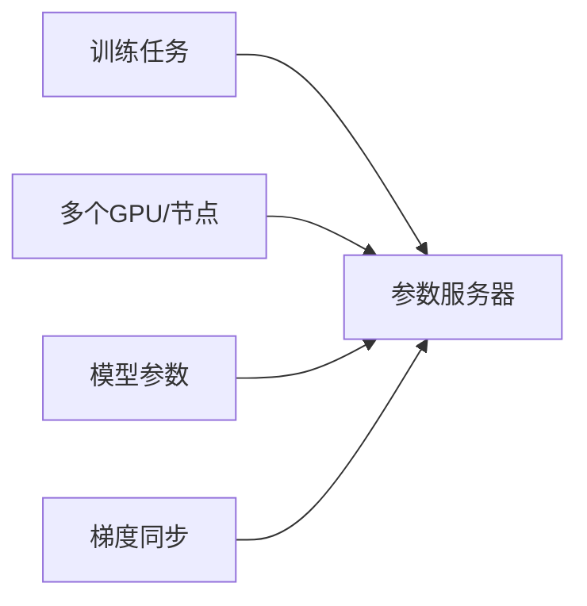
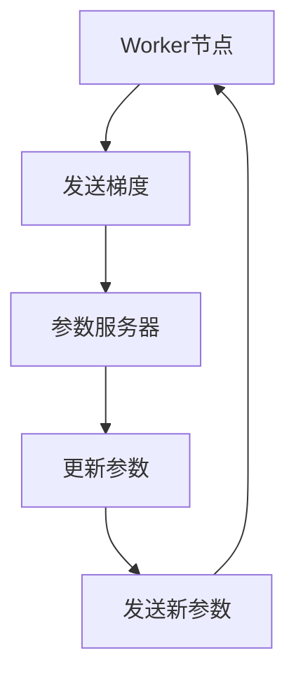
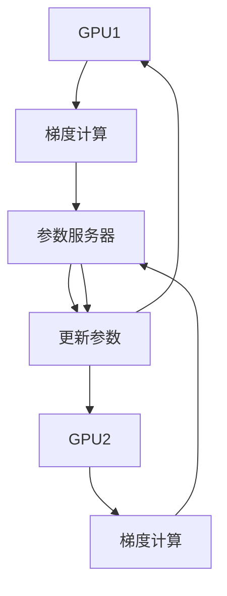
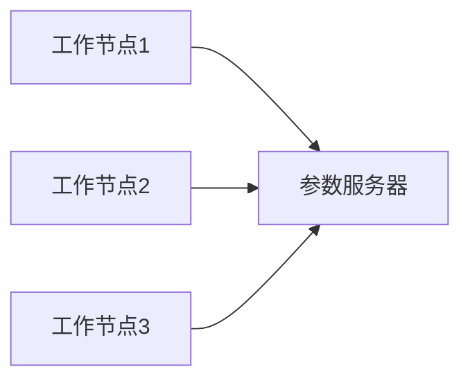
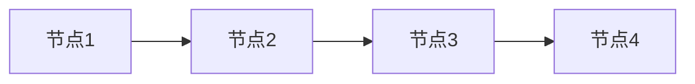

                 


# 分布式训练：加速大规模AI Agent的开发

## 关键词：
分布式训练，AI Agent，大规模模型，参数服务器，模型并行，数据并行

## 摘要：
本文深入探讨了分布式训练在加速大规模AI Agent开发中的关键作用。通过分析分布式训练的核心原理、算法实现、系统架构以及实际应用，结合丰富的图表和代码示例，系统性地讲解了如何通过分布式训练提升AI模型的训练效率和性能。文章内容从基础概念到高级算法，从理论分析到实战应用，为读者提供了一套完整的分布式训练解决方案。

---

## 第一部分: 分布式训练概述

### 第1章: 分布式训练的基本概念

#### 1.1 分布式训练的背景与问题背景
- 1.1.1 传统单机训练的局限性
  - 单机训练资源受限：计算能力、内存和存储的限制。
  - 大规模数据集处理困难：单机难以处理海量数据。
  - 模型复杂度增加带来的挑战：复杂模型需要更高效的训练方式。
- 1.1.2 大规模AI模型训练的需求
  - 高性能计算的需求：需要更高效的计算资源。
  - 分布式训练的必要性：通过多节点协作提升训练效率。
  - 真实应用场景中的挑战：分布式训练在实际应用中的复杂性。
- 1.1.3 分布式训练的核心目标
  - 提升训练效率：通过并行计算加速模型训练。
  - 支持大规模模型：能够处理超大参数量的模型。
  - 降低训练成本：优化资源利用，减少时间和计算成本。

#### 1.2 分布式训练的定义与特点
- 1.2.1 分布式训练的定义
  - 分布式训练是将训练任务分解到多个计算节点上，通过并行计算加速模型训练。
- 1.2.2 分布式训练的核心特点
  - 并行计算：通过数据并行、模型并行或混合并行提升训练速度。
  - 分布式通信：节点之间通过通信协议同步参数和梯度。
  - 高扩展性：能够支持大规模数据集和复杂模型。
- 1.2.3 分布式训练与传统训练的区别
  - 计算资源：分布式训练利用多节点资源，传统训练依赖单节点。
  - 训练效率：分布式训练显著提高训练速度，传统训练效率较低。
  - 模型规模：分布式训练支持更大规模的模型，传统训练受限于单机资源。

#### 1.3 分布式训练的应用场景
- 1.3.1 大语言模型训练
  - 分布式训练在大语言模型如GPT系列中的应用。
  - 处理海量文本数据的需求。
- 1.3.2 图像识别模型训练
  - 分布式训练在图像识别任务中的应用。
  - 处理大规模图像数据集的需求。
- 1.3.3 分布式训练在AI Agent开发中的应用
  - AI Agent的多任务学习需求。
  - 分布式训练在强化学习和多智能体协作中的应用。

### 第2章: 分布式训练的核心概念与联系

#### 2.1 分布式训练的核心原理
- 2.1.1 参数服务器模式
  - 参数服务器作为中央节点，负责参数的同步和更新。
  - 工作节点负责梯度计算和模型更新。
- 2.1.2 模型并行模式
  - 模型的不同部分分布在不同的计算节点上。
  - 适用于模型层面上的并行。
- 2.1.3 混合并行模式
  - 结合数据并行和模型并行的优势，适用于复杂场景。

#### 2.2 分布式训练的关键概念对比
- 2.2.1 数据并行与模型并行的对比
  - 数据并行：每个节点处理不同的数据样本，适用于批处理。
  - 模型并行：每个节点处理模型的不同部分，适用于模型规模较大时。
- 2.2.2 同步与异步训练的对比
  - 同步训练：所有节点同步更新参数，保证一致性。
  - 异步训练：节点可以异步更新参数，提高训练速度。
- 2.2.3 集中式与分布式训练的对比
  - 集中式训练：所有计算集中在单个节点，资源受限。
  - 分布式训练：利用多个节点协作，提升计算能力。

#### 2.3 分布式训练的实体关系图


### 第3章: 分布式训练的算法原理

#### 3.1 分布式训练的同步算法
- 3.1.1 参数服务器模式的同步流程
  - 工作节点计算梯度并发送到参数服务器。
  - 参数服务器更新参数并将其分发回工作节点。
  - 使用Mermaid图展示同步流程：


#### 3.2 分布式训练的异步算法
- 3.2.1 模型并行模式的异步流程
  - 每个GPU负责模型的不同部分，独立计算梯度。
  - 使用Mermaid图展示异步流程：


#### 3.3 分布式训练的数学模型
- 3.3.1 参数更新公式
  - 同步过程的数学推导：
  $$ \theta_{t+1} = \theta_t + \eta \cdot \nabla L(\theta_t) $$
  - 解释：$\theta_t$ 表示当前参数，$\eta$ 是学习率，$\nabla L(\theta_t)$ 是损失函数的梯度。

---

## 第二部分: 分布式训练的系统架构设计

### 第4章: 系统架构设计与实现

#### 4.1 分布式训练的系统架构概述
- 参数服务器架构：中央参数服务器负责同步参数，多个工作节点负责梯度计算。
- 环状架构：节点之间直接通信，无需中央服务器，适用于特定场景。

#### 4.2 参数服务器架构的设计
- 4.2.1 参数服务器的职责
  - 接收并汇总工作节点的梯度。
  - 更新参数并分发给工作节点。
- 4.2.2 工作节点的职责
  - 计算梯度并发送给参数服务器。
  - 使用更新后的参数进行下一步训练。
- 使用Mermaid图展示参数服务器架构：


#### 4.3 环状架构的设计
- 4.3.1 环状架构的交互流程
  - 节点之间直接通信，依次传递梯度和参数。
  - 适用于特定场景，如模型并行。
- 使用Mermaid图展示环状架构：


#### 4.4 系统接口与交互流程
- 4.4.1 系统接口设计
  - 工作节点与参数服务器之间的通信接口。
  - 梯度同步和参数更新的接口设计。
- 4.4.2 交互流程
  - 工作节点计算梯度并发送给参数服务器。
  - 参数服务器汇总梯度并更新参数。
  - 更新后的参数分发回工作节点。

---

## 第三部分: 分布式训练的项目实战

### 第5章: 分布式训练的项目实现

#### 5.1 项目环境搭建
- 安装必要的依赖：如TensorFlow、PyTorch、Kubernetes等。
- 配置分布式训练环境：设置网络、端口、IP地址等。

#### 5.2 分布式训练的核心代码实现
- 参数服务器模式的代码示例：
```python
import tensorflow as tf
from tensorflow.keras import layers

# 定义模型
class MyModel(tf.keras.Model):
    def __init__(self):
        super(MyModel, self).__init__()
        self.dense = layers.Dense(10, activation='relu')
        self.dropout = layers.Dropout(0.5)
        self.dense2 = layers.Dense(1, activation='sigmoid')

    def call(self, inputs):
        x = self.dense(inputs)
        x = self.dropout(x)
        return self.dense2(x)

# 初始化模型
model = MyModel()
model.compile(optimizer='adam', loss='binary_crossentropy')
```

- 模型并行模式的代码示例：
```python
import tensorflow as tf
from tensorflow.keras import layers

# 定义模型
class MyModel(tf.keras.Model):
    def __init__(self):
        super(MyModel, self).__init__()
        self.dense1 = layers.Dense(10, activation='relu')
        self.dropout = layers.Dropout(0.5)
        self.dense2 = layers.Dense(1, activation='sigmoid')

    def call(self, inputs):
        x = self.dense1(inputs)
        x = self.dropout(x)
        return self.dense2(x)

# 初始化模型
model = MyModel()
model.compile(optimizer='adam', loss='binary_crossentropy')
```

#### 5.3 分布式训练的实际案例分析
- 案例一：分布式训练在图像分类任务中的应用。
- 案例二：分布式训练在自然语言处理任务中的应用。
- 案例三：分布式训练在AI Agent开发中的应用。

---

## 第四部分: 分布式训练的最佳实践

### 第6章: 分布式训练的经验总结

#### 6.1 分布式训练的小结
- 分布式训练通过并行计算显著提升了训练效率。
- 参数服务器架构和模型并行模式是常用的实现方式。
- 需要注意通信开销和同步效率的优化。

#### 6.2 分布式训练的注意事项
- 节点间通信的延迟和带宽对性能的影响。
- 参数同步的频率和策略对模型收敛的影响。
- 分布式训练的资源分配和负载均衡问题。

#### 6.3 分布式训练的未来发展趋势
- 更高效的通信协议和算法优化。
- 分布式训练在边缘计算和云原生环境中的应用。
- 多模态模型和大规模预训练模型的分布式训练需求。

---

## 总结
分布式训练是加速大规模AI Agent开发的关键技术。通过合理的设计和优化，分布式训练能够显著提升模型训练效率和性能。本文从理论到实践，系统性地讲解了分布式训练的核心概念、算法原理、系统架构和项目实现，为读者提供了一套完整的分布式训练解决方案。未来，随着AI技术的不断发展，分布式训练将在更多领域发挥重要作用。

