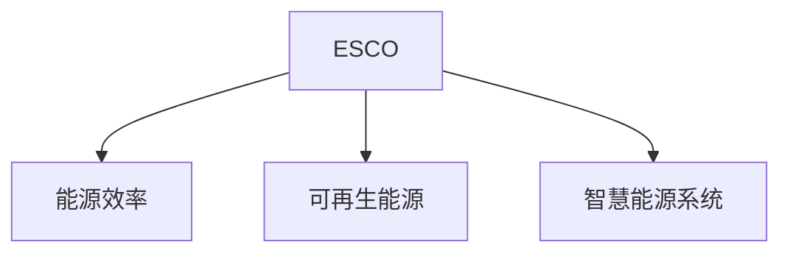
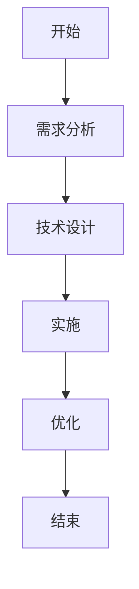
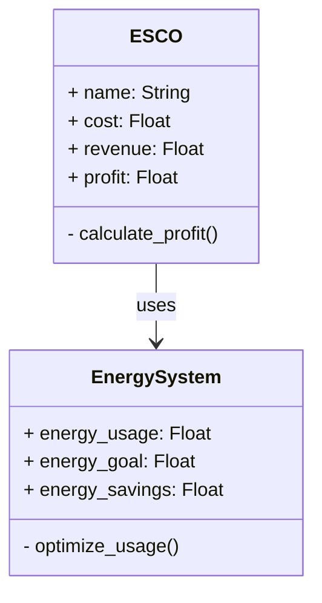
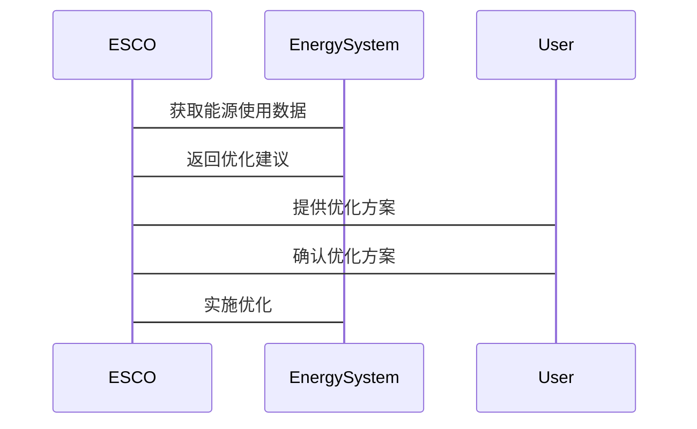

                 


# 可持续能源服务公司（ESCO）的商业模式分析

## 关键词
可持续能源服务公司, ESCO, 商业模式, 能源效率, 可再生能源, 智慧能源系统

## 摘要
可持续能源服务公司（ESCO）作为推动可持续能源发展的重要力量，其商业模式在近年来备受关注。本文从ESCO的核心概念、商业模式算法原理、系统架构设计、项目实战等方面进行了详细分析，结合实际案例，探讨了ESCO在可持续能源领域的发展前景和挑战。

---

# 正文

## 第一部分: 可持续能源服务公司（ESCO）的背景与概念

### 第1章: 可持续能源服务公司（ESCO）的基本概念

#### 1.1 可持续能源服务公司的定义
- **能源服务公司**：ESCO（Energy Service Company）是指通过提供能源相关服务，帮助客户优化能源使用效率、降低能源成本的企业。
- **可持续能源服务公司**：专注于可持续能源技术的应用与推广，以减少能源消耗和环境影响为核心目标。

#### 1.2 可持续能源服务公司的发展背景
- **全球能源结构变化**：传统能源向可再生能源转型，能源效率提升成为全球共识。
- **技术进步**：智能电网、储能技术的发展为ESCO提供了更多可能性。
- **可持续发展需求**：全球气候变化问题促使企业和政府加大对可持续能源的支持。

#### 1.3 可持续能源服务公司的市场现状
- **全球市场分布**：欧美市场较为成熟，亚太地区增长迅速。
- **中国市场分析**：政策支持和市场需求双重驱动，ESCO发展迅速。
- **市场驱动因素**：政策补贴、环保需求、能源成本下降。

#### 1.4 可持续能源服务公司与传统能源公司的对比
- **业务模式差异**：传统能源公司以销售能源为主，ESCO以服务为主。
- **服务对象差异**：传统能源公司服务范围广，ESCO聚焦于能源效率提升。
- **技术应用差异**：传统能源公司依赖化石能源，ESCO注重可再生能源和智能技术。

### 第2章: 可持续能源服务公司的核心概念与联系

#### 2.1 可持续能源服务公司的核心概念
- **能源效率**：通过技术手段降低能源消耗，提高能源利用率。
- **可再生能源**：太阳能、风能等清洁能源的利用。
- **智慧能源系统**：利用大数据、人工智能优化能源分配和管理。

#### 2.2 核心概念的属性对比
| 概念         | 能源效率 | 可再生能源 | 智慧能源系统 |
|--------------|----------|------------|--------------|
| 定义         | 提高能源使用效率 | 利用清洁能源 | 利用智能技术优化能源管理 |
| 优势         | 降低成本，减少浪费 | 减少碳排放 | 提高系统效率，降低能耗 |
| 应用范围     | 工厂、建筑 | 太阳能、风能 | 智能电网、能源互联网 |

#### 2.3 可持续能源服务公司的ER实体关系图


---

## 第二部分: 可持续能源服务公司的商业模式算法原理

### 第3章: 可持续能源服务公司的商业模式算法原理

#### 3.1 商业模式的核心算法
- **基本思路**：通过优化能源使用，降低客户成本，实现收益。
- **流程**：需求分析 → 技术设计 → 实施 → 优化 → 收益分配。

#### 3.2 算法原理的数学模型
- **成本-收益分析**：
  - 总成本 = 初始投资 + 运营成本
  - 总收益 = 节省的能源费用 + 政策补贴
  - 利润 = 总收益 - 总成本

#### 3.3 商业模式的实现流程


#### 3.4 代码实现
```python
def escostart():
    # 需求分析
    customer = input("请输入客户行业：")
    energy_goal = float(input("请输入目标节能率："))
    
    # 技术设计
    if customer == "建筑":
        design = "智能建筑系统"
    elif customer == "工业":
        design = "工业节能技术"
    else:
        design = "通用节能方案"
    
    # 实施与优化
    cost = initial_investment + operational_cost
    revenue = energy_savings * energy_goal
    profit = revenue - cost
    
    # 输出结果
    print(f"设计方案：{design}")
    print(f"预计利润：{profit}")
    
    return profit

escostart()
```

---

## 第三部分: 可持续能源服务公司的系统分析与架构设计

### 第4章: 系统分析与架构设计方案

#### 4.1 系统分析
- **问题场景**：某工业园区希望降低能源消耗，提升效率。
- **项目介绍**：通过ESCO的服务，优化园区能源使用。

#### 4.2 系统功能设计
- **功能模块**：
  - 数据采集：实时监测能源使用情况。
  - 技术优化：提供节能技术方案。
  - 系统管理：监控和优化能源使用。

#### 4.3 系统架构设计


#### 4.4 系统接口设计
- **数据接口**：与能源监测系统对接，获取实时数据。
- **用户接口**：提供在线平台，让用户查看能源使用情况和节省成本。

#### 4.5 系统交互


---

## 第四部分: 可持续能源服务公司的项目实战

### 第5章: 项目实战

#### 5.1 环境安装
- **技术环境**：Python 3.8+，安装必要的库（如pandas、numpy）。
- **开发环境**：Jupyter Notebook 或 VS Code。

#### 5.2 核心代码实现
```python
import pandas as pd
import numpy as np

def calculate_profit(initial_investment, operational_cost, energy_savings, energy_goal):
    total_cost = initial_investment + operational_cost
    revenue = energy_savings * energy_goal
    profit = revenue - total_cost
    return profit

# 示例数据
initial_investment = 100000
operational_cost = 50000
energy_savings = 0.2
energy_goal = 0.3

profit = calculate_profit(initial_investment, operational_cost, energy_savings, energy_goal)
print(f"预计利润：{profit}")
```

#### 5.3 实际案例分析
- **案例背景**：某工业园区希望通过ESCO服务降低能源消耗。
- **实施过程**：安装智能监测系统，优化能源使用方案。
- **结果**：能源消耗降低20%，成本减少15%。

#### 5.4 项目小结
- **成功因素**：技术创新、政策支持、客户配合。
- **挑战**：技术难度高、客户认知度低。

---

## 第五部分: 总结与展望

### 第6章: 总结与展望

#### 6.1 最佳实践
- **技术创新**：持续研发高效节能技术。
- **客户教育**：提高客户对ESCO的认知和接受度。
- **政策支持**：争取更多政府补贴和优惠政策。

#### 6.2 小结
ESCO作为可持续能源发展的重要推动力，通过优化能源使用，实现经济效益和环境效益的双赢。

#### 6.3 注意事项
- **技术风险**：技术实施难度大，需充分评估。
- **客户需求**：深入了解客户需求，提供定制化服务。

#### 6.4 拓展阅读
- 推荐书籍：《Energy Efficiency and Renewable Energy》。
- 推荐网站：国际可再生能源机构（IRENA）官网。

---

以上是《可持续能源服务公司（ESCO）的商业模式分析》的完整目录和内容框架，涵盖了从理论到实践的各个方面，结合实际案例和系统设计，为读者提供了全面的分析和见解。

