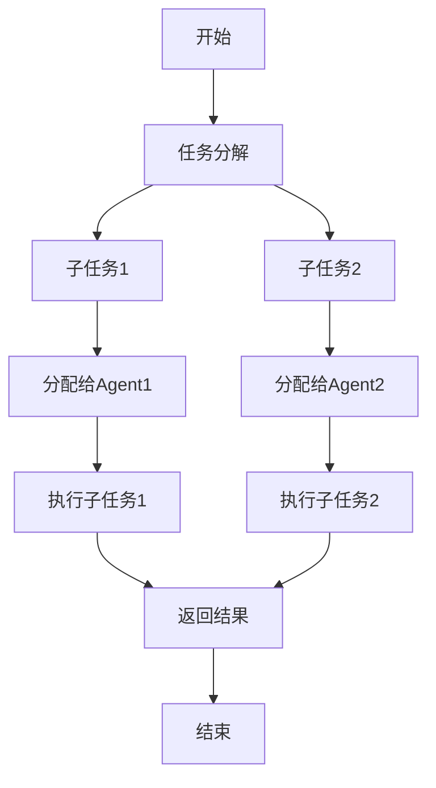
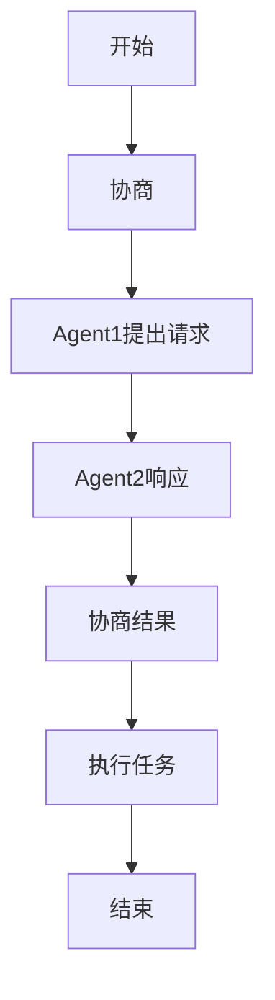
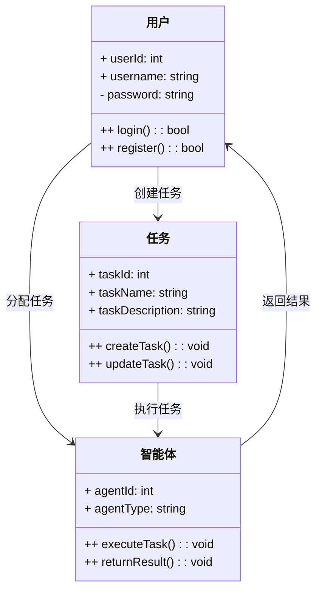

                 


# 多Agent协作系统：复杂任务的分解与协调

## 关键词
- 多Agent系统、复杂任务分解、任务协调、协作机制、系统架构、项目实战

## 摘要
多Agent协作系统是一种基于多个智能体（Agent）协作完成复杂任务的系统。本文将详细探讨多Agent协作系统的核心概念、任务分解与协调的算法原理、系统架构设计、项目实战以及最佳实践。通过本文，读者可以全面了解多Agent协作系统在复杂任务中的应用，掌握其实现的关键技术与方法。

---

## 第一部分：多Agent协作系统基础

### 第1章：多Agent协作系统概述

#### 1.1 多Agent系统的基本概念
多Agent系统（Multi-Agent System, MAS）由多个独立的智能体（Agent）组成，这些智能体能够通过协作完成复杂的任务。每个Agent都有自己的目标、知识、推理能力以及与环境和其他Agent交互的能力。

#### 1.2 复杂任务的分解与协调
复杂任务的分解是多Agent协作的核心，通过将任务分解为多个子任务，并分配给不同的Agent执行，可以提高系统的效率和灵活性。协调是确保各个Agent的任务分解和执行能够无缝衔接的关键。

---

## 第二部分：多Agent协作的核心概念与联系

### 第2章：多Agent协作的核心概念

#### 2.1 多Agent协作的原理
多Agent协作的原理包括任务分解、任务分配和任务协调。任务分解将复杂任务拆解为多个子任务，任务分配将子任务分配给不同的Agent，任务协调确保各个Agent的任务执行一致。

#### 2.2 多Agent协作的概念对比
通过对比单Agent和多Agent系统的优缺点，可以更好地理解多Agent协作的优势。例如，单Agent系统在任务复杂性增加时性能下降，而多Agent系统通过分解任务提高了系统的扩展性和容错性。

#### 2.3 多Agent协作的ER实体关系图
以下是多Agent协作系统的核心实体关系图：

```mermaid
er
actor(用户) -[创建任务]-> task(任务)
actor(用户) -[分配任务]-> agent(智能体)
agent(智能体) -[执行任务]-> task_execution(任务执行)
task_execution(任务执行) -[返回结果]-> actor(用户)
```

---

## 第三部分：多Agent协作的算法原理

### 第3章：任务分解与分配算法

#### 3.1 任务分解算法
任务分解算法将复杂任务拆解为多个子任务。例如，基于层次分解的任务分配算法：

1. 将任务分解为子任务，每个子任务由一个Agent执行。
2. 使用贪心算法选择最优的子任务分配方式。
3. 通过动态规划优化任务分解的效率。

以下是任务分解算法的流程图：



#### 3.2 协调算法
协调算法确保各个Agent的任务执行一致。例如，基于协商的协调算法：

1. Agent1和Agent2通过协商确定任务的优先级。
2. 通过规则或博弈论模型解决冲突。
3. 协调结果返回给所有相关的Agent。

以下是协商算法的流程图：



---

## 第四部分：系统分析与架构设计

### 第4章：系统架构设计

#### 4.1 系统功能设计
系统功能设计包括领域模型设计、功能模块划分和模块之间的关系。以下是领域模型图：



#### 4.2 系统架构图
以下是系统架构图：


---

## 第五部分：项目实战与案例分析

### 第5章：项目实战

#### 5.1 环境安装与配置
项目实战需要以下环境和工具：
- Python 3.8+
- pip
- Mermaid
- Jupyter Notebook

#### 5.2 核心代码实现
以下是任务分解与协调的核心代码实现：

```python
# 任务分解算法
def decompose_task(main_task):
    sub_tasks = []
    for task in main_task:
        if task == '子任务1':
            sub_tasks.append('子任务1')
        elif task == '子任务2':
            sub_tasks.append('子任务2')
    return sub_tasks

# 协调算法
def coordinate_agents(sub_tasks):
    for task in sub_tasks:
        assign_task(task)
    return '任务协调完成'
```

#### 5.3 代码解读与分析
代码实现了一个简单的任务分解和协调机制，通过函数调用完成任务分配和执行。

---

## 第六部分：最佳实践与总结

### 第6章：最佳实践与总结

#### 6.1 最佳实践
- 系统设计时要充分考虑扩展性和容错性。
- 开发过程中要注重代码的可维护性和可测试性。
- 测试阶段要覆盖所有可能的场景。

#### 6.2 项目小结
通过本文的讲解和实战，我们掌握了多Agent协作系统的核心技术，包括任务分解、协调机制和系统架构设计。

#### 6.3 拓展阅读
- 多Agent协作系统的最新研究进展
- 相关技术书籍推荐

---

以上是《多Agent协作系统：复杂任务的分解与协调》的技术博客文章。

