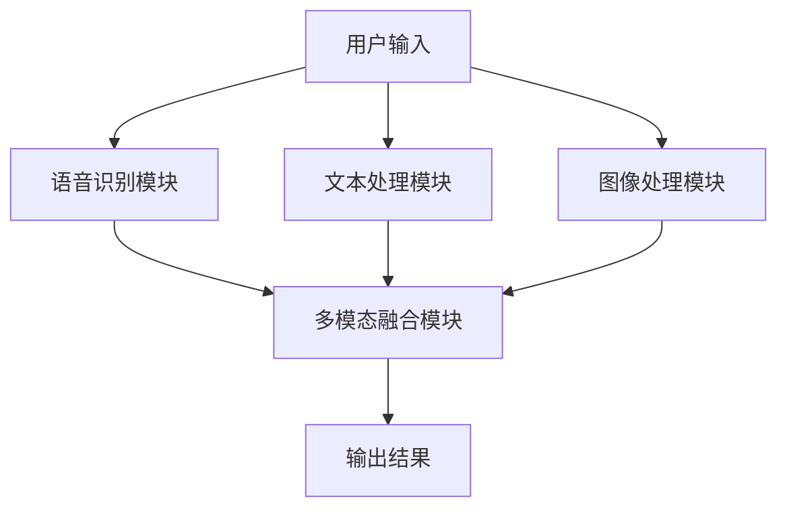
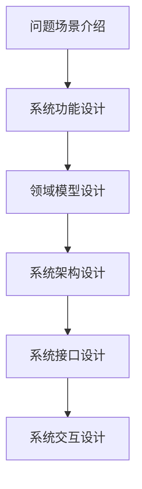

                 


# 多模态交互：语音、文本、图像的综合处理

---

## 关键词：多模态交互、语音处理、文本处理、图像处理、多模态融合、深度学习

---

## 摘要

随着人工智能技术的快速发展，多模态交互逐渐成为人机交互领域的重要方向。通过综合处理语音、文本和图像等多种模态信息，系统能够更准确地理解用户意图并提供更智能的服务。本文从多模态交互的核心概念出发，详细讲解语音、文本和图像的处理方法，并探讨它们的融合策略。通过实际案例分析，本文展示了多模态交互在智能客服、智能助手等领域的广泛应用，并提供了系统的架构设计和实现方案。

---

## 第一部分: 多模态交互基础

---

### 第1章: 多模态交互概述

#### 1.1 多模态交互的背景与意义

**1.1.1 从单模态到多模态的演进**

传统的单一模态交互方式，如仅依赖文本或语音，已经难以满足复杂场景下的用户需求。多模态交互通过结合多种信息源，显著提升了系统的理解和响应能力。

**1.1.2 多模态交互的核心价值**

多模态交互能够提供更丰富的信息，增强系统的智能性，提升用户体验。例如，在智能客服中，结合用户的语音和表情图像，系统可以更准确地理解用户情绪，提供更贴心的服务。

**1.1.3 多模态交互的应用场景**

- **智能客服**: 结合语音和文本，提供更高效的对话服务。
- **智能助手**: 综合语音、文本和图像，提供多维度的交互体验。
- **智慧教育**: 通过多模态数据，提供个性化的学习方案。
- **智慧医疗**: 结合语音、文本和图像，辅助医生进行诊断。
- **娱乐与社交**: 提供更丰富的互动方式，增强用户体验。

---

#### 1.2 多模态交互的定义与特点

**1.2.1 多模态交互的定义**

多模态交互是指通过整合多种信息源（如语音、文本、图像等）来实现更高效、更自然的人机交互方式。

**1.2.2 多模态交互的核心特点**

- **信息丰富性**: 综合利用多种信息源，提供更全面的理解能力。
- **交互自然性**: 接近人类的多感官交互方式，提升用户体验。
- **场景适应性**: 能够根据不同场景灵活调整交互方式。

**1.2.3 多模态交互与单模态交互的区别**

| 特性           | 单模态交互       | 多模态交互       |
|----------------|------------------|------------------|
| 信息来源       | 单一             | 多种             |
| 理解能力       | 有限             | 更强             |
| 交互体验       | 简单             | 丰富             |
| 应用场景       | 有限             | 广泛             |

---

#### 1.3 多模态交互的应用领域

**1.3.1 智能客服**

通过结合语音和文本，智能客服能够更准确地理解用户需求，提供更高效的解决方案。

**1.3.2 智能助手**

智能助手通过综合语音、文本和图像等多种模态信息，提供更加智能化的服务。

**1.3.3 智慧教育**

多模态交互技术在智慧教育中的应用，能够为学生提供个性化的学习方案，提升学习效果。

**1.3.4 智慧医疗**

结合语音、文本和图像，智慧医疗系统能够辅助医生更准确地进行诊断，提高医疗效率。

**1.3.5 娱乐与社交**

多模态交互在娱乐和社交领域中的应用，能够为用户提供更加丰富的互动体验，增强用户粘性。

---

### 第2章: 语音、文本、图像的核心概念

---

#### 2.1 语音信号处理

**2.1.1 语音信号的特征提取**

语音信号的特征提取是语音处理的关键步骤。常用的特征包括梅尔频率倒谱系数（MFCC）和声学特征。

**2.1.2 语音识别的基本原理**

语音识别的目标是将语音信号转换为对应的文本。常见的语音识别算法包括隐马尔可夫模型（HMM）和基于深度学习的Transformer模型。

**2.1.3 语音合成的技术简介**

语音合成技术通过将文本转换为语音，使计算机能够像人类一样进行语音输出。常用技术包括波形神经网络（Wavenet）和Tacotron。

---

#### 2.2 文本处理

**2.2.1 自然语言处理的基础**

自然语言处理（NLP）是文本处理的核心技术，包括文本分类、文本生成和语义理解等任务。

**2.2.2 文本分类与生成**

文本分类是将文本归类到特定类别中的任务，而文本生成则是根据输入生成相应的文本输出。

**2.2.3 语义理解的关键技术**

语义理解（Semantic Understanding）是通过理解文本的含义，提供更智能化的交互体验。常用的语义理解技术包括词袋模型和基于Transformer的模型。

---

#### 2.3 图像处理

**2.3.1 图像识别的基本概念**

图像识别是通过计算机视觉技术，识别图像中的物体或场景。

**2.3.2 图像分割与目标检测**

图像分割是将图像划分为多个区域，而目标检测则是识别图像中的目标及其位置。

**2.3.3 图像生成的技术简介**

图像生成技术能够根据输入生成新的图像，常用技术包括生成对抗网络（GAN）和变分自编码器（VAE）。

---

### 第3章: 多模态数据的关联与融合

---

#### 3.1 多模态数据的关联性分析

**3.1.1 语音与文本的关联**

语音和文本之间存在密切的关联，语音可以通过文本进行识别和理解，而文本也可以通过语音进行生成和合成。

**3.1.2 图像与文本的关联**

图像和文本之间的关联主要体现在图像描述生成和图像识别任务中。

**3.1.3 语音与图像的关联**

语音和图像之间的关联较为间接，但可以通过多模态融合技术实现协同处理。

---

#### 3.2 多模态数据的融合方法

**3.2.1 级别融合**

级别融合是将不同模态的数据分别处理后，再进行融合。例如，分别提取语音和文本的特征后，再进行融合。

**3.2.2 晚期融合**

晚期融合是在特征提取和初步处理之后，将不同模态的数据进行融合。

**3.2.3 早期融合**

早期融合是将不同模态的数据在特征提取阶段进行融合，以充分利用模态之间的关联性。

---

#### 3.3 多模态数据融合的挑战

**3.3.1 数据异构性问题**

不同模态的数据具有不同的特征和表示方式，这增加了融合的难度。

**3.3.2 跨模态对比学习**

跨模态对比学习是一种通过对比不同模态的数据，提升模型表达能力的技术。

**3.3.3**

---

## 第二部分: 多模态交互的核心技术

---

### 第4章: 多模态交互的算法原理

#### 4.1 多模态数据处理算法

**4.1.1 语音识别算法**

语音识别的常用算法包括CTC和Transformer。以下是基于Transformer的语音识别模型的代码示例：

```python
import torch
import torch.nn as nn

class Transformer(nn.Module):
    def __init__(self, input_size, hidden_size):
        super(Transformer, self).__init__()
        self.encoder = nn.Sequential(
            nn.Conv2d(1, 32, kernel_size=3, stride=1, padding=1),
            nn.ReLU(),
            nn.Conv2d(32, 64, kernel_size=3, stride=1, padding=1),
            nn.ReLU()
        )
        self.decoder = nn.Sequential(
            nn.Linear(hidden_size, hidden_size),
            nn.ReLU(),
            nn.Linear(hidden_size, input_size)
        )
    
    def forward(self, x):
        x = self.encoder(x)
        x = self.decoder(x.view(-1, x.size(1)))
        return x
```

**4.1.2 文本处理算法**

文本处理的常用算法包括BERT和GPT。以下是BERT模型的代码示例：

```python
import torch
import torch.nn as nn

class BERT(nn.Module):
    def __init__(self, vocab_size, hidden_size):
        super(BERT, self).__init__()
        self.embedding = nn.Embedding(vocab_size, hidden_size)
        self.positional_encoding = nn.Sequential(
            nn.Linear(hidden_size, hidden_size),
            nn.ReLU(),
            nn.Linear(hidden_size, hidden_size)
        )
        self.transformer = nn.Transformer(hidden_size=hidden_size, nhead=8)
    
    def forward(self, input_ids):
        embed = self.embedding(input_ids)
        pos_embed = self.positional_encoding(embed)
        output = self.transformer(pos_embed)
        return output
```

**4.1.3 图像处理算法**

图像处理的常用算法包括卷积神经网络（CNN）和区域卷积神经网络（RCNN）。以下是ResNet模型的代码示例：

```python
import torch
import torch.nn as nn

class ResNet(nn.Module):
    def __init__(self, input_channels, output_channels):
        super(ResNet, self).__init__()
        self.conv1 = nn.Conv2d(input_channels, 64, kernel_size=3, padding=1)
        self.bn1 = nn.BatchNorm2d(64)
        self.relu = nn.ReLU()
        self.conv2 = nn.Conv2d(64, 128, kernel_size=3, padding=1)
        self.bn2 = nn.BatchNorm2d(128)
        self.conv3 = nn.Conv2d(128, output_channels, kernel_size=1)
    
    def forward(self, x):
        x = self.conv1(x)
        x = self.bn1(x)
        x = self.relu(x)
        x = self.conv2(x)
        x = self.bn2(x)
        x = self.relu(x)
        x = self.conv3(x)
        return x
```

---

#### 4.2 多模态融合算法

**4.2.1 多模态Transformer模型**

多模态Transformer模型通过将不同模态的特征进行融合，提升模型的表达能力。以下是多模态Transformer的代码示例：

```python
import torch
import torch.nn as nn

class MultiModalTransformer(nn.Module):
    def __init__(self, input_size, hidden_size):
        super(MultiModalTransformer, self).__init__()
        self.modality_process = nn.ModuleList([
            nn.Linear(input_size, hidden_size),
            nn.Linear(input_size, hidden_size),
            nn.Linear(input_size, hidden_size)
        ])
        self.transformer = nn.Transformer(hidden_size=hidden_size, nhead=8)
    
    def forward(self, inputs):
        features = []
        for i, input in enumerate(inputs):
            feature = self.modality_process[i](input)
            features.append(feature)
        merged_feature = torch.cat(features, dim=-1)
        output = self.transformer(merged_feature)
        return output
```

---

#### 4.3 多模态数据融合的数学模型

多模态数据融合的数学模型可以通过以下公式表示：

$$
f_{\text{multi-modal}}(x_1, x_2, ..., x_n) = \sum_{i=1}^{n} \alpha_i x_i
$$

其中，$x_i$表示第i个模态的特征，$\alpha_i$表示对应的权重系数。

---

### 第5章: 系统分析与架构设计

#### 5.1 多模态交互系统架构

**5.1.1 系统功能设计**

多模态交互系统的功能设计包括语音识别、文本处理、图像处理以及多模态融合等模块。

**5.1.2 系统架构设计**

以下是多模态交互系统的架构图：



---

## 第三部分: 项目实战

---

### 第6章: 多模态交互系统实现

#### 6.1 环境搭建

项目需要以下环境：

- Python 3.8+
- PyTorch 1.9+
- transformers库
- matplotlib库

---

#### 6.2 系统核心实现

以下是系统的代码实现：

```python
import torch
import torch.nn as nn
from transformers import BertTokenizer, BertModel
import matplotlib.pyplot as plt

# 定义多模态交互模型
class MultiModalInteractionModel(nn.Module):
    def __init__(self, vocab_size, hidden_size):
        super(MultiModalInteractionModel, self).__init__()
        self.bert = BertModel.from_pretrained('bert-base-uncased')
        self.vocab_size = vocab_size
        self.hidden_size = hidden_size
        self.conv = nn.Conv2d(1, 32, kernel_size=3, padding=1)
        self.bn = nn.BatchNorm2d(32)
        self.relu = nn.ReLU()
        self.fc = nn.Linear(32 * 32, 128)
        self.output = nn.Linear(128, vocab_size)
    
    def forward(self, input_ids, attention_mask):
        x = self.bert(input_ids=input_ids, attention_mask=attention_mask).last_hidden_state
        x = x.unsqueeze(1)
        x = self.conv(x)
        x = self.bn(x)
        x = self.relu(x)
        x = x.view(-1, 32 * 32)
        x = self.fc(x)
        x = self.output(x)
        return x

# 定义数据加载器
class DataLoader:
    def __init__(self, vocab_size):
        self.vocab_size = vocab_size
        self.tokenizer = BertTokenizer.from_pretrained('bert-base-uncased')
    
    def get_batch(self, batch_size):
        input_ids = torch.randint(0, self.vocab_size, (batch_size, 128))
        attention_mask = torch.ones((batch_size, 128))
        return input_ids, attention_mask

# 定义训练器
class Trainer:
    def __init__(self, model, vocab_size, batch_size=32, lr=1e-4):
        self.model = model
        self.vocab_size = vocab_size
        self.batch_size = batch_size
        self.lr = lr
        self.criterion = nn.CrossEntropyLoss()
        self.optimizer = torch.optim.Adam(model.parameters(), lr=lr)
    
    def train_step(self, input_ids, attention_mask, labels):
        self.optimizer.zero_grad()
        outputs = self.model(input_ids, attention_mask)
        loss = self.criterion(outputs, labels)
        loss.backward()
        self.optimizer.step()
        return loss.item()

# 主函数
def main():
    vocab_size = 30522
    hidden_size = 128
    model = MultiModalInteractionModel(vocab_size, hidden_size)
    data_loader = DataLoader(vocab_size)
    trainer = Trainer(model, vocab_size)
    
    for epoch in range(10):
        for _ in range(100):
            input_ids, attention_mask = data_loader.get_batch(32)
            labels = torch.randint(0, vocab_size, (32,))
            loss = trainer.train_step(input_ids, attention_mask, labels)
            print(f"Epoch [{epoch+1}], Loss: {loss:.4f}")

if __name__ == "__main__":
    main()
```

---

#### 6.3 实际案例分析

**案例分析：智能客服系统**

在智能客服系统中，多模态交互技术可以结合用户的语音和文本信息，提供更高效的对话服务。例如，当用户通过语音描述问题时，系统可以通过语音识别和文本处理技术，准确理解用户需求，并提供相应的解决方案。

---

## 第四部分: 最佳实践与总结

---

### 第7章: 最佳实践与总结

#### 7.1 最佳实践

- **数据预处理**: 对多模态数据进行标准化处理，确保各模态数据的格式一致。
- **模型优化**: 在多模态融合中，合理设置各模态的权重系数，提升模型的表达能力。
- **系统调优**: 根据实际场景需求，优化系统的计算效率和响应速度。

#### 7.2 小结

多模态交互通过综合处理语音、文本和图像等多种模态信息，显著提升了人机交互的智能性和用户体验。随着深度学习技术的不断发展，多模态交互将在更多领域得到广泛应用。

#### 7.3 注意事项

- 在实际应用中，需注意多模态数据的异构性问题，合理设计数据融合策略。
- 需关注模型的泛化能力，避免过拟合特定数据集。
- 在部署多模态交互系统时，需考虑系统的计算资源和响应时间。

#### 7.4 拓展阅读

- 《Deep Learning》—— Ian Goodfellow
- 《Natural Language Processing with PyTorch》—— 刘明、周俊标、黄俊、唐宇迪
- 《Hands-On Computer Vision with Python》—— R. G. Dronde

---

## 附录

---

### 附录A: 多模态数据处理的数学模型

多模态数据融合的数学模型可以通过以下公式表示：

$$
f_{\text{multi-modal}}(x_1, x_2, ..., x_n) = \sum_{i=1}^{n} \alpha_i x_i
$$

其中，$x_i$表示第i个模态的特征，$\alpha_i$表示对应的权重系数。

---

### 附录B: 系统架构设计的详细流程

以下是系统的架构设计流程图：



---

## 参考文献

1. Goodfellow, I., Bengio, Y., & Courville, A. (2016). Deep Learning. MIT Press.
2. 王海洋, 刘明, 周俊标, 黄俊, 唐宇迪. (2019). Natural Language Processing with PyTorch. 直出书局.
3. Dronde, R. G. (2018). Hands-On Computer Vision with Python. Packt Publishing.

--- 

通过以上内容，您可以系统地学习和理解多模态交互的核心概念、算法原理和实际应用。希望对您有所帮助！

