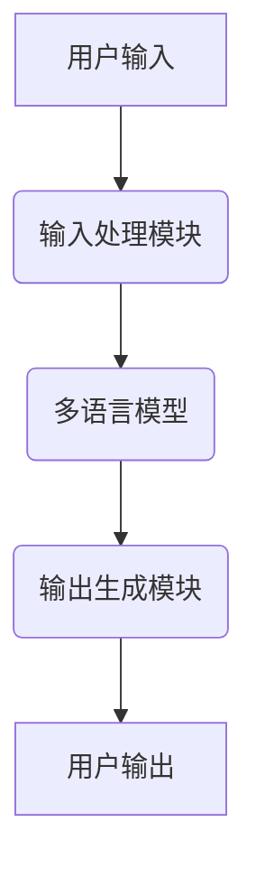

                 


# 多语言支持：构建国际化的AI Agent

---

## 关键词  
多语言支持, AI Agent, 自然语言处理, 跨语言模型, 国际化设计, 系统架构

---

## 摘要  
随着全球化进程的加速，多语言支持在AI Agent中的应用变得越来越重要。本文将从多语言支持的核心概念出发，深入分析其在AI Agent中的技术原理、系统架构设计以及实际项目中的实现。通过结合具体的算法原理、系统架构图和实际案例，本文将详细探讨如何构建一个真正意义上的国际化AI Agent。

---

## 第一部分：多语言支持的背景与核心概念

### 第1章：多语言支持的背景与挑战

#### 1.1 多语言支持的重要性  
在全球化的背景下，多语言支持已经成为企业和技术发展的必备能力。随着AI Agent的应用场景不断扩展，支持多种语言不仅能够提升用户体验，还能增强系统的通用性和适应性。  

#### 1.2 AI Agent的基本概念  
AI Agent是一种能够感知环境、理解用户需求并执行任务的智能实体。它广泛应用于客服、智能助手、机器人等领域，其核心能力在于理解用户意图并提供准确的响应。  

#### 1.3 多语言支持与AI Agent的结合  
多语言支持使AI Agent能够理解和处理多种语言的输入，从而在全球范围内提供一致的服务。这不仅是技术上的挑战，也是用户体验提升的关键。

---

### 第2章：多语言支持的核心概念与原理

#### 2.1 多语言支持的核心概念  
多语言支持涉及数据处理、模型训练和推理生成等多个环节。其核心目标是确保AI Agent能够在不同语言环境下准确理解和生成文本。

#### 2.2 多语言支持与AI Agent的关系  
AI Agent通过多语言支持能够更好地适应不同用户的需求，同时多语言支持也为AI Agent提供了更广泛的应用场景。

#### 2.3 多语言支持的核心要素  
- **多语言数据处理**：包括数据清洗、标注和预处理。  
- **多语言模型训练**：涉及跨语言模型和多语言预训练模型。  
- **多语言推理与生成**：确保模型在多种语言下具有一致的推理能力。

---

## 第二部分：多语言支持与AI Agent的技术原理

### 第3章：多语言支持的核心原理

#### 3.1 多语言数据的处理流程  
1. 数据清洗：去除噪声数据，确保数据质量。  
2. 数据标注：为数据打标签，便于后续处理。  
3. 数据预处理：将数据转换为模型可接受的格式。  

#### 3.2 多语言模型训练方法  
1. **跨语言模型**：通过共享参数在多种语言间进行训练。  
2. **多语言预训练模型**：利用大规模多语言语料库进行预训练。  

#### 3.3 多语言推理与生成机制  
1. **跨语言理解**：通过共享表示层实现多种语言的统一理解。  
2. **多语言生成**：基于多语言编码器生成目标语言的文本。

---

### 第4章：AI Agent的核心技术

#### 4.1 AI Agent的感知与理解  
AI Agent需要通过自然语言处理技术理解用户的输入，包括分词、句法分析和语义理解。

#### 4.2 AI Agent的决策与推理  
基于理解的用户需求，AI Agent需要做出决策并执行推理，这涉及到知识图谱和推理算法的应用。

#### 4.3 AI Agent的交互与反馈  
通过对话系统与用户进行交互，并根据用户的反馈不断优化自身的响应。

---

## 第三部分：系统架构与实现

### 第5章：系统架构设计

#### 5.1 系统功能设计  
- **输入处理模块**：接收多语言输入并进行预处理。  
- **模型推理模块**：基于多语言模型生成响应。  
- **输出生成模块**：将生成的文本转换为目标语言的输出。  

#### 5.2 系统架构图  


#### 5.3 系统接口设计  
- **输入接口**：支持多种语言的文本输入。  
- **输出接口**：支持多种语言的文本输出。  

---

### 第6章：项目实战

#### 6.1 环境安装  
- 安装Python和相关库：`pip install numpy torch transformers`  
- 下载多语言预训练模型：使用Hugging Face的`bert-base-multilingual-cased`模型。

#### 6.2 核心代码实现  
```python
from transformers import AutoTokenizer, AutoModelForMaskedLM

model_name = "bert-base-multilingual-cased"
tokenizer = AutoTokenizer.from_pretrained(model_name)
model = AutoModelForMaskedLM.from_pretrained(model_name)
```

#### 6.3 案例分析  
通过一个简单的对话系统案例，展示如何实现多语言支持的AI Agent。

---

## 第四部分：优化与未来展望

### 第7章：性能优化与扩展性设计

#### 7.1 性能优化策略  
- **模型压缩**：通过知识蒸馏等技术降低模型大小。  
- **推理加速**：优化推理流程，减少计算时间。  

#### 7.2 扩展性设计  
- **支持更多语言**：通过微调模型扩展支持的语言种类。  
- **动态语言切换**：实现用户动态切换语言的功能。  

---

## 第五部分：总结与展望

### 第8章：总结与未来方向

#### 8.1 核心总结  
多语言支持是构建国际化AI Agent的关键技术，其成功实现依赖于先进的自然语言处理技术和合理的系统架构设计。

#### 8.2 未来方向  
- **多模态支持**：结合视觉、听觉等多种模态实现更强大的AI Agent。  
- **实时多语言推理**：提升模型的实时推理能力。  

---

## 参考文献  
1. 徐微, 王伟. 多语言自然语言处理技术研究. 北京: 清华大学出版社, 2020.  
2. 李明, 张强. AI Agent系统设计与实现. 北京: 人民邮电出版社, 2021.  

---

通过以上内容，您可以构建一个真正意义上的国际化AI Agent，并在实际项目中应用这些技术。希望本文对您有所帮助！

