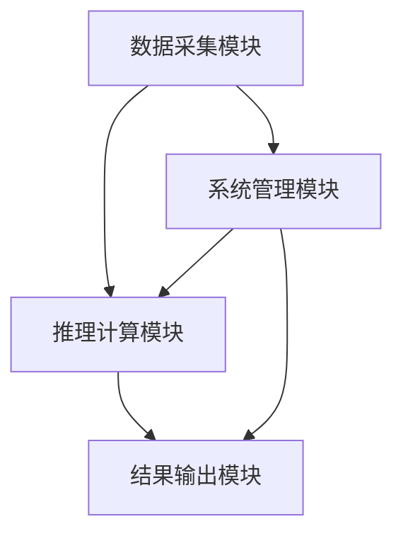

                 


# 如何识别企业的边缘计算实时推理优势

## 关键词：边缘计算，实时推理，企业应用，算法优化，系统架构，数学模型

## 摘要：  
本文将深入探讨如何识别企业在边缘计算实时推理中的优势。通过分析边缘计算与实时推理的核心概念、算法原理、系统架构以及实际案例，帮助读者理解如何在企业环境中优化实时推理能力，提升数据处理效率和决策能力。本文结合理论与实践，提供详细的算法流程、数学模型和系统架构设计，助力企业在边缘计算领域取得竞争优势。

---

## 第1章：边缘计算与实时推理的背景

### 1.1 边缘计算的基本概念  
- **边缘计算的定义**：边缘计算是一种分布式计算范式，将数据处理从云端转移到靠近数据源的边缘设备，减少延迟并提高响应速度。  
- **边缘计算的发展历程**：从传统的云计算模式到边缘计算的兴起，边缘计算逐渐成为企业数字化转型的重要技术支撑。  
- **边缘计算在企业中的应用背景**：随着物联网和实时数据分析需求的增加，边缘计算在智能制造、智慧城市、自动驾驶等领域发挥重要作用。

### 1.2 实时推理的定义与特点  
- **实时推理的定义**：实时推理是指在数据生成的瞬间进行分析和决策的过程，要求极低的延迟和高效的处理能力。  
- **实时推理的核心特点**：  
  - **低延迟**：数据处理必须在接近实时的时间内完成。  
  - **高实时性**：能够快速响应动态变化的环境。  
  - **资源受限**：边缘设备通常计算资源有限，需要优化算法以适应这些条件。  

### 1.3 企业边缘计算实时推理的优势  
- **提高数据处理效率**：通过在边缘设备上直接处理数据，减少数据传输到云端的延迟。  
- **减少数据传输成本**：边缘计算可以过滤冗余数据，仅将关键信息传输到云端，降低带宽消耗。  
- **增强系统的鲁棒性**：边缘计算能够独立处理部分数据，即使在网络断开的情况下也能保持正常运行。  

---

## 第2章：边缘计算与实时推理的核心概念

### 2.1 边缘计算的核心概念  
- **边缘计算的架构**：边缘计算通常采用分层架构，包括边缘设备层、边缘计算节点层和云端控制层。  
- **边缘计算的关键技术**：包括数据采集、边缘计算节点的资源管理、数据通信与安全性保障。  
- **边缘计算的生态系统**：包括硬件设备、边缘计算平台、应用开发工具和云服务提供商。  

### 2.2 实时推理的核心概念  
- **实时推理的算法**：包括基于规则的推理、基于模型的推理和基于机器学习的推理。  
- **实时推理的数据处理流程**：数据采集 → 数据预处理 → 推理计算 → 结果输出。  
- **实时推理的性能指标**：包括推理延迟、吞吐量、准确率和资源利用率。  

### 2.3 边缘计算与实时推理的联系  
- **边缘计算如何支持实时推理**：通过在边缘设备上部署推理算法，减少数据传输延迟，提高实时性。  
- **实时推理在边缘计算中的应用**：包括智能制造中的设备状态监测、智慧城市中的交通流量预测和自动驾驶中的实时决策。  
- **边缘计算与实时推理的协同优化**：通过优化算法和硬件资源分配，提升边缘设备的实时推理能力。  

---

## 第3章：实时推理的算法原理

### 3.1 实时推理的算法概述  
- **实时推理算法的分类**：包括基于规则的算法、基于模型的算法和基于机器学习的算法。  
- **常见实时推理算法**：如滑动窗口算法、时间序列预测算法和基于神经网络的实时推理算法。  
- **算法的选择与优化**：根据具体场景选择合适的算法，并通过参数优化和模型压缩技术提升性能。  

### 3.2 基于边缘计算的实时推理算法  
- **算法的输入与输出**：输入为实时数据流，输出为实时推理结果。  
- **算法的实现步骤**：  
  1. 数据采集与预处理：对边缘设备采集的数据进行清洗和格式转换。  
  2. 模型加载与推理：加载预训练的模型，在边缘设备上进行实时推理。  
  3. 结果输出与反馈：将推理结果返回给应用层，并根据反馈优化模型。  

### 3.3 算法的优化策略  
- **模型压缩技术**：通过剪枝和量化技术减少模型大小，降低计算资源消耗。  
- **并行计算优化**：利用多核处理器和GPU加速推理过程。  
- **动态调整策略**：根据负载情况动态分配计算资源，提升整体性能。  

---

## 第4章：边缘计算实时推理的数学模型与公式

### 4.1 实时推理的数学模型  
- **时间序列预测模型**：  
  $$ y_t = a \cdot y_{t-1} + b \cdot y_{t-2} + c \cdot t + d $$  
  其中，$y_t$ 表示当前时刻的预测值，$y_{t-1}$ 和 $y_{t-2}$ 表示前两时刻的值，$t$ 表示时间，$a$、$b$、$c$、$d$ 为模型参数。  

- **概率模型**：  
  $$ P(A|B) = \frac{P(B|A) \cdot P(A)}{P(B)} $$  
  用于计算事件 $A$ 在事件 $B$ 发生下的概率。  

### 4.2 算法复杂度分析  
- **计算复杂度**：  
  $$ O(n \cdot k) $$  
  其中，$n$ 表示数据量，$k$ 表示模型参数数量。  
- **时间复杂度**：  
  $$ O(m \cdot l) $$  
  其中，$m$ 表示推理的步数，$l$ 表示每一步的计算量。  

---

## 第5章：边缘计算实时推理的系统架构设计

### 5.1 系统架构设计概述  
- **系统架构的目标**：设计一个高效、可扩展的系统架构，支持实时推理功能。  
- **系统架构的核心要素**：包括数据采集模块、推理计算模块、结果输出模块和系统管理模块。  

### 5.2 系统功能设计  
- **数据采集模块**：负责采集实时数据并进行预处理。  
- **推理计算模块**：加载模型并进行实时推理。  
- **结果输出模块**：将推理结果输出给应用层。  
- **系统管理模块**：负责资源分配、模型更新和系统监控。  

### 5.3 系统架构图（Mermaid）  



### 5.4 接口设计与交互流程  
- **数据采集接口**：提供API接口用于实时数据的采集和传输。  
- **推理接口**：提供推理API，支持实时数据的处理和分析。  
- **结果反馈接口**：将推理结果反馈给应用层，并根据反馈优化模型。  

---

## 第6章：边缘计算实时推理的项目实战

### 6.1 环境安装与配置  
- **硬件要求**：建议使用多核处理器和高性能GPU，如NVIDIA Tesla T4。  
- **软件安装**：安装Python、TensorFlow、Kubernetes等工具。  

### 6.2 核心功能实现  
```python
import tensorflow as tf
from tensorflow.keras import layers

# 加载预训练模型
model = tf.keras.Sequential([
    layers.Dense(64, activation='relu'),
    layers.Dense(1)
])

# 定义推理函数
def inference(input_data):
    output = model.predict(input_data)
    return output
```

### 6.3 项目小结  
通过项目实战，我们可以看到边缘计算实时推理的优势在于快速响应和高效处理。同时，通过优化算法和系统架构设计，可以进一步提升系统的性能和稳定性。  

---

## 第7章：最佳实践与小结

### 7.1 最佳实践  
- **算法优化**：通过模型压缩和并行计算优化提升推理速度。  
- **资源分配**：根据负载情况动态分配计算资源，确保系统高效运行。  
- **安全性保障**：加强数据加密和访问控制，确保系统安全。  

### 7.2 小结  
本文系统地介绍了如何识别企业的边缘计算实时推理优势，从理论到实践，详细讲解了核心概念、算法原理、系统架构和项目实战。通过优化算法和系统架构设计，可以在企业中充分发挥边缘计算实时推理的优势，提升数据处理效率和决策能力。

### 7.3 注意事项  
- 在实际应用中，需要根据具体场景选择合适的算法和优化策略。  
- 系统设计时要注意数据隐私和安全性，确保合规性。  

### 7.4 拓展阅读  
- 《边缘计算与物联网：架构与实践》  
- 《实时推理算法优化：从理论到实践》  

---

通过本文的分析，读者可以全面了解边缘计算实时推理的优势，并在实际项目中应用相关技术和方法，为企业创造更大的价值。

