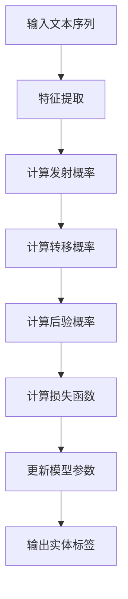
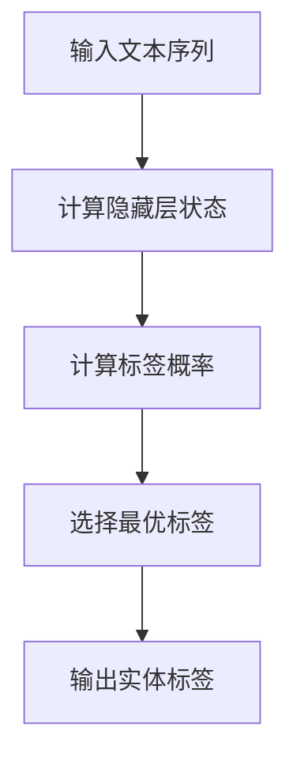

                 


# 第3章: 实体提取的算法原理

## 3.1 基于条件随机场（CRF）的实体提取

### 3.1.1 条件随机场（CRF）的基本原理
条件随机场是一种概率性无向图模型，常用于序列标注任务。CRF通过考虑相邻标签之间的关系，能够有效捕捉到上下文信息，从而提高实体提取的准确性。

#### 3.1.1.1 CRF的概率模型
CRF的概率公式如下：

$$ P(y|x) = \frac{1}{Z(x)} \exp\left( \sum_{i=1}^{n} \sum_{k=1}^{m} w_k f_k(x_i, y_{i-1}, y_i) \right) $$

其中：
- \( y \) 是标签序列。
- \( x \) 是输入文本序列。
- \( Z(x) \) 是归一化因子。
- \( w_k \) 是权重参数。
- \( f_k \) 是特征函数。

#### 3.1.1.2 CRF的工作流程
CRF通过以下步骤实现实体提取：
1. **输入文本序列**：将输入文本分割为字符或词。
2. **计算发射概率**：根据每个位置的特征计算标签的发射概率。
3. **计算转移概率**：考虑相邻标签之间的关系，计算转移概率。
4. **计算后验概率**：结合发射和转移概率，计算每个标签的后验概率。
5. **计算损失函数**：使用CRF的损失函数计算损失。
6. **更新模型参数**：通过反向传播优化模型参数。



#### 3.1.1.3 CRF的Python实现
以下是一个简单的CRF实现示例：

```python
import numpy as np

class CRF:
    def __init__(self, input_dim, output_dim):
        self.weights = np.random.randn(output_dim, input_dim)
        self.bias = np.zeros(output_dim)
        
    def forward(self, features):
        # features shape: (seq_len, input_dim)
        # Compute emission scores
        emission = np.dot(features, self.weights.T) + self.bias
        return emission
        
    def crf_loss(self, emission, labels):
        # labels shape: (seq_len,)
        # Compute the loss using CRF
        return np.mean(-emission[labels])
        
    def fit(self, features, labels, epochs=100):
        for _ in range(epochs):
            emission = self.forward(features)
            loss = self.crf_loss(emission, labels)
            # Update weights
            dw = np.zeros_like(self.weights)
            for i in range(len(labels)):
                dw[:, labels[i]] += features[i]
            self.weights += 0.01 * dw
            
    def predict(self, features):
        emission = self.forward(features)
        return np.argmax(emission, axis=1)
```

### 3.1.2 CRF的优缺点
CRF在实体提取中表现出色，但也有其局限性：
- **优点**：能够有效捕捉上下文信息，模型性能稳定。
- **缺点**：训练速度较慢，对特征工程依赖较高。

## 3.2 基于循环神经网络（RNN）的实体提取

### 3.2.1 循环神经网络（RNN）的基本原理
RNN通过处理序列数据，能够捕捉到文本的时序信息。在实体提取中，RNN常用于捕捉上下文信息，辅助标签预测。

#### 3.2.1.1 RNN的数学模型
RNN的基本模型如下：

$$ s_t = \text{tanh}(W_s x_t + U_s s_{t-1} + b_s) $$
$$ y_t = W_y s_t + b_y $$

其中：
- \( s_t \) 是第\( t \)个时间步的隐藏层状态。
- \( x_t \) 是第\( t \)个输入特征。
- \( y_t \) 是第\( t \)个输出标签的概率分布。

#### 3.2.1.2 RNN的工作流程
RNN通过以下步骤实现实体提取：
1. **输入文本序列**：将输入文本分割为字符或词。
2. **计算隐藏层状态**：根据当前输入和前一时间步的状态计算隐藏层状态。
3. **计算标签概率**：根据隐藏层状态计算每个标签的概率分布。
4. **选择最优标签**：根据概率分布选择最终的实体标签。



#### 3.2.1.3 RNN的Python实现
以下是一个简单的RNN实现示例：

```python
import numpy as np

class RNN:
    def __init__(self, input_dim, hidden_dim, output_dim):
        self.W_s = np.random.randn(hidden_dim, input_dim)
        self.W_y = np.random.randn(output_dim, hidden_dim)
        self.b_s = np.zeros((hidden_dim, 1))
        self.b_y = np.zeros((output_dim, 1))
        
    def forward(self, features):
        # features shape: (seq_len, input_dim)
        # Initialize hidden state
        h = np.zeros((features.shape[0], self.hidden_dim))
        # Compute hidden states
        for i in range(features.shape[0]):
            h[i] = np.tanh(np.dot(self.W_s, features[i]) + self.b_s)
        # Compute outputs
        output = np.dot(self.W_y, h.T).T
        return output
        
    def loss(self, output, labels):
        # labels shape: (seq_len,)
        # Compute cross-entropy loss
        return -np.mean(np.log(output[np.arange(len(output)), labels]))
        
    def fit(self, features, labels, epochs=100):
        for _ in range(epochs):
            output = self.forward(features)
            loss = self.loss(output, labels)
            # Update weights
            dW_y = np.dot((output - np.eye(len(output))[labels]).T, h)
            dW_s = np.dot((output - np.eye(len(output))[labels]).T, features)
            self.W_y -= 0.01 * dW_y
            self.W_s -= 0.01 * dW_s
            
    def predict(self, features):
        output = self.forward(features)
        return np.argmax(output, axis=1)
```

### 3.2.2 RNN的优缺点
RNN在实体提取中表现良好，但也有其局限性：
- **优点**：能够捕捉时序信息，适用于长序列数据。
- **缺点**：存在梯度消失问题，难以捕捉长距离依赖关系。

## 3.3 实体提取算法的对比分析

### 3.3.1 CRF与RNN的对比
以下是对CRF和RNN在实体提取中的优缺点对比：

| 对比维度 | CRF | RNN |
|----------|-----|-----|
| **训练速度** | 较慢 | 较快 |
| **模型复杂度** | 高 | 中 |
| **是否需要特征工程** | 是 | 否 |
| **是否考虑上下文** | 是 | 是 |
| **序列建模能力** | 强 | 强 |
| **模型表达能力** | 较强 | 较弱 |
| **适用场景** | 适合特征明确的任务 | 适合时序信息丰富的任务 |
| **代码实现难度** | 高 | 中 |

### 3.3.2 实体提取算法的适用场景
- **CRF**：适用于特征工程较为完善的场景，且需要精确捕捉上下文关系的任务。
- **RNN**：适用于时序信息较为丰富的场景，且对特征工程依赖较低的任务。

---

## 总结
通过本章的学习，我们详细探讨了条件随机场（CRF）和循环神经网络（RNN）在实体提取中的原理和实现。两种算法各有优劣，适用于不同的场景。在实际应用中，建议根据具体需求选择合适的算法，并结合其他技术（如预训练语言模型）进一步提升实体提取的准确性和效率。

