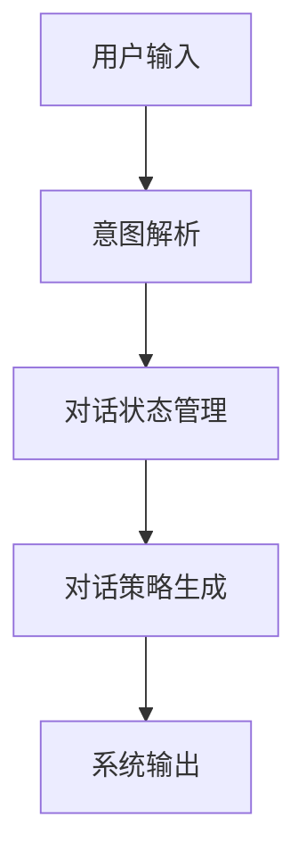

                 


# 对话管理系统：构建流畅自然的人机交互

> **关键词**：对话管理系统、自然语言处理、人机交互、深度学习、系统架构、算法原理

> **摘要**：对话管理系统是实现流畅自然人机交互的核心技术，本文将从对话管理系统的背景与概念、对话流程与交互机制、算法原理、系统架构设计、项目实战等多个方面展开，全面解析对话管理系统的构建过程。通过详细讲解对话管理的核心概念、算法实现、系统架构以及实际案例，帮助读者理解如何设计和实现一个高效的对话管理系统。

---

## 第1章: 对话管理系统的背景与概念

### 1.1 对话管理的基本概念

#### 1.1.1 对话的定义与背景
对话是指两个或多个实体之间通过语言进行信息交换的过程。在人机交互中，对话管理是实现用户与机器之间有效沟通的关键技术。随着人工智能技术的发展，对话系统广泛应用于智能客服、智能助手、智能音箱等领域。

#### 1.1.2 对话管理的核心问题
- **用户意图的理解**：准确识别用户的意图是对话管理的第一步。
- **对话状态的维护**：跟踪对话的上下文信息，确保系统能够根据当前对话状态生成合适的回应。
- **对话策略的优化**：制定对话策略，以实现高效的用户交互。

#### 1.1.3 对话管理的边界与外延
对话管理的边界包括用户输入、系统输出以及对话状态的更新。外延则涉及自然语言处理、机器学习、系统架构等多个领域。

### 1.2 对话管理系统的组成与功能

#### 1.2.1 对话管理系统的组成要素
- **用户输入解析模块**：解析用户的输入，提取意图和实体。
- **对话状态管理模块**：维护对话的状态，包括当前意图、上下文信息等。
- **对话策略生成模块**：根据对话状态生成合适的回应。
- **系统输出生成模块**：将策略生成的回应转化为自然语言输出。

#### 1.2.2 对话管理系统的功能模块
- **意图识别**：识别用户的意图，例如“查询天气”、“预订机票”等。
- **实体识别**：识别用户输入中的关键实体，例如地点、时间、人名等。
- **对话上下文管理**：维护对话的上下文信息，确保系统能够根据上下文生成合适的回应。
- **对话策略优化**：优化对话策略，以提高用户体验。

#### 1.2.3 对话管理系统的应用场景
- **智能客服**：通过对话系统为用户提供高效的服务。
- **智能助手**：例如Siri、Alexa等智能助手，能够与用户进行自然对话。
- **智能音箱**：通过对话系统实现与用户的交互。

### 1.3 对话管理系统的分类与特点

#### 1.3.1 基于规则的对话管理
基于规则的对话管理是通过预定义的规则来生成对话回应。优点是实现简单，缺点是灵活性较差。

#### 1.3.2 基于统计的对话管理
基于统计的对话管理通过分析大量对话数据，利用统计方法生成对话回应。优点是灵活性较高，缺点是需要大量的数据支持。

#### 1.3.3 基于深度学习的对话管理
基于深度学习的对话管理利用神经网络模型，通过端到端的训练生成对话回应。优点是能够处理复杂的对话场景，缺点是需要大量的计算资源和数据支持。

---

## 第2章: 对话流程与交互机制

### 2.1 对话流程的定义与分析

#### 2.1.1 对话流程的基本阶段
- **用户输入**：用户输入一句话或一个问题。
- **系统解析**：系统解析用户的输入，提取意图和实体。
- **系统生成回应**：系统根据解析结果生成回应。
- **用户反馈**：用户对系统的回应进行反馈，对话继续或结束。

#### 2.1.2 对话流程的驱动因素
- **用户意图**：用户的需求和目标。
- **对话状态**：当前对话的上下文信息。
- **系统策略**：系统的对话策略和规则。

#### 2.1.3 对话流程的优化方向
- **提高意图识别的准确率**。
- **优化对话策略，提高用户体验**。
- **增强对话的流畅性**。

### 2.2 对话交互的核心机制

#### 2.2.1 用户意图的理解与识别
- **意图识别**：通过自然语言处理技术，识别用户的意图。
- **实体识别**：识别用户输入中的关键实体，例如地点、时间等。

#### 2.2.2 系统意图的生成与表达
- **对话策略生成**：根据对话状态生成合适的对话策略。
- **系统回应生成**：将策略转化为自然语言输出。

#### 2.2.3 对话状态的维护与更新
- **对话上下文管理**：维护对话的上下文信息，确保系统能够根据上下文生成合适的回应。
- **对话历史记录**：记录对话历史，以便在需要时回溯。

### 2.3 对话管理中的上下文处理

#### 2.3.1 上下文信息的采集与存储
- **采集**：通过解析用户输入和系统回应，提取上下文信息。
- **存储**：将上下文信息存储在对话状态中，以便后续使用。

#### 2.3.2 上下文信息的关联与推理
- **关联**：将当前对话与历史对话关联起来，确保对话的连贯性。
- **推理**：根据上下文信息进行推理，生成合适的对话回应。

#### 2.3.3 上下文信息的更新与维护
- **更新**：根据对话的进展，实时更新对话状态。
- **维护**：确保对话状态的准确性和完整性。

---

## 第3章: 对话管理系统的算法原理

### 3.1 对话管理的算法框架

#### 3.1.1 基于规则的对话管理算法
- **规则定义**：预定义对话规则，例如“当用户询问天气时，系统回答当前天气情况”。
- **优点**：实现简单，易于理解和维护。
- **缺点**：灵活性较差，难以应对复杂场景。

#### 3.1.2 基于统计的对话管理算法
- **统计模型**：利用统计方法，例如马尔可夫链，分析对话数据，生成对话回应。
- **优点**：灵活性较高，能够处理复杂的对话场景。
- **缺点**：需要大量的数据支持。

#### 3.1.3 基于深度学习的对话管理算法
- **神经网络模型**：利用循环神经网络（RNN）或 transformer 模型，通过端到端的训练生成对话回应。
- **优点**：能够处理复杂的对话场景，生成自然流畅的回应。
- **缺点**：需要大量的计算资源和数据支持。

### 3.2 基于深度学习的对话管理算法详解

#### 3.2.1 状态转移模型
- **定义**：状态转移模型通过马尔可夫链描述对话状态的转移过程。
- **公式**：$$ P(s' | s, a) $$
  其中，\( P(s' | s, a) \) 表示在当前状态 \( s \) 和动作 \( a \) 下，转移到状态 \( s' \) 的概率。

#### 3.2.2 对话策略优化
- **目标函数**：$$ \max_{\theta} \sum_{t=1}^T R(s_t, a_t) $$
  其中，\( R(s_t, a_t) \) 表示在时间 \( t \) 处于状态 \( s_t \) 并采取动作 \( a_t \) 的奖励值。
- **方法**：利用强化学习算法，例如策略梯度法，优化对话策略。

#### 3.2.3 基于强化学习的对话管理
- **定义**：强化学习是一种通过试错方式优化策略的方法。
- **过程**：系统在与用户的对话过程中，通过不断试错，优化对话策略，以提高用户体验。

### 3.3 对话管理算法的数学模型

#### 3.3.1 状态转移概率公式
$$ P(s' | s, a) $$
其中，\( s \) 表示当前状态，\( a \) 表示当前动作，\( s' \) 表示下一个状态，\( P \) 表示状态转移概率。

#### 3.3.2 对话策略优化目标函数
$$ \max_{\theta} \sum_{t=1}^T R(s_t, a_t) $$
其中，\( R(s_t, a_t) \) 表示在时间 \( t \) 处于状态 \( s_t \) 并采取动作 \( a_t \) 的奖励值。

---

## 第4章: 对话管理系统的架构设计

### 4.1 系统架构的整体设计

#### 4.1.1 分层架构设计
- **输入层**：接收用户输入，例如文本或语音。
- **处理层**：解析用户输入，生成对话回应。
- **输出层**：将系统回应输出给用户，例如文本或语音。

#### 4.1.2 组件化设计
- **意图解析组件**：解析用户输入，提取意图和实体。
- **对话状态管理组件**：维护对话的上下文信息。
- **对话策略生成组件**：根据对话状态生成对话策略。
- **系统输出生成组件**：将策略转化为自然语言输出。

#### 4.1.3 高可用性设计
- **负载均衡**：通过负载均衡技术，确保系统能够处理大量的并发请求。
- **容错设计**：通过冗余设计，确保系统在部分组件故障时仍能正常运行。

### 4.2 系统功能模块设计

#### 4.2.1 用户意图理解模块
- **功能**：解析用户输入，提取意图和实体。
- **实现**：使用自然语言处理技术，例如分词、实体识别等。

#### 4.2.2 对话策略生成模块
- **功能**：根据对话状态生成对话策略。
- **实现**：利用算法，例如基于规则的策略生成或基于深度学习的策略生成。

#### 4.2.3 系统响应生成模块
- **功能**：将对话策略转化为自然语言输出。
- **实现**：通过模板引擎或生成模型生成自然语言文本。

### 4.3 对话管理系统架构图


---

## 第5章: 项目实战——智能客服对话管理系统

### 5.1 项目背景与目标
- **背景**：智能客服是对话管理系统的重要应用领域，能够为用户提供高效的服务。
- **目标**：实现一个智能客服对话管理系统，能够与用户进行自然对话，解决用户的问题。

### 5.2 项目环境与工具
- **开发工具**：Python、PyTorch、TensorFlow等。
- **框架**：基于深度学习的对话管理框架，例如Seq2Seq模型。

### 5.3 核心代码实现

#### 5.3.1 意图解析代码
```python
def parse_user_input(input_text):
    # 使用自然语言处理库，例如spaCy或jieba进行分词
    tokens = tokenize(input_text)
    # 提取意图和实体
    intent = extract_intent(tokens)
    entity = extract_entity(tokens)
    return intent, entity
```

#### 5.3.2 对话状态管理代码
```python
class DialogStateManager:
    def __init__(self):
        self.dialog_state = {}

    def update_state(self, intent, entity):
        self.dialog_state['intent'] = intent
        self.dialog_state['entity'] = entity

    def get_current_state(self):
        return self.dialog_state
```

#### 5.3.3 对话策略生成代码
```python
def generate_response(dialog_state):
    # 根据对话状态生成回应
    response = "您好，您的问题我们已经收到，请稍候。"
    return response
```

#### 5.3.4 系统输出生成代码
```python
def generate_output(response):
    print(response)
```

### 5.4 项目小结
通过本项目的实现，我们了解了对话管理系统的整体架构和实现过程。从用户输入的解析到对话状态的管理，再到对话策略的生成和系统输出的生成，每一部分都至关重要。同时，我们还通过代码实现了一个简单的对话管理系统，为后续的优化和扩展提供了基础。

---

## 第6章: 对话管理系统优化与注意事项

### 6.1 对话管理系统的优化方向
- **提高意图识别的准确率**：通过改进自然语言处理算法，提高意图识别的准确率。
- **优化对话策略**：通过强化学习等方法，优化对话策略，提高用户体验。
- **增强对话的流畅性**：通过引入上下文理解和情感分析，增强对话的流畅性。

### 6.2 对话管理系统实现中的注意事项
- **数据质量**：对话管理系统的性能很大程度上依赖于数据的质量，需要确保训练数据的多样性和代表性。
- **模型可解释性**：对话管理系统的决策需要具有可解释性，以便在出现问题时能够进行调试和优化。
- **用户体验**：对话管理系统的最终目标是提高用户体验，需要在设计和实现过程中始终以用户体验为核心。

---

## 第7章: 总结与展望

### 7.1 总结
对话管理系统是实现流畅自然人机交互的核心技术，本文从对话管理系统的背景与概念、对话流程与交互机制、算法原理、系统架构设计、项目实战等多个方面展开，全面解析了对话管理系统的构建过程。通过详细讲解对话管理的核心概念、算法实现、系统架构以及实际案例，帮助读者理解如何设计和实现一个高效的对话管理系统。

### 7.2 展望
随着人工智能技术的不断发展，对话管理系统将变得更加智能化和个性化。未来，对话管理系统将在更多领域得到应用，例如教育、医疗、金融等。同时，对话管理系统的优化方向也将更加多元化，例如引入多模态对话、增强对话的可解释性等。

---

## 参考文献
- [1] 《深度学习入门：基于Python的理论与实现》
- [2] 《自然语言处理实战：基于Python的文本处理》
- [3] 《机器学习实战：基于Scikit-learn和TensorFlow》

---

通过以上章节的详细讲解，读者可以系统地了解对话管理系统的构建过程，并掌握相关的核心技术和实现方法。

