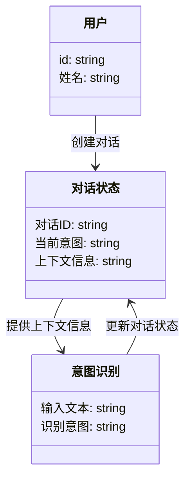
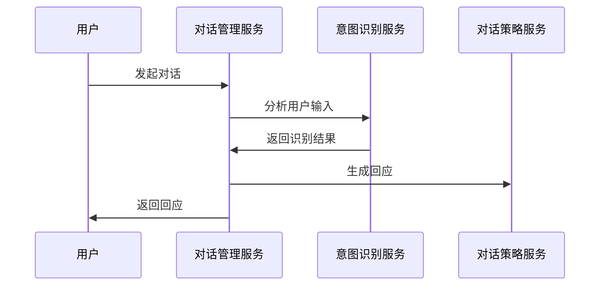

                 


# 对话管理：设计流畅的人机交互体验

## 关键词：对话管理、人机交互、自然语言处理、机器学习、系统架构

## 摘要：对话管理是实现流畅人机交互的核心技术，本文从对话管理的背景、核心概念、算法原理、系统架构、项目实战和最佳实践等方面进行详细分析，帮助读者全面理解对话管理的设计方法与实现技巧。

---

# 第一部分: 对话管理的背景与概念

## 第1章: 对话管理的基本概念

### 1.1 对话管理的定义与背景

#### 1.1.1 对话管理的定义

对话管理（Dialogue Management）是指在人机交互过程中，系统通过理解和预测用户的意图，生成合适的回应，以实现自然流畅的对话。它是自然语言处理（NLP）和人工智能（AI）领域的重要组成部分，旨在提升用户体验，使交互更加智能化和人性化。

#### 1.1.2 对话管理的发展历程

对话管理技术经历了从简单的基于规则的系统到复杂的深度学习模型的发展过程。早期的对话管理系统主要依赖于预定义的规则，而现在，随着自然语言处理和机器学习技术的进步，对话管理逐渐向智能化和个性化方向发展。

#### 1.1.3 对话管理在人机交互中的重要性

在智能客服、语音助手和聊天机器人等场景中，对话管理技术能够显著提升交互的流畅性和用户满意度。通过对话管理，系统可以更好地理解用户需求，提供更精准的服务，从而增强用户体验。

---

### 1.2 对话管理的核心问题

#### 1.2.1 对话状态的表示与更新

对话状态是对话管理的核心要素之一，它记录了当前对话的上下文信息，包括用户的意图、已输入的内容以及系统对这些内容的理解。常见的对话状态表示方法包括基于关键词的表示和基于向量的表示。

#### 1.2.2 用户意图的理解与预测

用户意图的理解是对话管理的关键任务之一。通过自然语言处理技术，系统可以分析用户的输入，识别其潜在的意图，并预测下一步的对话方向。

#### 1.2.3 对话策略的制定与执行

对话策略决定了系统在对话中的行为方式。基于规则的策略和基于机器学习的策略是两种主要的策略类型。前者依赖于预定义的规则，后者则通过训练数据学习对话模式。

---

### 1.3 对话管理的应用领域

#### 1.3.1 智能客服系统

智能客服系统通过对话管理技术，能够自动理解和处理用户的问题，提供高效的解决方案。这不仅节省了人工成本，还提高了客户满意度。

#### 1.3.2 智能音箱与语音助手

智能音箱和语音助手（如Siri、Alexa）通过对话管理技术，能够与用户进行自然的语言交互，完成多种任务，如播放音乐、设置提醒等。

#### 1.3.3 聊天机器人

聊天机器人广泛应用于社交媒体和在线客服等领域。通过对话管理技术，机器人可以实现个性化的对话体验，增强用户互动。

---

### 1.4 对话管理的挑战与未来趋势

#### 1.4.1 当前的主要挑战

- 对话历史的处理和管理
- 多轮对话中的意图漂移
- 不同场景下的对话策略切换

#### 1.4.2 未来的发展方向

随着深度学习和大语言模型技术的进步，对话管理将更加智能化和个性化。未来的对话管理系统将能够更好地理解用户的隐含需求，提供更贴近人类自然对话的交互体验。

---

## 第2章: 对话管理的核心概念与联系

### 2.1 对话状态管理

#### 2.1.1 对话状态的表示方法

对话状态可以通过以下几种方式表示：
1. 基于关键词的表示：记录用户输入中的关键词及其关系。
2. 基于向量的表示：使用词嵌入技术将对话内容转化为向量形式。

#### 2.1.2 对话状态的更新机制

对话状态的更新需要结合用户的输入和系统对意图的理解。通过不断更新对话状态，系统能够更好地理解用户的需求，从而生成更准确的回应。

---

### 2.2 用户意图识别

#### 2.2.1 意图识别的定义与方法

用户意图识别是通过分析用户的输入内容，推断其潜在需求的过程。常用的方法包括基于规则的意图识别和基于机器学习的意图识别。

#### 2.2.2 基于自然语言处理的意图识别

自然语言处理技术（如词袋模型和词嵌入）能够帮助系统更准确地理解用户的意图。通过训练大量的对话数据，系统可以学习到不同意图的特征，并进行分类。

---

### 2.3 对话策略

#### 2.3.1 对话策略的分类

对话策略可以分为基于规则的策略和基于机器学习的策略。前者依赖于预定义的规则，后者则通过数据驱动的方式进行优化。

#### 2.3.2 基于规则的对话策略

基于规则的对话策略适用于简单的对话场景，如FAQ解答。通过预定义的规则，系统可以快速生成回应。

#### 2.3.3 基于机器学习的对话策略

基于机器学习的对话策略能够处理复杂的对话场景。通过训练对话数据，系统可以学习到对话模式，并生成更自然的回应。

---

### 2.4 对话历史与关联

#### 2.4.1 对话历史的重要性

对话历史记录了用户与系统之间的所有交互信息，是理解当前对话上下文的重要依据。

#### 2.4.2 对话历史的存储与管理

对话历史可以通过数据库或缓存技术进行存储和管理。通过合理的存储策略，系统能够快速访问历史信息，提升对话效率。

---

### 2.5 核心概念对比分析

#### 2.5.1 对话状态与用户意图的对比

对话状态关注的是当前对话的上下文信息，而用户意图关注的是用户的潜在需求。两者相辅相成，共同推动对话的进行。

#### 2.5.2 对话策略与对话历史的关联

对话策略的制定需要结合对话历史信息，以确保回应的准确性和一致性。

---

## 第3章: 对话管理的系统架构

### 3.1 系统架构概述

对话管理系统的架构设计需要考虑系统的扩展性、可维护性和性能。常见的架构包括分层架构和组件化架构。

---

### 3.2 核心组件分析

#### 3.2.1 对话状态管理组件

对话状态管理组件负责记录和更新对话状态，确保系统能够理解当前对话的上下文信息。

#### 3.2.2 用户意图识别组件

用户意图识别组件通过自然语言处理技术，分析用户的输入内容，识别其潜在意图。

#### 3.2.3 对话策略执行组件

对话策略执行组件根据识别的用户意图，选择合适的对话策略，并生成回应。

---

### 3.3 系统架构设计

#### 3.3.1 组件之间的交互关系

对话状态管理组件、用户意图识别组件和对话策略执行组件之间需要紧密协作，共同完成对话的管理任务。

#### 3.3.2 系统的扩展性设计

系统的扩展性设计需要考虑未来功能的扩展和性能的优化。通过模块化设计，可以方便地添加新的功能模块。

---

### 3.4 系统架构的优缺点分析

#### 3.4.1 优点

- 组件化设计提高了系统的可维护性和扩展性。
- 分层架构保证了系统的稳定性和可靠性。

#### 3.4.2 缺点

- 组件之间的依赖关系可能增加系统的复杂性。
- 系统的性能优化需要综合考虑各组件的协作。

#### 3.4.3 改进建议

- 通过优化组件之间的交互机制，提高系统的整体性能。
- 引入缓存技术，减少对话历史的查询开销。

---

# 第二部分: 对话管理的核心概念与联系

## 第4章: 对话管理的算法原理

### 4.1 基于规则的对话管理系统

#### 4.1.1 基于规则的对话策略

基于规则的对话策略适用于简单的对话场景。通过预定义的规则，系统可以快速生成回应。

#### 4.1.2 规则的编写与

通过预定义的规则，系统可以快速生成回应。例如，当用户询问“天气如何？”时，系统可以触发“查询天气”规则，返回当前天气信息。

---

### 4.2 基于机器学习的对话管理系统

#### 4.2.1 基于机器学习的对话策略

基于机器学习的对话策略能够处理复杂的对话场景。通过训练对话数据，系统可以学习到对话模式，并生成更自然的回应。

---

### 4.3 对话管理算法的数学模型

#### 4.3.1 基于概率论的对话模型

对话模型可以通过概率论进行建模，计算每个可能的回应的概率，选择概率最高的回应作为最终的回应。

#### 4.3.2 基于深度学习的对话模型

深度学习模型（如循环神经网络和Transformer）能够捕捉对话中的长距离依赖关系，生成更自然的对话回应。

---

### 4.4 对话管理算法的实现步骤

#### 4.4.1 数据预处理

对对话数据进行清洗和标注，提取对话的上下文信息和意图标签。

#### 4.4.2 模型训练

通过训练数据，训练对话管理模型，使其能够理解和生成对话内容。

#### 4.4.3 模型优化

通过调整模型参数和优化算法，提升模型的对话生成能力。

---

## 第5章: 对话管理的系统架构设计

### 5.1 问题场景介绍

本节将介绍一个智能客服系统的对话管理问题，分析其需求和挑战。

---

### 5.2 系统功能设计

#### 5.2.1 领域模型设计

通过Mermaid类图展示系统的领域模型，包括用户、对话状态、意图识别等核心概念。



#### 5.2.2 系统架构设计

通过Mermaid架构图展示系统的整体架构，包括前端、后端和数据库。


#### 5.2.3 系统接口设计

定义系统的主要接口，如对话状态更新接口、意图识别接口等。

#### 5.2.4 系统交互设计

通过Mermaid序列图展示系统的交互流程，包括用户发起请求、系统识别意图、生成回应等步骤。



---

## 第6章: 对话管理的项目实战

### 6.1 环境安装

介绍对话管理项目所需的开发环境和工具的安装步骤，如Python、TensorFlow等。

---

### 6.2 系统核心实现

#### 6.2.1 对话状态管理的实现

通过Python代码实现对话状态的记录和更新。

```python
class DialogueState:
    def __init__(self, dialog_id):
        self.dialog_id = dialog_id
        self.current_intent = None
        self.context = {}
```

#### 6.2.2 意图识别的实现

使用自然语言处理库（如spaCy）实现意图识别功能。

```python
import spacy

nlp = spacy.load("en_core_web_sm")

def identify_intent(text):
    doc = nlp(text)
    # 这里可以根据具体的文本特征进行意图识别
    return "intent_1"  # 示例返回值
```

---

### 6.3 代码应用解读与分析

分析上述代码的实现细节，解释每个部分的功能和作用。

---

### 6.4 实际案例分析

通过一个具体的案例（如智能客服系统），分析对话管理技术的应用场景和实现效果。

---

### 6.5 项目小结

总结对话管理项目的实施过程，提出改进建议和未来发展方向。

---

## 第7章: 对话管理的最佳实践

### 7.1 小结

总结对话管理的核心概念、算法原理和系统架构设计。

---

### 7.2 注意事项

在实际应用中，需要注意对话历史的管理和意图识别的准确性，避免对话中的歧义和误解。

---

### 7.3 拓展阅读

推荐一些关于对话管理的优秀书籍和论文，供读者进一步学习和研究。

---

## 附录

### 附录A: 术语表

解释对话管理中的专业术语，如对话状态、意图识别等。

---

### 附录B: 参考文献

列出本文参考的主要文献和资料。

---

通过以上内容，读者可以全面理解对话管理的设计方法与实现技巧，掌握对话管理的核心概念和实际应用。

