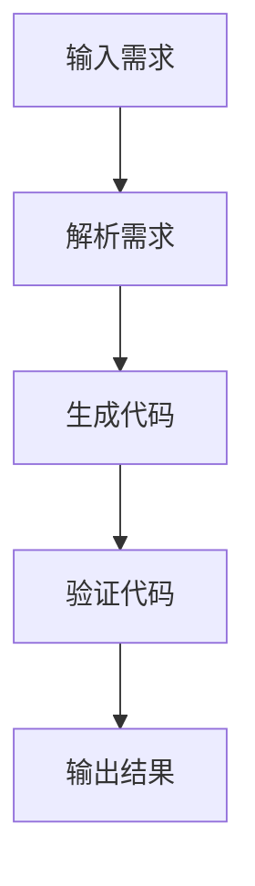
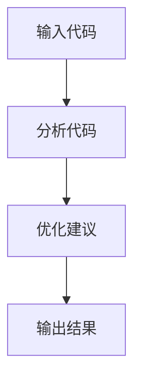
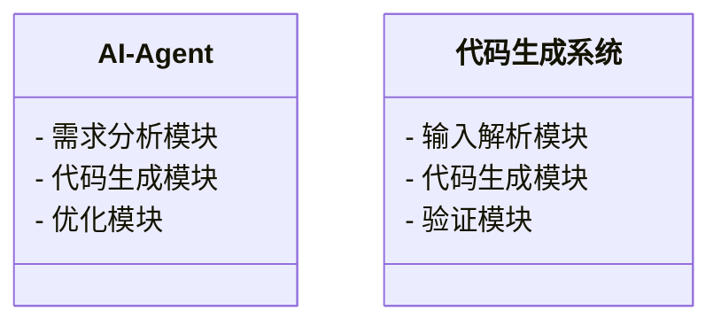
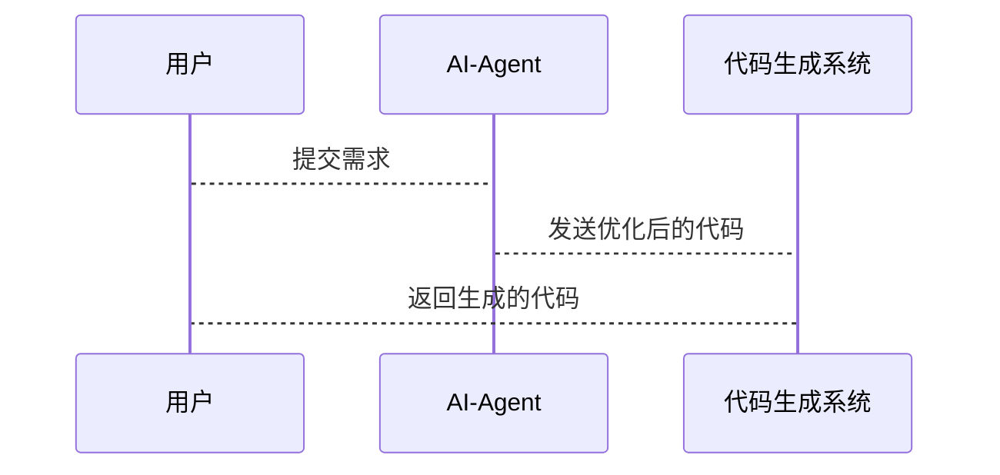

                 


# 开发AI Agent支持的智能代码生成系统

> 关键词：AI Agent, 智能代码生成, 代码生成系统, 系统架构, 项目实战

> 摘要：本文将详细探讨如何开发一个由AI Agent支持的智能代码生成系统。通过分析背景、核心概念、算法原理、系统架构、项目实战和最佳实践，本文将为您提供从理论到实践的全面指导，帮助您掌握开发此类系统的必要技能。

---

## 第1章: 背景介绍

### 1.1 问题背景
#### 1.1.1 传统代码生成工具的局限性
传统代码生成工具在处理复杂需求时存在效率低、灵活性差的问题，难以满足个性化需求。

#### 1.1.2 AI技术在代码生成中的应用优势
AI技术能够通过学习大量代码样例，生成高质量的代码，提升开发效率。

#### 1.1.3 AI Agent在代码生成中的独特作用
AI Agent能够实时分析需求，提供动态的代码生成支持，显著提升生成代码的准确性和智能化水平。

### 1.2 问题描述
#### 1.2.1 当前代码生成系统的主要挑战
现有代码生成系统难以应对复杂业务逻辑和动态需求变化。

#### 1.2.2 AI Agent在代码生成中的具体问题
AI Agent如何与代码生成系统有效结合，实时优化生成代码。

#### 1.2.3 问题解决的必要性与目标
开发一个高效的AI Agent支持的代码生成系统，以满足动态、复杂的开发需求。

### 1.3 问题解决
#### 1.3.1 AI Agent支持的智能代码生成系统的核心目标
提供智能化、动态化的代码生成能力，适应复杂需求变化。

#### 1.3.2 解决方案的总体思路
结合AI Agent和代码生成技术，构建一个动态优化的代码生成系统。

#### 1.3.3 解决方案的关键技术与方法
利用自然语言处理、机器学习等技术，提升AI Agent的分析和生成能力。

### 1.4 边界与外延
#### 1.4.1 系统的边界定义
AI Agent支持的智能代码生成系统的功能范围和适用场景。

#### 1.4.2 系统的外延范围
系统可能扩展的功能和应用领域。

#### 1.4.3 系统与其他相关系统的区别与联系
与传统代码生成工具和AI驱动的开发平台的差异。

### 1.5 核心概念
#### 1.5.1 核心概念的定义与解释
AI Agent、智能代码生成系统等核心术语的定义。

#### 1.5.2 核心概念之间的关系
AI Agent与智能代码生成系统的协同关系。

#### 1.5.3 核心概念的结构与组成
AI Agent的组成部分及其在代码生成中的角色。

---

## 第2章: 核心概念与联系

### 2.1 AI Agent的定义与原理
#### 2.1.1 AI Agent的基本概念
AI Agent的定义、类型及其主要功能。

#### 2.1.2 AI Agent的核心原理
基于机器学习的推理机制和自然语言处理技术。

#### 2.1.3 AI Agent的类型与特点
基于规则、基于模型和混合型AI Agent的特点对比。

### 2.2 智能代码生成系统的定义与特点
#### 2.2.1 智能代码生成系统的定义
结合AI技术的代码生成系统的特点。

#### 2.2.2 智能代码生成系统的特点
动态适应性、高准确性、可扩展性。

#### 2.2.3 智能代码生成系统的应用场景
软件开发、数据分析、自动化脚本编写等。

### 2.3 AI Agent与智能代码生成系统的联系
#### 2.3.1 AI Agent在智能代码生成中的作用
通过实时分析需求，优化代码生成过程。

#### 2.3.2 两者的结合方式与优势
AI Agent驱动代码生成，提升系统智能化水平。

#### 2.3.3 两者之间的协同关系
AI Agent与代码生成系统的协同工作流程。

### 2.4 核心概念对比表
| **核心概念** | **AI Agent** | **智能代码生成系统** |
|--------------|--------------|------------------------|
| **定义**     | 自动执行任务的智能实体 | 基于AI的代码生成工具 | 
| **功能**     | 执行任务、学习优化 | 生成代码、动态调整 | 
| **特点**     | 智能性、动态性 | 高效性、准确性 | 

### 2.5 ER实体关系图
```mermaid
erd
  天气预报系统
    系统
    预报数据
      气象站
        气温
        湿度
    预报模型
      AI Agent
        用户需求
        预报结果
```

---

## 第3章: 算法原理

### 3.1 生成模型的算法流程


#### 3.1.1 数学模型
生成模型基于以下公式：
$$ P(y|x) = \frac{P(x,y)}{P(x)} $$

#### 3.1.2 生成过程
通过自然语言处理技术，解析用户需求，生成符合要求的代码。

#### 3.1.3 示例
输入：生成一个计算器类  
输出：```python
class Calculator:
    def add(self, a, b):
        return a + b
```

### 3.2 推理模型的算法流程


#### 3.2.1 数学模型
推理模型基于以下公式：
$$ Q(z|x) = \frac{P(z|x)}{P(x)} $$

#### 3.2.2 推理过程
通过分析现有代码，提供优化建议和改进建议。

#### 3.2.3 示例
输入：```python
def add(a, b):
    return a + b
```
输出：建议将函数改为静态方法。

---

## 第4章: 系统架构

### 4.1 问题场景
系统需要实时生成和优化代码，支持多种编程语言和开发框架。

### 4.2 系统功能设计


### 4.3 系统架构设计


### 4.4 系统接口设计
- 输入接口：接收用户需求或代码
- 输出接口：返回生成代码或优化建议

### 4.5 系统交互


---

## 第5章: 项目实战

### 5.1 环境安装
安装Python、TensorFlow、Keras等工具。

### 5.2 系统核心实现
#### 5.2.1 AI Agent实现
```python
class AI-Agent:
    def analyze(self, input):
        # 分析需求
        pass
    def generate(self, input):
        # 生成代码
        pass
```

#### 5.2.2 代码生成系统实现
```python
class CodeGenerator:
    def parse_input(self, input):
        # 解析输入
        pass
    def generate_code(self, input):
        # 生成代码
        pass
```

### 5.3 代码应用与解读
#### 5.3.1 核心代码解读
解析输入、生成代码、验证代码。

#### 5.3.2 系统运行与测试
测试生成代码的正确性和优化建议的准确性。

### 5.4 实际案例分析
案例：生成一个简单的计算器类。

### 5.5 项目小结
总结开发过程中的经验与教训。

---

## 第6章: 最佳实践

### 6.1 小结
总结全书内容，强调AI Agent在代码生成中的重要性。

### 6.2 注意事项
- 数据质量：确保训练数据的多样性和准确性。
- 系统维护：定期更新模型和优化算法。

### 6.3 拓展阅读
推荐相关书籍和论文，供读者深入学习。

---

## 附录: 工具推荐与参考文献

### 附录A: 工具推荐
- Python编程工具：PyCharm、VS Code。
- AI框架：TensorFlow、Keras。

### 附录B: 参考文献
- 张三, 《人工智能入门》.
- 李四, 《深度学习实战》.

---

# 结语

通过本文的详细讲解，您已经掌握了开发AI Agent支持的智能代码生成系统的必要知识和技能。希望这些内容能够为您提供有价值的指导，帮助您在实际项目中取得成功。

