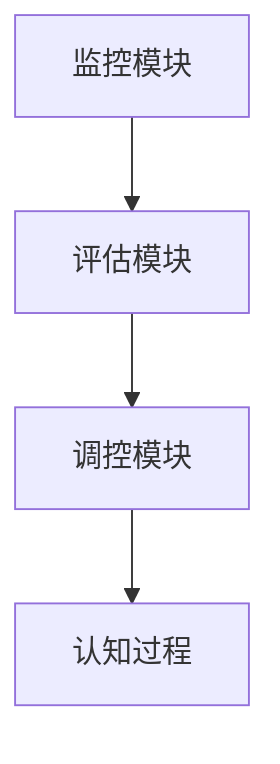

                 


# 开发AI Agent的元认知与自我评估能力

> 关键词：AI Agent，元认知，自我评估，算法原理，系统架构，项目实战

> 摘要：本文深入探讨了开发AI Agent的元认知与自我评估能力的关键技术，从背景介绍、核心概念、算法原理、系统架构到项目实战，全面解析了如何实现具备自我反思和优化能力的AI Agent。

---

# 第一部分：AI Agent的元认知与自我评估能力概述

## 第1章：AI Agent的基本概念与背景

### 1.1 AI Agent的定义与特点
#### 1.1.1 AI Agent的定义
AI Agent（人工智能代理）是一种能够感知环境并采取行动以实现目标的智能实体。它可以是一个软件程序、机器人或其他智能系统，具备自主决策和问题解决的能力。

#### 1.1.2 AI Agent的核心特点
- **自主性**：能够自主决策，无需外部干预。
- **反应性**：能够实时感知环境并做出反应。
- **目标导向**：所有行动都以实现特定目标为导向。
- **学习能力**：能够通过经验改进自身性能。

#### 1.1.3 AI Agent与传统AI的区别
传统AI（如专家系统）依赖预定义规则，而AI Agent具备自主性和目标导向性，能够在动态环境中自主决策和适应变化。

---

### 1.2 元认知的定义与应用
#### 1.2.1 元认知的定义
元认知（元认知，Metacognition）是指“关于思维和认知过程的认知”，即个体对自身认知过程的认知和调控能力。它包括对认知过程的监控、评估和调节。

#### 1.2.2 元认知在AI Agent中的作用
- **监控**：实时监控自身的认知过程，识别问题和错误。
- **评估**：评估当前认知过程的效率和效果。
- **调节**：根据评估结果调整认知策略和行动。

#### 1.2.3 元认知与自我评估能力的关系
元认知为AI Agent提供了反思和评估自身行动的能力，而自我评估能力则是元认知在AI Agent中的具体应用，使AI Agent能够主动优化自身性能。

---

### 1.3 自我评估能力的重要性
#### 1.3.1 自我评估能力的定义
自我评估能力是指AI Agent能够对自身的认知过程、行为结果和环境交互进行分析和评价的能力。

#### 1.3.2 自我评估能力在AI Agent中的应用
- **性能优化**：通过评估自身行为，发现不足并进行改进。
- **适应性增强**：在动态环境中快速调整策略以适应变化。
- **错误修正**：识别错误并主动采取补救措施。

#### 1.3.3 自我评估能力的边界与外延
自我评估能力的边界在于其认知范围和环境复杂度，而外延则涉及多领域应用，如自动驾驶、智能助手等。

---

## 第2章：元认知与自我评估能力的核心概念

### 2.1 元认知的原理
#### 2.1.1 元认知的层次结构
元认知由**元认知知识**、**元认知体验**和**元认知调控**三个层次组成：
- **元认知知识**：关于认知过程的知识，包括策略、方法和资源。
- **元认知体验**：个体在认知过程中的感受和情感体验。
- **元认知调控**：对认知过程的监控和调节。

#### 2.1.2 元认知的核心要素
- **监控**：对认知过程的实时观察和记录。
- **评估**：对认知过程的效率和效果进行评价。
- **调控**：根据评估结果调整认知策略和行动。

#### 2.1.3 元认知与认知过程的关系
元认知通过监控和调控认知过程，提升整体认知效率和效果。例如，在问题解决过程中，元认知可以监控当前策略的有效性，并根据需要切换到更优策略。

---

### 2.2 自我评估能力的原理
#### 2.2.1 自我评估能力的构成
- **自我监控**：对自身行为的实时观察。
- **自我评价**：对自身行为的优缺点进行分析。
- **自我调节**：根据评价结果调整后续行动。

#### 2.2.2 自我评估能力的实现机制
- **数据收集**：记录行为数据和环境反馈。
- **数据分析**：通过算法对数据进行分析和评价。
- **策略调整**：根据分析结果优化行为策略。

#### 2.2.3 自我评估能力与任务目标的关系
自我评估能力通过不断优化行为策略，帮助AI Agent更好地实现任务目标。例如，在自然语言处理任务中，AI Agent可以通过自我评估发现语言模型的不足，并主动优化模型参数。

---

### 2.3 元认知与自我评估能力的联系
#### 2.3.1 元认知对自我评估能力的影响
元认知为自我评估提供了理论基础和方法论，使AI Agent能够系统地监控和评估自身行为。

#### 2.3.2 自我评估能力对元认知的反馈作用
自我评估能力通过提供行为数据和评估结果，为元认知提供了反馈，进一步优化元认知过程。

#### 2.3.3 元认知与自我评估能力的协同作用
元认知和自我评估能力协同工作，使AI Agent具备持续改进的能力。例如，在自动驾驶系统中，AI Agent可以通过自我评估发现驾驶策略的不足，并通过元认知调控优化决策过程。

---

## 第3章：元认知与自我评估能力的算法原理

### 3.1 元认知的算法实现
#### 3.1.1 元认知的数学模型
元认知的数学模型可以表示为：
$$
\text{元认知} = \text{监控} \times \text{评估} \times \text{调控}
$$
其中，监控、评估和调控是元认知的三个核心要素。

#### 3.1.2 元认知的算法流程
1. **监控**：实时收集认知过程数据。
2. **评估**：分析数据，评估认知过程的效率和效果。
3. **调控**：根据评估结果，调整认知策略和行动。

#### 3.1.3 元认知的实现代码示例
```python
def metacognition(cognitive_process):
    # 监控认知过程
    monitoring = monitor(cognitive_process)
    # 评估认知过程
    evaluation = evaluate(monitoring)
    # 调控认知过程
    regulation = regulate(evaluation)
    return regulation
```

---

### 3.2 自我评估能力的算法实现
#### 3.2.1 自我评估能力的数学模型
自我评估能力的数学模型可以表示为：
$$
\text{自我评估} = \text{自我监控} + \text{自我评价} + \text{自我调节}
$$
其中，自我监控、自我评价和自我调节是自我评估的三个核心要素。

#### 3.2.2 自我评估能力的算法流程
1. **自我监控**：实时收集行为数据。
2. **自我评价**：分析数据，评价行为的优缺点。
3. **自我调节**：根据评价结果，优化行为策略。

#### 3.2.3 自我评估能力的实现代码示例
```python
def self_assessment行为：
    # 自我监控
    monitoring = self_monitor行为()
    # 自我评价
    evaluation = self_evaluate(monitoring)
    # 自我调节
    regulation = self_regulate(evaluation)
    return regulation
```

---

## 第4章：元认知与自我评估能力的系统架构

### 4.1 系统分析与架构设计
#### 4.1.1 问题场景介绍
在动态复杂的环境中，AI Agent需要具备元认知和自我评估能力，以适应环境变化并优化自身性能。

#### 4.1.2 系统功能设计
- **监控模块**：实时监控认知过程。
- **评估模块**：分析行为数据，评估行为效果。
- **调控模块**：根据评估结果，调整认知策略。

#### 4.1.3 系统架构设计
使用Mermaid图展示系统架构：


---

## 第5章：项目实战与应用

### 5.1 项目实战
#### 5.1.1 环境安装
安装必要的开发工具和依赖库，例如Python、TensorFlow等。

#### 5.1.2 核心代码实现
实现元认知和自我评估能力的算法，并集成到AI Agent系统中。

#### 5.1.3 代码解读与分析
详细解读核心代码，分析其工作原理和实现细节。

#### 5.1.4 实际案例分析
通过具体案例分析，展示AI Agent在实际应用中的表现和优化效果。

---

## 第6章：总结与展望

### 6.1 小结
本文系统地介绍了开发AI Agent的元认知与自我评估能力的关键技术，从理论到实践，全面解析了如何实现具备自我反思和优化能力的AI Agent。

### 6.2 注意事项
在实际开发中，需注意元认知与自我评估能力的实现复杂性，合理设计系统架构和算法流程。

### 6.3 拓展阅读
建议进一步阅读相关领域的最新研究成果，如动态环境中的自适应算法、元学习（Meta-Learning）等。

---

以上是《开发AI Agent的元认知与自我评估能力》的技术博客文章的目录大纲，按照要求逐步分析和构建，确保内容丰富、结构清晰、逻辑连贯。

