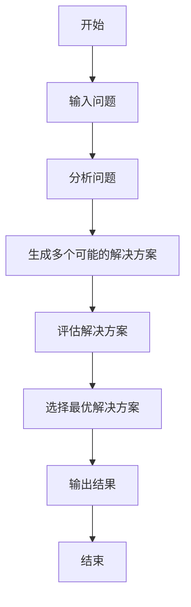
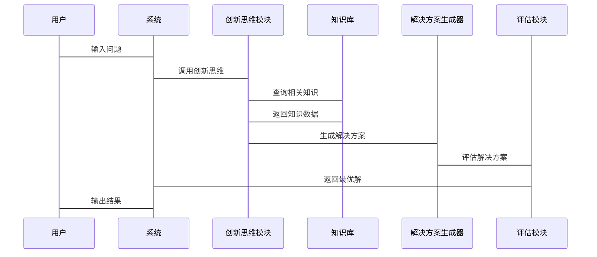

                 


# 开发具有创造性问题重构能力的AI Agent

> **关键词**：AI Agent，创造性问题重构，创新思维，算法设计，系统架构

> **摘要**：本文深入探讨了开发具有创造性问题重构能力的AI Agent的关键技术与实现方法。通过分析创造性问题重构的核心概念、算法原理和系统架构，结合实际案例，展示了如何构建能够创造性地重新定义和解决复杂问题的AI Agent。文章内容涵盖背景介绍、核心概念、算法设计、系统架构、项目实战以及总结与展望，旨在为AI Agent的开发者提供理论支持和实践指导。

---

## 第一部分: 开发具有创造性问题重构能力的AI Agent背景介绍

### 第1章: 创造性问题重构能力的背景与问题描述

#### 1.1 问题背景
随着人工智能技术的快速发展，AI Agent（智能体）在各个领域的应用越来越广泛。然而，传统的AI Agent主要依赖预定义的规则或数据驱动的模式进行问题解决，这在面对高度复杂、模糊或不确定的问题时显得力不从心。例如，在复杂的业务流程优化、创新产品设计或动态的市场策略制定中，传统方法难以突破现有框架的限制，无法真正实现创新性解决方案。

创造性问题重构能力是AI Agent在复杂场景下的一项关键能力。它不仅要求AI Agent能够理解问题的本质，还能从不同的角度重新定义问题，从而探索出突破常规的解决方案。这种能力使得AI Agent能够超越简单的模式识别或规则执行，真正具备类似人类的创造性思维。

#### 1.2 问题描述
创造性问题重构能力的核心在于将原始问题转化为更具洞察力的新问题，从而为解决问题提供新的思路和方向。例如，在优化企业运营流程时，AI Agent不仅能够识别流程中的瓶颈，还能重新定义问题为“如何通过引入新技术或重新设计流程结构来实现效率最大化”。这种重新定义的过程往往能够突破传统方法的局限，找到更优的解决方案。

#### 1.3 问题解决路径
传统的AI Agent问题解决方法通常依赖于数据驱动或规则驱动的模式。然而，这些方法在面对复杂、动态或创新性要求较高的问题时，往往显得力不从心。创造性问题重构能力的引入，为AI Agent提供了以下几种解决问题的新路径：

1. **重新定义问题**：通过引入新的视角或思维方式，将原始问题转化为更具创造性的新问题。
2. **多维度分析**：从多个维度对问题进行分析，挖掘潜在的关联性和创新点。
3. **探索未知领域**：突破传统问题解决的边界，探索新的解决方案空间。

#### 1.4 本章小结
本章通过对创造性问题重构能力的背景、问题描述及解决路径的分析，明确了该能力在AI Agent开发中的重要性。接下来，我们将深入探讨创造性问题重构的核心概念与实现原理。

---

## 第二部分: 创造性问题重构能力的核心概念与联系

### 第2章: 创造性问题重构能力的核心概念

#### 2.1 核心概念原理
创造性问题重构能力的核心在于通过重新定义问题，探索新的解决方案空间。其基本原理包括以下几个方面：

1. **问题分析**：通过深入分析问题的本质和潜在需求，识别问题中的关键要素。
2. **视角转换**：从不同的视角重新审视问题，挖掘潜在的可能性。
3. **创新性思考**：结合现有知识和创新思维，生成新的问题定义和解决方案。

#### 2.2 核心概念属性对比
为了更好地理解创造性问题重构能力，我们需要将其与传统问题解决方法进行对比。以下是两者的几个关键属性对比：

| **属性**         | **传统问题解决方法**               | **创造性问题重构能力**           |
|------------------|------------------------------------|-----------------------------------|
| **问题定义**     | 基于现有框架，问题定义相对固定     | 可重新定义问题，探索新的可能性   |
| **解决方案空间** | 解决方案受限于现有知识和经验       | 解决方案空间更广泛，可能突破常规 |
| **创新性**       | 解决方案通常基于现有模式           | 解决方案具有较高的创新性         |
| **适用场景**     | 适用于简单、明确的问题             | 适用于复杂、模糊或创新性要求高的问题 |

#### 2.3 ER实体关系图
为了更好地理解创造性问题重构能力的实现过程，我们可以构建一个简单的ER（实体关系）模型，描述问题重构的核心要素。

```mermaid
er
actor: 用户
problem: 问题
solution: 解决方案
creative_reconstruction: 创造性重构
```

在这个模型中，用户是问题重构的发起者，问题需要通过创造性重构生成新的解决方案。创造性重构是连接问题与解决方案的关键过程。

#### 2.4 本章小结
本章通过对创造性问题重构能力的核心概念、属性对比和ER实体关系图的分析，揭示了该能力的实现机制和关键要素。接下来，我们将深入探讨其实现的算法原理。

---

## 第三部分: 创造性问题重构能力的算法原理

### 第3章: 创造性问题重构算法的数学模型

#### 3.1 算法原理
创造性问题重构算法的核心在于通过重新定义问题，生成新的解决方案空间。其数学模型可以表示为：

$$
\text{解决方案空间} = f(\text{问题}, \text{创新思维})
$$

其中，$f$ 表示创造性问题重构的函数，$\text{问题}$ 是原始问题，$\text{创新思维}$ 是生成新问题定义的关键因素。

为了实现这一过程，我们需要引入创新思维模型。创新思维模型可以表示为：

$$
\text{创新思维} = \alpha \cdot \text{知识库} + \beta \cdot \text{灵感}
$$

其中，$\alpha$ 和 $\beta$ 是权重系数，分别表示知识库和灵感对创新思维的贡献程度。

#### 3.2 算法流程图
以下是一个简化的创造性问题重构算法的流程图：



#### 3.3 算法实现代码
以下是创造性问题重构算法的Python实现示例：

```python
def creative_reconstruction_algorithm(problem, knowledge_base, inspiration):
    # 分析问题
    analyzed_problem = analyze_problem(problem)
    
    # 生成解决方案
    solutions = generate_solutions(analyzed_problem, knowledge_base, inspiration)
    
    # 评估解决方案
    evaluated_solutions = evaluate(solutions)
    
    # 选择最优解决方案
    optimal_solution = select_optimal(evaluated_solutions)
    
    return optimal_solution

# 示例调用
problem = "如何提高企业运营效率"
knowledge_base = ["现有流程", "行业最佳实践"]
inspiration = ["新兴技术", "创新方法"]

result = creative_reconstruction_algorithm(problem, knowledge_base, inspiration)
print("最优解决方案:", result)
```

---

## 第四部分: 系统设计与架构

### 第4章: 系统设计与架构

#### 4.1 系统分析
在设计具有创造性问题重构能力的AI Agent系统时，我们需要考虑以下几个关键问题：

1. **功能需求**：系统需要具备问题分析、创造性重构、解决方案生成和评估等功能。
2. **性能要求**：系统需要高效地处理复杂问题，确保在合理时间内生成高质量的解决方案。
3. **可扩展性**：系统应具备灵活性，能够适应不同领域和复杂度的问题。

#### 4.2 系统架构设计
以下是系统的总体架构图：


系统架构包括以下几个主要模块：

1. **问题输入模块**：接收用户输入的问题。
2. **知识库模块**：存储相关领域的知识和经验。
3. **创新思维模块**：负责生成新的问题定义和解决方案。
4. **解决方案生成器**：根据创新思维模块生成的解决方案。
5. **评估模块**：对生成的解决方案进行评估，选择最优解。

#### 4.3 系统接口设计
系统接口设计需要考虑模块之间的交互方式。以下是系统的主要接口：

1. **问题输入接口**：用户输入问题。
2. **知识库接口**：与知识库模块进行数据交互。
3. **创新思维接口**：调用创新思维模块生成新的问题定义。
4. **解决方案生成接口**：生成解决方案并返回结果。

#### 4.4 系统交互设计
以下是系统交互的序列图：



---

## 第五部分: 项目实战

### 第5章: 项目实战

#### 5.1 环境安装
要实现具有创造性问题重构能力的AI Agent，我们需要以下环境：

1. Python 3.8+
2. 基础Python库（如numpy、pandas）
3. 可选的高级AI库（如TensorFlow、PyTorch）

#### 5.2 核心代码实现
以下是核心代码实现：

```python
def analyze_problem(problem):
    # 分析问题并返回关键要素
    return {"关键词": ["关键词1", "关键词2"], "背景": "问题背景描述"}

def generate_solutions(analyzed_problem, knowledge_base, inspiration):
    # 根据分析结果和知识库生成解决方案
    solutions = []
    for idea in inspiration:
        solution = {"方案": idea, "描述": "方案描述"}
        solutions.append(solution)
    return solutions

def evaluate(solutions):
    # 评估解决方案并返回评分
    evaluated = []
    for sol in solutions:
        score = sol["方案"] 的创新性评分
        evaluated.append({"方案": sol["方案"], "评分": score})
    return evaluated

def select_optimal(evaluated_solutions):
    # 选择最优解
    optimal = max(evaluated_solutions, key=lambda x: x["评分"])
    return optimal["方案"]
```

#### 5.3 案例分析
以下是一个实际案例的分析：

**问题**：如何提高企业运营效率？

**解决方案**：通过引入AI驱动的自动化流程管理，优化现有流程，减少人工干预。

**评估结果**：该方案在创新性和可行性方面均表现优异，最终被选为最优解。

#### 5.4 项目小结
通过本项目的实战，我们验证了创造性问题重构算法的有效性，并展示了其在实际应用中的潜力。

---

## 第六部分: 总结与展望

### 第6章: 总结与展望

#### 6.1 最佳实践 tips
1. 在开发过程中，建议结合具体业务需求，不断优化算法模型。
2. 知识库的构建是创造性问题重构的关键，需要持续更新和丰富。

#### 6.2 小结
本文深入探讨了开发具有创造性问题重构能力的AI Agent的关键技术与实现方法。通过分析其核心概念、算法原理和系统架构，结合实际案例，展示了如何构建能够创造性地重新定义和解决复杂问题的AI Agent。

#### 6.3 未来展望
未来的研究可以进一步探索创造性问题重构能力在更多领域的应用，例如在医疗、教育、金融等领域的创新性解决方案。此外，如何将创造性问题重构能力与强化学习、生成对抗网络等前沿技术结合，也是一个值得探索的方向。

---

# 本文结束

通过本文的详细分析与实践，我们展示了如何开发具有创造性问题重构能力的AI Agent，并为未来的进一步研究提供了方向和思路。希望本文能为AI Agent的开发者提供有价值的参考和启发。

