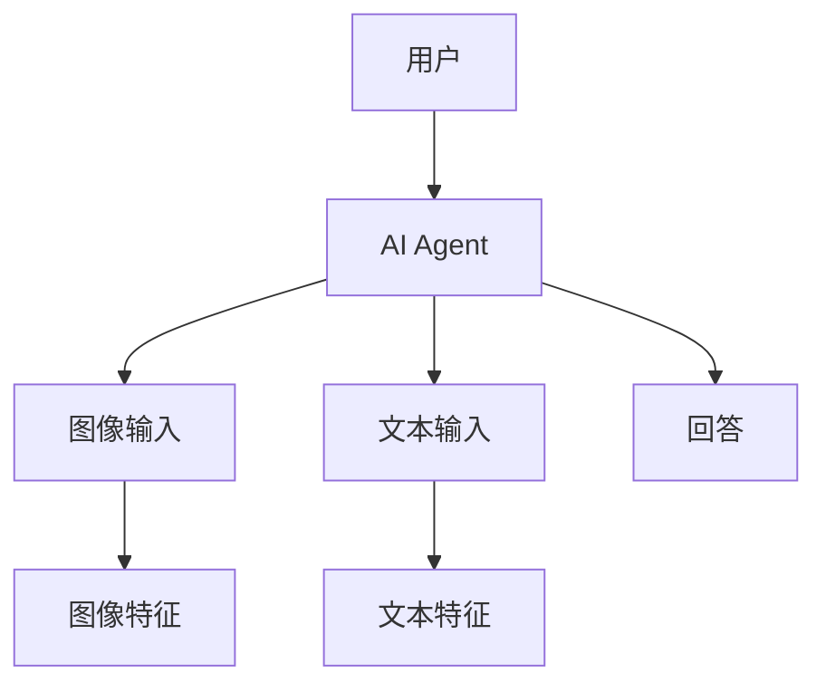
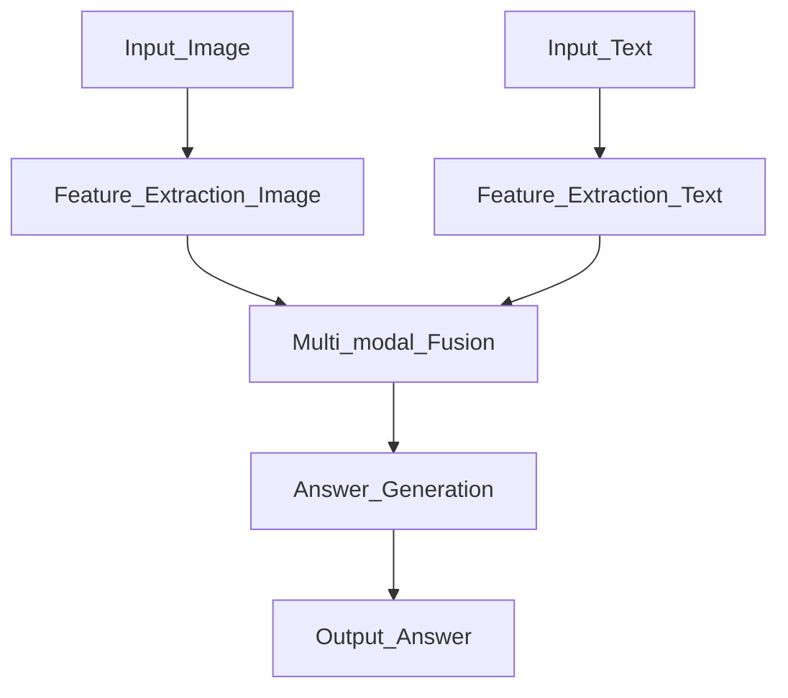
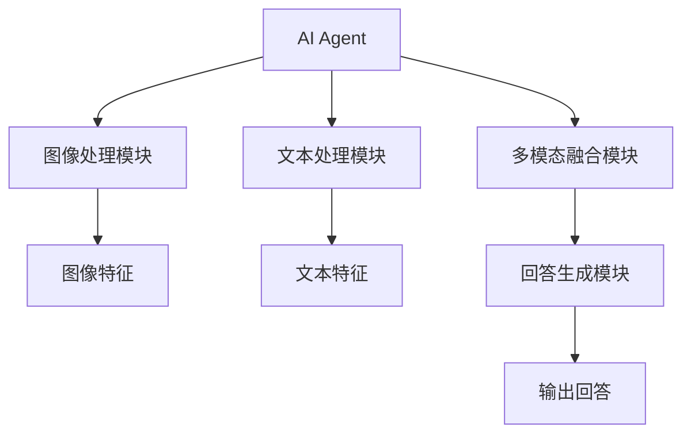

                 

# 开发具有视觉问答能力的AI Agent

> 关键词：视觉问答，AI Agent，多模态技术，计算机视觉，自然语言处理

> 摘要：本文详细探讨了开发具有视觉问答能力的AI Agent的技术背景、核心概念、算法原理、系统架构设计以及项目实战。从基础概念到高级算法，从理论分析到实践应用，系统地介绍了如何构建一个能够通过视觉信息理解和回答问题的智能代理系统。

---

# 第一部分：背景与问题背景

## 第1章：背景与问题背景

### 1.1 问题背景

#### 1.1.1 视觉问答的定义与特点
视觉问答（Visual Question Answering, VQA）是一种结合了计算机视觉和自然语言处理的多模态任务，旨在通过图像理解和文本问答的结合，回答与图像相关的问题。视觉问答的特点包括：
- **多模态性**：同时处理图像和文本信息。
- **任务多样性**：能够回答关于图像内容、属性、关系等多种类型的问题。
- **场景适应性**：适用于图像识别、图像描述生成等多种应用场景。

#### 1.1.2 AI Agent的基本概念
AI Agent（人工智能代理）是一种能够感知环境、执行任务并做出决策的智能系统。AI Agent的核心特点包括：
- **自主性**：能够在没有外部干预的情况下自主运行。
- **反应性**：能够根据环境输入做出实时反应。
- **目标导向性**：具有明确的目标，并能够采取行动以实现目标。

#### 1.1.3 视觉问答AI Agent的必要性
视觉问答AI Agent的开发是为了将视觉问答技术应用于实际场景中，使其具备自主决策和问题解决能力。通过结合AI Agent的自主性和目标导向性，视觉问答AI Agent能够更高效地处理复杂的视觉问答任务，为用户提供智能化的服务。

---

### 1.2 技术发展背景

#### 1.2.1 计算机视觉技术的发展
计算机视觉技术的进步为视觉问答AI Agent的实现奠定了基础。近年来，深度学习技术在图像识别、目标检测、图像分割等领域取得了显著进展，推动了视觉问答技术的发展。

#### 1.2.2 自然语言处理技术的进步
自然语言处理技术的发展使得机器能够更好地理解和生成人类语言。BERT、GPT等预训练模型的出现，显著提升了文本问答的效果，为视觉问答AI Agent的文本处理能力提供了强大的支持。

#### 1.2.3 多模态技术的融合趋势
多模态技术的融合是当前人工智能领域的重要研究方向。视觉问答AI Agent的核心思想是通过结合图像和文本信息，实现更高效的问题理解和回答生成。多模态技术的融合趋势推动了视觉问答AI Agent的发展。

---

### 1.3 核心问题描述

#### 1.3.1 视觉问答的核心问题
视觉问答的核心问题是如何将图像信息与文本问题结合起来，生成准确的问答结果。这涉及到图像理解、文本理解和多模态融合等多个技术难点。

#### 1.3.2 AI Agent的目标与任务
AI Agent的目标是通过视觉问答技术，实现对图像内容的理解和问题解决。具体任务包括：
- **图像理解**：从图像中提取有用的信息。
- **问题理解**：解析用户提出的问题。
- **回答生成**：基于图像和问题生成准确的回答。

#### 1.3.3 问题解决的关键技术
视觉问答AI Agent的关键技术包括：
- **图像特征提取**：通过深度学习模型提取图像的视觉特征。
- **文本特征提取**：通过自然语言处理技术提取文本的语义特征。
- **多模态融合**：将图像和文本特征结合起来，生成最终的回答。

---

### 1.4 核心概念与边界

#### 1.4.1 视觉问答的核心概念
视觉问答的核心概念包括：
- **图像特征**：图像中物体、场景、颜色等信息。
- **文本特征**：问题中的关键词、语义信息等。
- **多模态融合**：将图像和文本特征结合起来，生成回答。

#### 1.4.2 AI Agent的功能边界
AI Agent的功能边界包括：
- **输入处理**：接收图像和问题输入。
- **特征提取**：提取图像和文本的特征。
- **回答生成**：生成与输入问题相关的回答。
- **输出反馈**：将回答返回给用户。

#### 1.4.3 视觉问答的外延与限制
视觉问答的外延包括：
- **图像描述生成**：生成对图像内容的描述。
- **图像问答系统**：基于图像回答多种类型的问题。

视觉问答的限制包括：
- **数据依赖性**：需要大量标注数据进行训练。
- **场景限制**：目前主要适用于特定场景下的问答任务。

---

## 第2章：视觉问答AI Agent的核心概念与联系

### 2.1 核心概念原理

#### 2.1.1 多模态理解的原理
多模态理解的原理是通过结合图像和文本信息，实现对问题的更准确理解和回答生成。具体步骤包括：
1. **图像特征提取**：通过卷积神经网络（CNN）提取图像的视觉特征。
2. **文本特征提取**：通过自然语言处理模型（如BERT）提取文本的语义特征。
3. **多模态融合**：将图像和文本特征结合起来，生成最终的回答。

#### 2.1.2 视觉问答的模型架构
视觉问答的模型架构通常包括以下模块：
1. **图像编码器**：将图像转换为视觉特征表示。
2. **文本编码器**：将问题转换为文本特征表示。
3. **多模态解码器**：将图像和文本特征结合，生成回答。

#### 2.1.3 AI Agent的决策机制
AI Agent的决策机制包括：
- **感知环境**：通过图像和文本输入感知环境。
- **分析问题**：分析用户提出的问题。
- **生成回答**：基于感知和分析，生成回答并输出。

---

### 2.2 核心概念对比表

#### 2.2.1 多模态与单模态的对比
| 对比维度 | 多模态 | 单模态 |
|----------|--------|--------|
| 信息来源 | 图像+文本 | 图像或文本 |
| 表达能力 | 更强 | 较弱 |
| 应用场景 | 复杂场景 | 简单场景 |

#### 2.2.2 视觉问答与文本问答的区别
| 对比维度 | 视觉问答 | 文本问答 |
|----------|--------|--------|
| 输入类型 | 图像+文本 | 文本 |
| 处理难度 | 较高 | 较低 |
| 应用场景 | 图像相关问题 | 文本相关问题 |

#### 2.2.3 AI Agent与传统问答系统的差异
| 对比维度 | AI Agent | 传统问答系统 |
|----------|--------|--------|
| 自主性 | 高 | 低 |
| 反应性 | 高 | 低 |
| 适应性 | 高 | 低 |

---

### 2.3 ER实体关系图

---

## 第3章：视觉问答AI Agent的算法原理

### 3.1 算法原理概述

#### 3.1.1 多模态模型的基本原理
多模态模型的基本原理是通过结合图像和文本信息，生成更准确的回答。具体步骤包括：
1. **图像特征提取**：使用CNN提取图像的视觉特征。
2. **文本特征提取**：使用BERT提取文本的语义特征。
3. **多模态融合**：将图像和文本特征结合起来，生成最终的回答。

#### 3.1.2 视觉问答的端到端模型
视觉问答的端到端模型通常包括以下步骤：
1. **输入图像和文本问题**。
2. **提取图像特征**。
3. **提取文本特征**。
4. **融合特征生成回答**。

#### 3.1.3 AI Agent的决策算法
AI Agent的决策算法包括：
- **基于规则的决策**：根据预定义的规则进行决策。
- **基于模型的决策**：基于机器学习模型进行决策。

---

### 3.2 算法流程图

---

### 3.3 数学模型与公式

#### 3.3.1 图像特征提取公式
图像特征提取通常使用卷积神经网络（CNN），具体公式如下：
$$
f(x) = \text{CNN}(x)
$$
其中，$x$ 是输入图像，$f(x)$ 是提取的图像特征。

#### 3.3.2 文本特征提取公式
文本特征提取通常使用BERT模型，具体公式如下：
$$
g(y) = \text{BERT}(y)
$$
其中，$y$ 是输入文本，$g(y)$ 是提取的文本特征。

#### 3.3.3 多模态融合公式
多模态融合通常通过将图像和文本特征进行加法或拼接，具体公式如下：
$$
h = f(x) + g(y)
$$
其中，$h$ 是融合后的特征。

#### 3.3.4 回答生成公式
回答生成通常使用多层感知机（MLP）进行分类或回归，具体公式如下：
$$
p(a|x,y) = \text{MLP}(h)
$$
其中，$a$ 是回答，$h$ 是融合后的特征。

---

## 第4章：视觉问答AI Agent的系统架构设计

### 4.1 系统架构概述

#### 4.1.1 系统功能模块
视觉问答AI Agent的系统功能模块包括：
1. **图像处理模块**：负责图像的输入和特征提取。
2. **文本处理模块**：负责文本的输入和特征提取。
3. **多模态融合模块**：负责图像和文本特征的融合。
4. **回答生成模块**：负责生成最终的回答。

#### 4.1.2 系统功能流程
系统功能流程包括：
1. **输入处理**：接收图像和文本输入。
2. **特征提取**：提取图像和文本特征。
3. **多模态融合**：将图像和文本特征结合起来。
4. **回答生成**：生成最终的回答并输出。

---

### 4.2 系统架构图

---

## 第5章：视觉问答AI Agent的项目实战

### 5.1 项目实战概述

#### 5.1.1 环境配置
项目实战需要以下环境配置：
- **Python**：3.8及以上版本。
- **深度学习框架**：TensorFlow或PyTorch。
- **自然语言处理库**：Hugging Face Transformers库。
- **图像处理库**：OpenCV。

#### 5.1.2 数据集准备
项目实战需要准备以下数据集：
- **VQA数据集**：常用的数据集之一。
- **自定义数据集**：根据具体需求进行定制。

#### 5.1.3 模型训练
模型训练包括以下步骤：
1. **数据预处理**：对数据进行清洗和标注。
2. **模型构建**：构建视觉问答模型。
3. **模型训练**：使用训练数据训练模型。
4. **模型评估**：对模型进行评估和优化。

#### 5.1.4 模型部署
模型部署包括以下步骤：
1. **模型保存**：保存训练好的模型。
2. **接口开发**：开发API接口。
3. **部署上线**：将模型部署到服务器或云平台。

---

## 第6章：最佳实践与注意事项

### 6.1 最佳实践

#### 6.1.1 数据预处理
数据预处理是模型训练的关键步骤，需要注意以下几点：
- **数据清洗**：去除无效数据。
- **数据增强**：通过数据增强提升模型的泛化能力。
- **数据标注**：确保数据标注的准确性。

#### 6.1.2 模型优化
模型优化是提升模型性能的重要步骤，需要注意以下几点：
- **超参数调优**：通过网格搜索或随机搜索优化模型参数。
- **模型剪枝**：通过剪枝减少模型的复杂度。
- **模型融合**：通过集成学习提升模型性能。

#### 6.1.3 系统优化
系统优化是提升系统性能的重要步骤，需要注意以下几点：
- **并行计算**：通过并行计算加速模型训练。
- **内存优化**：优化内存使用，减少内存泄漏。
- **日志管理**：通过日志管理监控系统运行状态。

---

## 第7章：总结与展望

### 7.1 本章小结
视觉问答AI Agent的开发是一个复杂而有趣的技术挑战。通过结合计算机视觉和自然语言处理技术，能够实现对图像内容的理解和问题解决。本文从背景、核心概念、算法原理、系统架构设计到项目实战，系统地介绍了如何开发具有视觉问答能力的AI Agent。

### 7.2 未来展望
未来，视觉问答AI Agent的发展将朝着以下几个方向进行：
- **多模态技术的进一步融合**：探索更多模态信息的融合方式。
- **模型的轻量化**：通过模型压缩和优化，提升模型的运行效率。
- **实时性提升**：通过优化算法和硬件加速，提升系统的实时性。

---

# 总结

开发具有视觉问答能力的AI Agent是一项具有挑战性的技术任务，但通过不断的技术创新和实践探索，我们能够逐步克服技术难点，实现更高效、更智能的视觉问答系统。希望本文的内容能够为读者提供有价值的参考和启示。

