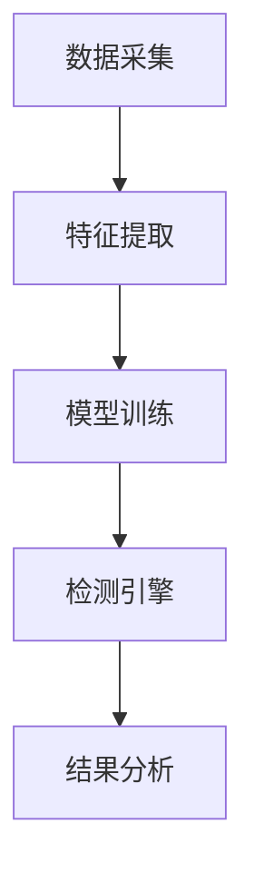

                 


# 异常检测：识别AI Agent的非正常行为

> 关键词：异常检测，AI Agent，行为分析，机器学习，深度学习，数据安全

> 摘要：  
本文将深入探讨如何识别AI Agent的非正常行为，从异常检测的基本概念到具体算法实现，再到系统架构设计，结合实际案例分析，全面解析如何通过技术手段发现和应对AI Agent的异常行为。

---

# 第一部分: 异常检测背景与概述

## 第1章: 异常检测概述

### 1.1 异常检测的定义与背景

#### 1.1.1 什么是异常检测
异常检测（Outlier Detection）是指识别数据中与预期模式或行为显著不同的个体、事件或行为。在AI Agent领域，异常检测的核心目标是识别AI Agent在运行过程中偏离预期行为的模式。

#### 1.1.2 异常检测的重要性
在AI Agent系统中，异常检测是确保系统安全性和稳定性的关键环节。通过及时发现异常行为，可以有效防止潜在的安全威胁、优化系统性能，并确保AI Agent的行为符合预期目标。

#### 1.1.3 异常检测的应用场景
- **安全监控**：识别恶意攻击或数据篡改行为。
- **系统优化**：发现性能瓶颈或资源滥用问题。
- **用户体验**：检测用户行为异常，提升服务质量。

### 1.2 AI Agent的异常行为问题

#### 1.2.1 AI Agent的基本概念
AI Agent是指具有感知环境、执行任务和自主决策能力的智能体。它可以是一个软件程序、机器人或其他智能系统。

#### 1.2.2 AI Agent异常行为的表现形式
- **输入异常**：接收到不符合预期的输入数据。
- **决策异常**：做出与训练目标不符的决策。
- **行为异常**：在执行任务时偏离预设的规范。

#### 1.2.3 异常行为对系统的影响
异常行为可能导致系统崩溃、数据泄露、服务中断等问题，严重威胁系统的安全性和可靠性。

---

## 第2章: 异常检测的核心概念与背景

### 2.1 异常检测的核心概念

#### 2.1.1 异常与正常行为的定义
- **正常行为**：符合预期模式的行为。
- **异常行为**：偏离正常模式的行为，可能是孤立点、群组异常或混合异常。

#### 2.1.2 异常检测的关键属性
- **实时性**：快速识别异常行为。
- **鲁棒性**：在噪声干扰下仍能有效检测异常。
- **可解释性**：检测结果能够被人类理解。

#### 2.1.3 异常检测的边界与外延
异常检测的边界在于如何定义“正常”的范围，外延则涉及数据来源的多样性和场景的复杂性。

### 2.2 异常检测的核心要素

#### 2.2.1 数据源与特征提取
- **数据源**：来自传感器、日志文件、用户行为等。
- **特征提取**：将原始数据转化为可用于检测异常的特征向量。

#### 2.2.2 检测算法与模型
- **算法选择**：基于统计、机器学习或深度学习的方法。
- **模型训练**：利用训练数据构建异常检测模型。

#### 2.2.3 结果解释与反馈机制
- **结果解释**：将检测结果转化为可理解的解释。
- **反馈机制**：将异常行为反馈给系统进行修正或进一步分析。

---

## 第3章: 异常检测的技术挑战与研究现状

### 3.1 异常检测的主要技术挑战

#### 3.1.1 数据分布的不平衡性
异常数据通常占少数，导致检测模型难以有效学习。

#### 3.1.2 高维数据的处理难度
高维数据可能导致维度灾难，增加计算复杂度。

#### 3.1.3 动态环境下的适应性问题
环境的变化可能导致模型失效，需要动态调整检测策略。

### 3.2 异常检测的研究现状

#### 3.2.1 基于统计的方法
- **Z-Score**：基于数据的均值和标准差检测异常。
- **马氏距离**：考虑数据分布的多维特性。

#### 3.2.2 基于机器学习的方法
- **随机森林**：利用树结构检测异常。
- **支持向量机**：通过边界划分正常与异常。

#### 3.2.3 基于深度学习的方法
- **自动编码器**：通过重建误差检测异常。
- **变分自编码器**：学习数据分布，识别异常样本。

---

# 第二部分: 异常检测的核心概念与联系

## 第4章: 异常检测的核心概念原理

### 4.1 异常检测的基本原理

#### 4.1.1 基于概率的异常检测
- **高斯分布**：假设数据服从正态分布，远离均值的点为异常。
- **贝叶斯网络**：通过概率推理识别异常。

#### 4.1.2 基于距离的异常检测
- **K-近邻法**：计算数据点与最近邻居的距离，距离过大的点为异常。
- **DBSCAN**：基于密度的聚类方法，识别孤立点。

#### 4.1.3 基于密度的异常检测
- **LOF算法**：计算局部密度差异，识别异常点。

### 4.2 异常检测的核心算法原理

#### 4.2.1 LOF算法
- **原理**：通过局部密度对比发现异常点。
- **步骤**：计算每个点的局部可达密度和局部密度比。

#### 4.2.2 Isolation Forest算法
- **原理**：通过构建隔离树随机分割数据，异常点更容易被隔离。
- **步骤**：随机选择特征和分割点，构建隔离树。

#### 4.2.3 One-Class SVM算法
- **原理**：学习数据的分布，将异常点划分为不同的类。

---

## 第5章: 异常检测的核心概念对比与联系

### 5.1 异常检测方法的对比分析

#### 5.1.1 基于统计的方法对比
- **优缺点**：简单但难以处理复杂数据。

#### 5.1.2 基于机器学习的方法对比
- **优缺点**：鲁棒性较好但需要大量标注数据。

#### 5.1.3 基于深度学习的方法对比
- **优缺点**：能够处理高维数据但计算复杂度高。

### 5.2 异常检测方法的联系与选择

#### 5.2.1 不同方法的适用场景
- **统计方法**：适用于低维数据。
- **机器学习方法**：适用于中等规模数据。
- **深度学习方法**：适用于高维和复杂数据。

#### 5.2.2 方法选择的依据
- 数据规模：样本数量和特征维度。
- 计算资源：模型训练和推理的计算成本。
- 业务需求：检测的实时性和准确性要求。

---

# 第三部分: 异常检测算法原理与数学模型

## 第6章: 异常检测算法原理与数学模型

### 6.1 LOF算法的数学模型

#### 6.1.1 LOF算法的公式
$$ LOF = \frac{d(x, k)}{d(k, x, k)} $$
其中，$d(x, k)$表示点$x$的第$k$近邻的距离，$d(k, x, k)$表示点$k$的第$k$近邻的距离。

#### 6.1.2 LOF算法的实现步骤
1. 计算每个点的局部密度。
2. 对比每个点的局部密度差异。
3. 确定异常点。

### 6.2 Isolation Forest算法的数学模型

#### 6.2.1 Isolation Forest算法的公式
$$ s = \sum_{i=1}^{n} \log(p_i) $$
其中，$p_i$表示点$i$被隔离的概率。

#### 6.2.2 Isolation Forest算法的实现步骤
1. 构建随机树，分割数据。
2. 统计每个点的隔离时间。
3. 根据隔离时间判断异常点。

### 6.3 One-Class SVM算法的数学模型

#### 6.3.1 One-Class SVM算法的公式
$$ y = \text{sign}(w \cdot x + b) $$
其中，$w$是权重向量，$b$是偏置项。

#### 6.3.2 One-Class SVM算法的实现步骤
1. 训练SVM模型，学习数据分布。
2. 对新数据进行分类，判断是否为异常点。

---

## 第7章: 异常检测的系统分析与架构设计

### 7.1 异常检测系统的功能设计

#### 7.1.1 功能模块划分
- 数据采集模块：采集原始数据。
- 特征提取模块：提取特征向量。
- 模型训练模块：训练异常检测模型。
- 检测引擎模块：实时检测异常行为。
- 结果分析模块：解释和反馈检测结果。

#### 7.1.2 功能流程图


### 7.2 异常检测系统的架构设计

#### 7.2.1 系统架构图
```mermaid
``` 

#### 7.2.2 系统接口设计
- 数据接口：数据输入和输出的接口。
- 模型接口：训练和推理的接口。
- 结果接口：结果输出和反馈的接口。

---

## 第8章: 异常检测的项目实战

### 8.1 项目环境安装

```bash
pip install numpy pandas scikit-learn
```

### 8.2 项目核心实现

#### 8.2.1 LOF算法实现
```python
from sklearn.neighbors import LocalOutlierFactor

def detect_outliers_lof(X, n_neighbors=5):
    clf = LocalOutlierFactor(n_neighbors=n_neighbors)
    outlier_scores = clf.fit_score(X)
    outliers = (outlier_scores == -1)
    return outliers
```

#### 8.2.2 Isolation Forest实现
```python
from sklearn.ensemble import IsolationForest

def detect_outliers_if(X, contamination=0.1):
    clf = IsolationForest(contamination=contamination)
    clf.fit(X)
    outliers = clf.predict(X) == -1
    return outliers
```

#### 8.2.3 One-Class SVM实现
```python
from sklearn.svm import OneClassSVM

def detect_outliers_ocsvm(X):
    clf = OneClassSVM()
    clf.fit(X)
    outliers = clf.predict(X) == -1
    return outliers
```

### 8.3 项目小结

---

# 第四部分: 异常检测的注意事项与拓展阅读

## 第9章: 异常检测的注意事项

### 9.1 注意事项
- 数据预处理：确保数据质量和一致性。
- 模型调优：根据实际需求调整算法参数。
- 结果解释：确保检测结果的可解释性。

---

## 第10章: 异常检测的拓展阅读

### 10.1 推荐书籍
- 《异常检测：理论与实践》
- 《深度学习中的异常检测》

### 10.2 推荐论文
- "Anomaly Detection: A Review" (K. Liu et al., 2002)
- "Deep Learning for Anomaly Detection in Time Series" (Y. Zhang et al., 2020)

---

# 结语

通过本文的详细讲解，读者可以全面了解异常检测的基本概念、算法原理和系统设计，并通过实际案例掌握异常检测的核心技术。希望本文能为识别AI Agent的非正常行为提供有价值的参考和指导。

--- 

如果需要进一步的技术支持或代码实现，请随时联系我！

