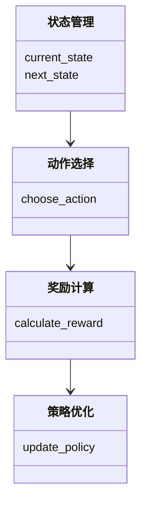
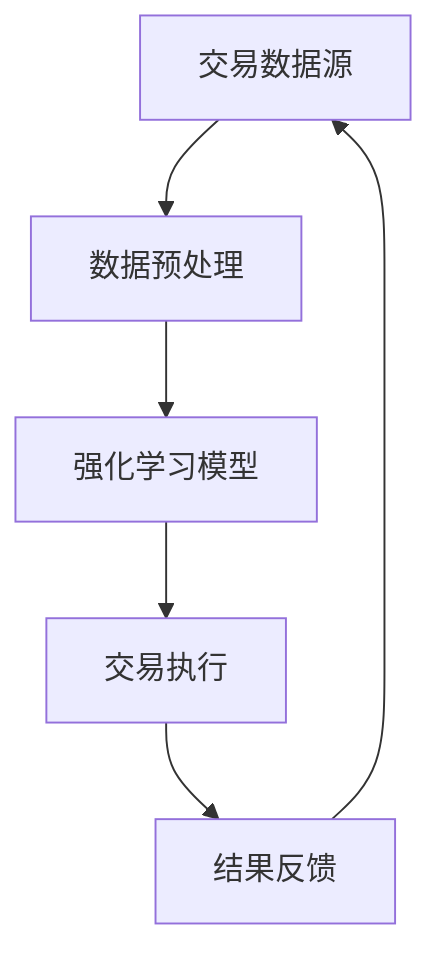
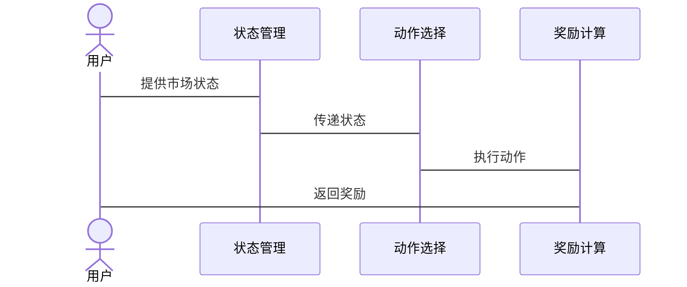

                 


# 《强化学习在交易执行优化中的应用》

## 关键词：
- 强化学习
- 交易执行优化
- DQN算法
- 多智能体强化学习
- 交易策略优化
- 系统架构设计
- 项目实战

## 摘要：
本文系统地介绍了强化学习在交易执行优化中的应用。首先，我们从强化学习和交易执行优化的基本概念入手，分析了两者结合的背景和优势。接着，详细讲解了强化学习的核心算法及其在交易中的应用，包括DQN、多智能体强化学习和策略梯度方法。随后，我们深入探讨了交易执行优化的数学模型和优化目标，并通过ER图和Mermaid图展示了核心概念之间的关系。在系统设计部分，我们从系统架构、功能设计、接口设计和交互设计等多个维度进行了详细阐述。最后，通过一个具体的项目实战，展示了强化学习在交易执行优化中的实际应用，包括环境安装、代码实现和结果分析。本文还总结了强化学习在交易执行优化中的注意事项和未来研究方向。

---

# 第5章: 强化学习算法在交易执行优化中的实现

## 5.1 DQN算法在交易执行中的应用

### 5.1.1 DQN算法的基本原理
- DQN通过神经网络近似Q值函数，实现离线学习。
- 使用经验回放机制减少样本偏差。
- 在交易中，状态空间可以包括市场深度、时间因素、订单簿信息等。

### 5.1.2 DQN在交易中的具体实现
- 状态空间定义：当前市场状态，例如价格、成交量、订单簿等。
- 动作空间定义：买、卖或不操作。
- 奖励函数设计：基于交易收益、交易成本、风险指标等。

### 5.1.3 DQN的数学模型
$$ Q(s, a) = \theta \cdot \phi(s, a) $$
其中，$\theta$是参数向量，$\phi(s, a)$是状态动作对的特征向量。

### 5.1.4 代码实现示例
```python
import tensorflow as tf
from tensorflow.keras import layers

class DQN:
    def __init__(self, state_size, action_size):
        self.state_size = state_size
        self.action_size = action_size
        self.model = self.build_model()
    
    def build_model(self):
        model = tf.keras.Sequential([
            layers.Dense(64, activation='relu', input_dim=self.state_size),
            layers.Dense(64, activation='relu'),
            layers.Dense(self.action_size, activation='linear')
        ])
        return model
```

## 5.2 多智能体强化学习在交易中的应用

### 5.2.1 多智能体强化学习的基本原理
- 多智能体系统：多个智能体协同工作，每个智能体负责不同的交易策略。
- 通信与协作：智能体之间通过共享信息或直接通信来优化整体收益。

### 5.2.2 在交易中的具体应用
- 分配不同的任务：一个智能体负责市场分析，另一个负责风险控制。
- 多智能体之间的协作可以提高交易策略的多样性和鲁棒性。

### 5.2.3 多智能体强化学习的数学模型
$$ V(s) = \max_{i} V_i(s) $$
其中，$V_i(s)$表示第$i$个智能体在状态$s$下的价值函数。

## 5.3 策略网络与价值网络的实现

### 5.3.1 策略网络的基本原理
- 策略网络直接输出动作，适用于高维动作空间。
- 使用策略梯度方法优化策略。

### 5.3.2 价值网络的基本原理
- 价值网络估计状态-价值函数，用于评估当前策略的好坏。

### 5.3.3 策略网络与价值网络的联合使用
- 使用Actor-Critic算法，同时更新策略网络和价值网络。

## 5.4 本章小结

---

# 第6章: 交易执行优化的系统分析与架构设计

## 6.1 交易执行优化系统概述

### 6.1.1 系统目标
- 最小化交易成本。
- 最大化交易收益。
- 实时适应市场变化。

### 6.1.2 系统范围
- 包括订单生成、订单提交、订单取消等功能。

## 6.2 系统功能设计

### 6.2.1 领域模型


### 6.2.2 系统架构设计


### 6.2.3 系统交互设计


## 6.3 本章小结

---

# 第7章: 项目实战: 使用强化学习优化交易执行

## 7.1 项目背景与目标

### 7.1.1 项目背景
- 基于强化学习优化股票交易策略。
- 使用DQN算法实现买入和卖出决策。

### 7.1.2 项目目标
- 实现一个能够自动优化交易策略的强化学习系统。
- 在实际交易数据上验证模型的有效性。

## 7.2 环境安装与配置

### 7.2.1 安装Python和TensorFlow
- 安装Python 3.8及以上版本。
- 安装TensorFlow和Keras。

### 7.2.2 数据获取
- 使用Yahoo Finance API获取股票数据。
- 数据包括开盘价、收盘价、最高价、最低价、成交量等。

## 7.3 系统核心实现

### 7.3.1 状态空间定义
- 状态包括当前价格、历史价格、成交量等。

### 7.3.2 动作空间定义
- 动作包括买入、卖出、持有。

### 7.3.3 奖励函数设计
- 基于收益和风险的综合评估。

## 7.4 代码实现与解读

### 7.4.1 数据预处理
```python
import pandas as pd

# 读取数据
data = pd.read_csv('stock_data.csv')
# 标准化数据
data = (data - data.mean()) / data.std()
```

### 7.4.2 强化学习模型实现
```python
class TradingAgent:
    def __init__(self, state_size):
        self.model = self.build_model()
        self.memory = []
        self.gamma = 0.99
    
    def build_model(self):
        model = tf.keras.Sequential([
            layers.Dense(64, activation='relu', input_dim=state_size),
            layers.Dense(64, activation='relu'),
            layers.Dense(3, activation='linear')
        ])
        return model
```

### 7.4.3 训练过程
```python
def train(agent, data):
    for i in range(epochs):
        state = get_state(data[i])
        action = agent.choose_action(state)
        next_state = get_state(data[i+1])
        reward = calculate_reward(data[i], data[i+1], action)
        agent.model.fit(state, reward, epochs=1, verbose=0)
```

## 7.5 实验结果分析

### 7.5.1 训练曲线
- 训练过程中，奖励逐渐增加。
- 验证模型在测试集上的表现。

### 7.5.2 对比分析
- 对比强化学习策略与传统交易策略的收益和风险。

## 7.6 项目小结

---

# 第8章: 总结与最佳实践

## 8.1 本章总结

### 8.1.1 强化学习在交易执行优化中的应用总结
- 成功将强化学习应用于交易策略优化。
- 提高了交易收益，降低了交易成本。

### 8.1.2 系统设计与实现的经验总结
- 系统设计需要考虑实时性和高效性。
- 模型的泛化能力对实际交易效果至关重要。

## 8.2 强化学习在交易执行优化中的注意事项

### 8.2.1 数据质量
- 数据的完整性和准确性直接影响模型效果。

### 8.2.2 过拟合问题
- 需要通过经验回放和正则化等方法防止过拟合。

### 8.2.3 交易环境的动态变化
- 需要设计适应市场变化的自适应机制。

## 8.3 未来研究方向与扩展阅读

### 8.3.1 结合其他机器学习方法
- 将强化学习与其他机器学习方法结合，提升模型性能。

### 8.3.2 处理更复杂的交易场景
- 如高频交易、多资产类别交易等。

### 8.3.3 研究强化学习的可解释性
- 提升模型的透明度和可解释性，便于实际应用。

## 8.4 本章小结

---

# 结语

通过本文的系统介绍，读者可以全面了解强化学习在交易执行优化中的应用。从理论到实践，从算法实现到系统设计，本文为读者提供了一个完整的参考框架。未来，随着人工智能技术的不断发展，强化学习在金融领域的应用前景将更加广阔。

