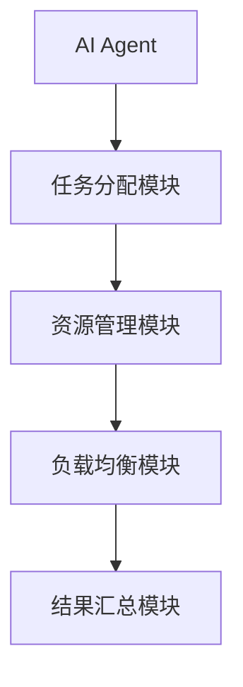
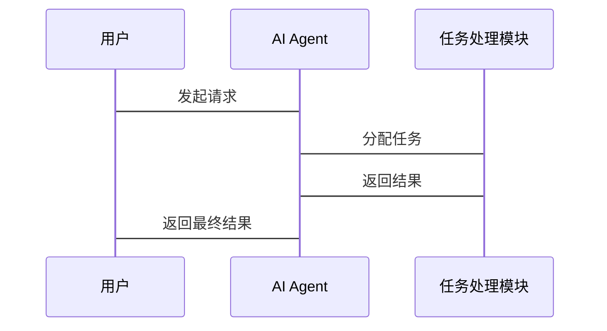

                 


# 性能优化：提高AI Agent的响应速度

## 关键词：AI Agent、性能优化、响应速度、并行计算、分布式系统

## 摘要：AI Agent的性能优化是提升用户体验的关键。本文从AI Agent的基本概念出发，详细探讨了性能优化的核心概念、算法原理、系统架构设计、项目实战和最佳实践，帮助读者全面掌握性能优化的方法和技术。

---

# 第1章: AI Agent与性能优化概述

## 1.1 AI Agent的基本概念

### 1.1.1 AI Agent的定义与特点
AI Agent（人工智能代理）是指能够感知环境、自主决策并执行任务的智能实体。AI Agent的特点包括自主性、反应性、目标导向性和社交能力。

### 1.1.2 AI Agent的分类与应用场景
AI Agent主要分为简单反射型、基于模型的反射型、目标驱动型和实用驱动型。应用场景包括智能助手、自动驾驶、智能推荐系统等。

### 1.1.3 性能优化的核心目标
性能优化的核心目标是提升AI Agent的响应速度和处理能力，确保其在各种场景下都能高效运行。

---

## 1.2 性能优化的背景与挑战

### 1.2.1 响应时间对用户体验的影响
响应时间直接影响用户体验，过长的响应时间会导致用户流失和满意度下降。

### 1.2.2 当前AI Agent性能优化的主要挑战
主要挑战包括计算资源限制、数据处理效率低下和多任务并行处理能力不足。

### 1.2.3 优化的边界与外延
优化的边界在于在有限的资源条件下找到最优解，外延则涉及硬件优化、算法改进和系统架构设计。

---

## 1.3 本章小结
本章介绍了AI Agent的基本概念、分类及应用场景，并阐述了性能优化的核心目标和面临的挑战。

---

# 第2章: 性能优化的核心概念与原理

## 2.1 性能优化的关键指标

### 2.1.1 响应时间
响应时间是用户发起请求到系统返回结果的时间，直接影响用户体验。

### 2.1.2 并发处理能力
并发处理能力决定了系统在同一时间能够处理的请求数量，是衡量系统性能的重要指标。

### 2.1.3 资源利用率
资源利用率包括CPU、内存和网络资源的使用效率，是系统优化的重要目标。

---

## 2.2 性能优化的核心方法

### 2.2.1 并行计算
并行计算通过同时处理多个任务来提高计算效率，常见的实现方法包括多线程和多进程。

### 2.2.2 分布式计算
分布式计算通过将任务分配到多个节点上并行处理，提高系统的计算能力和响应速度。

### 2.2.3 负载均衡
负载均衡技术用于合理分配任务到不同的节点或核心，避免资源浪费和性能瓶颈。

---

## 2.3 性能优化的数学模型与公式

### 2.3.1 基本公式
响应时间的计算公式为：
$$响应时间 = 处理时间 + 延迟 + 传输时间$$

### 2.3.2 并行计算效率公式
加速比的计算公式为：
$$加速比 = \frac{运行时间}{并行处理时间}$$

---

## 2.4 本章小结
本章详细探讨了性能优化的关键指标、核心方法和数学模型，为后续的优化策略提供了理论基础。

---

# 第3章: AI Agent性能优化的算法原理

## 3.1 基于并行计算的优化算法

### 3.1.1 分治法
分治法将问题分解为多个子问题，分别求解后再合并结果。适用于任务可以独立处理的场景。

### 3.1.2 贪心算法
贪心算法通过在每一步选择最优解，逐步构建整体最优解。适用于资源分配和路径规划等问题。

### 3.1.3 动态规划
动态规划通过将问题分解为重叠子问题，利用子问题的解来构建整体解。适用于优化问题中的最短路径和最长子序列等场景。

---

## 3.2 基于分布式计算的优化算法

### 3.2.1 MapReduce
MapReduce是一种并行计算模型，适用于大规模数据处理。通过将任务分解为Map和Reduce操作，实现数据的并行处理。

### 3.2.2 分布式锁机制
分布式锁机制用于在分布式系统中协调资源访问，避免数据冲突和竞争条件。

### 3.2.3 分片技术
分片技术将数据分成多个部分，分配到不同的节点上进行处理，提高系统的并行处理能力。

---

## 3.3 算法实现的Python代码示例

### 3.3.1 并行计算示例
```python
import concurrent.futures

def process_task(task):
    # 处理任务的逻辑
    return result

with concurrent.futures.ThreadPoolExecutor() as executor:
    futures = [executor.submit(process_task, task) for task in tasks]
    for future in concurrent.futures.as_completed(futures):
        result = future.result()
        # 处理结果
```

### 3.3.2 MapReduce示例
```python
from mrjob.job import MRJob

class WordCount(MRJob):
    def mapper(self, _, line):
        for word in line.split():
            yield word, 1

    def reducer(self, key, values):
        yield key, sum(values)

if __name__ == '__main__':
    WordCount.run()
```

---

## 3.4 算法优化

---

## 本章小结
本章详细探讨了并行计算和分布式计算的优化算法，并通过代码示例展示了这些算法的实现方法。

---

# 第4章: 系统分析与架构设计方案

## 4.1 问题场景介绍

### 4.1.1 项目介绍
本项目旨在优化AI Agent的响应速度，提升用户体验。

### 4.1.2 系统功能设计
系统功能设计包括任务分配、资源管理、负载均衡和结果汇总。

---

## 4.2 系统架构设计

### 4.2.1 系统架构图


### 4.2.2 系统交互设计


---

## 4.3 本章小结
本章通过系统架构设计和交互设计，展示了如何通过合理的系统架构实现性能优化。

---

# 第5章: 项目实战

## 5.1 环境安装

### 5.1.1 安装Python
安装Python 3.8及以上版本。

### 5.1.2 安装依赖库
安装必要的依赖库，例如`concurrent.futures`和`mrjob`。

---

## 5.2 核心代码实现

### 5.2.1 并行计算实现
```python
import concurrent.futures

def process_task(task):
    # 处理任务的逻辑
    return result

with concurrent.futures.ThreadPoolExecutor() as executor:
    futures = [executor.submit(process_task, task) for task in tasks]
    for future in concurrent.futures.as_completed(futures):
        result = future.result()
        # 处理结果
```

### 5.2.2 分布式计算实现
```python
from mrjob.job import MRJob

class WordCount(MRJob):
    def mapper(self, _, line):
        for word in line.split():
            yield word, 1

    def reducer(self, key, values):
        yield key, sum(values)

if __name__ == '__main__':
    WordCount.run()
```

---

## 5.3 案例分析与详细解读

### 5.3.1 案例分析
通过实际案例分析，展示如何在实际项目中应用上述优化方法。

### 5.3.2 详细解读
详细解读每个部分的实现细节，帮助读者理解如何将优化方法应用到实际项目中。

---

## 5.4 本章小结
本章通过项目实战，展示了如何通过并行计算和分布式计算实现AI Agent的性能优化。

---

# 第6章: 最佳实践与总结

## 6.1 最佳实践

### 6.1.1 小结
总结本章的主要内容和优化方法。

### 6.1.2 注意事项
在实际项目中，需要注意资源限制、算法选择和系统架构设计。

### 6.1.3 拓展阅读
推荐相关书籍和资源，供读者深入学习。

---

## 6.2 本章小结
本章通过总结和最佳实践，帮助读者更好地理解和应用性能优化的方法。

---

# 总结

本文从AI Agent的基本概念出发，详细探讨了性能优化的核心概念、算法原理、系统架构设计、项目实战和最佳实践。通过理论与实践相结合，帮助读者全面掌握性能优化的方法和技术。

